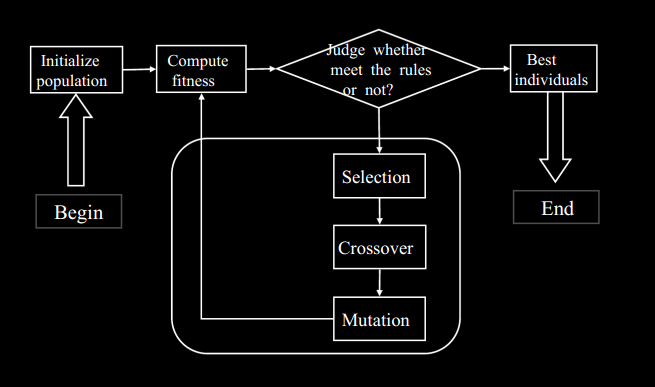

软件架构部分

**定义：**

>   软件系统的构架（在某一给定点）是指系统重要构件的组织或结构。这些重要构件通过不断减小的构件与接口所组成的构件进行交互。

>   某个软件或者计算系统的软件构架即组成该系统的一个或者多个结构，他们组成软件的各个部分，形成这些构件的外部可见属性及相互间的联系。

>   系统的组织结构

**架构模式**

比设计模式的力度更大。MVC 结构、分层结构、C/S架构

**MVC架构介绍**

遗传算法部分

