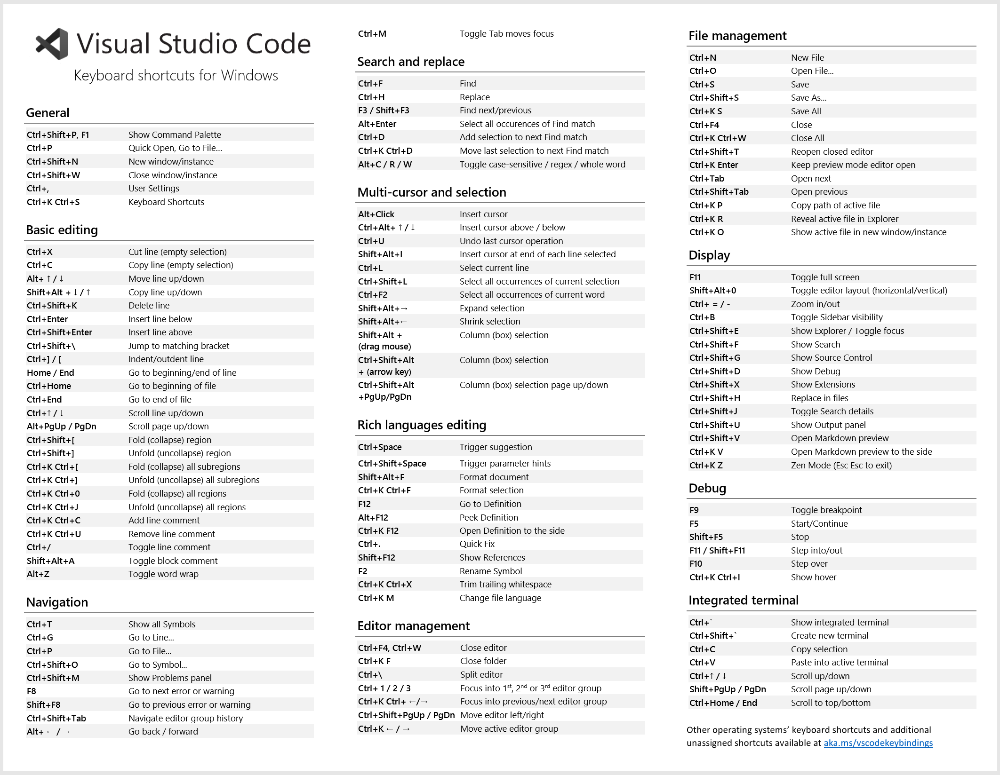

## 1 快捷键



### 常用快捷键说明
侧边栏导航
- ctrl+shift+E 资源管理器
- ctrl+shift+G git
- ctrl+shift+D debug
- ctrl+shift+X extension

界面相关操作

- ctrl J 命令行
- ctrl B 侧边栏
- ctrl k,z zen 模式
- ctrl \ 拆分编辑器
- ctrl 2 选择编辑器组
- ctrl tab 内部浏览（浏览器也适用）

光标相关操作（选择复制移动。编辑选项的相关操作）

- ctrl alt ↑/↓ 多光标
- Ctrl + Shift + L 将附加光标添加到当前选择的所有实例中
- ctrl D 同时修改多个实例
- ctrl U 撤销光标
- Alt + Left返回到先前的位置>go back


选择复制移动

- 拖动鼠标时按住 Shift + Alt 键来选择文本块
- Shift + Alt +向上键或 Shift + Alt +向下键 向上或者向下复制一行
- Alt + Up 或 Alt + Down 向上或向下移动一行
- ctrl L 选择当前行

- shift alt F格式化

markdown

- ctrl k,v 预览

intellisense

- F12 转到代码的定义
- Alt + F12 peek代码，查看代码的位置
- shiff + F12 转到参考
- Shift + Alt + F12打开“引用”视图，在专用视图中显示文件的所有符号。

refector

- F2 重构所有引用

搜索和修改
- ctrl + F 搜索
- ctrl + H 替换

tasks
- ctrl shift B


launch
- F5 调试运行
- ctrl F5 非调试运行


## 2 Ctrl + P 命令窗口

### 运行命令 command

```
view
edt
```

### 打开文件 file

```
file.md
```

### 行号跳转:

- ctrl G

```
:45
```

### 建议命令?

```
?
```

### 快速命令>

- 快捷键：Ctrl + shift + P。

```
> command
```

### 大纲跳转@****

- 快捷键：ctrl + shift + O

```
@
```
