## 1 架构设计

### 架构和技术说明



本项目主要架构包括三部分
1. 数据层。通过vscode和markdown创建的笔记内容数据，存储在github上。需要对笔记内容进行重构，以适应多种形式的输出。
2. 业务层。提供博客系统的业务数据访问。
   1. Sync模块从github同步数据，存储到本地数据库中对数据进行分析和处理，通过只能算法生成博客的元数据，包括tag、description等，对数据内容进行筛选（根据配置）和完整性校验，可以通过定时任务和Github的流水线触发数据的增量处理任务。
   2. User模块提供了用户的登录认证、权限校验功能，允许用户匿名访问系统也允许用户创建一个简单的账户，区分匿名用户、普通用户、管理用户的权限区别。
   3. Article模块提供文章的多级索引，包括目录、tag、日期、关键字等方便用户快速找到自己感兴趣的文章，也方便自己回顾阅读，同时提供了一些基础的交互能力和数据统计能力，包括点赞、评论、访问量。整个系统通过标准Rest接口对外提供访问。
3. 渲染层。通过vue前端框架和element组件库，快速构建前端页面，提供交互能力。访问后端的Rest接口进行渲染。


## 2 模型设计

### 2.1 对象设计
文章的对象模型主要包括以下五个：文章、分类、标签、评论、用户。



### 2.2 逻辑设计
在逻辑设计的时候应该遵循以下原则
1. 不允许使用外键
2. 尽量减少连表操作。连表操作会大大增加数据管理的难度。

文章与用户关系：在博文中记录的应该是用户名，这样前端直接根据用户名称进行查询，就可以找到对应的文章。而不是传递用户id。

文章与目录：文章与目录是一对多的关系。可以直接在文章中存储目录的id。不同目录下可能存在同名的子目录。所以目录名称的唯一键应该是 父目录+子目录。

文章与标签：文章与标签是多对多的关系。不需要建立关联关系表，直接将标签以逗号分割的形式添加到文章里即可。多选可以使用 Like or的方法直接进行查询。标签的名称是唯一键，主要用来显示标签云，不用每次都统计标签的数量

文章与评论：文章与评论是一对多关系。不需要建立关联关系。评论中存储文章id的外键。评论之间可以相互回复，parent_id标识其上一级评论，如果parent_id为零，表示直接回复当篇文章。


### 2.3 物理设计

```sql

--【1】创建 blog数据库
CREATE DATABASE blog SET utf8mb4 COLLATE utf8mb4_unicode_ci;


--【2】创建用户表 user
CREATE TABLE `user` (
 `id` bigint NOT NULL AUTO_INCREMENT COMMENT '用户ID',
 `user_name` varchar(32) NOT NULL COMMENT '用户名',
 `password` varchar(64) DEFAULT NULL COMMENT '用户密码',
 `nickname` varchar(32) DEFAULT NULL COMMENT '用户名',
 `email` varchar(64) DEFAULT NULL COMMENT '用户邮箱',
  `role` tinyint DEFAULT 0 COMMENT '注册时间0表示普通用户1表示管理员2表示匿名用户',
 `photo` varchar(256) DEFAULT NULL COMMENT '用户头像',
 `uuid` varchar(32) DEFAULT NULL COMMENT '唯一标识',
 `ip` varchar(20) NOT NULL COMMENT '用户IP',
 PRIMARY KEY (`id`),
 KEY `user_name` (`user_name`),
 KEY `email` (`email`)
);


--【3】创建分类表 \category

CREATE TABLE `category` (
  `id`     bigint NOT NULL AUTO_INCREMENT COMMENT '目录ID',
  `name`   varchar(100) NOT NULL  COMMENT '标签名称',
  `parent` bigint NOT NULL DEFAULT '0' COMMENT '目录ID，0表示顶层目录',
  `description` text DEFAULT NULL COMMENT '目录下README.MD文件的内容',
  PRIMARY KEY (`id`),
  UNITUQ KEY `path`(`parent`,`name`)
)COMMENT='分类表';


--【4】创建分类表 tag

CREATE TABLE `tag` (
  `id`    bigint  NOT NULL AUTO_INCREMENT,
  `name`  varchar(32) DEFAULT '' COMMENT '标签名称',
  `count` int  DEFAULT '0' COMMENT '权重数量',
  `description` varchar(256) DEFAULT NULL COMMENT '评论数量',
  PRIMARY KEY (`id`),
  UNIQUE KEY `name`(`name`)
) COMMENT='标签表';


--【5】创建文章表 article
CREATE TABLE `article` (
 `id`  bigint NOT NULL AUTO_INCREMENT COMMENT '博文ID',
 `user_id` bigint NOT NULL COMMENT '发表用户ID',
 `category_id` bigint NOT NULL COMMENT '目录ID',
 `title` varchar(128) NOT NULL COMMENT '博文标题',
 `content` longtext NOT NULL COMMENT '博文内容',
 `description` text NOT NULL COMMENT '博文简介',
 `love` int NOT NULL DEFAULT 0 COMMENT '喜欢量',
 `view` int NOT NULL DEFAULT 0 COMMENT '浏览量',
 `order` int NOT NULL DEFAULT 0 COMMENT '评论总数',
 `state` tinyint NOT NULL DEFAULT 0 COMMENT '状态0标识正常，1表示草稿或隐藏',
 `path` varchar(256) NOT NULL COMMENT '文章相对路径',
 `cover` varchar(256) DEFAULT NULL COMMENT '文章封面图片路径',
 PRIMARY KEY (`article_id`),
 KEY `user_id` (`user_id`),
 KEY `category_id`(`category_id`)
) COMMENT='文章表';

--【6】创建文章标签表 tag
CREATE TABLE `article_tag` (
  `id`    bigint  NOT NULL AUTO_INCREMENT,
  `article_id`  bigint  NOT NULL COMMENT '文章id',
  `tag_id` bigint  NOT NULL COMMENT '标签id',
  PRIMARY KEY (`id`),
  UNIQUE KEY `article_tag_id`(`article_id`,`tag_id`)
) COMMENT='文章标签表';


--【7】创建评论表 comment
CREATE TABLE `comment` (
  `id`         bigint  NOT NULL AUTO_INCREMENT,
  `user_id`    bigint  NOT NULL COMMENT '创建者id',
  `article_id` bigint  NOT NULL COMMENT '文章id',
  `parent_id`  bigint  NOT NULL DEFAULT 0 COMMENT '父评论ID'
  `content`  varchar(256)               DEFAULT '' COMMENT '评论内容',
  PRIMARY KEY (`id`)
)COMMENT='评论表';


--【8】忽略外键约束
-- ALTER TABLE  blog_article ADD CONSTRAINT FK_ARTICLE_TAGID FOREIGN KEY(tag_id) REFERENCES blog_tag(id);
-- ALTER TABLE  blog_article ADD CONSTRAINT FK_ARTICLE_USERID FOREIGN KEY(user_id) REFERENCES blog_auth(id);

-- ALTER TABLE  blog_comment ADD CONSTRAINT FK_COMMENT_USERID FOREIGN KEY(user_id) REFERENCES blog_tag(id);
-- ALTER TABLE  blog_comment ADD CONSTRAINT FK_COMMENT_ARTICLEID FOREIGN KEY(article_id) REFERENCES blog_article(id);

```

