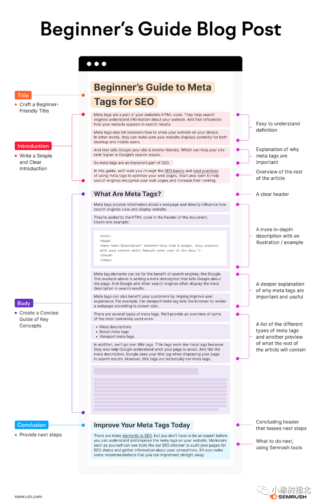
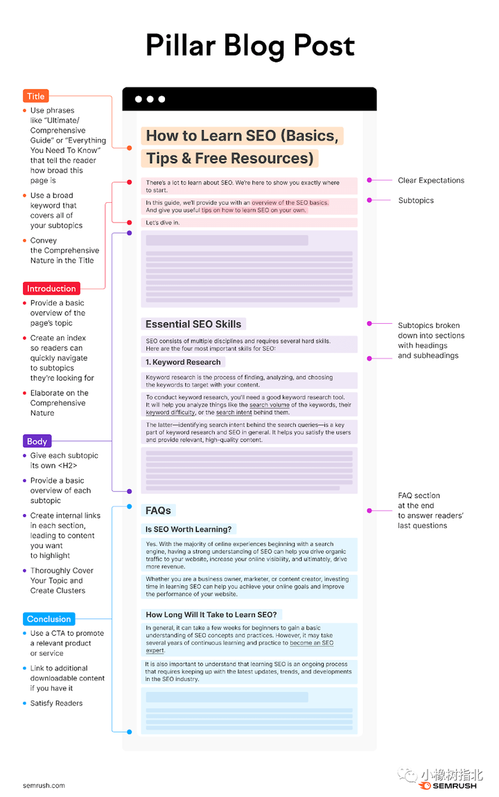
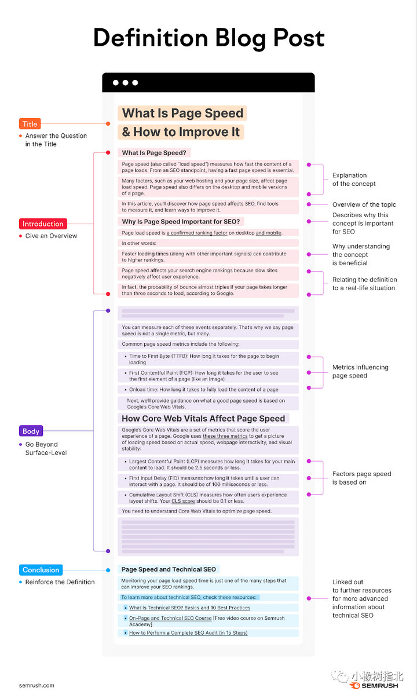
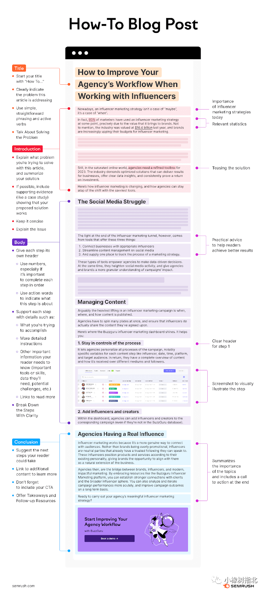
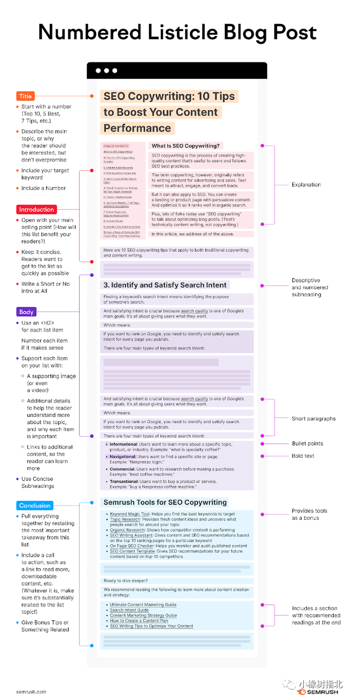

## 1 五种类型的文章
> https://www.semrush.com/blog/blog-post-templates/#pillar-blog-post-template

### 初学者指南（Beginner’s Guide Blog Post Template）
初学者最关注的问题应该就是how，what，why 的问题，使用这个模板可以很好地解释这类问题。这类型的文章也是流量很大的。

### 主干文章（Pillar Blog Post Template）
pillar 指的是主干，基石的意思，这类的文章一般都会是长青类的文章，不太有时效性，它能够持续的为博客带来流量。它应该作为在一系列关键词中的主干文章，我们可以以这篇文章为主干，去把相关关键词作为枝叶。

### 下定义类型文章（Definition Blog Post Template）

### How to类型（“How-To” Blog Post Template）
这类文章的最后适合引出其他的解决方案，可以方便推广我们的产品。

### 数字类型文章（Numbered Listicle Blog Post Template）
数字类型的文章一直是比较好用的方法，带有数字的文章标题通常都会有比较好的浏览量。

