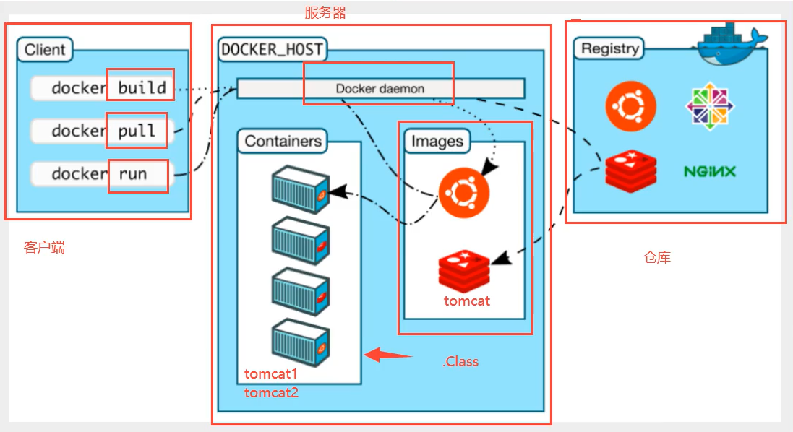
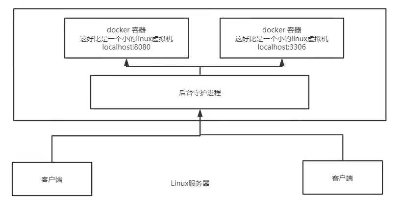

## 0 概述
### 构成原理

* Docker 客户端(Client)Docker 客户端通过命令行或者其他工具使用 Docker SDK与 Docker 的守护进程通信。
* Docker 主机(Host)一个物理或者虚拟的机器用于执行 Docker 守护进程和容器。
* Docker Hub 提供了庞大的镜像集合供使用。一个 Docker Registry 中可以包含多个仓库（Repository）；每个仓库可以包含多个标签（Tag）；每个标签对应一个镜像。通常，一个仓库会包含同一个软件不同版本的镜像，而标签就常用于对应该软件的各个版本。我们可以通过 <仓库名>:<标签> 的格式来指定具体是这个软件哪个版本的镜像。如果不给出标签，将以 latest 作为默认标签。
* Docker Machine。Docker Machine是一个简化Docker安装的命令行工具，通过一个简单的命令行即可在相应的平台上安装Docker，比如VirtualBox、 Digital Ocean、Microsoft Azure。
### 基本组成

- 镜像（Image）：Docker 镜像（Image），就相当于是一个 root 文件系统。比如官方镜像 ubuntu:16.04 就包含了完整的一套 Ubuntu16.04 最小系统的 root 文件系统。 Docker 镜像(Images)Docker 镜像是用于创建 Docker 容器的模板，比如 Ubuntu 系统。
- 容器（Container）：镜像（Image）和容器（Container）的关系，就像是面向对象程序设计中的类和实例一样，镜像是静态的定义，容器是镜像运行时的实体。容器可以被创建、启动、停止、删除、暂停等。Docker 容器(Container)容器是独立运行的一个或一组应用，是镜像运行时的实体。
- 仓库（Repository）：仓库可看成一个代码控制中心，用来保存镜像。Docker 仓库（Registry）Docker 仓库用来保存镜像，可以理解为代码控制中的代码仓库。
  - 公有仓库docker hub、
  - 私有仓库

### 底层原理

* Docker是一个Client-Server结构的系统，Docker的守护进程在主机上。通过Socket从客户端访问！
* DockerServer接受到Docker-Client的指令，

## 1 容器cantainer

### 容器较为官方的解释
一句话概括容器：容器就是将软件打包成标准化单元，以用于开发、交付和部署。

* 容器镜像是轻量的、可执行的独立软件包 ，包含软件运行所需的所有内容：代码、运行时环境、系统工具、系统库和设置。
* 容器化软件适用于基于 Linux 和 Windows 的应用，在任何环境中都能够始终如一地运行。
* 容器赋予了软件独立性，使其免受外在环境差异（例如，开发和预演环境的差异）的影响，从而有助于减少团队间在相同基础设施上运行不同软件时的冲突。

* 虚拟化->容器技术LXC->cgroup&namespace
### 虚拟化技术

* 虚拟化技术是一种资源管理技术，是将计算机的各种实体资源（CPU、内存、磁盘空间、网络适配器等），予以抽象、转换后呈现出来并可供分割、组合为一个或多个电脑配置环境。
* 由此，打破实体结构间的不可切割的障碍，使用户可以比原本的配置更好的方式来应用这些电脑硬件资源。这些资源的新虚拟部分是不受现有资源的架设方式，地域或物理配置所限制。一般所指的虚拟化资源包括计算能力和数据存储。

### LXC虚拟容器技术

Docker 技术是基于 LXC（Linux container- Linux 容器）虚拟容器技术的。

* LXC，其名称来自 Linux 软件容器（Linux Containers）的缩写，一种操作系统层虚拟化（Operating system–level virtualization）技术，为 Linux 内核容器功能的一个用户空间接口。
* 它将应用软件系统打包成一个软件容器（Container），内含应用软件本身的代码，以及所需要的操作系统核心和库。通过统一的名字空间和共用 API 来分配不同软件容器的可用硬件资源，创造出应用程序的独立沙箱运行环境，使得 Linux 用户可以容易的创建和管理系统或应用容器。

* LXC 技术主要是借助 Linux 内核中提供的 CGroup 功能和 namespace 来实现的，通过 LXC 可以为软件提供一个独立的操作系统运行环境。

### cgroup 和 namespace

* namespace 是 Linux 内核用来隔离内核资源的方式。 通过 namespace 可以让一些进程只能看到与自己相关的一部分资源，而另外一些进程也只能看到与它们自己相关的资源，这两拨进程根本就感觉不到对方的存在。具体的实现方式是把一个或多个进程的相关资源指定在同一个 namespace 中。Linux namespaces 是对全局系统资源的一种封装隔离，使得处于不同 namespace 的进程拥有独立的全局系统资源，改变一个 namespace 中的系统资源只会影响当前 namespace 里的进程，对其他 namespace 中的进程没有影响。

* CGroup 是 Control Groups 的缩写，是 Linux 内核提供的一种可以限制、记录、隔离进程组 (process groups) 所使用的物力资源 (如 cpu memory i/o 等等) 的机制。