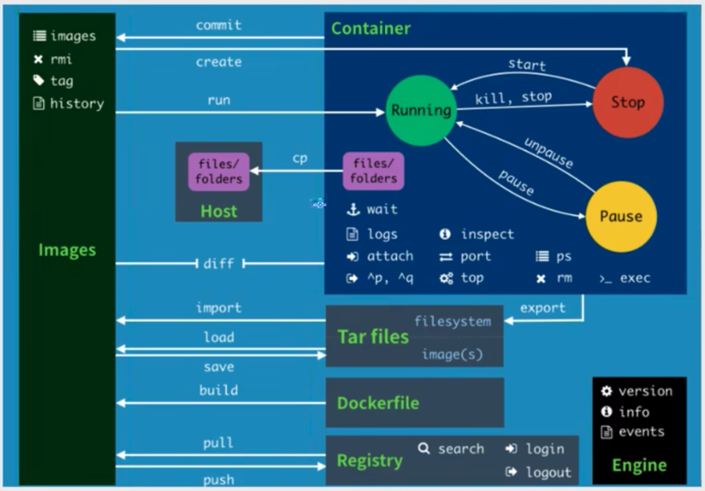
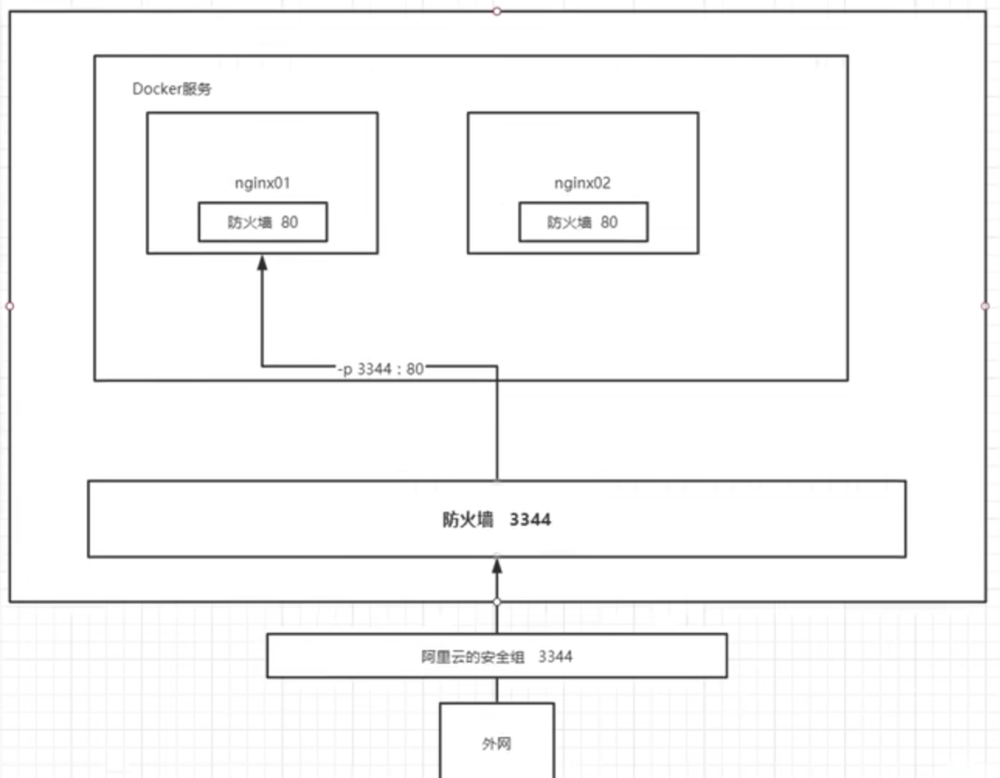
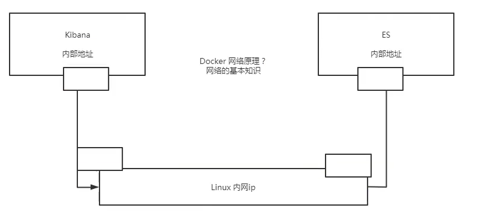

## 0 基本命令
### 概述


```
[root@192 home]# docker --help

Usage:	docker [OPTIONS] COMMAND

A self-sufficient runtime for containers

Options:
      --config string      Location of client config
                           files (default "/root/.docker")
  -c, --context string     Name of the context to use to
                           connect to the daemon
                           (overrides DOCKER_HOST env var
                           and default context set with
                           "docker context use")
  -D, --debug              Enable debug mode
  -H, --host list          Daemon socket(s) to connect to
  -l, --log-level string   Set the logging level
                           ("debug"|"info"|"warn"|"error"|"fatal") (default "info")
      --tls                Use TLS; implied by --tlsverify
      --tlscacert string   Trust certs signed only by
                           this CA (default
                           "/root/.docker/ca.pem")
      --tlscert string     Path to TLS certificate file
                           (default "/root/.docker/cert.pem")
      --tlskey string      Path to TLS key file (default
                           "/root/.docker/key.pem")
      --tlsverify          Use TLS and verify the remote
  -v, --version            Print version information and quit

Management Commands:
  builder     Manage builds
  config      Manage Docker configs
  container   Manage containers
  context     Manage contexts
  engine      Manage the docker engine
  image       Manage images
  network     Manage networks
  node        Manage Swarm nodes
  plugin      Manage plugins
  secret      Manage Docker secrets
  service     Manage services
  stack       Manage Docker stacks
  swarm       Manage Swarm
  system      Manage Docker
  trust       Manage trust on Docker images
  volume      Manage volumes

Commands:
  attach      Attach local standard input, output, and error streams to a running container
  build       Build an image from a Dockerfile
  commit      Create a new image from a container's changes
  cp          Copy files/folders between a container and the local filesystem
  create      Create a new container
  diff        Inspect changes to files or directories on a container's filesystem
  events      Get real time events from the server
  exec        Run a command in a running container
  export      Export a container's filesystem as a tar archive
  history     Show the history of an image
  images      List images
  import      Import the contents from a tarball to create a filesystem image
  info        Display system-wide information
  inspect     Return low-level information on Docker objects
  kill        Kill one or more running containers
  load        Load an image from a tar archive or STDIN
  login       Log in to a Docker registry
  logout      Log out from a Docker registry
  logs        Fetch the logs of a container
  pause       Pause all processes within one or more containers
  port        List port mappings or a specific mapping for the container
  ps          List containers
  pull        Pull an image or a repository from a registry
  push        Push an image or a repository to a registry
  rename      Rename a container
  restart     Restart one or more containers
  rm          Remove one or more containers
  rmi         Remove one or more images
  run         Run a command in a new container
  save        Save one or more images to a tar archive (streamed to STDOUT by default)
  search      Search the Docker Hub for images
  start       Start one or more stopped containers
  stats       Display a live stream of container(s) resource usage statistics
  stop        Stop one or more running containers
  tag         Create a tag TARGET_IMAGE that refers to SOURCE_IMAGE
  top         Display the running processes of a container
  unpause     Unpause all processes within one or more containers
  update      Update configuration of one or more containers
  version     Show the Docker version information
  wait        Block until one or more containers stop, then print their exit codes

```


```shell
docker version 查看版本号
docker info 查看基本信息
docker 命令 --help 查看帮助命令
```

## 1 镜像命令
### docker images 查看镜像

查看所有本地主机上的镜像


```shell
~docker images                                          
REPOSITORY                                                TAG                                                                          IMAGE ID       CREATED         SIZE
tomcat02                                                  1.0                                                                          6e0e1ad86723   3 hours ago     478MB

# 解释
REPOSITORY  # 镜像仓库源
TAG                 # 镜像的标签
IMAGE ID           # 镜像的ID
CREATED           # 镜像的创建时间
SIZE # 镜像的大小

--all , -a		Show all images (default hides intermediate images) # 显示所有
--quiet , -q		Only show numeric IDs # 只显示id
```


### docker search 搜索镜像

```shell
docker search catainer_name:tag

docker search mysql --filter=STARS=3000 # 搜索出Stars大于3000的

➜  ~ docker search mysql 
NAME                            DESCRIPTION                                     STARS     OFFICIAL   AUTOMATED
mysql                           MySQL is a widely used, open-source relation…   13234     [OK]       
mariadb                         MariaDB Server is a high performing open sou…   5062      [OK]       
```
### docker pull 下载镜像

* 分层下载，同一个镜像不同的tag可以共用之前的分层。
```
docker pull  catainer_name:tag

Using default tag: latest  # 如果不写tag默认就是latest
latest: Pulling from library/mysql 
051f419db9dd: Pull complete  # 分层下载
7627573fa82a: Pull complete 
a44b358d7796: Pull complete 
95753aff4b95: Pull complete 
a1fa3bee53f4: Pull complete 
f5227e0d612c: Pull complete 
b4b4368b1983: Pull complete 
f26212810c32: Pull complete 
d803d4215f95: Pull complete 
d5358a7f7d07: Pull complete 
435e8908cd69: Pull complete 
Digest: sha256:b9532b1edea72b6cee12d9f5a78547bd3812ea5db842566e17f8b33291ed2921  # 签名信息
Status: Downloaded newer image for mysql:latest
docker.io/library/mysql:latest 
```


### docker rmi删除镜像

```
删除指定的容器
docker rmi -f image_id

# 删除所有的镜像
docker rmi -f $(docker images -aq)
```

### docker image 打包镜像
Docker 把应用程序及其依赖，打包在 image 文件里面。只有通过这个文件，才能生成 Docker 容器。image 文件可以看作是容器的模板。Docker 根据 image 文件生成容器的实例。同一个 image 文件，可以生成多个同时运行的容器实例。

image 是二进制文件。实际开发中，一个 image 文件往往通过继承另一个 image 文件，加上一些个性化设置而生成。举例来说，你可以在 Ubuntu 的 image 基础上，往里面加入 Apache 服务器，形成你的 image。

```
# 列出本机的所有 image 文件。
$ docker image ls

# 删除 image 文件
$ docker image rm [imageName]
```
image 文件是通用的，一台机器的 image 文件拷贝到另一台机器，照样可以使用。一般来说，为了节省时间，我们应该尽量使用别人制作好的 image 文件，而不是自己制作。即使要定制，也应该基于别人的 image 文件进行加工，而不是从零开始制作。

为了方便共享，image 文件制作完成后，可以上传到网上的仓库。Docker 的官方仓库 Docker Hub 是最重要、最常用的 image 仓库。此外，出售自己制作的 image 文件也是可以的。


## 2 容器命令

### docker run 启动镜像


```bash
docker run [] image

# 参数说明
--name="Name" 容器名字，，同一个镜像可以由多个不同的容器。
-d 后台方式运行
-it 使用交互方式运行。金融容器查看内容
-p  指定容器端口
    -p 主机端口:容器端口
    -p 容器端口
    容器端口puu
    -p ip:主机端口:容器端口
-P  随机指定端口

exit
退出容器。如果交互形式运行，退出后容器就会终止。
```


### docker ps查看容器

* 查看正在运行的容器

```
docker ps

-a 所有运行的容器，包括停止的容器。历史运行过的容器
-n=? 显示最近创建的容器
-q 只显示容器的编号。


➜  ~ docker ps -a
CONTAINER ID   IMAGE                                                                    COMMAND                  CREATED             STATUS                         PORTS                    NAMES
11283b603c39   centos                                                                   "/bin/bash"              3 minutes ago       Exited (0) 5 seconds ago                                vibrant_tereshkova
```

### 退出容器

```
exit 容器停止退出
ctrl +p +q 容器不停止退出

[root@192 ~]# docker run -it centos /bin/bash
[root@bfcea13c40cd /]# [root@192 ~]# docker ps ##注意这里会自动给个命令，删掉
CONTAINER ID        IMAGE               COMMAND             CREATED              STATUS              PORTS               NAMES
bfcea13c40cd        centos              "/bin/bash"         About a minute ago   Up About a minute                       stoic_wilson
edbd9366d959        centos              "/bin/bash"         7 minutes ago        Up 7 minutes                            affectionate_bartik
[root@192 ~]# docker exec -it edbd9366d959 /bin/bash ## 再次进入
[root@edbd9366d959 /]# exit ##停止并推出
exit
```

### docker rm删除容器

* 删除容器
```
docker rm container_id 删除指定的容器，不能删除正在运行的容器。
-f 可以删除正在运行的容器
-f $(docker ps -aq) 删除所有的容器。包括没在运行的容器
docker -aq |xargs docker rm 也能删除容器
```

### 启动、停止容器

```
docker start container_id 启动容器
docker restart container_id 重启容器
docker stop container_id 停止当前正在运行容器
docker kill container_id 强制停止当前容器
```

## 3 其他命令

### 后台启动容器
```
docker run -d centos
* docker run -d 后台运行，但是镜像停止了。后台运行，就必须有一个前台进程，docker发现没有提供服务或者没有程序应用，会自动停止。
```
### docker logs查看日志
* 显示指定条数的日志
```
➜  ~ docker logs --help                    

Usage:  docker logs [OPTIONS] CONTAINER

Fetch the logs of a container

Options:
      --details        Show extra details provided to logs
  -f, --follow         Follow log output
      --since string   Show logs since timestamp (e.g. 2013-01-02T13:23:37Z) or relative (e.g. 42m for 42 minutes)
  -n, --tail string    Number of lines to show from the end of the logs (default "all")
  -t, --timestamps     Show timestamps
      --until string   Show logs before a timestamp (e.g. 2013-01-02T13:23:37Z) or relative (e.g. 42m for 42 minutes)
```


```
➜  ~ docker run -d centos /bin/sh -c  "while true;do echo zhangxiaoyu;sleep 1;done"
9e594a93bc178f0eb6bb22e3abbf730ecf30f992b74eb95942366339924b14ed

➜  ~ docker ps   
CONTAINER ID   IMAGE           COMMAND                  CREATED             STATUS             PORTS     NAMES
9e594a93bc17   centos          "/bin/sh -c 'while t…"   8 seconds ago       Up 7 seconds                 quizzical_proskuriakova
2b4e3ea3e31f   nginx           "/docker-entrypoint.…"   About an hour ago   Up About an hour             k8s_nginx_nginx-deployment-544dc8b7c4-5lkjz_default_87eff95b-e6da-444b-b4ed-5e25e15f3ce7_2
2fadcdb7bb51   804f9cebfdc5    "/docker-entrypoint.…"   About an hour ago   Up About an hour             k8s_web-server_fortune_default_ff6246d7-788f-4807-a649-807cf65ae492_2
a7d8795f243c   luksa/fortune   "/bin/sh -c /bin/for…"   About an hour ago   Up About an hour             k8s_html-generator_fortune_default_ff6246d7-788f-4807-a649-807cf65ae492_2
a40e11d2f769   115053965e86    "/metrics-sidecar"       About an hour ago   Up About an hour             k8s_dashboard-metrics-scraper_dashboard-metrics-scraper-8c47d4b5d-wht26_kubernetes-dashboard_c2a0ead5-956b-4bb3-929d-d329c118759a_1

➜  ~ docker logs -tf --tail 10 9e594a93bc17
2022-10-07T08:38:09.202722580Z zhangxiaoyu
2022-10-07T08:38:10.204883524Z zhangxiaoyu
2022-10-07T08:38:11.209016595Z zhangxiaoyu
2022-10-07T08:38:12.216470402Z zhangxiaoyu
```


### 查看进程信息ps/top

```
docker top 容器id

➜  ~ docker top 9e594a93bc17
UID                 PID                 PPID                C                   STIME               TTY                 TIME                CMD
root                79688               79663               0                   08:36               ?                   00:00:00            /bin/sh -c while true;do echo zhangxiaoyu;sleep 1;done
root                84352               79688               0                   08:41               ?                   00:00:00            /usr/bin/coreutils --coreutils-prog-shebang=sleep /usr/bin/sleep 1
```

### docker inspect查看容器的元数据
```
➜  ~ docker inspect 9e594a93bc17                            
[
    {
        "Id": "9e594a93bc178f0eb6bb22e3abbf730ecf30f992b74eb95942366339924b14ed",
        "Created": "2022-10-07T08:36:30.660739121Z",
        "Path": "/bin/sh",
        "Args": [
            "-c",
            "while true;do echo zhangxiaoyu;sleep 1;done"
        ],
        "State": {
            "Status": "running",
            "Running": true,
            "Paused": false,
            "Restarting": false,
            "OOMKilled": false,
            "Dead": false,
            "Pid": 79688,
            "ExitCode": 0,
            "Error": "",
            "StartedAt": "2022-10-07T08:36:31.008595764Z",
            "FinishedAt": "0001-01-01T00:00:00Z"
        },
        "Image": "sha256:5d0da3dc976460b72c77d94c8a1ad043720b0416bfc16c52c45d4847e53fadb6",
        "ResolvConfPath": "/var/lib/docker/containers/9e594a93bc178f0eb6bb22e3abbf730ecf30f992b74eb95942366339924b14ed/resolv.conf",
        "HostnamePath": "/var/lib/docker/containers/9e594a93bc178f0eb6bb22e3abbf730ecf30f992b74eb95942366339924b14ed/hostname",
        "HostsPath": "/var/lib/docker/containers/9e594a93bc178f0eb6bb22e3abbf730ecf30f992b74eb95942366339924b14ed/hosts",
        "LogPath": "/var/lib/docker/containers/9e594a93bc178f0eb6bb22e3abbf730ecf30f992b74eb95942366339924b14ed/9e594a93bc178f0eb6bb22e3abbf730ecf30f992b74eb95942366339924b14ed-json.log",
        "Name": "/quizzical_proskuriakova",
        "RestartCount": 0,
        "Driver": "overlay2",
        "Platform": "linux",
        "MountLabel": "",
        "ProcessLabel": "",
        "AppArmorProfile": "",
        "ExecIDs": null,
        "HostConfig": {
            "Binds": null,
            "ContainerIDFile": "",
            "LogConfig": {
                "Type": "json-file",
                "Config": {}
            },
            "NetworkMode": "default",
            "PortBindings": {},
            "RestartPolicy": {
                "Name": "no",
                "MaximumRetryCount": 0
            },
            "AutoRemove": false,
            "VolumeDriver": "",
            "VolumesFrom": null,
            "CapAdd": null,
            "CapDrop": null,
            "CgroupnsMode": "private",
            "Dns": [],
            "DnsOptions": [],
            "DnsSearch": [],
            "ExtraHosts": null,
            "GroupAdd": null,
            "IpcMode": "private",
            "Cgroup": "",
            "Links": null,
            "OomScoreAdj": 0,
            "PidMode": "",
            "Privileged": false,
            "PublishAllPorts": false,
            "ReadonlyRootfs": false,
            "SecurityOpt": null,
            "UTSMode": "",
            "UsernsMode": "",
            "ShmSize": 67108864,
            "Runtime": "runc",
            "ConsoleSize": [
                0,
                0
            ],
            "Isolation": "",
            "CpuShares": 0,
            "Memory": 0,
            "NanoCpus": 0,
            "CgroupParent": "",
            "BlkioWeight": 0,
            "BlkioWeightDevice": [],
            "BlkioDeviceReadBps": null,
            "BlkioDeviceWriteBps": null,
            "BlkioDeviceReadIOps": null,
            "BlkioDeviceWriteIOps": null,
            "CpuPeriod": 0,
            "CpuQuota": 0,
            "CpuRealtimePeriod": 0,
            "CpuRealtimeRuntime": 0,
            "CpusetCpus": "",
            "CpusetMems": "",
            "Devices": [],
            "DeviceCgroupRules": null,
            "DeviceRequests": null,
            "KernelMemory": 0,
            "KernelMemoryTCP": 0,
            "MemoryReservation": 0,
            "MemorySwap": 0,
            "MemorySwappiness": null,
            "OomKillDisable": null,
            "PidsLimit": null,
            "Ulimits": null,
            "CpuCount": 0,
            "CpuPercent": 0,
            "IOMaximumIOps": 0,
            "IOMaximumBandwidth": 0,
            "MaskedPaths": [
                "/proc/asound",
                "/proc/acpi",
                "/proc/kcore",
                "/proc/keys",
                "/proc/latency_stats",
                "/proc/timer_list",
                "/proc/timer_stats",
                "/proc/sched_debug",
                "/proc/scsi",
                "/sys/firmware"
            ],
            "ReadonlyPaths": [
                "/proc/bus",
                "/proc/fs",
                "/proc/irq",
                "/proc/sys",
                "/proc/sysrq-trigger"
            ]
        },
        "GraphDriver": {
            "Data": {
                "LowerDir": "/var/lib/docker/overlay2/708ae2078ad7240a47648c22eea4fa1768a119adcb8d0bf123d46a8dd19e5063-init/diff:/var/lib/docker/overlay2/96cb8d4ebc60b000a56aa04a929228cb062524eaa54df1b98d3dc7e71de7d296/diff",
                "MergedDir": "/var/lib/docker/overlay2/708ae2078ad7240a47648c22eea4fa1768a119adcb8d0bf123d46a8dd19e5063/merged",
                "UpperDir": "/var/lib/docker/overlay2/708ae2078ad7240a47648c22eea4fa1768a119adcb8d0bf123d46a8dd19e5063/diff",
                "WorkDir": "/var/lib/docker/overlay2/708ae2078ad7240a47648c22eea4fa1768a119adcb8d0bf123d46a8dd19e5063/work"
            },
            "Name": "overlay2"
        },
        "Mounts": [],
        "Config": {
            "Hostname": "9e594a93bc17",
            "Domainname": "",
            "User": "",
            "AttachStdin": false,
            "AttachStdout": false,
            "AttachStderr": false,
            "Tty": false,
            "OpenStdin": false,
            "StdinOnce": false,
            "Env": [
                "PATH=/usr/local/sbin:/usr/local/bin:/usr/sbin:/usr/bin:/sbin:/bin"
            ],
            "Cmd": [
                "/bin/sh",
                "-c",
                "while true;do echo zhangxiaoyu;sleep 1;done"
            ],
            "Image": "centos",
            "Volumes": null,
            "WorkingDir": "",
            "Entrypoint": null,
            "OnBuild": null,
            "Labels": {
                "org.label-schema.build-date": "20210915",
                "org.label-schema.license": "GPLv2",
                "org.label-schema.name": "CentOS Base Image",
                "org.label-schema.schema-version": "1.0",
                "org.label-schema.vendor": "CentOS"
            }
        },
        "NetworkSettings": {
            "Bridge": "",
            "SandboxID": "3afb645e146a65c60e82b5662c52cead5baa6b44534e6377fc494b9724c4097b",
            "HairpinMode": false,
            "LinkLocalIPv6Address": "",
            "LinkLocalIPv6PrefixLen": 0,
            "Ports": {},
            "SandboxKey": "/var/run/docker/netns/3afb645e146a",
            "SecondaryIPAddresses": null,
            "SecondaryIPv6Addresses": null,
            "EndpointID": "51fc6f4ddc503db0c5ab935614f21d99ec1a464b93398ddf2197a4bb10068873",
            "Gateway": "172.17.0.1",
            "GlobalIPv6Address": "",
            "GlobalIPv6PrefixLen": 0,
            "IPAddress": "172.17.0.2",
            "IPPrefixLen": 16,
            "IPv6Gateway": "",
            "MacAddress": "02:42:ac:11:00:02",
            "Networks": {
                "bridge": {
                    "IPAMConfig": null,
                    "Links": null,
                    "Aliases": null,
                    "NetworkID": "70b0ebbcbbdf0e90289563aaedcbdd8b55e347ab1cc818cf1ee4c18564d5d2e1",
                    "EndpointID": "51fc6f4ddc503db0c5ab935614f21d99ec1a464b93398ddf2197a4bb10068873",
                    "Gateway": "172.17.0.1",
                    "IPAddress": "172.17.0.2",
                    "IPPrefixLen": 16,
                    "IPv6Gateway": "",
                    "GlobalIPv6Address": "",
                    "GlobalIPv6PrefixLen": 0,
                    "MacAddress": "02:42:ac:11:00:02",
                    "DriverOpts": null
                }
            }
        }
    }
]
```


### 进入正在运行的容器

* docker exec 容器id
  * 进入容器后开启新的终端


* docker attach 容器id
  * 进入容器中正在执行的终端，不会启动新的进程。


```
➜  ~ docker ps                  
CONTAINER ID   IMAGE           COMMAND                  CREATED         STATUS         PORTS     NAMES
9e594a93bc17   centos          "/bin/sh -c 'while t…"   9 minutes ago   Up 9 minutes             quizzical_proskuriakova
2b4e3ea3e31f   nginx           "/docker-entrypoint.…"   2 hours ago     Up 2 hours               k8s_nginx_nginx-deployment-544dc8b7c4-5lkjz_default_87eff95b-e6da-444b-b4ed-5e25e15f3ce7_2
2fadcdb7bb51   804f9cebfdc5    "/docker-entrypoint.…"   2 hours ago     Up 2 hours               k8s_web-server_fortune_default_ff6246d7-788f-4807-a649-807cf65ae492_2
a7d8795f243c   luksa/fortune   "/bin/sh -c /bin/for…"   2 hours ago     Up 2 hours               k8s_html-generator_fortune_default_ff6246d7-788f-4807-a649-807cf65ae492_2
a40e11d2f769   115053965e86    "/metrics-sidecar"       2 hours ago     Up 2 hours               k8s_dashboard-metrics-scraper_dashboard-metrics-scraper-8c47d4b5d-wht26_kubernetes-dashboard_c2a0ead5-956b-4bb3-929d-d329c118759a_1
➜  ~ docker exec -it 9e594a93bc17 /bin/bash
[root@9e594a93bc17 /]# ls
bin  dev  etc  home  lib  lib64  lost+found  media  mnt  opt  proc  root  run  sbin  srv  sys  tmp  usr  var
```

```
docker attach containerid
```

### docker cp从容器内拷贝到主机上

*  id
  * 进入容器，
  * 创建文件
  * 拷贝文件
```sh
➜  ~ docker ps                  
CONTAINER ID   IMAGE           COMMAND                  CREATED          STATUS          PORTS     NAMES
9e594a93bc17   centos          "/bin/sh -c 'while t…"   15 minutes ago   Up 15 minutes             quizzical_proskuriakova
2b4e3ea3e31f   nginx           "/docker-entrypoint.…"   2 hours ago      Up 2 hours                k8s_nginx_nginx-deployment-544dc8b7c4-5lkjz_default_87eff95b-e6da-444b-b4ed-5e25e15f3ce7_2
2fadcdb7bb51   804f9cebfdc5    "/docker-entrypoint.…"   2 hours ago      Up 2 hours                k8s_web-server_fortune_default_ff6246d7-788f-4807-a649-807cf65ae492_2
a7d8795f243c   luksa/fortune   "/bin/sh -c /bin/for…"   2 hours ago      Up 2 hours                k8s_html-generator_fortune_default_ff6246d7-788f-4807-a649-807cf65ae492_2
a40e11d2f769   115053965e86    "/metrics-sidecar"       2 hours ago      Up 2 hours                k8s_dashboard-metrics-scraper_dashboard-metrics-scraper-8c47d4b5d-wht26_kubernetes-dashboard_c2a0ead5-956b-4bb3-929d-d329c118759a_1
➜  ~ docker exec -it 9e594a93bc17 /bin/bash                             
[root@9e594a93bc17 /]# ls
bin  dev  etc  home  lib  lib64  lost+found  media  mnt  opt  proc  root  run  sbin  srv  sys  tmp  usr  var
[root@9e594a93bc17 /]# cd home
[root@9e594a93bc17 home]# ls
[root@9e594a93bc17 home]# touch zhangxiaoyu.go
[root@9e594a93bc17 home]# ls
zhangxiaoyu.go
[root@9e594a93bc17 home]# exit
exit
➜  ~ docker cp 9e594a93bc17:/home/zhangxiaoyu.go ./                                                    
➜  ~ ls
Applications                            Pictures                                conf                                    input_stream                            mybin
Desktop                                 Postman Agent                           dsrconsole_extract                      java_error_in_idea.hprof                open_code
Documents                               Public                                  gitee                                   java_error_in_idea_32040.log            schedule
Downloads                               Zotero                                  github                                  kubeadm                                 sprint_MS_S916382437_20201014_zhonghang
IdeaProjects                            a.txt                                   hello.json                              kubectl.sha256                          temp
Library                                 antdld-resources                        hello.txt                               localFileRegistry                       work
Movies                                  app                                     htdocs                                  logs                                    zhangxiaoyu.go
Music                                   bower_test                              html                                    mosn                                    zhonghang_project
```

### docker stats查看状态

* 每秒刷新查看容器状态。
```
CONTAINER ID   NAME                                                                                                                                  CPU %     MEM USAGE / LIMIT     MEM %     NET I/O           BLOCK I/O         PIDS
7b8096067457   tomcat02                                                                                                                              0.86%     118.8MiB / 7.676GiB   1.51%     11.1kB / 159kB    0B / 6.14MB       41
083dfca4b050   tomcat01                                                                                                                              0.17%     67.57MiB / 7.676GiB   0.86%     1.05kB / 0B       0B / 328kB        40
99d1cdedb54a   nginx01                                                                                                                               0.00%     5.352MiB / 7.676GiB   0.07%     4.03kB / 3.66kB   0B / 12.3kB       7
9e594a93bc17   quizzical_proskuriakova                                                                                                               0.44%     952KiB / 7.676GiB     0.01%     1.45kB / 0B       0B / 8.19kB       2
2b4e3ea3e31f   k8s_nginx_nginx-deployment-544dc8b7c4-5lkjz_default_87eff95b-e6da-444b-b4ed-5e25e15f3ce7_2                                            0.00%     5.371MiB / 7.676GiB   0.07%     0B / 0B           0B / 12.3kB       7
2fadcdb7bb51   k8s_web-server_fortune_default_ff6246d7-788f-4807-a649-807cf65ae492_2                                                                 0.00%     6.508MiB / 7.676GiB   0.08%     0B / 0B           6.48MB / 12.3kB   7
a7d8795f243c   k8s_html-generator_fortune_default_ff6246d7-788f-4807-a649-807cf65ae492_2                                                             0.00%     5.113MiB / 7.676GiB   0.07%     0B / 0B           6.23MB / 3.83MB   3
a40e11d2f769   k8s_dashboard-metrics-scraper_dashboard-metrics-scraper-8c47d4b5d-wht26_kubernetes-dashboard_c2a0ead5-956b-4bb3-929d-d329c118759a_1   0.00%     6.793MiB / 7.676GiB   0.09%     0B / 0B           22.9MB / 0B       10
```

## 实例：nginx容器

1. 搜索镜像search
2. 下载镜像pull
3. 创建运行run -d 后台运行--name 名称-p port端口映射
4. 查看运行ps /curl
5. 进入容器exec /attach

端口映射的原理


> run --rm stop后删除
> run -e 添加启动参数和启动环境参数

## 实例：es+kibana

* 两个容器可以通过端口映射和内网ip访问彼此的服务。


### 可视化portainer

```
docker run -d -p 8088:9000 --restart=always -v /var/run/docker.sock:/var/run/docker.sock --privileged=true portainer/po
rtainer
```