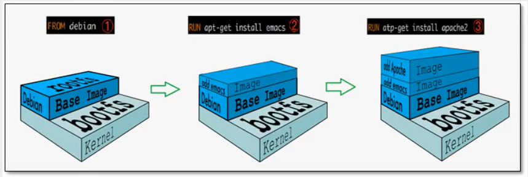
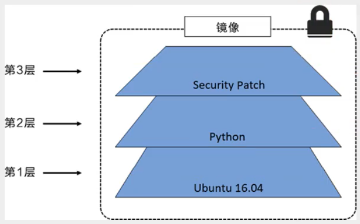
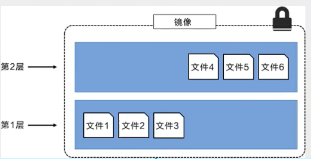
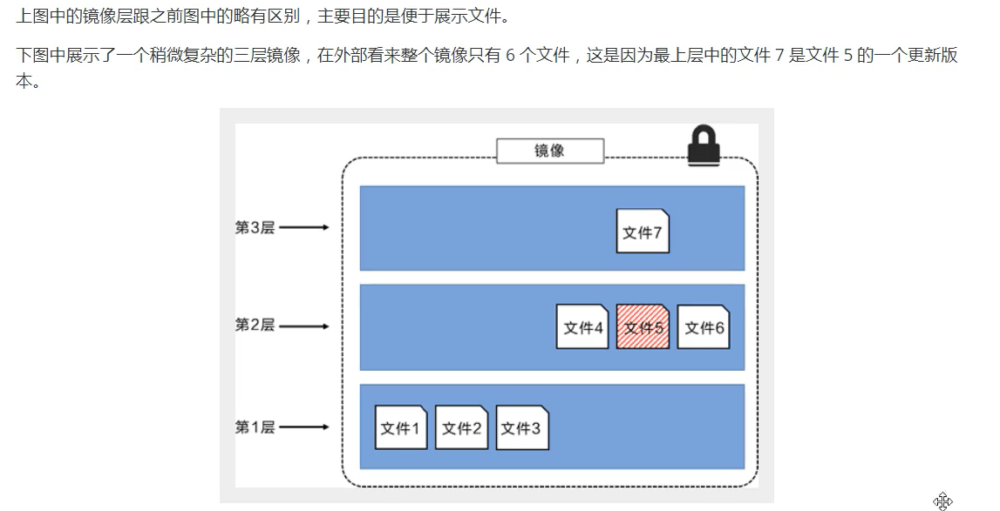
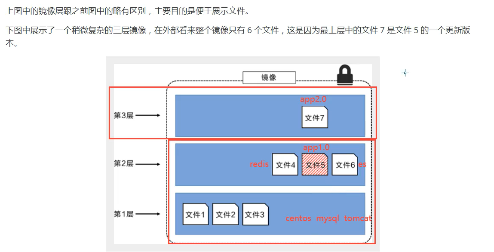
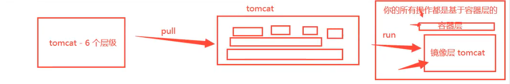
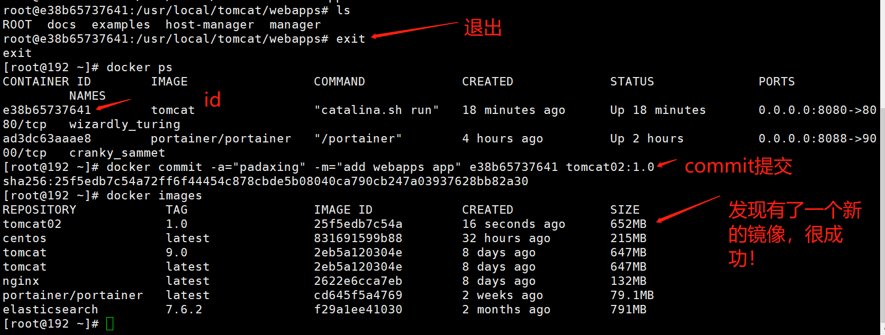

## 1 分层文件系统
### UnionFS 联合文件系统

* bootfs：boot file system
* rootfs：root file system



### 分层文件系统









* Docker镜像都是只读的，当容器启动时，一个新的可写层被加到镜像的顶部，这一层就是我们通常说的容器层，容器层之下的都叫镜像层


## 2 commit提交镜像

```
docker commit # 提交容器成为一个新的副本
docker commit -m="提交的描述信息" -a="作者" 容器id 目标镜像名：[TAG]
```
* 创建新镜像
```
➜  ~ docker commit -a="zhangxiaoyude" -m="add webapps app" 7b8096067457 tomcat02:1.0
sha256:6e0e1ad86723c435bdf26d368472195b7050de1d6b920252d9c93eac26132336
➜  ~ docker images                                                                  
REPOSITORY                                                TAG                                                                          IMAGE ID       CREATED          SIZE
tomcat02                                                  1.0                                                                          6e0e1ad86723   20 seconds ago   478MB
```

* 查看新镜像。发现新的版本，比之前的大了一些，因为里面记录了我们的改动
