## 1 概述

### 原理

* Docker：将应用和环境打包成一个镜像
* 数据？如果数据在容器中，那么我们容器删除，数据就会丢失。需求：数据持久化。
* 所以：Mysql的数据可以存储在本地。
* 所以：容器间可以有一个数据共享的技术。 Docker容器中产生的数据，同步到本地。这就是卷技术。
* 本质上是一种目录挂载，将容器内的目录，挂载到宿主机上。


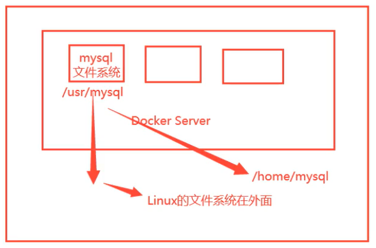
**总结：容器的持久化和同步操作，容器间可以数据共享**

### 使用

* -v 实现文件映射
```
docker run -it -v 目录映射 -p 端口映射
# -it 交互式
# -v volume卷技术
# -p 主机端口
➜  ~ docker run -it -v /Users/yinkanglong/ceshi:/home centos /bin/bash
```

* 使用docker inspect 查看挂载情况mount

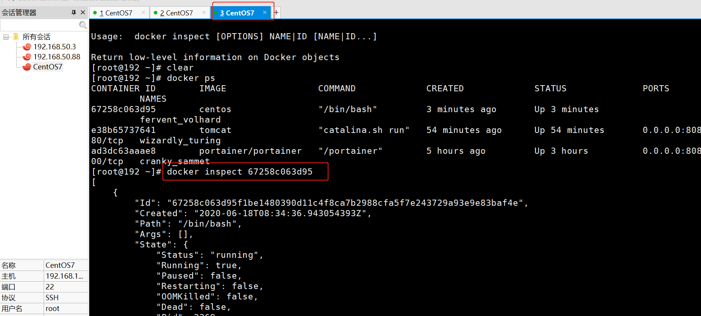
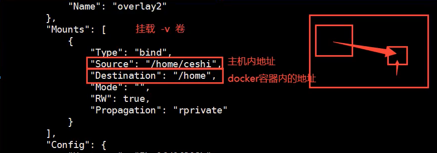
* 同步的过程，是一种双向绑定的过程。容器停止后，修改主机文件，再启动容器的时候，数据同样改变

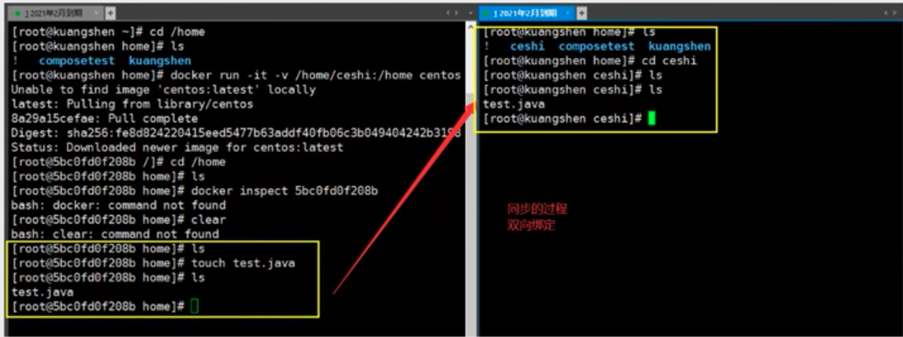
> 是同步的过程，还是目录挂载到磁盘的同一个位置了？

### 实战：安装Mysql

```
# 获取镜像
docker pull mysql 5.7

# 运行容器，需要做数据挂载
-d 后台运行
-p 端口映射
-v 卷挂载
--name 容器名字
➜  ~ docker run -d -p 3310:3306 -v /Users/yinkanglong/mysql/conf:/etc/mysql/conf.d -v /Users/yinkanglong/mysql/data:/var/lib/mysql -e MYSQL_ROOT_PASSWORD=123456 --name mysql01 mysql:5.7

# 启动之后链接数据库服务器进行测试
➜  data mysql -h 127.0.0.1 -P 3310 -uroot -p123456

# 在本地测试创建数据库，查看映射路径是否可以
create table
```

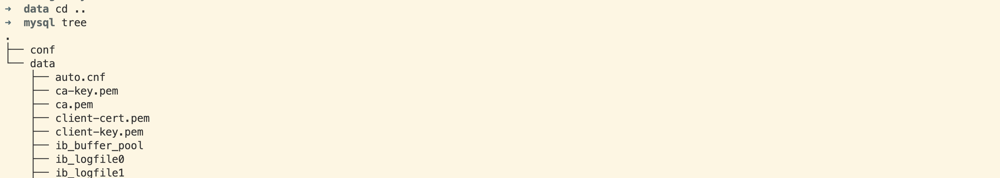


## 2 docker volume数据卷操作

```
docker volume --help
create      Create a volume
inspect     Display detailed information on one or more volumes
ls          List volumes
prune       Remove all unused local volumes
rm          Remove one or more volumes
```
* 查看所有的卷的情况
```
➜ docker volume ls    
DRIVER    VOLUME NAME
local     635d632e8d79ad10168a6bd6b65ba5b67de68c38c63b619915b6d00db2bd1b4a
local     0704fe09fca1d196b4d4f1cc14141ba05bae986d03ac1209f63ed1cca3d7bd7c
local     924b3cbb61444c73191a11200c727b52f9ccc17dd27024bce61ba63a33577663

# 这里发现的，就是匿名挂载。
```
* 查看卷的配置信息

```
➜ docker volume inspect 635d632e8d79ad10168a6bd6b65ba5b67de68c38c63b619915b6d00db2bd1b4a
[
    {
        "CreatedAt": "2022-10-07T10:04:09Z",
        "Driver": "local",
        "Labels": null,
        "Mountpoint": "/var/lib/docker/volumes/635d632e8d79ad10168a6bd6b65ba5b67de68c38c63b619915b6d00db2bd1b4a/_data",
        "Name": "635d632e8d79ad10168a6bd6b65ba5b67de68c38c63b619915b6d00db2bd1b4a",
        "Options": null,
        "Scope": "local"
    }
]
```
### 多种挂载方式
匿名挂载和具名挂载
* 匿名挂载，volume名称是随机生成的字符串。没有指定目录的情况下，都是挂载在/var/lib/docker/volumes/xxxx目录下
* 具名挂载方式，volume名称是我们指定的字符串。可以很方便地找我们的卷。大多数情况下使用具名挂载。
* 指定路径挂载。
* 指定读写权限挂载。容器内对路径的读写权限
  * ro readonly 只读权限
  * rw readwrite 读写权限

```
-v 容器内路径 # 匿名挂载
-v 卷名:容器内路径  # 具名挂载
-v /宿主机绝对路径:容器内路径 # 指定路径挂载
-v ::读写权限 # 指定目录的读写权限。
```

```
docker run -d -P --name nginx02 -v juming-nginx:/etc/nginx:ro nginx
docker run -d -P --name nginx02 -v juming-nginx:/etc/nginx:rw nginx
```


## 3 DockerFile构建docker镜像文件
Dockerfile 用来构建docker镜像的构建文件！就是命令脚本。

* 通过这个脚本可以生成镜像，镜像就是一层一层的。脚本是一个个的命令，每个命令是一层。

```shell
# 创建一个dockerfile文件，名字尽量为dockerfile
# 文件中的恩荣，指令大写，参数
➜  test_volume cat dockerfile1 
FROM centos

VOLUME ["volume01","volume02"]

CMD echo "--end--"
CMD /bin/bashs
# 这里的每个命令，都是镜像中的一层。
```
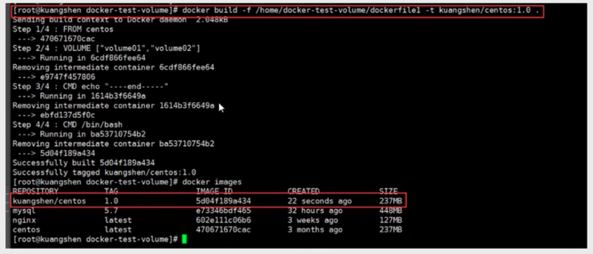

* 运行并查看我们自己创建的镜像。可以看到挂载的卷。这是一个匿名挂载，只包含容器内的文件路径。

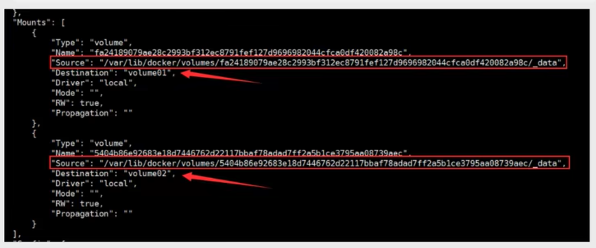

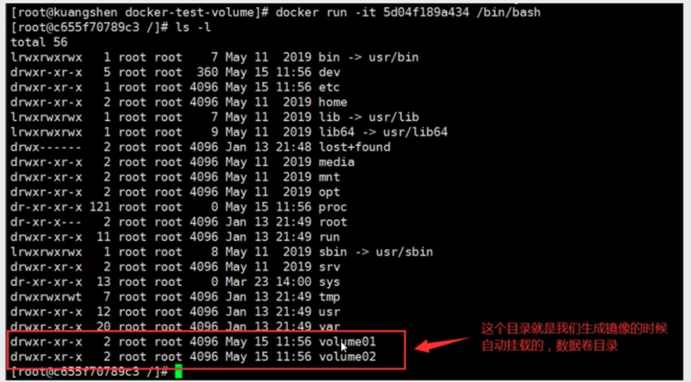
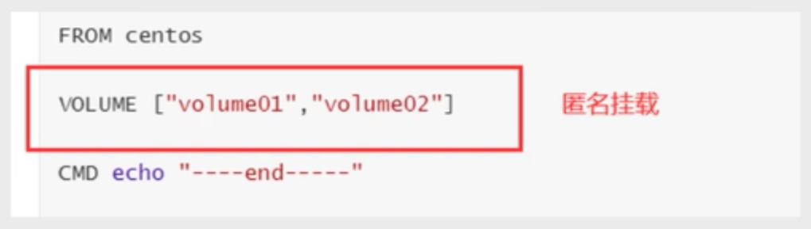
* 使用docker inspect能够查看卷挂载的路径。


* 最后测试一下文件是否同步。
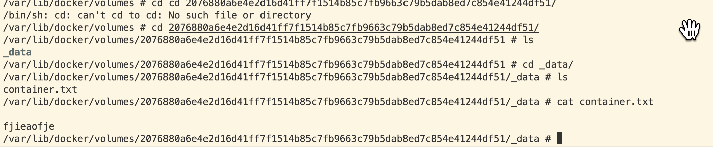
* mac下无法访问/var/lib/docker目录。解决方案

```
# 拉取镜像并运行进入VM，然后就可以找到/var/lib/docker
docker run -it --rm --privileged --pid=host justincormack/nsenter1
/ # hostname
docker-desktop
/ # uname -a
Linux docker-desktop 5.10.47-linuxkit #1 SMP Sat Jul 3 21:51:47 UTC 2021 x86_64 Linux
/ # cd /var/lib/docker/containers/
/var/lib/docker/containers # ls

469a5c56d4dcfa1f10228e4a10da5fdef2576d046bf83b99066ded54aeb93f90
a2158f98ccbfe057f8bf4d9c0f3a34b8408ed1bdb22ae72ea90cb781df6af166
b0bca090076ae5e683469b95ef7279b43ae941fb7ad7732ce233057a175225d8
d211d5e9bd3e094b37699e9163825c8941e6eff03c036fd3ffc774364db99493
d4df5c6e11115695fbc4d61cd018ab8a59006a6b9373ba837bf7003df8fd14bb

/var/lib/docker/containers # ls ../volumes/

0bc95ec18e21b6fe455581b48fc8784159e5b3de52037ae0b01dc30a978b3ed7
45f7d5b3f9a819b8035b088d4bfea306f1a54c3c5257cdc0f733d24691be8dcd
54c34557ba83af6f142a0916c7eddc36acdb1652eb9b5123ff5c40f6e1e7e4e8
79d875e4bb162d15417d9a1768b0042c2d08203450dcb904e69f01816927a07a
b2d98f27082a7864f83aaf667858f3fad39a02819cd4e00e61279a7d30589159
backingFsBlockDev
c4a9d80b6636e6dede8c637210dad9abf1b476a63f38848c767802de735a51dc
db8dcda5d651ec433d83cfeee5dd6d4be198a13d9fe5c103410060addab014ac
metadata.db
nginxconfig
```


## 4 数据卷容器

### 共享原理

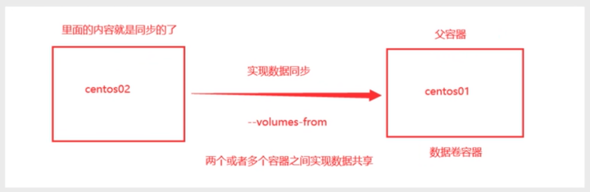


### 数据共享

* 通过vulumes-from 参数实现数据共享

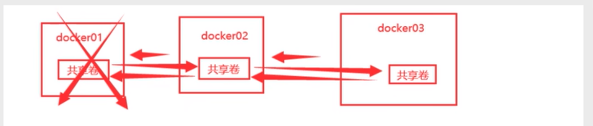

```shell
docker run -it --name docker01 --volumes-from a04eb38b1a38 yinkanglong/hello
```