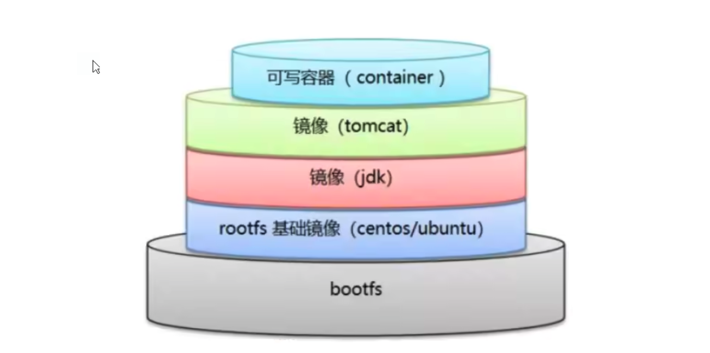
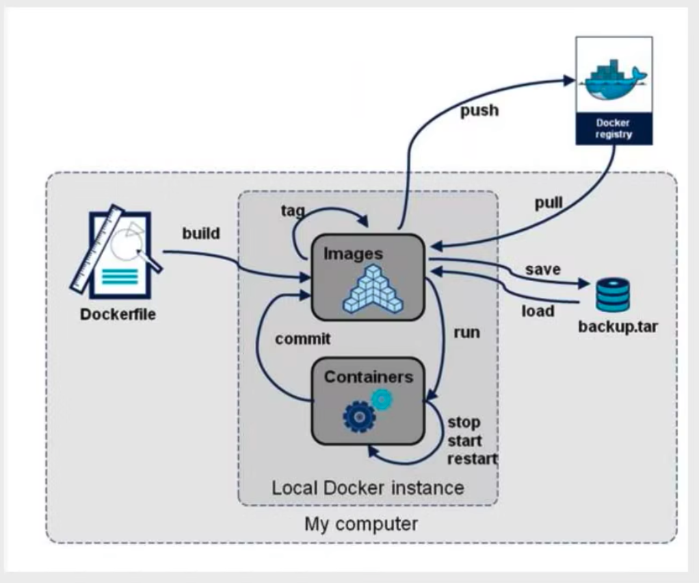

# Dockerfile

## 1 DockerFile

### 构建过程

dockerfile是用来构建docker镜像文件！命令参数脚本

构建步骤
1. dockerfile
2. docker build 构建一个镜像
3. docker run 运行镜像
4. docker push 发布一个镜像

dockerhub官方的镜像，会对应到github上一个仓库中的Dockerfile


### 指令
```
FROM 基础镜像
MAINTAINER 镜像的维护者信息
RUN Docker镜像构建的时候需要的命令
ADD 步骤：tomcat的镜像中，tomcat的压缩包
WORKDIR 镜像的工作目录
VOLUME -v挂载的目录位置
EXPOSE -p暴露端口


CMD 指定这个容器启动的时候运行的命令，只有最后一个会生效，而且可悲替代
ENTRYPOINT 指定这个容器启动的时候运行的命令，可以追加命令
ONBUILD 当构建一个被继承的DockerfileFile，就会影响ONBUILD指令。触发指令
COPY 类似ADD命令，将文件COPY到镜像中。
ENV 构建的时候设置环境变量
```

1. 每个保留关键字指令都是大写字母
2. `#`表示注释
3. 每一个指令都会创建提交一个新的镜像层，并提交

### DockFile的作用


dockerfile是面向开发的，发布项目、做镜像需要编写dockerfile。

* DockerFile：构建文件，定义了一切的步骤、源代码
* DockerImages：通过DockerFile构建生成的镜像，最终发布和运行的产品
* Docker容器：容器就是镜像运行起来，提供服务器

### 实践：创建自己的centos

> docker hub 中99%镜像都是从FROM scratch

1. 编写dockerfile的文件

```
➜  dockerfile git:(master) ✗ cat mydockerfile        
FROM centos
MAINTAINER yinkanglong<yinkanglong.163.com>


ENV MYPATH /usr/local
WORKDIR $MYPATH

RUN yum -y install vim
RUN yum -y install net-tools


EXPOSE 80

CMD echo $MYPATH
CMD echo "----end----"

CMD /bin/bash
```
2. docker builid 运行镜像

```
dockerfile git:(master) ✗ docker build -f mydockerfile -t mycentos:0.1 .
[+] Building 64.0s (8/8) FINISHED                                                                                                
 => [internal] load build definition from mydockerfile                                                                      0.2s
 => => transferring dockerfile: 265B                                                                                        0.1s
 => [internal] load .dockerignore                                                                                           0.1s
 => => transferring context: 2B                                                                                             0.0s
 => [internal] load metadata for docker.io/library/centos:7                                                                 4.5s
 => [1/4] FROM docker.io/library/centos:7@sha256:c73f515d06b0fa07bb18d8202035e739a494ce760aa73129f60f4bf2bd22b407          20.6s
 => => resolve docker.io/library/centos:7@sha256:c73f515d06b0fa07bb18d8202035e739a494ce760aa73129f60f4bf2bd22b407           0.0s
 => => sha256:c73f515d06b0fa07bb18d8202035e739a494ce760aa73129f60f4bf2bd22b407 1.20kB / 1.20kB                              0.0s
 => => sha256:dead07b4d8ed7e29e98de0f4504d87e8880d4347859d839686a31da35a3b532f 529B / 529B                                  0.0s
 => => sha256:eeb6ee3f44bd0b5103bb561b4c16bcb82328cfe5809ab675bb17ab3a16c517c9 2.75kB / 2.75kB                              0.0s
 => => sha256:2d473b07cdd5f0912cd6f1a703352c82b512407db6b05b43f2553732b55df3bc 76.10MB / 76.10MB                           15.0s
 => => extracting sha256:2d473b07cdd5f0912cd6f1a703352c82b512407db6b05b43f2553732b55df3bc                                   5.3s
 => [2/4] WORKDIR /usr/local                                                                                                0.6s
 => [3/4] RUN yum -y install vim                                                                                           21.9s
 => [4/4] RUN yum -y install net-tools                                                                                      9.3s
 => exporting to image                                                                                                      6.1s 
 => => exporting layers                                                                                                     6.1s 
 => => writing image sha256:87b7be8e41c9cc237c733930df0513f40a708fb0944f5ef48e815979e6880ee2                                0.0s 
 => => naming to docker.io/library/mycentos:0.1                                                                             0.0s 
                                                                                                                                 
Use 'docker scan' to run Snyk tests against images to find vulnerabilities and learn how to fix them                             
```
3. 测试运行docker run，验证了 vim和ifconfig命令可行

```
dockerfile git:(master) ✗ docker run -it mycentos:0.1    
[root@f318e4ba01b3 local]# pwd
/usr/local
[root@f318e4ba01b3 local]# ifconfig
eth0: flags=4163<UP,BROADCAST,RUNNING,MULTICAST>  mtu 1500
        inet 172.17.0.2  netmask 255.255.0.0  broadcast 172.17.255.255
        ether 02:42:ac:11:00:02  txqueuelen 0  (Ethernet)
        RX packets 10  bytes 876 (876.0 B)
        RX errors 0  dropped 0  overruns 0  frame 0
        TX packets 0  bytes 0 (0.0 B)
        TX errors 0  dropped 0 overruns 0  carrier 0  collisions 0

lo: flags=73<UP,LOOPBACK,RUNNING>  mtu 65536
        inet 127.0.0.1  netmask 255.0.0.0
        loop  txqueuelen 1000  (Local Loopback)
        RX packets 0  bytes 0 (0.0 B)
        RX errors 0  dropped 0  overruns 0  frame 0
        TX packets 0  bytes 0 (0.0 B)
        TX errors 0  dropped 0 overruns 0  carrier 0  collisions 0

[root@f318e4ba01b3 local]# vim where
[root@f318e4ba01b3 local]# which vim
/usr/bin/vim
```
 
### 实践：CMD和ENTRYPOINT


1. 编写dockerfilefile

```
vim dockerfile-cmd-test
FROM centos
CMD ["ls","-a"]
```
2. 构建镜像
```
docker build -f dockerfile-cmd-test -t cmdtest
```

3. 运行镜像
```
docker run cmdtest
```

4. 测试镜像
```
发现CMD追加命令报错，发现ENTRYPOINT命令追加的命令是可以执行的。
docker run cmtest  -l
```


### 实践：制作tomcat镜像 

> 更加复杂，日后补充

## 2 发布自己的镜像

### 发布自己的镜像到dockerhub

> DockeHub

1. 在https://hub.docker.com创建账号
2. 向服务器提交自己的镜像
3. 登录 docker login -u yinkanglong
4. 推送 docker push yinkanglong/mycentos:01


### 发布自己的镜像到阿里云

1. 登录阿里云
2. 申请仓库地址
3. 登录到阿里云仓库
4. docker push

### 本地发布docker save & docker load

1. 将镜像保存压缩包

2. 将压缩包加载为镜像

## 总结



## 3 DockerFile命令

Dockerfile 中每一个指令都会建立一层.

### 构建镜像
```
$ docker build -t nginx:v3 .
Sending build context to Docker daemon 2.048 kB
Step 1 : FROM nginx
 ---> e43d811ce2f4
Step 2 : RUN echo '<h1>Hello, Docker!</h1>' > /usr/share/nginx/html/index.html
 ---> Running in 9cdc27646c7b
 ---> 44aa4490ce2c
Removing intermediate container 9cdc27646c7b
Successfully built 44aa4490ce2c
```

* 直接用 Git repo 进行构建docker build 还支持从 URL 构建，比如可以直接从 Git repo 中构建：
```
$ docker build https://github.com/twang2218/gitlab-ce-zh.git#:8.14
docker build https://github.com/twang2218/gitlab-ce-zh.git\#:8.14
Sending build context to Docker daemon 2.048 kB
Step 1 : FROM gitlab/gitlab-ce:8.14.0-ce.0
8.14.0-ce.0: Pulling from gitlab/gitlab-ce
aed15891ba52: Already exists
773ae8583d14: Already exists
...
```
* 用给定的 tar 压缩包构建
```
$ docker build http://server/context.tar.gz
```

* 从标准输入中读取 Dockerfile 进行构建

```
docker build - < Dockerfile
或
cat Dockerfile | docker build -
```
* 从标准输入中读取上下文压缩包进行构建

```
$ docker build - < context.tar.gz
```
### 镜像构建上下文（Context）
docker build 命令最后有一个 .。. 表示当前目录，而 Dockerfile 就在当前目录，因此不少初学者以为这个路径是在指定 Dockerfile 所在路径，这么理解其实是不准确的。如果对应上面的命令格式，你可能会发现，这是在指定上下文路径。

首先我们要理解 docker build 的工作原理。Docker 在运行时分为 Docker 引擎（也就是服务端守护进程）和客户端工具。Docker 的引擎提供了一组 REST API，被称为 Docker Remote API，而如 docker 命令这样的客户端工具，则是通过这组 API 与 Docker 引擎交互，从而完成各种功能。

当我们进行镜像构建的时候，并非所有定制都会通过 RUN 指令完成，经常会需要将一些本地文件复制进镜像，比如通过 COPY 指令、ADD 指令等。而 docker build 命令构建镜像，其实并非在本地构建，而是在服务端，也就是 Docker 引擎中构建的。那么在这种客户端/服务端的架构中，如何才能让服务端获得本地文件呢？

这就引入了上下文的概念。当构建的时候，用户会指定构建镜像上下文的路径，docker build 命令得知这个路径后，会将路径下的所有内容打包，然后上传给 Docker 引擎。这样 Docker 引擎收到这个上下文包后，展开就会获得构建镜像所需的一切文件。


### FROM
指定基础镜像
所谓定制镜像，那一定是以一个镜像为基础，在其上进行定制。就像我们之前运行了一个 nginx 镜像的容器，再进行修改一样，基础镜像是必须指定的。而 FROM 就是指定基础镜像，因此一个 Dockerfile 中 FROM 是必备的指令，并且必须是第一条指令。

在 Docker Hub (https://hub.docker.com/explore/) 上有非常多的高质量的官方镜像， 有可以直接拿来使用的服务类的镜像，如 nginx、redis、mongo、mysql、httpd、php、tomcat 等

除了选择现有镜像为基础镜像外，Docker 还存在一个特殊的镜像，名为 scratch。这个镜像是虚拟的概念，并不实际存在，它表示一个空白的镜像。

对于 Linux 下静态编译的程序来说，并不需要有操作系统提供运行时支持，所需的一切库都已经在可执行文件里了，因此直接 FROM scratch 会让镜像体积更加小巧。使用 Go 语言 开发的应用很多会使用这种方式来制作镜像，这也是为什么有人认为 Go 是特别适合容器微服务架构的语言的原因之一。
```
FROM scratch
...
```


### RUN执行命令
RUN 指令是用来执行命令行命令的。由于命令行的强大能力，RUN 指令在定制镜像时是最常用的指令之一。其格式有两种：

* shell 格式：RUN <命令>，就像直接在命令行中输入的命令一样。刚才写的 Dockrfile 中的 RUN 指令就是这种格式。
* exec 格式：RUN ["可执行文件", "参数1", "参数2"]，这更像是函数调用中的格式。

```
RUN echo '<h1>Hello, Docker!</h1>' > /usr/share/nginx/html/index.html
```


像 Shell 脚本一样把每个命令对应一个 RUN
```
FROM debian:jessie

RUN apt-get update
RUN apt-get install -y gcc libc6-dev make
RUN wget -O redis.tar.gz "http://download.redis.io/releases/redis-3.2.5.tar.gz"
RUN mkdir -p /usr/src/redis
RUN tar -xzf redis.tar.gz -C /usr/src/redis --strip-components=1
RUN make -C /usr/src/redis
RUN make -C /usr/src/redis install
```

上面的这种写法，创建了 7 层镜像。这是完全没有意义的，而且很多运行时不需要的东西，都被装进了镜像里，比如编译环境、更新的软件包等等。结果就是产生非常臃肿、非常多层的镜像，不仅仅增加了构建部署的时间，也很容易出错。 
Dockerfile 正确的写法
```
FROM debian:jessie

RUN buildDeps='gcc libc6-dev make' \
    && apt-get update \
    && apt-get install -y $buildDeps \
    && wget -O redis.tar.gz "http://download.redis.io/releases/redis-3.2.5.tar.gz" \
    && mkdir -p /usr/src/redis \
    && tar -xzf redis.tar.gz -C /usr/src/redis --strip-components=1 \
    && make -C /usr/src/redis \
    && make -C /usr/src/redis install \
    && rm -rf /var/lib/apt/lists/* \
    && rm redis.tar.gz \
    && rm -r /usr/src/redis \
    && apt-get purge -y --auto-remove $buildDeps
```

这里为了格式化还进行了换行。Dockerfile 支持 Shell 类的行尾添加 \ 的命令换行方式，以及行首 # 进行注释的格式。良好的格式，比如换行、缩进、注释等，会让维护、排障更为容易，这是一个比较好的习惯。

此外，还可以看到这一组命令的最后添加了清理工作的命令，删除了为了编译构建所需要的软件，清理了所有下载、展开的文件，并且还清理了 apt 缓存文件。这是很重要的一步，我们之前说过，镜像是多层存储，每一层的东西并不会在下一层被删除，会一直跟随着镜像。因此镜像构建时，一定要确保每一层只添加真正需要添加的东西，任何无关的东西都应该清理掉。

### COPY 复制文件

COPY 指令将从构建上下文目录中 <源路径> 的文件/目录复制到新的一层的镜像内的 <目标路径> 位置。

```
COPY package.json /usr/src/app/
```
### ADD 高级文件复制
ADD 指令和 COPY 的格式和性质基本一致。但是在 COPY 基础上增加了一些功能。

* 如果 <源路径> 可以是一个 URL，这种情况下，Docker 引擎会试图去下载这个链接的文件放到 <目标路径> 去。下载后的文件权限自动设置为 600
* 如果 <源路径> 为一个 tar 压缩文件的话，压缩格式为 gzip, bzip2 以及 xz 的情况下，ADD 指令将会自动解压缩这个压缩文件到 <目标路径> 去。

```
FROM scratch
ADD ubuntu-xenial-core-cloudimg-amd64-root.tar.gz /
...
```


### CMD 容器启动命令
CMD 指令就是用于指定默认的容器主进程的启动命令的。

CMD 指令的格式和 RUN 相似，也是两种格式：

* shell 格式：CMD <命令>
* exec 格式：CMD ["可执行文件", "参数1", "参数2"...]
* 参数列表格式：CMD ["参数1", "参数2"...]。在指定了 ENTRYPOINT 指令后，用 CMD 指定具体的参数。


在运行时可以指定新的命令来替代镜像设置中的这个默认命令，比如，ubuntu 镜像默认的 CMD 是 /bin/bash，如果我们直接 docker run -it ubuntu 的话，会直接进入 bash。我们也可以在运行时指定运行别的命令，如 docker run -it ubuntu cat /etc/os-release。这就是用 cat /etc/os-release 命令替换了默认的 /bin/bash 命令了，输出了系统版本信息。

### ENTRYPOINT

ENTRYPOINT 的格式和 RUN 指令格式一样，分为 exec 格式和 shell 格式。

ENTRYPOINT 的目的和 CMD 一样，都是在指定容器启动程序及参数。ENTRYPOINT 在运行时也可以替代，不过比 CMD 要略显繁琐，需要通过 docker run 的参数 --entrypoint 来指定。

* CMD命令无法追加参数，ENTRYPOINT命令可以追加参数。

```
FROM ubuntu:16.04
RUN apt-get update \
    && apt-get install -y curl \
    && rm -rf /var/lib/apt/lists/*
ENTRYPOINT [ "curl", "-s", "http://ip.cn" ]
```

```
$ docker run myip
当前 IP：61.148.226.66 来自：北京市 联通

$ docker run myip -i
HTTP/1.1 200 OK
Server: nginx/1.8.0
Date: Tue, 22 Nov 2016 05:12:40 GMT
Content-Type: text/html; charset=UTF-8
Vary: Accept-Encoding
X-Powered-By: PHP/5.6.24-1~dotdeb+7.1
X-Cache: MISS from cache-2
X-Cache-Lookup: MISS from cache-2:80
X-Cache: MISS from proxy-2_6
Transfer-Encoding: chunked
Via: 1.1 cache-2:80, 1.1 proxy-2_6:8006
Connection: keep-alive

当前 IP：61.148.226.66 来自：北京市 联通
```

* ENTRYPOINT与CMD组合追加参数。可以写一个脚本，然后放入 ENTRYPOINT 中去执行，而这个脚本会将接到的参数（也就是 <CMD>）作为命令，在脚本最后执行。

```
FROM alpine:3.4
...
RUN addgroup -S redis && adduser -S -G redis redis
...
ENTRYPOINT ["docker-entrypoint.sh"]

EXPOSE 6379
CMD [ "redis-server" ]
```

### ENV设置环境变量
格式有两种：
```
ENV <key> <value>
ENV <key1>=<value1> <key2>=<value2>...
```

这个指令很简单，就是设置环境变量而已，无论是后面的其它指令，如 RUN，还是运行时的应用，都可以直接使用这里定义的环境变量。
```
ENV VERSION=1.0 DEBUG=on \
    NAME="Happy Feet"
```

```sh
ENV NODE_VERSION 7.2.0

RUN curl -SLO "https://nodejs.org/dist/v$NODE_VERSION/node-v$NODE_VERSION-linux-x64.tar.xz" \
  && curl -SLO "https://nodejs.org/dist/v$NODE_VERSION/SHASUMS256.txt.asc" \
  && gpg --batch --decrypt --output SHASUMS256.txt SHASUMS256.txt.asc \
  && grep " node-v$NODE_VERSION-linux-x64.tar.xz\$" SHASUMS256.txt | sha256sum -c - \
  && tar -xJf "node-v$NODE_VERSION-linux-x64.tar.xz" -C /usr/local --strip-components=1 \
  && rm "node-v$NODE_VERSION-linux-x64.tar.xz" SHASUMS256.txt.asc SHASUMS256.txt \
  && ln -s /usr/local/bin/node /usr/local/bin/nodejs
```


### ARG 构建参数

```
格式：ARG <参数名>[=<默认值>]
```
构建参数和 ENV 的效果一样，都是设置环境变量。所不同的是，ARG 所设置的构建环境的环境变量，在将来容器运行时是不会存在这些环境变量的。但是不要因此就使用 ARG 保存密码之类的信息，因为 docker history 还是可以看到所有值的。

Dockerfile 中的 ARG 指令是定义参数名称，以及定义其默认值。该默认值可以在构建命令 docker build 中用 --build-arg <参数名>=<值> 来覆盖。

### VOLUME 定义匿名卷
格式为：
```
VOLUME ["<路径1>", "<路径2>"...]
VOLUME <路径>
```
之前我们说过，容器运行时应该尽量保持容器存储层不发生写操作，对于数据库类需要保存动态数据的应用，其数据库文件应该保存于卷(volume)中，后面的章节我们会进一步介绍 Docker 卷的概念。为了防止运行时用户忘记将动态文件所保存目录挂载为卷，在 Dockerfile 中，我们可以事先指定某些目录挂载为匿名卷，这样在运行时如果用户不指定挂载，其应用也可以正常运行，不会向容器存储层写入大量数据。
```
VOLUME /data
```
这里的 /data 目录就会在运行时自动挂载为匿名卷，任何向 /data 中写入的信息都不会记录进容器存储层，从而保证了容器存储层的无状态化。当然，运行时可以覆盖这个挂载设置。比如：
```
docker run -d -v mydata:/data xxxx
```
在这行命令中，就使用了 mydata 这个命名卷挂载到了 /data 这个位置，替代了 Dockerfile 中定义的匿名卷的挂载配置。

### EXPOSE 暴露端口

```
格式为 EXPOSE <端口1> [<端口2>...]。
```
EXPOSE 指令是声明运行时容器提供服务端口，这只是一个声明，在运行时并不会因为这个声明应用就会开启这个端口的服务。在 Dockerfile 中写入这样的声明有两个好处，一个是帮助镜像使用者理解这个镜像服务的守护端口，以方便配置映射；另一个用处则是在运行时使用随机端口映射时，也就是 docker run -P 时，会自动随机映射 EXPOSE 的端口。

### WORKDIR 指定工作目录
```
格式为 WORKDIR <工作目录路径>。
```
使用 WORKDIR 指令可以来指定工作目录（或者称为当前目录），以后各层的当前目录就被改为指定的目录，如该目录不存在，WORKDIR 会帮你建立目录。


之前提到一些初学者常犯的错误是把 Dockerfile 等同于 Shell 脚本来书写，这种错误的理解还可能会导致出现下面这样的错误：
```
RUN cd /app
RUN echo "hello" > world.txt
```
如果将这个 Dockerfile 进行构建镜像运行后，会发现找不到 /app/world.txt 文件，或者其内容不是 hello。原因其实很简单，在 Shell 中，连续两行是同一个进程执行环境，因此前一个命令修改的内存状态，会直接影响后一个命令；而在 Dockerfile 中，这两行 RUN 命令的执行环境根本不同，是两个完全不同的容器。这就是对 Dokerfile 构建分层存储的概念不了解所导致的错误。


### USER 指定当前用户
```
格式：USER <用户名>
```
USER 指令和 WORKDIR 相似，都是改变环境状态并影响以后的层。WORKDIR 是改变工作目录，USER 则是改变之后层的执行 RUN, CMD 以及 ENTRYPOINT 这类命令的身份。

当然，和 WORKDIR 一样，USER 只是帮助你切换到指定用户而已，这个用户必须是事先建立好的，否则无法切换。
```
RUN groupadd -r redis && useradd -r -g redis redis
USER redis
RUN [ "redis-server" ]
```
如果以 root 执行的脚本，在执行期间希望改变身份，比如希望以某个已经建立好的用户来运行某个服务进程，不要使用 su 或者 sudo，这些都需要比较麻烦的配置，而且在 TTY 缺失的环境下经常出错。建议使用 gosu，可以从其项目网站看到进一步的信息：https://github.com/tianon/gosu
```
# 建立 redis 用户，并使用 gosu 换另一个用户执行命令
RUN groupadd -r redis && useradd -r -g redis redis
# 下载 gosu
RUN wget -O /usr/local/bin/gosu "https://github.com/tianon/gosu/releases/download/1.7/gosu-amd64" \
    && chmod +x /usr/local/bin/gosu \
    && gosu nobody true
# 设置 CMD，并以另外的用户执行
CMD [ "exec", "gosu", "redis", "redis-server" ]
```