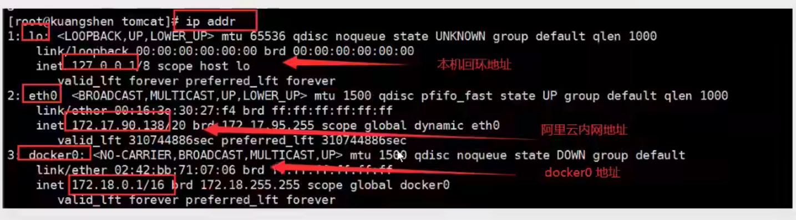
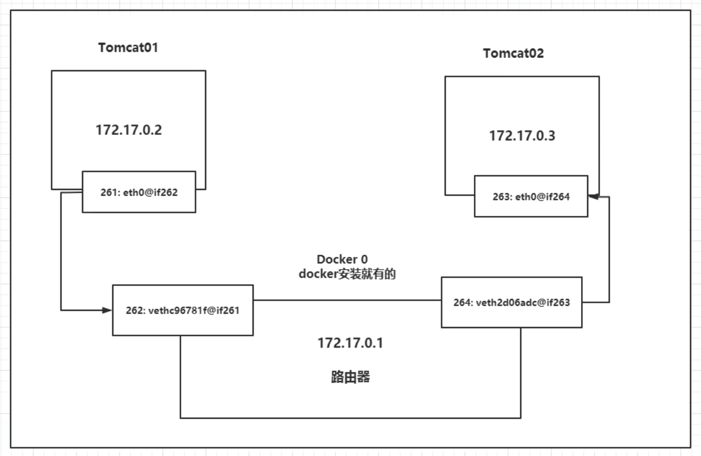
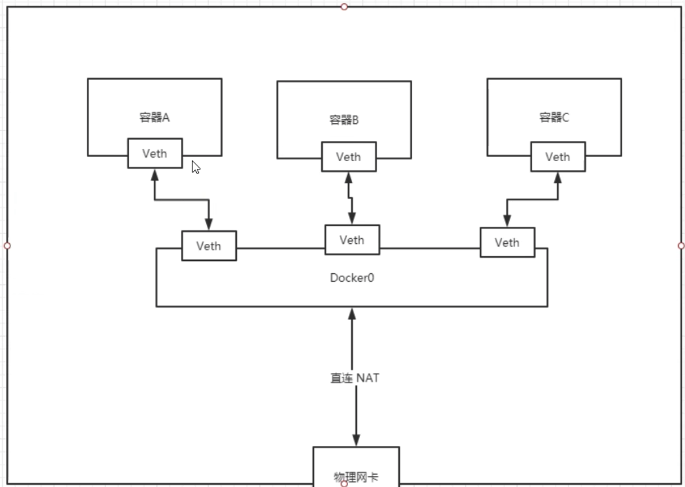
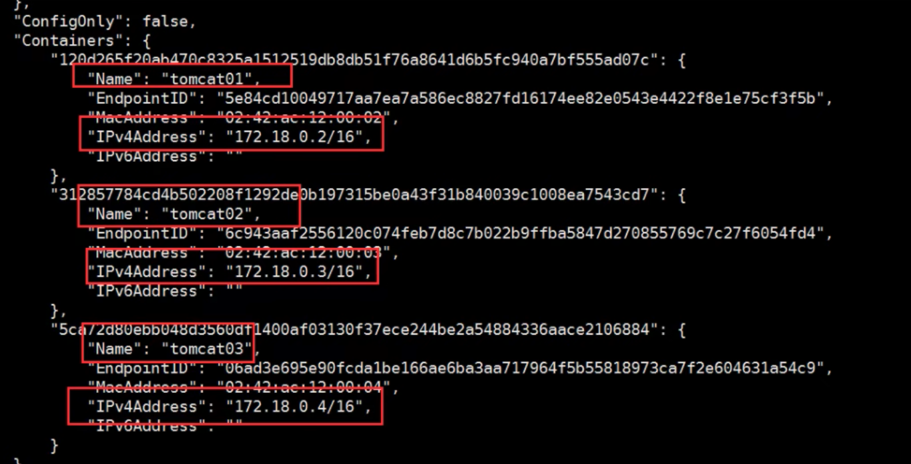
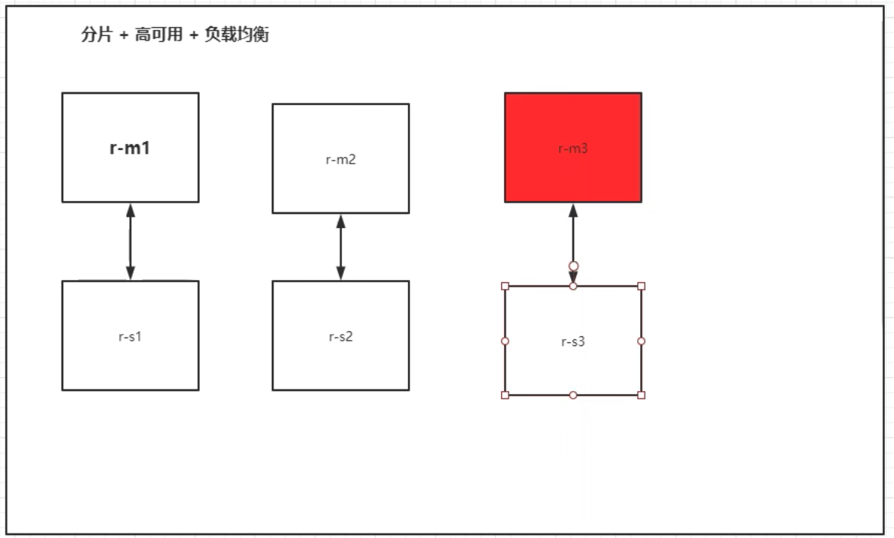

## 1 简介

### 网络原理


* 下载iproute工具（linux）ip addr查看地址映射



* 容器内ip地址会进行映射@符号。docker分配的地址。

```
77: eth0@if78: <BROADCAST,MULTICAST,UP,LOWER_UP> mtu 1500 qdisc noqueue state UP group default 
    link/ether 02:42:ac:11:00:03 brd ff:ff:ff:ff:ff:ff link-netnsid 0
    inet 172.17.0.3/16 brd 172.17.255.255 scope global eth0
       valid_lft forever preferred_lft forever
```

* 容器、宿主机之间可以通过docker构建的docker虚拟网络进行通信，相互ping通
### docker桥接原理
vethc-pair技术，充当桥梁。
* 宿主机能够生成成对的地址，一端连接容器的虚拟网卡，另一端连接宿主机的虚拟网卡。
* 宿主机端的虚拟网卡们，能够构成一个局域网络。
* 宿主机的网卡能够和docker中的网卡进行一对一通信。



### 容器网络

所有容器在不指定网络的情况下，使用docker0的地址做路由。

docker中的所有网络接口都是虚拟的，转发效率很高。

容器删除，对应的网桥一对就没了。



## 2 补充知识

### --link名称解析

--link可以通过名称访问具体的docker

* 在docker启动的过程中，早host中添加了一条路由。
* 所以只有在这个容器中访问指定的名字的时候，才能pint通。


### docker network网络查看

```
  connect     Connect a container to a network
  create      Create a network
  disconnect  Disconnect a container from a network
  inspect     Display detailed information on one or more networks
  ls          List networks
  prune       Remove all unused networks
  rm          Remove one or more networks
```

* ls能够查看网卡
* inspect能够查看网卡细节的元数据信息。




## 3 自定义网络

### 网络原理

* 桥接模式bridge：
* none：不配置网络
* host：和宿主机共享网络
* container:容器内网络联通

```
直接启动默认参数--net bridge
➜  notes git:(master) ✗ docker run -d -P --name tomcat01 --net bridge tomcat

创建容器网络
docker network create --driver bridge --subnet 192.168.0.0/16 --gateway 192.168.0.1 mynet

查看自己创建的网络
docker network inspect mynet


创建容器加入容器网络
docker run -d -P --name tomcat01 --net mynet tomcat


能够将容器加入到网络中
docker network connnet mynet tomcat01
```


## 4 实战：Redis集群




```
for port in $(seq 1 6); \
do \
mkdir -p /mydata/redis/node-${port}/conf
touch /mydata/redis/node-${port}/conf/redis.conf
cat << EOF >/mydata/redis/node-${port}/conf/redis.conf
port 6379 
bind 0.0.0.0
cluster-enabled yes 
cluster-config-file nodes.conf
cluster-node-timeout 5000
cluster-announce-ip 172.38.0.1${port}
cluster-announce-port 6379
cluster-announce-bus-port 16379
appendonly yes
EOF
done

for i in(1..6);
do
docker run -p 6371:6379 -p 16371:16379 --name redis-1 \
    -v ~/mydata/redis/node-1/data:/data \
    -v ~/mydata/redis/node-1/conf/redis.conf:/etc/redis/redis.conf \
    -d --net redis --ip 172.38.0.11 redis:5.0.9-alpine3.11 redis-server /etc/redis/redis.conf
done 
```

## 实战：SpringBoot服务

1. 开构建springboot项目
2. 打包应用
3. 编写dockerfilefile
4. 构建镜像
5. 发布运行

```
FROM java:8
COPY *.jar /app.jar

CMD ["--server.port=8080"]

EXPOSE 8080

ENTRYPOINT ["java","jar","/app.jar"]
```