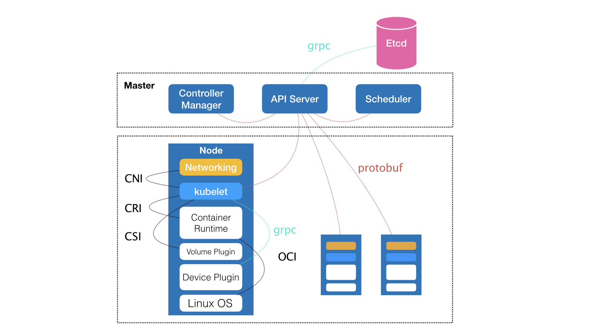
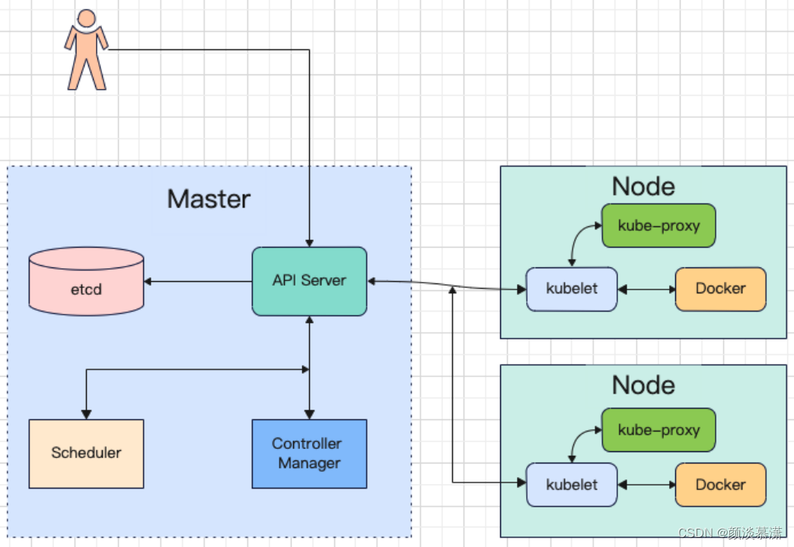
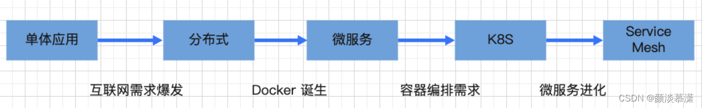
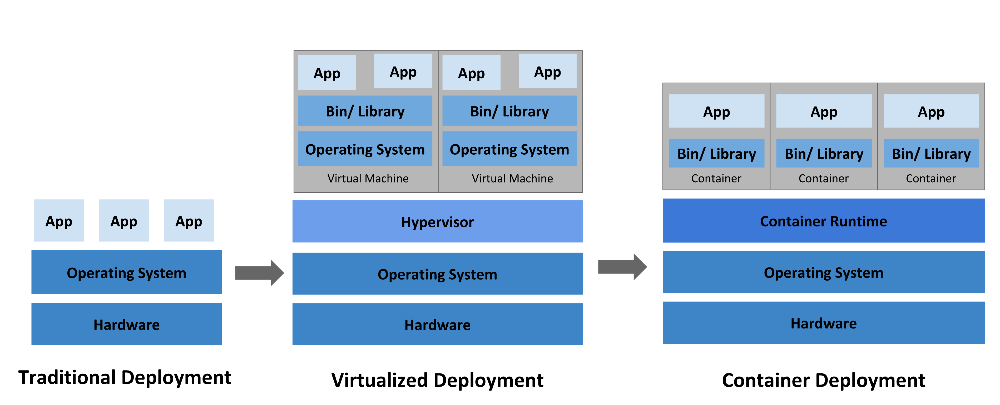
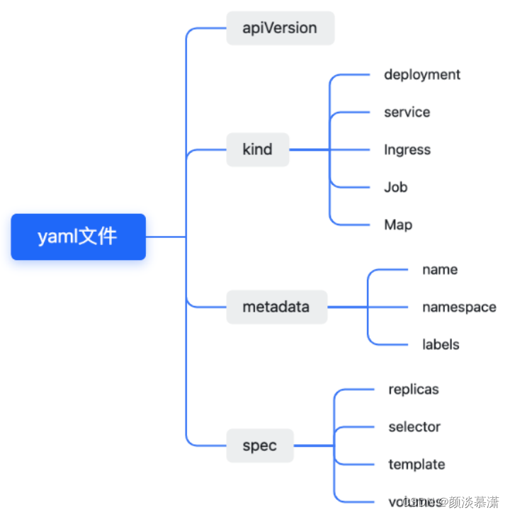
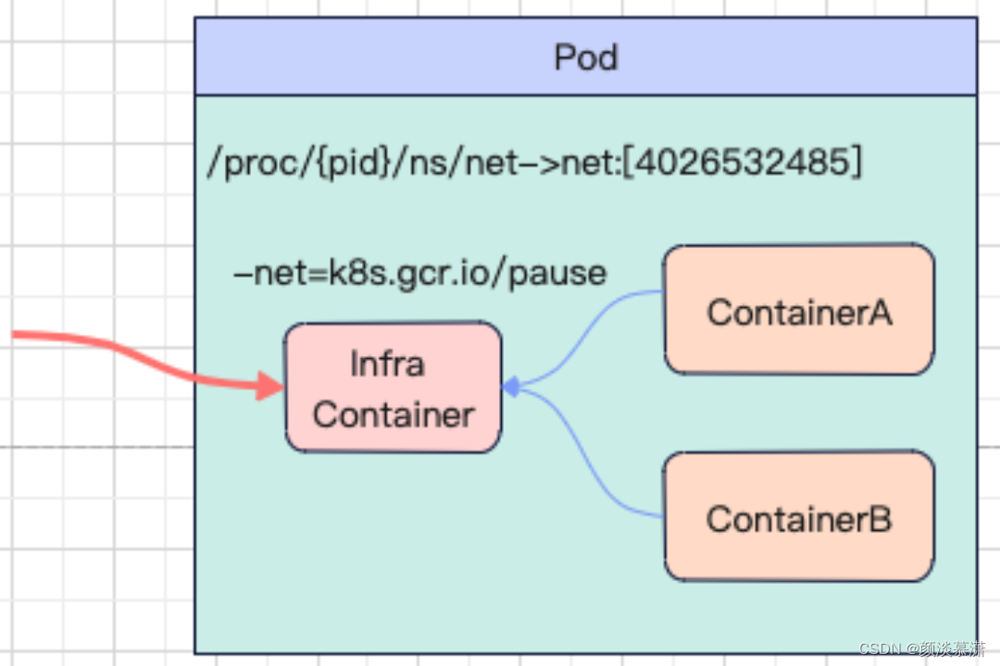
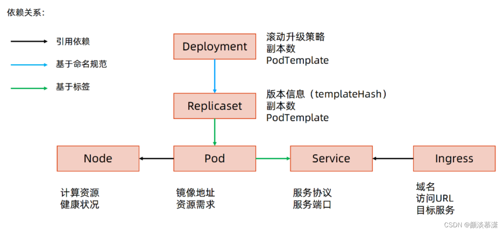

# Kubernetes

## 概述

### 什么是Kubernetes

随着微服务架构被越来越多的公司使用，大部分单体应用正逐步被拆解成小的、独立运行的微服务。微服务的优势这里不做探讨，但是其带来的服务维护问题大大增加，若想要在管理大量微服务的情况下同时还做到以下几点：

- 让资源利用率更高

- 让硬件成本相对更低

Kubernetes是一个可以移植、可扩展的开源平台，使用 声明式的配置 并依据配置信息自动地执行容器化应用程序的管理。在所有的容器编排工具中（类似的还有 docker swarm / mesos等），Kubernetes的生态系统更大、增长更快，有更多的支持、服务和工具可供用户选择。于是就自然而然地就产生了基于容器自动化部署微服务的需求，在容器编排这块的纷争，各大巨头参与，战况惨烈，但最终胜出的是谷歌的Kubernetes[^1]，其提供的特性有：

- **服务发现和负载均衡**
- **服务编排和容器调度**
- **发布部署：滚动升级、回滚**
- **自动伸缩：扩容缩容和重启**
- **自愈**
- **密钥及配置管理**

### Kubernetes构成
通过下面架构图可以看到其有上下两部分对应的`Master&Node`节点构成，这两种角色分别对应着**控制节点和计算节点**。

> Master控制节点主要出发点在于如何编排、管理、调度用户提交的作业

Master组件是集群的控制平台（control plane）：
* master 组件负责集群中的全局决策（例如，调度）
* master 组件探测并响应集群事件（例如，当 Deployment 的实际 Pod 副本数未达到 replicas 字段的规定时，启动一个新的 Pod）

Kubernetes Master组件。控制节点主要由以下几个核心组件组成：

  
- apiserver提供了资源操作的唯一入口，并提供认证、授权、访问控制、API注册和发现等机制。提供 Kubernetes API。这是Kubernetes控制平台的前端（front-end），可以水平扩展（通过部署更多的实例以达到性能要求）。kubectl / kubernetes dashboard / kuboard 等Kubernetes管理工具就是通过 kubernetes API 实现对 Kubernetes 集群的管理。
- etcd支持一致性和高可用的名值对存储组件，Kubernetes集群的所有配置信息都存储在 etcd 中。保存了整个集群的状态
- scheduler负责资源的调度，按照预定的调度策略将Pod调度到相应的机器上。此 master 组件监控所有新创建尚未分配到节点上的 Pod，并且自动选择为 Pod 选择一个合适的节点去运行。
- controller manager负责维护集群的状态，比如故障检测、自动扩展、滚动更新等。运行了所有的控制器。逻辑上来说，每一个控制器是一个独立的进程，但是为了降低复杂度，这些控制器都被合并运行在一个进程里。kube-controller-manager 中包含的控制器有：
  - 节点控制器： 负责监听节点停机的事件并作出对应响应
  - 副本控制器： 负责为集群中每一个 副本控制器对象（Replication Controller Object）维护期望的 Pod 副本数
  - 端点（Endpoints）控制器：负责为端点对象（Endpoints Object，连接 Service 和 Pod）赋值
  - Service Account & Token控制器： 负责为新的名称空间创建 default Service Account 以及 API Access Token

Kubernetes Node组件。对于计算节点：

- kubelet负责维护容器的生命周期，同时也负责Volume（CSI）和网络（CNI）的管理。此组件是运行在每一个集群节点上的代理程序。它确保 Pod 中的容器处于运行状态。
- Container runtime负责镜像管理以及Pod和容器的真正运行（CRI）。容器引擎负责运行容器。Kubernetes支持多种容器引擎：Docker、containerd、cri-o 、rktlet以及任何实现了 Kubernetes容器引擎接口 (opens new window)的容器引擎
- kube-proxy负责为Service提供cluster内部的服务发现和负载均衡。是一个网络代理程序，运行在集群中的每一个节点上，是实现 Kubernetes Service 概念的重要部分。
- DNS。所有 Kubernetes 集群都应该有 Cluster DNS。Cluster DNS 是一个 DNS 服务器，是对您已有环境中其他 DNS 服务器的一个补充，存放了 Kubernetes Service 的 DNS 记录。Kubernetes 启动容器时，自动将该 DNS 服务器加入到容器的 DNS 搜索列表中。
- Web UI（Dashboard）。Dashboard (opens new window)是一个Kubernetes集群的 Web 管理界面。用户可以通过该界面管理集群。Kuboard，Kuboard 是一款基于Kubernetes的微服务管理界面
- ContainerResource Monitoring。Container Resource Monitoring (opens new window)将容器的度量指标（metrics）记录在时间序列数据库中，并提供了 UI 界面查看这些数据

### kubernetes发展历史

* 传统部署时代：早期，企业直接将应用程序部署在物理机上。由于物理机上不能为应用程序定义资源使用边界，我们也就很难合理地分配计算资源。例如：如果多个应用程序运行在同一台物理机上，可能发生这样的情况：其中的一个应用程序消耗了大多数的计算资源，导致其他应用程序不能正常运行。应对此问题的一种解决办法是，将每一个应用程序运行在不同的物理机上。然而，这种做法无法大规模实施，因为资源利用率很低，且企业维护更多物理机的成本昂贵。

* 虚拟化部署时代：针对上述问题，虚拟化技术应运而生。用户可以在单台物理机的CPU上运行多个虚拟机（Virtual Machine）。
  * 虚拟化技术使得应用程序被虚拟机相互分隔开，限制了应用程序之间的非法访问，进而提供了一定程度的安全性。
  * 虚拟化技术提高了物理机的资源利用率，可以更容易地安装或更新应用程序，降低了硬件成本，因此可以更好地规模化实施。
  * 每一个虚拟机可以认为是被虚拟化的物理机之上的一台完整的机器，其中运行了一台机器的所有组件，包括虚拟机自身的操作系统。
* 容器化部署时代：容器与虚拟机类似，但是降低了隔离层级，共享了操作系统。因此，容器可以认为是轻量级的。通过约束和修改进程的动态表现，从而为其创造出一个“边界”。进而为每个应用创造了独立的运行空间
    * 与虚拟机相似，每个容器拥有自己的文件系统、CPU、内存、进程空间等
    * 运行应用程序所需要的资源都被容器包装，并和底层基础架构解耦
    * 容器化的应用程序可以跨云服务商、跨Linux操作系统发行版进行部署

## 声明式系统

### 是什么

声明式系统：关注目标-“做什么”。在软件工程领域，声明式系统指程序代码描述系统应 该做什么而不是怎么做。仅限于描述要达到什么目的， 如何达到目的交给系统。

命令式系统：关注过程- “如何做”。在软件工程领域，命令式系统是写出解决某个问 题，完成某个任务，或者达到某个目标的的明确步 骤。此方法明确写出系统应该执行某指令，并且期待系统返回期望结果。

### 标准结构

* Apiversion：定义api版本标签
* Kind：定义资源的类型、角色，其中有常用的这几种(deployment、service、Ingress、Job、Map)
* Metadata：定义资源的元数据信息，比如资源名称，namespace,标签等
* Spec：定义资源需要的参数属性，比如副本数量，标签选择器，业务版本，是否需要容器，容器镜像版本，容器启动名称，启动策略，硬件资源限制，等等，都是通过spec的子项进行定义

## 重要概念

### 1.集群
Kubernetes集群是由多个节点组成的集合，这些节点可以在同一物理机器上，也可以在不同的物理机器上。

集群由Master节点和Worker节点组成。Master节点用于管理整个集群，而Worker节点用于托管应用程序的容器。

集群中的每个节点都有一个代理程序（kubelet），它与Master节点进行通信，以管理容器。

### 2.节点
Kubernetes节点是集群中的计算机，可以是物理计算机或虚拟机。节点可以是Master节点或Worker节点。

Master节点负责管理整个集群，而Worker节点负责托管应用程序的容器。

### 3.容器
Kubernetes容器是一种轻量级的虚拟化技术，它可以将应用程序及其依赖项打包到一个可移植的镜像中，并在运行时在任何地方运行。

Docker是一种常用的容器技术，Kubernetes也支持其他容器技术。

### 4.Pod
Kubernetes Pod是一个或多个紧密耦合的容器的最小部署单元。

Pod包含一个或多个应用程序容器，这些容器共享相同的网络和存储资源，并可以通过本地进程间通信（IPC）和共享文件系统进行通信。

Pod还可以包含一个或多个初始化容器，这些容器在应用程序容器之前运行，以准备Pod的运行环境。

容器的本质是进程，k8s就是操作系统。而k8s所做的，其实就是将“进程组”的概念映射到了容器技术中,就产生了pod。所以说，pod是一个逻辑概念。他是一组共享了某些资源的容器。

具体的说：Pod 里的所有容器，共享的是同一个 Network Namespace，并且可以声明共享同一个 Volume。这些共享容器，通过 Join Network Namespace 的方式，与 Infra 容器关联在一起。这样的组织关系整体，叫做pod

### 5.Service
Kubernetes Service是一种抽象，用于定义Pod的逻辑集合，这些Pod可以作为单个单位进行访问。Service提供了一个稳定的网络终结点，以便其他应用程序可以通过它来访问Pod。Service还可以定义负载均衡规则，以将流量分配到多个Pod之间。

对于一个容器来说，它的 IP 地址等信息不是固定的，后端每次发布ip都会改变，那么 Web 应用又怎么找到后端服务容器的 Pod 呢？

所以，Kubernetes 项目的做法是给 Pod 绑定一个 Service 服务，而 Service 服务声明的 IP 地址等信息是“终生不变”的。

因此：这个 Service 服务的主要作用，就是作为 Pod 的代理入口，从而代替 Pod 对外暴露一个固定的网络地址。这样，对于 Web 应用的 Pod 来说，它需要关心的就是后端服务 Pod 的 Service 信息。

### 6.Deployment
Kubernetes Deployment是一种控制器，它可以自动化容器的部署和更新。Deployment使用Pod模板定义应用程序容器的规范，然后创建和管理Pod的副本。如果Pod失败或被删除，Deployment将自动创建一个新的Pod以替换它。

在 k8s项目中，所推崇的使用方法是：首先，通过一个“编排对象”，比如 Pod、Job、 等，来描述你试图管理的应用；然后，再为它定义一些“服务对象”，比如 Service、Secret、ingress。这些对象，会负责具体的平台级功能。

