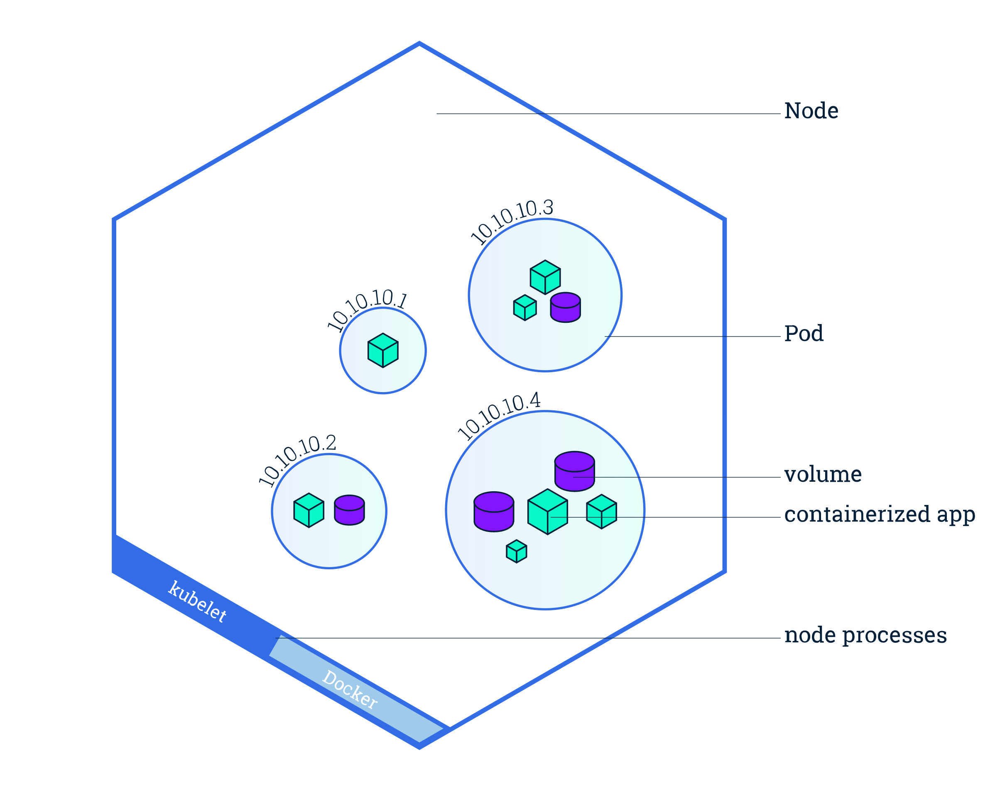
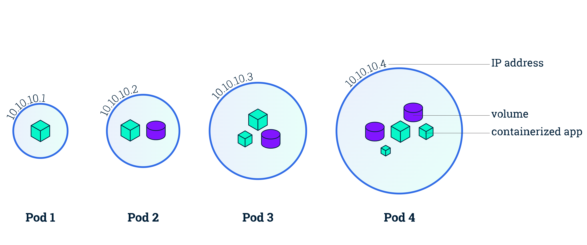

cd# 基础概念介绍


俗话说，磨刀不误砍柴工。上一章，我们成功搭建了k8s集群，接下来我们主要花时间了解一下k8s的相关概念，为后续掌握更高级的知识提前做好准备。

本文主要讲解以下四个概念：

- `Pod`
- `Deployment`
- `Service`
- `Namespace`


## 1 引入

让我们使用`Deployment`运行一个无状态应用来开启此章节吧，比如运行一个`nginx Deployment`（创建文件：`nginx-deployment.yaml`）：

```yaml
apiVersion: apps/v1
kind: Deployment
metadata:
  name: nginx-deployment
  labels:
    app: nginx
spec:
  replicas: 1
  selector:
    matchLabels:
      app: nginx
  template:
    metadata:
      labels:
        app: nginx
    spec:
      containers:
      - name: nginx
        image: nginx:latest
        ports:
        - containerPort: 80
```

配置文件第二行，有个`kind`字段，表示的是此时`yaml`配置的类型，即`Deployment`。什么是`Deployment`？这里我先不做解释，让我们先实践，看能不能在使用过程中体会出这个类型的概念意义。

在终端执行：

```shell
kubectl apply -f ./nginx-deployment.yaml
# 输出
deployment.apps/nginx-deployment created
```

然后通过以下命令分别查看集群中创建的 Deployment 和 Pod 的状态：

```shell
# 查看 Deployment
kubectl get deployments
# 输出
NAME               READY   UP-TO-DATE   AVAILABLE   AGE
nginx-deployment   1/1     1            1           2m29s

# 查看 Pod
kubectl get pods
# 输出
NAME                               READY   STATUS    RESTARTS   AGE
nginx-deployment-585449566-qslv5   1/1     Running   0          2m38s

# 查看 Deployment 的信息
kubectl describe deployment nginx	

# 删除 Deployment
kubectl delete deployment nginx-deployment

# 查看 Pod 的信息
# kubectl describe pod <pod-name>
# 这里的 <pod-name> 是某一 Pod 的名称
kubectl describe pod  nginx-deployment-585449566-qslv5

# 进入容器
kubectl exec -it nginx-deployment-585449566-qslv5 -- /bin/bash
```

此时我们已经成功在k8s上部署了一个实例的nginx应用程序。但是，等等！我们好像又看到了一个新的名词`Pod`，这又是什么？让我们带着疑问继续往下看吧。

## 2 Pod

> 在Kubernetes中，最小的管理元素不是一个个独立的容器，而是pod（目的在于解决容器间**紧密协作**关系的难题）




`Pod`是一组并置的容器，代表了`Kubernetes`中的基本构建模块:

- 一个`Pod`包含：
  - 一个或多个容器（container）
  - 容器（container）的一些共享资源：存储、网络等
- 一个`Pod`的所有容器都运行在同一个节点
  - Node（节点）是 kubernetes 集群中的计算机，可以是虚拟机或物理机。每个 Node（节点）都由 master 管理。
  - 一个 Node（节点）可以有多个Pod（容器组）

容器可以被管理，但是容器里面的多个进程实际上是不好被管理的，所以**容器被设计为每个容器只运行一个进程**。

容器的本质实际上就是一个进程，**Namespace 做隔离，Cgroups 做限制，rootfs 做文件系统**。在一个容器只能运行一个进程的前提下，实际开发过程中一个应用是由多个容器紧密协作才可以成功地运行起来。因此，我们需要另一种更高级的结构来将容器绑定在一起，并将它们作为一个单元进行管理，这就是`Pod`出现的目的。

`Pod`另一个重要意义就是容器设计模式，这对传统虚拟机服务迁移起到了关键性的指导作用，`Kubernetes` 社区把**容器设计模**这个理论整理成了一篇小论文[《Design Patterns for Container-based Distributed Systems》](https://www.usenix.org/conference/hotcloud16/workshop-program/presentation/burns)，我也将这篇论文做了一个翻译，阅读地址[《设计模式——基于容器的分布式系统》](https://www.howie6879.cn/k8s/docs/03_appendix/00.%E8%AE%BE%E8%AE%A1%E6%A8%A1%E5%BC%8F%E5%9F%BA%E4%BA%8E%E5%AE%B9%E5%99%A8%E7%9A%84%E5%88%86%E5%B8%83%E5%BC%8F%E7%B3%BB%E7%BB%9F/)。

### 如何定义并创建一个Pod

创建文件`nginx-pod.yaml`:

```shell
apiVersion: v1
kind: Pod
metadata:
  name: nginx
  labels:
    name: nginx
spec:
  shareProcessNamespace: true
  containers:
  - name: nginx
    image: nginx
  - name: shell
    image: busybox
    stdin: true
    tty: true
```

相关字段解释如下：

- kind: 该配置的类型，这里是 Pod
- metadata：元数据
  - name：Pod的名称
  - labels：标签
- spec：期望Pod实现的功能
  - containers：容器相关配置
    - name：container名称
    - image：镜像
    - ports：容器端口
      - containerPort：应用监听的端口

运行：

```shell
# 创建
kubectl create -f nginx-pod.yaml
# 输出
pod/nginx created

# 查看
kubectl get pods
# 输出
NAME                                READY   STATUS    RESTARTS   AGE
nginx                               1/1     Running   0          43s

# 查看 Pod 完整的描述性文件 
# yaml 是你想看的格式 也可以是 json
kubectl get po nginx -o yaml

# 连接 shell 容器
kubectl attach -it nginx -c shell
# 在容器执行 ps ax
# 会发现 pause 以及 niginx 等进程
# 这意味着整个 Pod 里的每个容器的进程对所有容器来说都是可见的，它们共享了同一个 PID Namespace。

# 删除 Pod
kubectl delete -f nginx-pod.yaml
```

这里简单介绍了用声明式API怎么创建`Pod`，但从技术角度看，`Pod`又是怎样被创建的呢？实际上`Pod`只是一个逻辑概念，`Pod`里的所有容器，共享的是同一个`Network Namespace`，并且可以声明共享同一个`Volume`。

`Pod`除了启动你定义的容器，还会启动一个`Infra`容器，这个容器使用的就是`k8s.gcr.io/pause`镜像，它的作用就是整一个`Network Namespace`方便用户容器加入，这就意味着`Pod`有以下特性：

- 内部直接使用`127.0.0.1`通信，网络设备一致（`Infra`容器决定）
- 只有一个IP地址
- `Pod`的生命周期只跟`Infra`容器一致，而与用户容器无关

### 标签

现在我们的集群里面只运行了一个`Pod`，但在实际环境中，我们运行数十上百个`Pod`也是一件很正常的事情，这样就引出了`Pod`管理上的问题，我们可以通过标签来组织`Pod`和所有其他`Kubernetes`对象。

前面`nginx-pod.yaml`里面就声明了`labels`字段，标签为`name`，相关操作记录如下：

```shell
# 查看标签
kubectl get pods --show-labels
# 输出
NAME                              READY   STATUS    RESTARTS   AGE   LABELS
nginx                             1/1     Running   0          17m   name=nginx

# 增加标签
kubectl label pods nginx version=latest
# 输出
pod/nginx labeled

# 查看特定标签
kubectl get pods -l "version=latest" --show-labels

# 更新标签
kubectl label pods nginx version=1 --overwrite

# 删除标签
kubectl label pods nginx version-
```

### 命名空间

利用标签，我们可以将`Pod`和其他对象组织成一个组，这是最小粒度的分类，当我们需要将对象分割成完全独立且不重叠的组时，比如我想单独基于`k8s`搭建一套`Flink`集群，我不想让我的`Flink`和前面搭建的`Nginx`放在一起，这个时候，命名空间（namespace）的作用就体现出来了。

```shell
# 列出所有的命名空间
kubectl get ns
# 输出，我们目前都是在 default 命名空间中进行操作
NAME                   STATUS   AGE
default                Active   20d
kube-node-lease        Active   20d
kube-public            Active   20d
kube-system            Active   20d
kubernetes-dashboard   Active   19d
```

让我们创建一个命名空间`vim cus-ns.yaml`，输入:

```shell
apiVersion: v1
kind: Namespace
metadata:
  name: cus-ns
```

让我们在终端实践一番：

```shell
# 开始创建命名空间 or kubectl create ns cus-ns
kubectl create -f cus-ns.yaml
# 输出
NAME                   STATUS   AGE
cus-ns                 Active   6s

# 切换命名空间【可选】
kubectl config set-context --current --namespace=cus-ns

# 为新建资源选择命名空间
kubectl create -f nginx-pod.yaml -n cus-ns

kubectl delete ns cus-ns
```

这里我们可以暂时先做一个总结，如前面所说，`Pod`可以表示`k8s`中的基本部署单元。经过前面的讲解，你应该知道以下一些知识点：

- 手动增删改查`Pod`
- 让其服务化（`Service`）

但是在实际使用中，我们并不会直接人工干预来管理`Pod`，为什么呢？当`Pod`健康出问题或者需要进行更新等操作时，人是没有精力来做这种维护管理工作的，但我们擅长创造工具来自动化这些繁琐的事情，所以我们可以使用后面介绍的`Deployment`。

### 外部访问

此时我们已经启动了一个`nginx`，我们有哪些方法可以对`Pod`进行连接测试呢？

可以使用如下命令：

```shell
kubectl port-forward nginx 8088:80
# 输出
Forwarding from 127.0.0.1:8088 -> 80
Forwarding from [::1]:8088 -> 80

# 再开一个终端访问测试或者打开浏览器
curl http://0.0.0.0:8088/
```


显然，成功访问，但是这个有个问题就是此端口不会长期开放，一旦一定时间内没有访问，就会自动断掉，我们需要其他的方式来进行访问，比如后面会提到的`Service`，这里就简单运行个命令，大家感受一下：

```shell
# 创建一个服务对象
# NodePort 在所有节点（虚拟机）上开放一个特定端口，任何发送到该端口的流量都被转发到对应服务
kubectl expose po nginx --port=80 --target-port=80 --type=NodePort  --name nginx-http
# 输出
service/nginx-http exposed

# 查看服务
kubectl get svc
# 输出
NAME         TYPE        CLUSTER-IP       EXTERNAL-IP   PORT(S)        AGE
kubernetes   ClusterIP   10.96.0.1        <none>        443/TCP        16d
nginx-http   NodePort    10.102.141.232   <none>        80:32220/TCP   1s

# 终端访问测试
curl http://0.0.0.0:32220/
# 输出 html, 表示成功端口成功开放给外部
```

## 3 Service

> Service 服务的主要作用就是替代 Pod 对外暴露一个不变的访问地址

在本文第二节`Pod`部分的`外部访问`小节，就已经提到并演示了`Service`，它很方便地将我们的服务端口成功开放给外部访问。

### 介绍

我们的`Pod`是有生命周期的，它们可以被创建、销毁，但是一旦被销毁，这个对象的相关痕迹就没有了，哪怕我们用`ReplicaSet`让他又*复生*了，但是新`Pod` 的`IP`我们是没法管控的。

很显然，如果我们的后端服务的接口地址总是在变，我们的前端人员心中定然大骂，怎么办？这就轮到`Service`出场了。

### 定义 Service

前面我们创建了一个名为`nginx-http`的`Services`，用的是命令行；接下来我们介绍一下配置文件的形式，在`nginx-deployment.yaml`后面增加以下配置：

```yaml
---
kind: Service
apiVersion: v1
metadata:
  name: nginx
spec:
  selector:
    app: nginx
  type:  NodePort
  ports:
    - nodePort: 30068
      port: 8068
      protocol: TCP
      targetPort: 80
```

相信上述配置，大部分的字段看起来都没什么问题了吧，先说一下端口这块的含义：

- nodePort：通过任意节点的`30068`端口来访问`Service`
- port：集群内的其他容器组可通过`8068`端口访问`Service`
- targetPort：`Pod`内容器的开发端口

这里我想强调的是`type`字段，说明如下：

- ClusterIP：默认类型，服务只能够在集群内部可以访问
- NodePort：通过每个 Node 上的 IP 和静态端口（`NodePort`）暴露服务
- LoadBalancer：使用云提供商的负载均衡器，可以向外部暴露服务。

关于`LoadBalancer`，基本上是云商会提供此类型，如果是我们自行搭建的，就没有此类型可选，但是很多开源项目默认是启用这种类型，我们可以自行打一个补丁来解决这个问题：

```shell
kubectl patch svc {your-svc-name} -n default -p '{"spec": {"type": "LoadBalancer", "externalIPs":["0.0.0.0"]}}'
```

执行生效命令：

```shell
kubectl apply -f ./nginx-deployment.yaml
# 输出
deployment.apps/nginx-deployment unchanged
service/nginx created

# 查看服务
kubectl get services -o wide
# 输出
NAME         TYPE        CLUSTER-IP       EXTERNAL-IP   PORT(S)          AGE     SELECTOR
nginx        NodePort    10.110.245.214   <none>        8068:30068/TCP   11m     app=nginx

# 终端测试
curl http://0.0.0.0:30068/
```

除了前面提的两种方法（`NodePort`、`LoadBalancer`），还有另外一种方法——`Ingress`资源。我们为什么需要引入`Ingress`，最主要的原因是`LoadBalancer`需要公有的IP地址，自行搭建的就不要考虑了。

而`Ingress`非常强大，它位于多个服务之前，充当集群中的**智能路由器**或入口点：


## Deployment

窥一斑而知全豹，好好了解完`Pod`之后，再继续了解`k8s`的概念也就水到渠成了。我们一般不会直接创建`Pod`，毕竟通过创建`Deployment`资源可以很方便的创建管理`Pod`（水平扩展、伸缩），并支持声明式地更新应用程序。

### 介绍

本章第一小节**引入**部分就是以`Deployment`举例，当时启动配置文件我们看到了一个`Deployment`资源和一个`Pod`，查看命令如下：

```shell
kubectl get deployments
# 输出
NAME               READY   UP-TO-DATE   AVAILABLE   AGE
nginx-deployment   0/1     1            0           4s

kubectl get pods
# 输出 如果名字有变化不用在意，只是我重新创建了一个 Deployment 
NAME                               READY   STATUS    RESTARTS   AGE
nginx-deployment-585449566-mnrtn   1/1     Running   0          2m1s
```

这里我们再增加一条命令：

```shell
kubectl get replicasets.apps
# 输出
NAME                         DESIRED   CURRENT   READY   AGE
nginx-deployment-585449566   1         1         1       10m
```

嗯嗯~，让我们捋一捋，当我们创建一个`Deployment`对象时，`k8s`不会只创建一个`Deployment`资源，还会创建另外的`ReplicaSet `以及1个`Pod `对象。所以问题来了， `ReplicaSet`又是个是什么东西？

### ReplicaSet

如果你更新了`Deployment`的`Pod`模板，那么`Deployment`就需要通过滚动更新（rolling update）的方式进行更新。

而滚动更新，离不开`ReplicaSet`，说到`ReplicaSet`就得说到`ReplicationController`（弃用）。

> `ReplicationController`是一种`k8s`资源，其会持续监控正在运行的pod列表，从而保证`Pod`的稳定（在现有`Pod`丢失时启动一个新`Pod`），也能轻松实现`Pod`的水平伸缩

`ReplicaSet`的行为与`ReplicationController`完全相同，但`Pod`选择器的表达能力更强（允许匹配缺少某个标签的Pod，或包含特定标签名的Pod）。所以我们可以将`Deployment`当成一种更高阶的资源，用于部署应用程序，并以声明的方式管理应用，而不是通过`ReplicaSet`进行部署，上述命令的创建关系如下图：


如上图，`Deployment`的控制器，实际上控制的是`ReplicaSet`的数目，以及每个`ReplicaSet`的属性。我们可以说`Deployment`是一个两层控制器：

> Deployment-->ReplicaSet-->Pod

这种形式下滚动更新是极好的，但这里有个前提条件那就是`Pod`是无状态的，如果运行的容器必须依赖此时的相关运行数据，那么回滚后这些存在于容器的数据或者一些相关运行状态值就不存在了，对于这种情况，该怎么办？此时需要的就是`StatefulSet`（部署有状态的多副本应用）。

## StatefulSet

如果通过`ReplicaSet`创建多个`Pod`副本（其中描述了关联到特定持久卷声明的数据卷），那么这些副本都将共享这个持久卷声明的数据卷。


那如何运行一个pod的多个副本，让每个pod都有独立的存储卷呢？对于这个问题，之前学习的相关知识都不能提供比较好的解决方案。`k8s`提供了`Statefulset`资源来运行这类Pod，它是专门定制的一类应用，这类应用中每一个实例都是不可替代的个体，都拥有稳定的名字和状态。

对于有状态的应用（实例之间有不对等的关系或者依赖外部数据），主要需要对以下两种类型的状态进行复刻：

- 存储状态：应用的多个实例分别绑定了不同的存储数据，也就是让每个Pod都有自己独立的存储卷
- 拓扑状态：应用的多个实例之间不是完全对等的关系，各个Pod需要按照一定的顺序启动

## 参考

本章的基本概念就介绍到这里了，谢谢！本部分内容有参考如下文章：

- [学习Kubernetes基础知识](https://kuboard.cn/learning/k8s-basics/kubernetes-basics.html)
- [详解 Kubernetes Deployment 的实现原理](https://draveness.me/kubernetes-deployment/)
- [Kubernetes 中文指南](https://jimmysong.io/kubernetes-handbook/concepts/deployment.html)：Deployment
- [Kubernetes 中文指南](https://jimmysong.io/kubernetes-handbook/concepts/service.html)：Service 
- [深入剖析Kubernetes](https://time.geekbang.org/column/intro/100015201?code=UhApqgxa4VLIA591OKMTemuH1%2FWyLNNiHZ2CRYYdZzY%3D)：容器编排部分
- Kubernetes in Action中文版：第3、4、5、9章