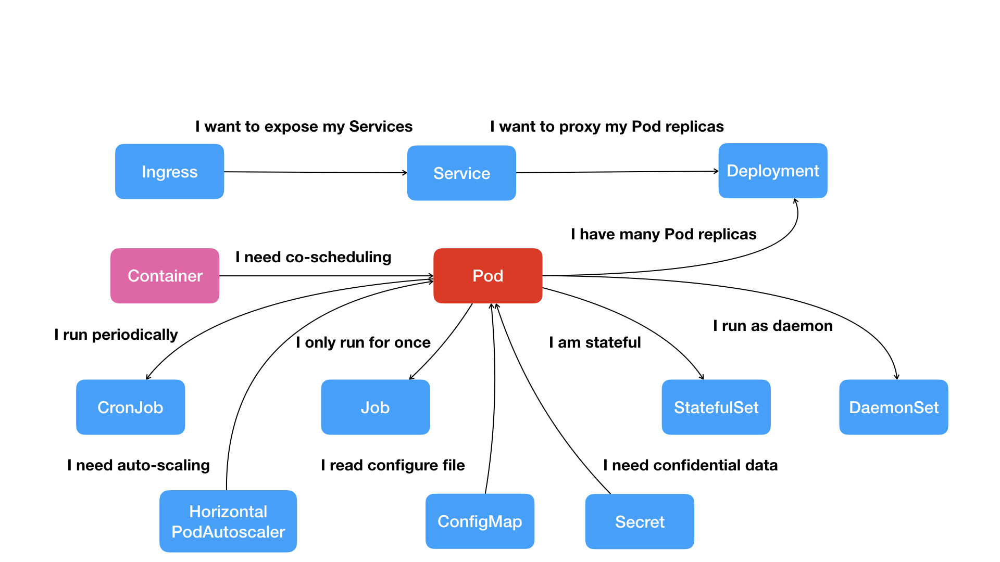
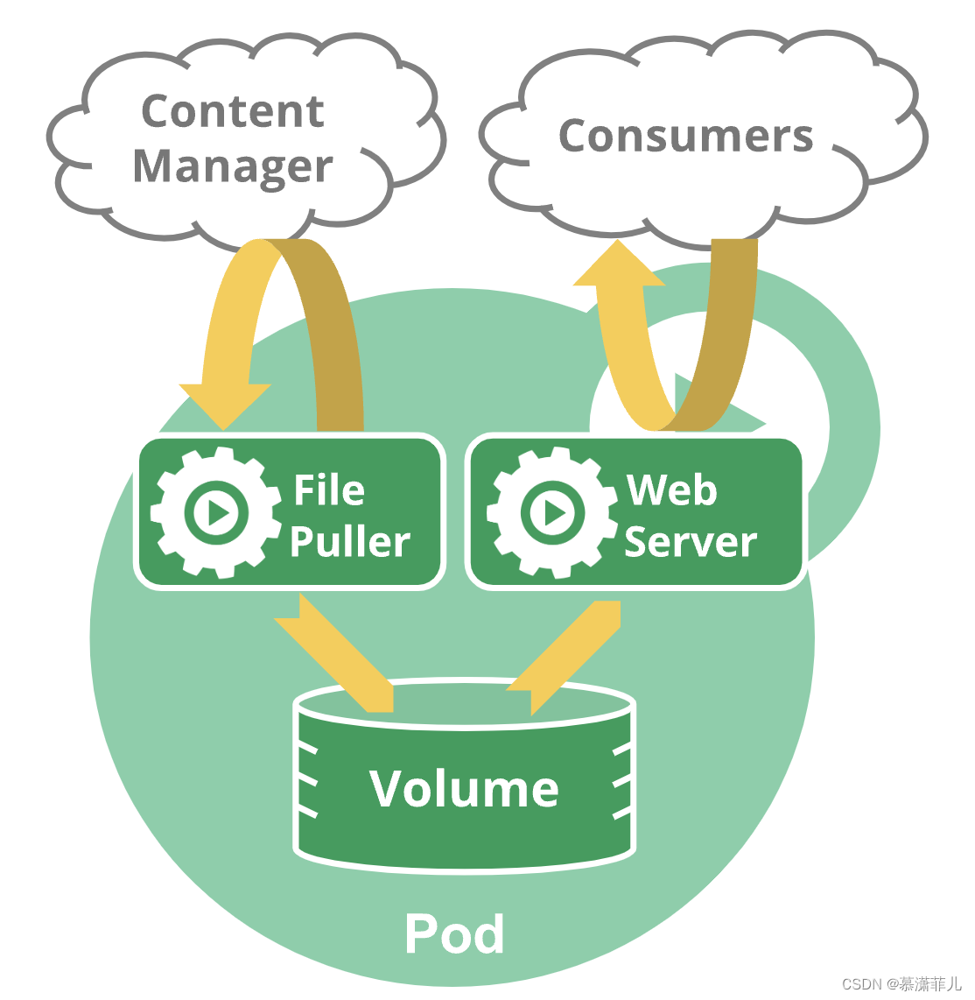

## 1 概念

### 是什么

1. Pod是Kubernetes创建或部署的最小/最简单的基本单位，一个Pod代表集群上正在运行的一个进程。
2. 一个Pod封装一个或多个多个容器，存储资源、一个独立的网络IP以及管理控制容器运行方式的策略选项。
3. Pod代表部署的一个单位：Kubernetes中单个应用的实例，它可能由单个容器或多个容器共享组成的资源。

### 两种工作模式
kubernetes中pod使用的两种方式
1. 单容器模式：Pod中运行一个容器。“one-container-per-Pod”模式是Kubernetes最常见的用法; 在这种情况下，你可以将Pod视为单个封装的容器，但是Kubernetes是直接管理Pod而不是容器。
2. 多容器模式：Pods中运行多个需要一起工作的容器。Pod可以封装紧密耦合的应用，它们需要由多个容器组成，它们之间能够共享资源，这些容器可以形成一个单一的内部service单位 -（类似docker swam？） 一个容器共享文件，另一个“sidecar”容器来更新这些文件。Pod将这些容器的存储资源作为一个实体来管理。

### 多容器模式

Pods的设计可用于支持多进程的协同工作（作为容器），形成一个cohesive的Service单位。Pod中的容器在集群中Node上被自动分配，容器之间可以共享资源、网络和相互依赖关系，并同时被调度使用。

只有在容器紧密耦合的特殊实例中使用此模式。Pods提供两种共享资源：网络和存储。例如，有一个容器被用作WEB服务器，用于共享volume，以及一个单独“sidecar”容器需要从远程获取资源来更新这些文件，如下图所示：

1. 共享网络：每个Pod被分配一个独立的IP地址，Pod中的每个容器共享网络命名空间，包括IP地址和网络端口。Pod内的容器可以使用localhost相互通信。当Pod中的容器与Pod 外部通信时，他们必须协调如何使用共享网络资源（如端口）。
2. Pod可以指定一组共享存储volumes。Pod中的所有容器都可以访问共享volumes，允许这些容器共享数据。volumes 还用于Pod中的数据持久化，以防其中一个容器需要重新启动而丢失数据。

## 2 使用

### 使用方式
1. 很少会直接在kubernetes中创建单个Pod。因为Pod的生命周期是短暂的，用后即焚的实体。当Pod被创建后（不论是由你直接创建还是被其他Controller），都会被Kuberentes调度到集群的Node上。直到Pod的进程终止、被删掉、因为缺少资源而被驱逐、或者Node故障之前这个Pod都会一直保持在那个Node上。
2. 重启可以从三个维度理解：pod重启、容器重启、应用重启。Pod只提供容器的运行环境并保持容器的运行状态，重启容器不会造成Pod重启。

### Pod和Controller

Kubernetes使用更高级的称为Controller的抽象层，来管理Pod实例。Controller可以创建和管理多个Pod，提供副本管理、滚动升级和集群级别的自愈能力。

通常，Controller会用你提供的Pod Template来创建相应的Pod。包含一个或者多个Pod的Controller示例：
* Deployment
* StatefulSet
* DaemonSet