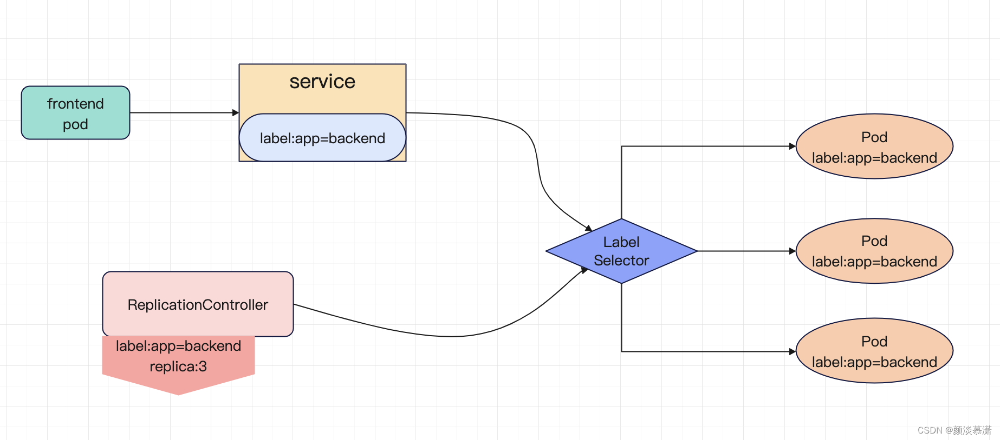
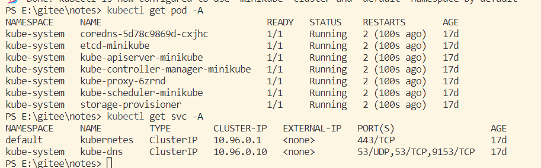

## 1 基本介绍

### 概念

在Kubernetes中，Pod中的网络是隔离的，而且IP随着pod的的变化而变化。

Kubernetes中抽象出来一个Service服务发现机制（只支持四层负载均衡，即通过IP端口转发）。Service为Pods提供了一个稳定的IP地址和DNS名称，以便其他应用程序可以通过这些标识符来访问该服务。

它还提供了负载均衡和服务发现的能力，可以将流量路由到一组具有相同标签的Pods中。

### 工作原理

Service 被赋予一个唯一的 dns name。Service 通过 label selector 选定一组 Pod。Service 实现负载均衡，可将请求均衡分发到选定这一组 Pod 中
 




### 底层实现
1. 域名的解析以来DNS组件。 kubernetes 的 dns 服务 （不同 kubernetes 版本的 dns 默认使用的也是不一样的，1.11 之前的版本使用的是 kubeDNS，较新的版 本使用的是 coredns）
2. 每 个 K8s 节点上都有一个组件叫做 kube-proxy，kube-proxy 这个组件通过 watch（监视） 方法将始终监视着 apiserver 中有关 service 资源的变动信息。然后通过iptables，也可能是 ipvs，请求调度到后端特定的 pod 资源之上




## 2 类型说明

* ClusterIp:默认类型，自动分配一个仅Cluster内部可以访问的IP
* Headless:ClusterIp为None的时候
* NodePort:在ClusterIP基础上为Service在每台机器上绑定一作口，这样就可以通过NodePort来访问该服努
* LoadBalancer:在NodePort的基础上，侑助cloud provider创建一个外部负载均衡器，并将请热专发 到：NodePort
* ExternalName:把集群外部的服努引入到集群内部来，在集群内部直接使用。没有任何类型代理被创建， 这只有kubernetes 1.7或更高版本的kube-dns才支持

### HeadLess
Headless Services是一种特殊的service，其spec:clusterIP表示为None，这样在实际运行时就不会被分配ClusterIP。也被称为无头服务。

* headless不分配clusterIP。headless service可以通过解析service的DNS，返回所有Pod的地址和DNS(statefulSet部署的Pod才有DNS)
* 普通的service，只能通过解析service的DNS返回service的ClusterIP


### ClusterIp
ClusterIP类型将创建一个虚拟IP地址，该IP地址将绑定到Service上，并通过Kubernetes内部的代理进行转发。这种类型的服务只能在集群内部访问，并且通常用于内部服务之间的通信。


### NodePort
只对外部可见，通过每个 Node 节点上的 IP 和静态端口（NodePort）暴露服务。NodePort 服务会路由到 ClusterIP 服务，这个 ClusterIP 服务会自动创建。

主要适合：集群外业务访问的场景。可以从集群的外部访问一个 NodePort 服务

```yml
apiVersion: v1
kind: Service
metadata:
  name: test-service
spec:
  selector:
    app: test
  type: NodePort # 指定service 类型
  ports:
  - protocol: TCP
    port: 80
    targetPort: 80
    name: test-http
    nodePort: 30000 # 范围：30000-32767
```

设置 type 的值为 "NodePort"，Kubernetes master 将从给定的配置范围内（默认：30000-32767）分配端口。每个 Node 将从该端口（每个 Node 上的同一端口）代理到 Service。该端口将通过 Service 的 spec.ports[*].nodePort 字段被指定，这里指定的是30000。如果不指定的话会自动生成一个端口。

### LoadBalance
使用云提供商的负载局衡器，可以向外部暴露服务。外部的负载均衡器可以路由到 NodePort 服务和 ClusterIP 服务，需要结合具体的云厂商进行操作

ExternalName 是 Service 的特例

没有 selector
没有定义任何的端口和 Endpoint
对于运行在集群外部的服务，它通过返回该外部服务的别名这种方式来提供服务。

示例：
```yaml
kind: Service
apiVersion: v1
metadata:
  name: test-service
  namespace: test
spec:
  type: ExternalName # 类型
  externalName: test.service.com
```


## 原理介绍
