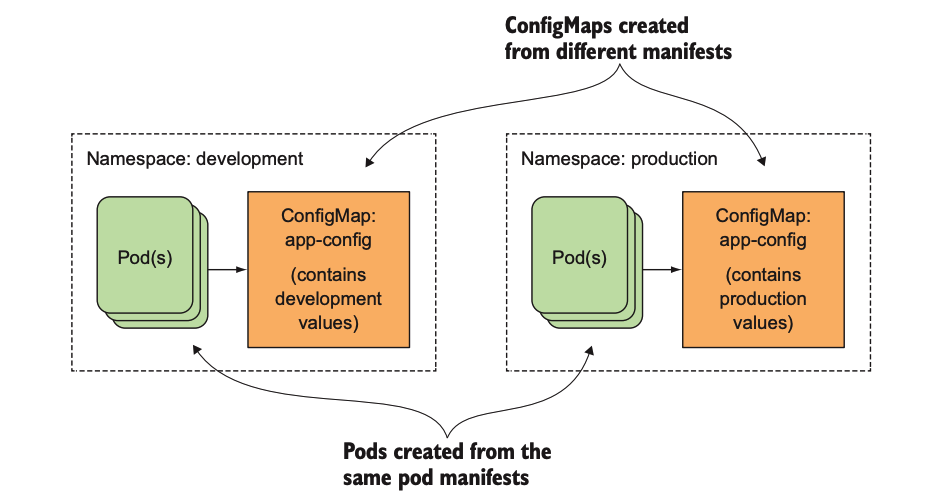
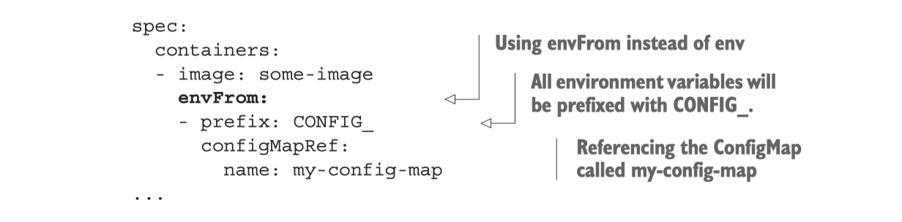

# 配置应用程序


使用`Docker`部署应用程序时，一般常用的配置方式有：

- 配置内嵌
- 启动传参配置
- 环境变量

经过前面容器持久化存储的介绍，我们很容易能想到是以挂载卷的形式，比如：

- gitRepo
- hostPath
- NFS

再结合边车模式来进行配置文件的管控是可行的，然而有一种更加简便的方法能将配置数据置于`Kubernetes`的顶级资源对象中，那就是`ConfigMap`。

## 传递命令行参数

在上一节**容器持久化存储**的`emptyDir`概念介绍部分，我们引入了一个`fortune-pod`的例子，再回顾一下之前的配置文件吧，如下：

```yaml
apiVersion: v1
kind: Pod
metadata:
  name: fortune
spec:
  containers:
  - image: luksa/fortune
    name: html-generator
    volumeMounts:
    - name: html
      mountPath: /var/htdocs
  - image: nginx:alpine
    name: web-server
    volumeMounts:
    - name: html
      mountPath: /usr/share/nginx/html
      readOnly: true
    ports:
    - containerPort: 80
      protocol: TCP
  volumes:
  - name: html
    emptyDir: {}
```

此应用程序设定了每隔`10s`就会自动生成输出到`html`，现在我们要做的是通过命令行参数，自行设定隔多少秒自动生成内容。

创建文件`fortune-pod-args.yaml`，输入以下内容：

```yaml
apiVersion: v1
kind: Pod
metadata:
  name: fortune2s
spec:
  containers:
  - image: luksa/fortune:args
    args: ["2"]
    name: html-generator
    volumeMounts:
    - name: html
      mountPath: /var/htdocs
  - image: nginx:alpine
    name: web-server
    volumeMounts:
    - name: html
      mountPath: /usr/share/nginx/html
      readOnly: true
    ports:
    - containerPort: 80
      protocol: TCP
  volumes:
  - name: html
    emptyDir: {}
```

看到配置文件中的`args`字段了么？这个就是传给镜像`luksa/fortune:args`控制时间的参数，让我们启动看看吧。

```shell
kubectl create -f fortune-pod-args.yaml
# 输出
pod/fortune2s created

# 查看状态
kubectl get pods
# 输出
NAME      READY   STATUS    RESTARTS   AGE
fortune   2/2     Running   0          2m27s

# 暂时服务化
kubectl port-forward fortune2s 8080:80
```

访问`127.0.0.1:8080`就会发现输出的频率变成了`2s`：

```shell
> curl 127.0.0.1:8080                                                                                              
Stay away from flying saucers today.
```
进入pod中查看pod启动时执行的命令
```shell
➜  .kube kubectl exec -it fortune2s /bin/sh
kubectl exec [POD] [COMMAND] is DEPRECATED and will be removed in a future version. Use kubectl exec [POD] -- [COMMAND] instead.
Defaulted container "html-generator" out of: html-generator, web-server
# ps -ef
UID        PID  PPID  C STIME TTY          TIME CMD
root         1     0  0 06:13 ?        00:00:00 /bin/bash /bin/fortuneloop.sh 2
root      1607     0  0 06:31 pts/0    00:00:00 /bin/sh
root      1633     1  0 06:31 ?        00:00:00 sleep 2
root      1634  1607  0 06:31 pts/0    00:00:00 ps -ef
```

## 设置环境变量

> 与容器的命令和参数设置相同，环境变量列表无法在pod创建后被修改

设置环境变量非常简单，我们只需要在`pod`中指定环境变量即可；当然，这里有个前提是你需要将修改镜像让其支持读取环境变量。

我们直接使用书中的例子：`vim fortune-pod-env.yaml`：

```yaml
apiVersion: v1
kind: Pod
metadata:
  name: fortune-env
spec:
  containers:
  - image: luksa/fortune:env
    env:
    - name: INTERVAL
      value: "30"
    name: html-generator
    volumeMounts:
    - name: html
      mountPath: /var/htdocs
  - image: nginx:alpine
    name: web-server
    volumeMounts:
    - name: html
      mountPath: /usr/share/nginx/html
      readOnly: true
    ports:
    - containerPort: 80
      protocol: TCP
  volumes:
  - name: html
    emptyDir: {}
```

可以看到配置中声明了`INTERVAL`环境变量值为`30`，在终端中实践一下：

```shell
kubectl create -f fortune-pod-env.yaml
# 输出
pod/fortune-env created

# 查看状态
kubectl get pods
# 输出
NAME      READY   STATUS    RESTARTS   AGE
fortune-env   2/2     Running   0          10s

# 暂时服务化
kubectl port-forward fortune-env 8080:80
```

访问`127.0.0.1:8080`就会发现输出的频率变成了`30s`。


```
➜  .kube kubectl exec -it fortune-env -c html-generator -- /bin/sh
# env
KUBERNETES_SERVICE_PORT=443
KUBERNETES_PORT=tcp://10.96.0.1:443
HOSTNAME=fortune-env
HOME=/root
TERM=xterm
KUBERNETES_PORT_443_TCP_ADDR=10.96.0.1
PATH=/usr/local/sbin:/usr/local/bin:/usr/sbin:/usr/bin:/sbin:/bin
KUBERNETES_PORT_443_TCP_PORT=443
KUBERNETES_PORT_443_TCP_PROTO=tcp
INTERVAL=30
KUBERNETES_SERVICE_PORT_HTTPS=443
KUBERNETES_PORT_443_TCP=tcp://10.96.0.1:443
KUBERNETES_SERVICE_HOST=10.96.0.1
PWD=/
```
进入指定容器查看环境变量，可以看到在容器的启动参数中添加的环境变量。

现在应用程序的所有配置基本上可以说是硬编码的形式进行配置，并且`yaml`配置文件总是有配置相关的字段，有没有办法让镜像和配置文件解耦呢？

`k8s`提供了名为`ConfigMap`的资源对象解决这个问题。

## ConfigMap

资源对象`ConfigMap`提供了向容器中注入配置信息的机制，它本质上就是一个键/值对映射，可以用来保存单个值或者配置文件。

`ConfigMap`是不需要被读取的，它映射的内容通过环境变量或者卷文件的形式传给容器。一般直接在`pod`的定义里面就可以声明`ConfigMap`，这样就可以根据不同的环境创建不同的配置，流程交互如下图所示：



### 创建

还是用之前应用程序为例，配置专注于环境变量`INTERVAL`，创建命令如下所示：

```shell
kubectl create configmap fortune-config --from-literal=sleep-interval=25
# 输出
configmap/fortune-config created

# 获取相关描述
kubectl get configmap fortune-config -o yaml

# 查看 configmap
kubectl get configmap

# 删除
kubectl delete configmap fortune-config
```

此外，`k8s`还可以直接填写配置文件来进行创建`vim fortune-config.yaml`，输入如下内容：

```yaml
apiVersion: v1
kind: ConfigMap
metadata:
  name: fortune-config
data:
  sleep-interval: "25"
```

然后执行：

```shell
kubectl create -f fortune-config.yaml
# 输出
configmap/fortune-config created
```

其实还有更多的创建方式，大概提一下：

```shell
# 从文件内容创建ConfigMap条目
kubectl create configmap my-config --from-file=config-file.conf
# 从文件夹创建ConfigMap
kubectl create configmap my-config --from-file=/path/to/dir
# 合并不同选项
kubectl create configmap my-config 
	--from-file=foo.json 
	--from-file=bar=foobar.conf 
	--from-file=config-opts/ 
	--from-literal=some=thing 
```

### 作为环境变量传入容器

如何将映射中的值传递给`pod`的容器？最简单的方法是给容器设置环境变量，通过在配置中声明`valueFrom`，具体操作`vim fortune-pod-env-configmap.yaml`:

```shell
apiVersion: v1
kind: Pod
metadata:
  name: fortune-env-from-configmap
spec:
  containers:
  - image: luksa/fortune:env
    env:
    - name: INTERVAL
      valueFrom: 
        configMapKeyRef:
          name: fortune-config
          key: sleep-interval
    name: html-generator
    volumeMounts:
    - name: html
      mountPath: /var/htdocs
  - image: nginx:alpine
    name: web-server
    volumeMounts:
    - name: html
      mountPath: /usr/share/nginx/html
      readOnly: true
    ports:
    - containerPort: 80
      protocol: TCP
  volumes:
  - name: html
    emptyDir: {}

```

让我们启动`pod`实践看看：

```shell
kubectl create -f fortune-pod-env-configmap.yaml
# 输出
pod/fortune-env-from-configmap created

# 查看状态
kubectl get pods
# 输出
NAME                         READY   STATUS    RESTARTS   AGE
fortune-env-from-configmap   2/2     Running   0          19s

# 暂时服务化
kubectl port-forward fortune-env-from-configmap 8080:80

# 删除pod
kubectl delete pods fortune-env-from-configmap
```

现在我们已经成功在`pod`中使用了`ConfigMap`资源，不过这种使用方式是比较低效的，考虑这样一个情况：如果环境变量比较多，这样单独一个个环境变量的设置方式是个程序员都没法忍受的，一般在框架里面加载一些环境变量都会利用前缀机制来进行批量加载。

`k8s`也提供了这样类似的机制，配置声明如下图示：



### ConfigMap卷

> 环境变量或者命令行参数值作为配置值通常适用于变量值较短的场景。由于ConfigMap中可以包含完整的配置文件内容，当你想要将其暴露给容器时，可以借助前面章节提到过的一种称为configMap卷的特殊卷格式。

首先删除前面声明建立的`cf`资源：`kubectl delete configmap fortune-config`。然后建立文件夹`configmap-files`，首先建立`Nginx`配置文件：`vim my-nginx-config.conf`：

```shell
server {
    listen              80;
    server_name         www.kubia-example.com;

    gzip on;
    gzip_types text/plain application/xml;

    location / {
        root   /usr/share/nginx/html;
        index  index.html index.htm;
    }

}
```

另外在该文件夹中添加一个名为`sleep-interval`的文本文件，输入`25`，类似前面声明环境变量。

接下来从文件夹创建`ConfigMap`：

```shell
kubectl create configmap fortune-config --from-file=configmap-files
# 输出
configmap/fortune-config created

# 验证
kubectl get configmap fortune-config -o yaml
```


创建包含`ConfigMap`条目内容的卷只需要创建一个引用`ConfigMap`名称的卷并挂载到容器中：


创建配置文件：`vim fortune-pod-configmap-volume.yaml`，输入如下内容：

```shell
apiVersion: v1
kind: Pod
metadata:
  name: fortune-configmap-volume
spec:
  containers:
  - image: luksa/fortune:env
    env:
    - name: INTERVAL
      valueFrom:
        configMapKeyRef:
          name: fortune-config
          key: sleep-interval
    name: html-generator
    volumeMounts:
    - name: html
      mountPath: /var/htdocs
  - image: nginx:alpine
    name: web-server
    volumeMounts:
    - name: html
      mountPath: /usr/share/nginx/html
      readOnly: true
    - name: config
      mountPath: /etc/nginx/conf.d
      readOnly: true
    - name: config
      mountPath: /tmp/whole-fortune-config-volume
      readOnly: true
    ports:
      - containerPort: 80
        name: http
        protocol: TCP
  volumes:
  - name: html
    emptyDir: {}
  - name: config
    configMap:
      name: fortune-config
```

## Secret

前面说的，都是针对非敏感信息的配置数据，对于一些敏感数据，例如：密码、OAuth token、ssh 密钥等，就可以使用`Secret`资源了。

`Secret`结构和使用方法都与`ConfigMap`类似，其作用就是将加密数据放到`etcd`中，然后`k8s`将`Secret`分发到对应`pod`所在机器节点来保障其安全性。另外，`Secret`只会存储在节点的内存中，永不写入物理存储。

### 创建

以创建一个包含用户名密码的`secret`资源为例：

```shell
# 创建文件
echo -n 'admin' > ./username.txt
echo -n '1f2d1e2e67df' > ./password.txt

# 单独创建
kubectl create secret generic user --from-file=./username.txt
kubectl create secret generic pass --from-file=./password.txt

# 批量创建资源
kubectl create secret generic db-user-pass --from-file=./username.txt --from-file=./password.txt

# 输出
secret/db-user-pass created

# 查看
kubectl get secrets

# 输出
NAME                  TYPE                                  DATA   AGE
db-user-pass          Opaque                                2      6h48m
default-token-nlxkq   kubernetes.io/service-account-token   3      2d
pass                  Opaque                                1      7s
user                  Opaque                                1      10s
```

`db-user-pass`很好理解，就是刚才创建的`secret`资源，`default-token-nlxkq`是什么呢？这是一种默认被挂载至所有容器的`Secret`。

这里同样也可以是用`yaml`文件形式创建，先将用户名密码进行基础的`Base64`转码：

```shell
echo -n 'admin' | base64
echo -n '1f2d1e2e67df' | base64
```

`vim db-user-pass-secret.yaml`：

```yaml
apiVersion: v1
kind: Secret
metadata:
  name: db-user-pass
type: Opaque
data:
  user: YWRtaW4=
  pass: MWYyZDFlMmU2N2Rm
```

终端执行：

```shell
# 启动
kubectl create -f db-user-pass-secret.yaml

# 查看
kubectl get secrets

# 输出
NAME                  TYPE                                  DATA   AGE
db-user-pass          Opaque                                2      15s
default-token-ds2lv   kubernetes.io/service-account-token   3      41h

# 删除
kubectl delete secrets db-user-pass
```

### 使用

利用投射数据卷在`Pod`中使用`Secret`，编辑配置文件`vim test-projected-volume.yaml`：

```yaml
apiVersion: v1
kind: Pod
metadata:
  name: test-projected-volume 
spec:
  containers:
  - name: test-secret-volume
    image: busybox
    args:
    - sleep
    - "86400"
    volumeMounts:
    - name: mysql-cred
      mountPath: "/projected-volume"
      readOnly: true
  volumes:
  - name: mysql-cred
    projected:
      sources:
      - secret:
          name: user
      - secret:
          name: pass
```

终端执行：

```shell
# 启动
kubectl create -f test-projected-volume.yaml

# 查看
kubectl get pods -o wide

# 输出
NAME                    READY   STATUS    RESTARTS   AGE
test-projected-volume   1/1     Running   0          37s

# 查看数据
kubectl exec -it test-projected-volume -- /bin/sh

> ls /projected-volume/
> cat /projected-volume/username.txt

# 删除
kubectl delete pods test-projected-volume
```


## 参考

本章关于配置应用程序就介绍到这里了，谢谢！本部分内容有参考如下文章：

- [配置 Pod 使用 ConfigMap](https://kubernetes.io/zh/docs/tasks/configure-pod-container/configure-pod-configmap/)
- [Secret概述](https://kuboard.cn/learning/k8s-intermediate/config/secrets/)
- [Kubernetes in Action](https://github.com/luksa/kubernetes-in-action)中文版：可以算是第7章的读书笔记