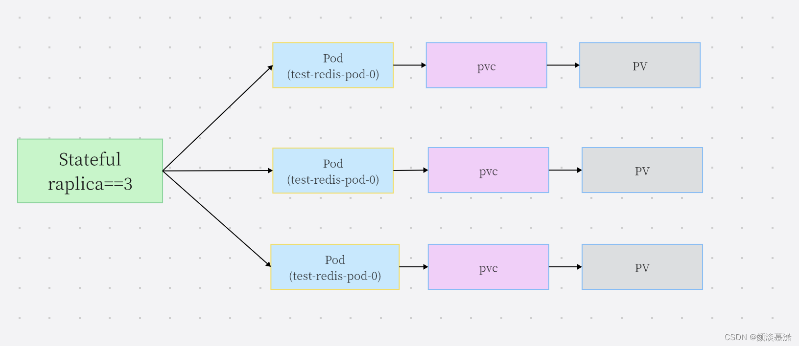

## 1 有无状态服务对比

### 无状态服务
1. 数据方面：无状态服务不会在本地存储持久化数据.多个实例可以共享相同的持久化数据
2. 结果方面：多个服务实例对于同一个用户请求的响应结果是完全一致的
3. 关系方面：这种多服务实例之间是没有依赖关系
4. 影响方面：在k8s控制器 中动态启停无状态服务的pod并不会对其它的pod产生影响
5. 示例方面：nginx实例，tomcat实例，web应用
6. 资源方面：相关的k8s资源有：ReplicaSet、ReplicationController、Deployment
7. 创建方式：Deployment被设计用来管理无状态服务的pod。每个pod完全一致，原因如下：
   1. 无状态服务内的多个Pod创建的顺序是没有顺序的
   2. 无状态服务内的多个Pod的**名称是随机的**.pod被重新启动调度后,它的名称与IP都会发生变化
   3. 无状态服务内的多个Pod背后是共享存储的
8. 缩容方式：随机缩容。由于是无状态服务，所以这些控制器创建的pod序号都是随机值。并且在缩容也是随机，并不会明确缩容某一个pod。因为所有实例得到的返回值都是一样，所以缩容任何一个pod都可以

### 有状态服务

1. 数据方面：有状态服务需要在本地存储持久化数据,典型的是分布式数据库，任何一个容器关闭都会导致数据丢失，服务不可用。
2. 结果方面：实例之间，请求结果可能存在不一致
3. 关系方面：分布式节点实例之间有依赖的拓扑关系.比如,主从关系.
4. 影响方面：如果K8S停止分布式集群中任 一实例pod,就可能会导致数据丢失或者集群的crash
5. 示例方面：mysql数据库、kafka、zookeeper、Redis主从架构
6. 资源方面：statefulSet
7. 创建方式：statefulSet管理。Pod的特点：
   1. 唯一性: 每个Pod会被分配一个**唯一序号**
   2. 顺序性: Pod启动,更新,销毁是**线性的，按顺序进行**
   3. **稳定的网络标识**: Pod主机名,DNS地址不会随着Pod被重新调度而发生变化.
   4. **稳定的持久化存储**: Pod被重新调度后,仍然能挂载原有的PV,从而保证了数据的完整性和一致性.
8. 缩容方式：有顺序的缩容。StatefulSet 缩容只会操作 一个 pod 实例，因此有状态应用的缩容相对于无状态的缩容速度会慢。
   1. 举例来说， 一个分布式存储应用若同时下线多个节点 ，则可能导致其数据丢失 。比如说，一个数据项副本数设置为 2 的数据存储应用， 若同时有两个节点下线，如果一份数据它正好保存在这两个节点上，这份数据就会丢失。
   2. 因此缩容是线性的 ，分布式存储应用需要时间把丢失的副本复制到其他节点 ，从而保证数据不会丢失。其实，这也是第七点中所讲的顺序性。


## 有状态服务的说明

### 稳定的网络标识

需要创建名为test-redis-pod的Stateful模型,根据配置的Replica=3的设置,K8S会创建三个Pod,依次命名为:
```
test-redis-pod-0
test-redis-pod-1
test-redis-pod-2
```
K8S为有状态的服务Pod分配稳定的网络标识,具体实现基于test-redis-pod-0名称,借助Headless DNS进行如下解析,获取后端其中一个Pod的地址.
```
$(pod name).$(service name).$(namespace).svc.cluster.local
```
下面通过Pod名称访问Redis集群的Master节点地址的方法.
```
session.save_path = "tcp://test-redis-pod-0.test-redis-service.default.svc.cluster.local:6379"
```
### 稳定的持久化存储



1. 唯一：每个Redis Pod对应一个PVC/PV.当Pod发生调度时,需要在别的节点启动时,根据Pod背后关联的存储信息，可以保证其名称的稳定性.
2. 复用：Pod还是会attach挂载到原来的PV/PVC中,从而确定每个Pod有自己专用的存储卷.