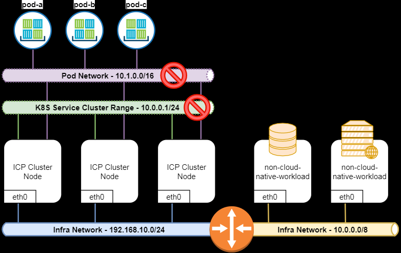

# 容器网络

### 网络类型
* Node Network: 外部网络接口。集群节点所在的网络，这个网络就是你的主机所在的网络，通常情况下是你的网络基础设施提供。如果node处于不同的网段，那么你需要保证路由可达。如上图中的 192.168.10.0/24和10.0.0.0/8这两个网络

Service Network：K8S服务网络,ipvs规则当中的网络，由特定组件提供路由和调度。 service_cluster_ip_range（如图，默认的配置是的10.0.0.1/24)。在上图中，扩充的节点（基础网络是10.0.0.0/8)和 服务网络（10.0.0.1/24)冲突，会造网络问题。

 Pod Network： 节点当中pod的内部网络无法与外界通信。第三个网络是Pod的网络， K8s中一个Pod由多个容器组成，但是一个pod只有一个IP地址，Pod中所有的容器共享同一个IP。这个IP启动pod时从一个IP池中分配的， 叫做 pod CIDR, 或者叫network_cidr（如图，默认配置是10.1.0.0/16)。 可以在配置文件中配置。

       
kubernetes对于pod的网络定制了下列三个要求，所有网络插件支持这几个要求即可：

* 所有节点上所有的pod可以互相通信，并且不依赖NAT
* 节点上的进程可以和该节点上的所有pod通信
* 运行在主机网络空间下的pod可以和所有节点上的所有pod互相通信，并且不依赖NAT

> 注意： 一个Pod会包含多个container， 但是这些containers共享一个网路IP，也就是说，Container A如果占了80， Container B就不能用80 了。

## 2 service network

为了解决Pod IP地址不是持久性的，可能会进行更改，k8s采用service对pod进行抽象，service为pod组提供虚拟ip，任何路由到这个虚拟ip的，都将转发到对应关联的pod上，而且service还提供高可用与负载均衡。

相关的网络组件和工具包括netfilter、iptables

### netfilter
为了在群集内执行负载平衡，Kubernetes依赖于Linux内置的网络框架netfilter，它允许以自定义处理程序的形式实现与网络相关的各种操作。数据包筛选，网络地址转换和端口转换的操作，提供了通过网络引导数据包所需的功能，并提供了禁止数据包到达计算机网络内敏感位置的功能。

### iptables 
采用iptables对netfilter进行管理，它是一个用户空间程序，提供了一个基于表的系统，用于定义netfilter模块的处理和转换数据包的规则；iptables规则监视发往服务虚拟的流量IP，并从一组可用的Pod中随机选择一个Pod IP地址，并且iptables规则将数据包的目标IP地址从服务的虚拟IP更改为所选Pod的IP。