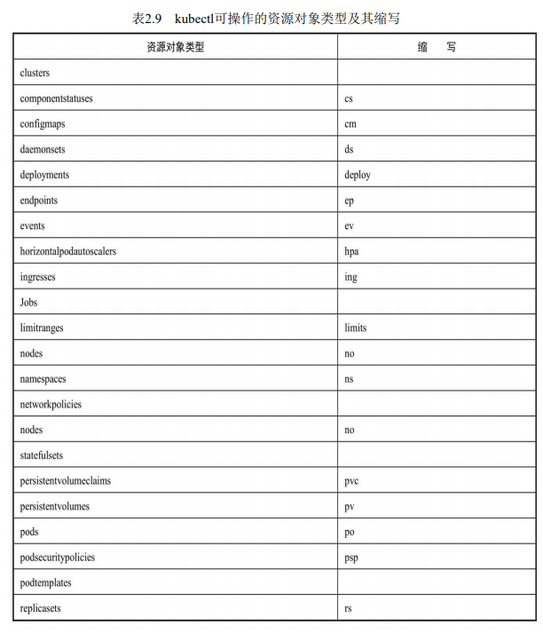
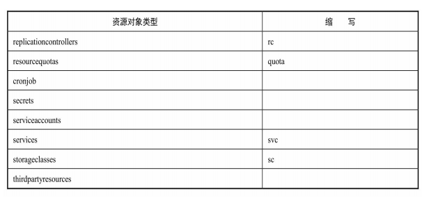

> * 之前的部分按照操作内容，介绍操作的流程和原理。
> * 这一部分主要对命令进行汇总
## 1 命令基础

### 命令格式
```sh
kubectl [command] [type] [name] [flags]

kubectl get pod pod_name -n asa-ms
```
* command：子命令，用于操作Kubernetes集群资源对象的命 令，例如create、delete、describe、get、apply等。
* TYPE：资源对象的类型，区分大小写，能以单数、复数或者 简写形式表示。例如以下3种TYPE是等价的。
  * kubectl get pod 
  * kubectl get pods
  * kubectl get po
* NAME：资源对象的名称，区分大小写。如果不指定名称， 系统则将返回属于TYPE的全部对象的列表，也可以指定多个资源对象。
  * kubectl get pods将返 回所有Pod的列表
  * kubectl get pods pod1 pod2 pod3
* flags：kubectl子命令的可选参数，例如使用“-s”指定API Server的URL地址而不用默认值。


### 输出格式-o

* -o json 以json格式输出
* -o yaml 以yaml格式输出
* -o wide 输出额外信息
* -o name 金输出名字


### 资源类型




### 基本命令

```shell
Basic Commands (Beginner):
  create          Create a resource from a file or from stdin
  expose          Take a replication controller, service, deployment or pod and expose it as a new Kubernetes service
  run             在集群中运行一个指定的镜像
  set             为 objects 设置一个指定的特征

Basic Commands (Intermediate):
  explain         Get documentation for a resource
  get             显示一个或更多 resources
  edit            在服务器上编辑一个资源
  delete          Delete resources by file names, stdin, resources and names, or by resources and label selector

Deploy Commands:
  rollout         Manage the rollout of a resource
  scale           Set a new size for a deployment, replica set, or replication controller
  autoscale       Auto-scale a deployment, replica set, stateful set, or replication controller

Cluster Management Commands:
  certificate     修改 certificate 资源.
  cluster-info    Display cluster information
  top             Display resource (CPU/memory) usage
  cordon          标记 node 为 unschedulable
  uncordon        标记 node 为 schedulable
  drain           Drain node in preparation for maintenance
  taint           更新一个或者多个 node 上的 taints

Troubleshooting and Debugging Commands:
  describe        显示一个指定 resource 或者 group 的 resources 详情
  logs            输出容器在 pod 中的日志
  attach          Attach 到一个运行中的 container
  exec            在一个 container 中执行一个命令
  port-forward    Forward one or more local ports to a pod
  proxy           运行一个 proxy 到 Kubernetes API server
  cp              Copy files and directories to and from containers
  auth            Inspect authorization
  debug           Create debugging sessions for troubleshooting workloads and nodes

Advanced Commands:
  diff            Diff the live version against a would-be applied version
  apply           Apply a configuration to a resource by file name or stdin
  patch           Update fields of a resource
  replace         Replace a resource by file name or stdin
  wait            Experimental: Wait for a specific condition on one or many resources
  kustomize       Build a kustomization target from a directory or URL.

Settings Commands:
  label           更新在这个资源上的 labels
  annotate        更新一个资源的注解
  completion      Output shell completion code for the specified shell (bash, zsh or fish)

Other Commands:
  alpha           Commands for features in alpha
  api-resources   Print the supported API resources on the server
  api-versions    Print the supported API versions on the server, in the form of "group/version"
  config          修改 kubeconfig 文件
  plugin          Provides utilities for interacting with plugins
  version         输出 client 和 server 的版本信息
```

## 创建资源——create&apply

```
1.创建资源对象 根据YAML配置文件一次性创建Service和RC：

kubectl   create -f  my-service.yaml  -f  my-rc.yaml

 

根据 yaml 创建资源, apply 可以重复执行，create 不行

kubectl create -f pod.yaml

kubectl apply -f pod.yaml
```

## 查看资源——get

```shell
2、查看pod列表

kubectl get pods               查看所有 pod 列表

kubectl get pod -n kube     -n 后跟 namespace, 查看指定的命名空间中的pod

 

3、查看RC和Service列表： 

kubectl get rc,svc                                svc是service简写，也可以写全拼

kubectl get pod,svc -o wide                 -o wide 查看详细信息

kubectl get pod <pod-name> -o yaml


# 获取节点和服务版本信息
kubectl get nodes
# 获取节点和服务版本信息，并查看附加信息
kubectl get nodes -o wide
# 获取pod信息，默认是default名称空间
kubectl get pod
# 获取pod信息，默认是default名称空间，并查看附加信息【如：pod的IP及在哪个节点运行】
kubectl get pod -o wide
# 获取指定名称空间的pod
kubectl get pod -n kube-system
# 获取指定名称空间中的指定pod
kubectl get pod -n kube-system podName
# 获取所有名称空间的pod
kubectl get pod -A
# 查看pod的详细信息，以yaml格式或json格式显示
kubectl get pods -o yaml
kubectl get pods -o json
# 查看pod的标签信息
kubectl get pod -A --show-labels
# 根据Selector（label query）来查询pod
kubectl get pod -A --selector="k8s-app=kube-dns"
# 查看运行pod的环境变量
kubectl exec podName env
# 查看指定pod的日志
kubectl logs -f --tail 500 -n kube-system kube-apiserver-k8s-master
# 查看所有名称空间的service信息
kubectl get svc -A
# 查看指定名称空间的service信息
kubectl get svc -n kube-system
# 查看componentstatuses信息
kubectl get cs
# 查看所有configmaps信息
kubectl get cm -A
# 查看所有serviceaccounts信息
kubectl get sa -A
# 查看所有daemonsets信息
kubectl get ds -A
# 查看所有deployments信息
kubectl get deploy -A
# 查看所有replicasets信息
kubectl get rs -A
# 查看所有statefulsets信息
kubectl get sts -A
# 查看所有jobs信息
kubectl get jobs -A
# 查看所有ingresses信息
kubectl get ing -A
# 查看有哪些名称空间
kubectl get ns
# 查看pod的描述信息
kubectl describe pod podName
kubectl describe pod -n kube-system kube-apiserver-k8s-master
# 查看指定名称空间中指定deploy的描述信息
kubectl describe deploy -n kube-system coredns
# 查看node或pod的资源使用情况
# 需要heapster 或metrics-server支持
kubectl top node
kubectl top pod
# 查看集群信息
kubectl cluster-info 或 kubectl cluster-info dump
# 查看各组件信息【172.16.1.110为master机器】
kubectl -s https://172.16.1.110:6443 get componentstatuses
```

## 编辑资源——edit
```
```
## 描述资源——describe

```
4、显示Node的详细信息：

kubectl describe node 192.168.0.212

kubectl describe nodes  <node-name>

 

5、显示Pod的详细信息：

kubectl describe pods<pod-name>

eg:  kubectl describe pod redis-master-tqds9

 

6、显示由RC管理的Pod的信息：

kubectl describe pods <rc-name>
```

## 删除资源——delete
```
7、基于pod.yaml定义的名称删除Pod：

kubectl delete -f pod.yaml

 

8、删除所有包含某个Label的Pod和Service：

kubectl delete pod,svc -l name=<label-name>

 

9、删除所有Pod：

kubectl delete pod --all
```

## 执行容器命令——exec

```
10、执行Pod的date命令，默认使用Pod中的第1个容器执行：

 kubectl exec <pod-name> -- date

11、指定Pod中的某个容器执行date命令：

kubectl  exec <pod-name>   -c <container-name>  date

12、通过bash获得Pod中某个容器的TTY，相当于登录容器：

kubectl exec -it <pod-name> -c <container-name> -- bash
```


## 查看容器日志——logs

```sh
查看容器输出到stdout的日志：
kubectl logs <pod-name>
kubectl logs -f <pod-name> # 实时查看日志

跟踪查看容器的日志，相当于tail -f命令的结果：
kubectl logs -f <pod-name>  -c <container-name>
```


## 一些常用的操作

● 进入运行中的pod执行命令。将某个程序的标准输入输出链接到当前的窗口。
kubectl attach -it nginx -c shell
-i 标准输入输出
-t tty表示窗口链接
-c 容器container名称
● 进入指定的容器中执行特定的命令
```sh
kubectl exec -it mongodb mongo
kubectl exec -it pod_name -c container_name -- /bin/sh
```
● 暂时服务化一个容器，将本机的端口映射到容器中某个服务的端口。
kubectl port-forward fortune 8080:80
● 永久服务化，创建一个持久化的服务
```sh
# 创建一个服务对象
# NodePort 在所有节点（虚拟机）上开放一个特定端口，任何发送到该端口的流量都被转发到对应服务
kubectl expose pod nginx --port=80 --target-port=80 --type=NodePort  --name nginx-http
```
● 删除所有的pod和所有的资源
```
kubectl delete pod --all -n custom-namespace
kubectl delete all --all -n custom-namespace2
kubectl delete ns --all
```
## kubectl错误排查的步骤