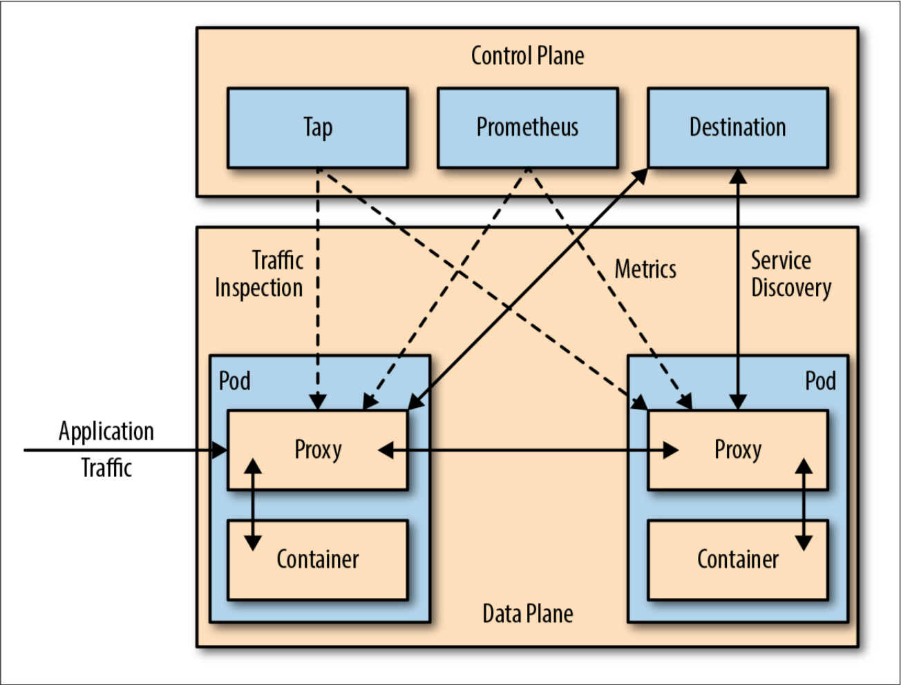
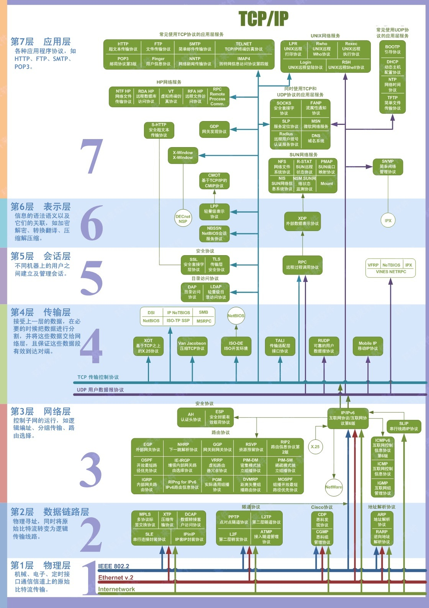
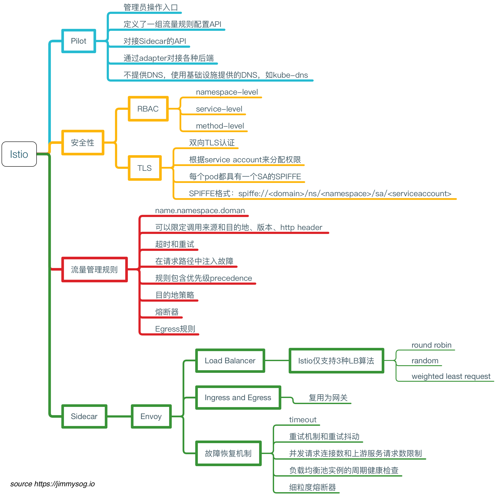

## 1 简介

### 服务网格

如果用一句话来解释什么是服务网格，可以将它比作是应用程序或者说微服务间的 TCP/IP，负责服务之间的网络调用、限流、熔断和监控。对于编写应用程序来说一般无须关心 TCP/IP 这一层（比如通过 HTTP 协议的 RESTful 应用），同样使用服务网格也就无须关系服务之间的那些原来是通过应用程序或者其他框架实现的事情，比如 Spring Cloud、OSS，现在只要交给服务网格就可以了。

服务网格中分为控制平面和数据平面，当前流行的两款开源的服务网格 Istio 和 Linkerd 实际上都是这种构造，只不过 Istio 的划分更清晰，而且部署更零散，很多组件都被拆分，控制平面中包括 Mixer（Istio 1.5 之前版本）、Pilot、Citadel，数据平面默认是用 Envoy；而 Linkerd 中只分为 Linkerd 做数据平面，namerd 作为控制平面。

控制平面的特点：

* 不直接解析数据包
* 与控制平面中的代理通信，下发策略和配置
* 负责网络行为的可视化
* 通常提供 API 或者命令行工具可用于配置版本化管理，便于持续集成和部署

数据平面的特点：

* 通常是按照无状态目标设计的，但实际上为了提高流量转发性能，需要缓存一些数据，因此无状态也是有争议的
* 直接处理入站和出站数据包，转发、路由、健康检查、负载均衡、认证、鉴权、产生监控数据等
* 对应用来说透明，即可以做到无感知部署



服务网格是七层网络架构中的第五层




### Istio

实际上Istio 就是 Service Mesh 架构的一种实现，服务之间的通信（比如这里的 Service A 访问 Service B）会通过代理（默认是 Envoy）来进行。将微服务下沉到了云原生的层面。

> 发现上层应用的一系列技术，都在向云原生的方式靠拢，即k8s定义的一套部署运维机制。曾经服务的发布和订阅还是通过专门的中间件注册中心来实现的，现在k8s提供了云原生的方式进行服务的发布和订阅。服务治理曾经是中间件的能力，现在也下沉到了云原生的方式，通过istio来实现容器切面，进行服务治理

控制平面做了进一步的细分，分成了 Pilot、Citadel 和 Galley，它们的各自功能如下：

* Pilot：为 Envoy 提供了服务发现，流量管理和智能路由（AB 测试、金丝雀发布等），以及错误处理（超时、重试、熔断）功能。
* Citadel：为服务之间提供认证和证书管理，可以让服务自动升级成 TLS 协议。
* Galley：Galley 是 Istio 的配置验证、提取、处理和分发组件。它负责将其余的 Istio 组件与从底层平台（例如 Kubernetes）获取用户配置的细节隔离开来。


### 优势

通过负载均衡、服务间的身份验证、监控等方法，Istio 可以轻松地创建一个已经部署了服务的网络，而服务的代码只需很少更改甚至无需更改。通过在整个环境中部署一个特殊的 sidecar 代理为服务添加 Istio 的支持，而代理会拦截微服务之间的所有网络通信，然后使用其控制平面的功能来配置和管理 Istio，这包括：

* 为 HTTP、gRPC、WebSocket 和 TCP 流量自动负载均衡。
* 通过丰富的路由规则、重试、故障转移和故障注入对流量行为进行细粒度控制。
* 可插拔的策略层和配置 API，支持访问控制、速率限制和配额。
* 集群内（包括集群的入口和出口）所有流量的自动化度量、日志记录和追踪。
* 在具有强大的基于身份验证和授权的集群中实现安全的服务间通信。

### 能力



#### 流量管理

Istio 简单的规则配置和流量路由允许您控制服务之间的流量和 API 调用过程。

Istio 简化了服务级属性（如熔断器、超时和重试）的配置，并且让它轻而易举的执行重要的任务（如 A/B 测试、金丝雀发布和按流量百分比划分的分阶段发布）。

有了更好的对流量的可视性和开箱即用的故障恢复特性，就可以在问题产生之前捕获它们，无论面对什么情况都可以使调用更可靠，网络更健壮。

#### 安全

Istio 的安全特性解放了开发人员，使其只需要专注于应用程序级别的安全。

Istio 提供了底层的安全通信通道，并为大规模的服务通信管理认证、授权和加密。有了 Istio，服务通信在默认情况下就是受保护的，可以让您在跨不同协议和运行时的情况下实施一致的策略——而所有这些都只需要很少甚至不需要修改应用程序。

Istio 是独立于平台的，可以与 Kubernetes（或基础设施）的网络策略一起使用。但它更强大，能够在网络和应用层面保护pod到 pod 或者服务到服务之间的通信。

#### 可观察性

Istio 健壮的追踪、监控和日志特性让您能够深入的了解服务网格部署。

通过 Istio 的监控能力，可以真正的了解到服务的性能是如何影响上游和下游的；而它的定制 Dashboard 提供了对所有服务性能的可视化能力，并让您看到它如何影响其他进程。

Istio 的 Mixer 组件负责策略控制和遥测数据收集。它提供了后端抽象和中介，将一部分 Istio 与后端的基础设施实现细节隔离开来，并为运维人员提供了对网格与后端基础实施之间交互的细粒度控制。

所有这些特性都使您能够更有效地设置、监控和加强服务的 SLO。当然，底线是您可以快速有效地检测到并修复出现的问题。

## 2 最佳实践

### 应用需要改造

服务通信和治理相关的功能迁移到 [sidecar](https://jimmysong.io/kubernetes-handbook/GLOSSARY.html#sidecar "Sidecar，全称 Sidecar proxy，为在应用程序旁运行的单独的进程，它可以为应用程序添加许多功能，而无需在应用程序中添加额外的第三方组件，或修改应用程序的代码或配置。") 进程中后， 应用中的 SDK 通常需要作出一些对应的改变。

比如 SDK 需要关闭一些功能，例如重试。一个典型的场景是，SDK 重试 m 次，[sidecar](https://jimmysong.io/kubernetes-handbook/GLOSSARY.html#sidecar "Sidecar，全称 Sidecar proxy，为在应用程序旁运行的单独的进程，它可以为应用程序添加许多功能，而无需在应用程序中添加额外的第三方组件，或修改应用程序的代码或配置。") 重试 n 次，这会导致 m * n 的重试风暴，从而引发风险。

此外，诸如 trace header 的透传，也需要 SDK 进行升级改造。如果你的 SDK 中还有其它特殊逻辑和功能，这些可能都需要小心处理才能和 Isito [sidecar](https://jimmysong.io/kubernetes-handbook/GLOSSARY.html#sidecar "Sidecar，全称 Sidecar proxy，为在应用程序旁运行的单独的进程，它可以为应用程序添加许多功能，而无需在应用程序中添加额外的第三方组件，或修改应用程序的代码或配置。") 完美配合。

## 只有 HTTP 协议是一等公民

> 这也是Istio在落地过程中一个重要的改造点。将企业内部的私有通信协议适配到自身的sidecar上。

Istio 原生对 HTTP 协议提供了完善的全功能支持，但在真实的业务场景中，私有化协议却非常普遍，而 Istio 却并未提供原生支持。

这导致使用私有协议的一些服务可能只能被迫使用 TCP 协议来进行基本的请求路由，这会导致很多功能的缺失，这其中包括 Istio 非常强大的基于内容的消息路由，如基于 header、 path 等进行权重路由。

## Istio 在集群规模较大时的性能问题

> 这一世istio的优势之一，不依赖单独集中式的注册中心，而是从k8s的etcd注册中心订阅全量的服务。而不是等待访问发生时进行订阅和路由。

Istio 默认的工作模式下，每个 [sidecar]() 都会收到全集群所有服务的信息。如果你部署过 Istio 官方的 Bookinfo 示例应用，并使用 Envoy 的 config dump 接口进行观察，你会发现，仅仅几个服务，Envoy 所收到的配置信息就有将近 20w 行。

可以想象，在稍大一些的集群规模，Envoy 的内存开销、Istio 的 CPU 开销、XDS 的下发时效性等问题，一定会变得尤为突出。

Istio 这么做一是考虑这样可以开箱即用，用户不用进行过多的配置，另外在一些场景，可能也无法梳理出准确的服务之间的调用关系，因此直接给每个 [sidecar](https://jimmysong.io/kubernetes-handbook/GLOSSARY.html#sidecar "Sidecar，全称 Sidecar proxy，为在应用程序旁运行的单独的进程，它可以为应用程序添加许多功能，而无需在应用程序中添加额外的第三方组件，或修改应用程序的代码或配置。") 下发了全量的服务配置，即使这个 [sidecar](https://jimmysong.io/kubernetes-handbook/GLOSSARY.html#sidecar "Sidecar，全称 Sidecar proxy，为在应用程序旁运行的单独的进程，它可以为应用程序添加许多功能，而无需在应用程序中添加额外的第三方组件，或修改应用程序的代码或配置。") 只会访问其中很小一部分服务。

当然这个问题也有解法，你可以通过 [sidecar](https://jimmysong.io/kubernetes-handbook/GLOSSARY.html#sidecar "Sidecar，全称 Sidecar proxy，为在应用程序旁运行的单独的进程，它可以为应用程序添加许多功能，而无需在应用程序中添加额外的第三方组件，或修改应用程序的代码或配置。") [CRD](https://jimmysong.io/kubernetes-handbook/GLOSSARY.html#crd "CRD，全称 Custom Resource Definition（自定义资源定义）是默认的 Kubernetes API 扩展。") 来显示定义服务调用关系，使 Envoy 只得到他需要的服务信息，从而大幅降低 Envoy 的资源开销，但前提是在你的业务线中能梳理出这些调用关系。

## XDS 分发没有分级发布机制

当你对一个服务的策略配置进行变更的时候，XDS 不具备分级发布的能力，所有访问这个服务的 Envoy 都会立即收到变更后的最新配置。这在一些对变更敏感的严苛生产环境，可能是有很高风险甚至不被允许的。

如果你的生产环境严格要求任何变更都必须有分级发布流程，那你可能需要考虑自己实现一套这样的机制

## Istio 组件故障时是否有退路？

以 Istio 为代表的 [sidecar](https://jimmysong.io/kubernetes-handbook/GLOSSARY.html#sidecar "Sidecar，全称 Sidecar proxy，为在应用程序旁运行的单独的进程，它可以为应用程序添加许多功能，而无需在应用程序中添加额外的第三方组件，或修改应用程序的代码或配置。") 架构的特殊性在于，[sidecar](https://jimmysong.io/kubernetes-handbook/GLOSSARY.html#sidecar "Sidecar，全称 Sidecar proxy，为在应用程序旁运行的单独的进程，它可以为应用程序添加许多功能，而无需在应用程序中添加额外的第三方组件，或修改应用程序的代码或配置。") 直接承接了业务流量，而不像一些其他的基础设施那样，只是整个系统的**旁路组件**（比如 Kubernetes）。

因此在 Isito 落地初期，你必须考虑，如果 [sidecar](https://jimmysong.io/kubernetes-handbook/GLOSSARY.html#sidecar "Sidecar，全称 Sidecar proxy，为在应用程序旁运行的单独的进程，它可以为应用程序添加许多功能，而无需在应用程序中添加额外的第三方组件，或修改应用程序的代码或配置。") 进程挂掉，服务怎么办？是否有退路？是否能 fallback 到直连模式？

在 Istio 落地过程中，是否能无损 fallback，通常决定了核心业务能否接入服务网格。

## Istio 目前解决的问题域还很有限

> Sidecar是一种设计模型，能够将应用和基础架构解耦。Istio只是使用这种模式实现服务发布和订阅，时Sidecar设计模式的一种应用场景。

Istio 目前主要解决的是分布式系统之间服务调用的问题，但还有一些分布式系统的复杂语义和功能并未纳入到 Istio 的 [sidecar](https://jimmysong.io/kubernetes-handbook/GLOSSARY.html#sidecar "Sidecar，全称 Sidecar proxy，为在应用程序旁运行的单独的进程，它可以为应用程序添加许多功能，而无需在应用程序中添加额外的第三方组件，或修改应用程序的代码或配置。") 运行时之中，比如消息发布和订阅、状态管理、资源绑定等等。

云原生应用将会朝着多 [sidecar](https://jimmysong.io/kubernetes-handbook/GLOSSARY.html#sidecar "Sidecar，全称 Sidecar proxy，为在应用程序旁运行的单独的进程，它可以为应用程序添加许多功能，而无需在应用程序中添加额外的第三方组件，或修改应用程序的代码或配置。") 运行时或将更多分布式能力纳入单 [sidecar](https://jimmysong.io/kubernetes-handbook/GLOSSARY.html#sidecar "Sidecar，全称 Sidecar proxy，为在应用程序旁运行的单独的进程，它可以为应用程序添加许多功能，而无需在应用程序中添加额外的第三方组件，或修改应用程序的代码或配置。") 运行时的方向继续发展，以使服务本身变得更为轻量，**让应用和基础架构彻底解耦**。

如果你的生产环境中，业务系统对接了非常多和复杂的分布式系系统中间件，Istio 目前可能并不能完全解决你的应用的云原生化诉求。

## 3 实践

### 安装

1. 下载istioctl工具https://gcsweb.istio.io/gcs/istio-release/releases/1.21.2/ 下载对应操作系统的版本。

```
wget https://github.com/istio/istio/releases/download/1.18.1/istio-1.18.1-linux-amd64.tar.gz
tar -zxvf istio-1.18.1-linux-amd64.tar.gz
cp /bin/istioctl /usr/bin/ctl
```

2. 将istio安装到环境中。安装后会出现以下资源。

```shell
➜  istio-1.21.2 istioctl install --set profile=demo -y
WARNING: Istio is being upgraded from 1.18.0 to 1.21.2.
         Running this command will overwrite it; use revisions to upgrade alongside the existing version.
         Before upgrading, you may wish to use 'istioctl x precheck' to check for upgrade warnings.
This installation will make default injection and validation pointing to the default revision, and originally it was pointing to the revisioned one.
✔ Istio core installed                                                                                                                                                                        
✔ Istiod installed                                                                                                                                                                            
✔ Egress gateways installed                                                                                                                                                                   
✔ Ingress gateways installed                                                                                                                                                                  
✔ Installation complete                                                                                                                                                                           Made this installation the default for injection and validation.
➜  istio-1.21.2 cd ..                                                                                                              
➜  kubetest kubectl get all -n istio-system                                                                                    
NAME                                      READY   STATUS    RESTARTS   AGE
pod/istio-egressgateway-8c547cdc-27s94    1/1     Running   0          73s
pod/istio-ingressgateway-cd9c7b79-2gsr5   1/1     Running   0          73s
pod/istiod-868c79fcc6-tl9g7               1/1     Running   0          89s

NAME                           TYPE           CLUSTER-IP       EXTERNAL-IP     PORT(S)                                                                      AGE
service/istio-egressgateway    ClusterIP      192.168.241.8    <none>          80/TCP,443/TCP                                                               73s
service/istio-ingressgateway   LoadBalancer   192.168.23.245   123.57.172.74   15021:30965/TCP,80:32501/TCP,443:30930/TCP,31400:31622/TCP,15443:32480/TCP   73s
service/istiod                 ClusterIP      192.168.35.184   <none>          15010/TCP,15012/TCP,443/TCP,15014/TCP                                        15d

NAME                                   READY   UP-TO-DATE   AVAILABLE   AGE
deployment.apps/istio-egressgateway    1/1     1            1           73s
deployment.apps/istio-ingressgateway   1/1     1            1           73s
deployment.apps/istiod                 1/1     1            1           15d

NAME                                            DESIRED   CURRENT   READY   AGE
replicaset.apps/istio-egressgateway-8c547cdc    1         1         1       74s
replicaset.apps/istio-ingressgateway-cd9c7b79   1         1         1       74s
replicaset.apps/istiod-6b56fd6ddd               0         0         0       15d
replicaset.apps/istiod-868c79fcc6               1         1         1       90s

NAME                                         REFERENCE           TARGETS   MINPODS   MAXPODS   REPLICAS   AGE
horizontalpodautoscaler.autoscaling/istiod   Deployment/istiod   10%/80%   1         5         1          15d

NAME                                                                                             AGE
containernetworkfilesystem.storage.alibabacloud.com/cnfs-nas-c3225ec7463fe4ba9816186be4d2eb7f7   16d
```

3. 给制定明敏个空间开启istio注入。

```shell
kubectl label namespace bookinfo istio-injection=enabled
```

```shell
[root@vela istio-1.18.1]# kubectl get crds |grep istio
authorizationpolicies.security.istio.io                            2023-07-23T04:42:38Z
destinationrules.networking.istio.io                               2023-07-23T04:42:38Z
envoyfilters.networking.istio.io                                   2023-07-23T04:42:38Z
gateways.networking.istio.io                                       2023-07-23T04:42:38Z
istiooperators.install.istio.io                                    2023-07-23T04:42:39Z
peerauthentications.security.istio.io                              2023-07-23T04:42:39Z
proxyconfigs.networking.istio.io                                   2023-07-23T04:42:39Z
requestauthentications.security.istio.io                           2023-07-23T04:42:39Z
serviceentries.networking.istio.io                                 2023-07-23T04:42:39Z
sidecars.networking.istio.io                                       2023-07-23T04:42:39Z
telemetries.telemetry.istio.io                                     2023-07-23T04:42:39Z
virtualservices.networking.istio.io                                2023-07-23T04:42:39Z
wasmplugins.extensions.istio.io                                    2023-07-23T04:42:40Z
workloadentries.networking.istio.io                                2023-07-23T04:42:40Z
workloadgroups.networking.istio.io                                 2023-07-23T04:42:40Z
```

4. 部署测试应用

```shell
kubectl apply -f samples/bookinfo/platform/kube/bookinfo.yaml -n bookinfo

istio-1.21.2 kubectl apply -f samples/bookinfo/platform/kube/bookinfo.yaml -n bookinfo
service/details created
serviceaccount/bookinfo-details created
deployment.apps/details-v1 created
service/ratings created
serviceaccount/bookinfo-ratings created
deployment.apps/ratings-v1 created
service/reviews created
serviceaccount/bookinfo-reviews created
deployment.apps/reviews-v1 created
deployment.apps/reviews-v2 created
deployment.apps/reviews-v3 created
service/productpage created
serviceaccount/bookinfo-productpage created

```

5. 测试引用是否启动成功

```shell
kubectl exec -n bookinfo  "$(kubectl get -n bookinfo pod -l app=ratings -o jsonpath='{.items[0].metadata.name}')" -c ratings -- curl -sS productpage:9080/productpage | grep -o "<title>.*</title>"
<title>Simple Bookstore App</title>
```
