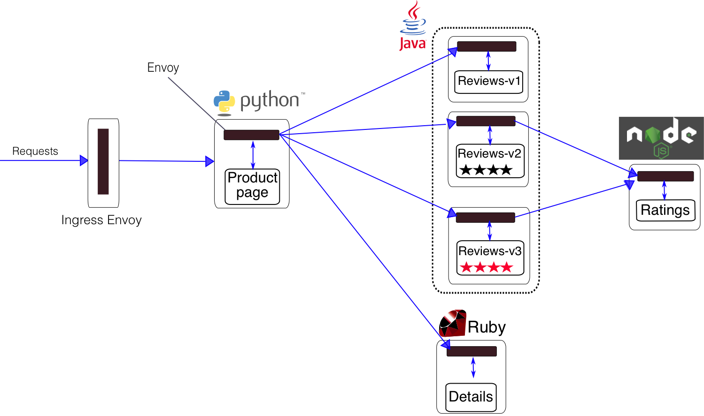
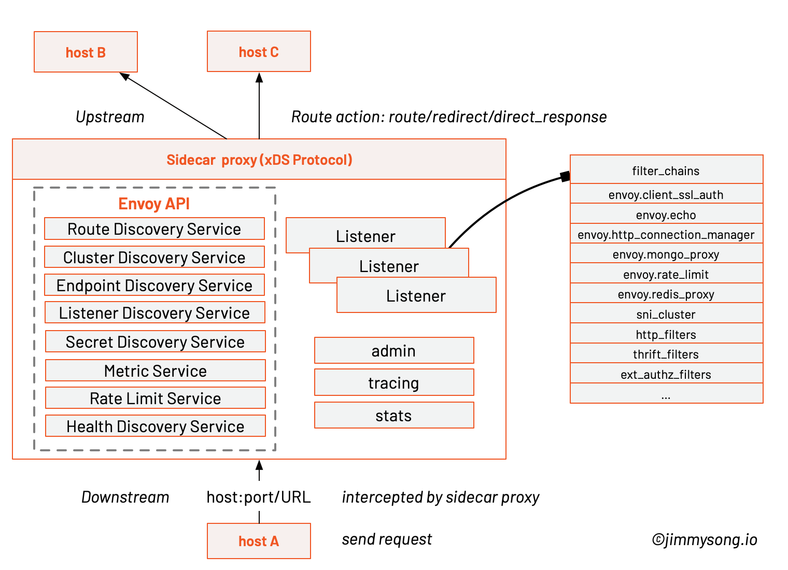

## 规范

### Pod Spec 中需满足的条件

为了成为 服务网格中的一部分，Kubernetes 集群中的每个 Pod 都必须满足如下条件，这些规范不是由 Istio 自动注入的，而需要 生成 Kubernetes 应用部署的 YAML 文件时需要遵守的：

Service 关联：每个 pod 都必须只属于某一个 Kubernetes Service （当前不支持一个 pod 同时属于多个 service）。
命名的端口：Service 的端口必须命名。端口的名字必须遵循如下格式 `<protocol>`[-`<suffix>`]，可以是 http、http2、 grpc、 mongo、 或者 redis 作为 `<protocol>` ，这样才能使用 Istio 的路由功能。例如 name: http2-foo 和 name: http 都是有效的端口名称，而 name: http2foo 不是。如果端口的名称是不可识别的前缀或者未命名，那么该端口上的流量就会作为普通的 TCP 流量来处理（除非使用 Protocol: UDP 明确声明使用 UDP 端口）。
带有 app label 的 Deployment：我们建议 Kubernetes 的Deploymenet 资源的配置文件中为 Pod 明确指定 applabel。每个 Deployment 的配置中都需要有个与其他 Deployment 不同的含有意义的 app label。app label 用于在分布式追踪中添加上下文信息。
Mesh 中的每个 pod 里都有一个 Sidecar：最后，网格中的每个 pod 都必须运行与 Istio 兼容的 sidecar。以下部分介绍了将 sidecar 注入到 pod 中的两种方法：使用istioctl 命令行工具手动注入，或者使用 Istio Initializer 自动注入。注意 sidecar 不涉及到流量，因为它们与容器位于同一个 pod 中。

## 原理

### 注入方式

1. istioctl手动注入
2. 自动注入

Sidecar 容器注入的流程，每个注入了 Sidecar 的 Pod 中除了原先应用的应用本身的容器外，都会多出来这样两个容器：

* istio-init：用于给 Sidecar 容器即 Envoy 代理做初始化，设置 iptables 端口转发
* istio-proxy：Envoy 代理容器，运行 Envoy 代理

### Init容器

一个 Pod 中可以指定多个 Init 容器，如果指定了多个，那么 Init 容器将会按顺序依次运行。只有当前面的 Init 容器必须运行成功后，才可以运行下一个 Init 容器。当所有的 Init 容器运行完成后，Kubernetes 才初始化 Pod 和运行应用容器。

Init 容器使用 Linux Namespace，所以相对应用程序容器来说具有不同的文件系统视图。因此，它们能够具有访问 Secret 的权限，而应用程序容器则不能。

Istio 在 Pod 中注入的 Init 容器名为 istio-init，如果你查看 reviews Deployment 配置，你将看到其中 initContaienrs 的启动参数：

```
initContainers:
        - name: istio-init
          image: docker.io/istio/proxyv2:1.13.1
          args:
            - istio-iptables
            - '-p'
            - '15001'
            - '-z'
            - '15006'
            - '-u'
            - '1337'
            - '-m'
            - REDIRECT
            - '-i'
            - '*'
            - '-x'
            - ''
            - '-b'
            - '*'
            - '-d'
            - 15090,15021,15020
```

参数解释

```
$ istio-iptables -p PORT -u UID -g GID [-m mode] [-b ports] [-d ports] [-i CIDR] [-x CIDR] [-h]
  -p: 指定重定向所有 TCP 流量的 Envoy 端口（默认为 $ENVOY_PORT = 15001）
  -u: 指定未应用重定向的用户的 UID。通常，这是代理容器的 UID（默认为 $ENVOY_USER 的 uid，istio_proxy 的 uid 或 1337）
  -g: 指定未应用重定向的用户的 GID。（与 -u param 相同的默认值）
  -m: 指定入站连接重定向到 Envoy 的模式，“REDIRECT” 或 “TPROXY”（默认为 $ISTIO_INBOUND_INTERCEPTION_MODE)
  -b: 逗号分隔的入站端口列表，其流量将重定向到 Envoy（可选）。使用通配符 “*” 表示重定向所有端口。为空时表示禁用所有入站重定向（默认为 $ISTIO_INBOUND_PORTS）
  -d: 指定要从重定向到 Envoy 中排除（可选）的入站端口列表，以逗号格式分隔。使用通配符“*” 表示重定向所有入站流量（默认为 $ISTIO_LOCAL_EXCLUDE_PORTS）
  -i: 指定重定向到 Envoy（可选）的 IP 地址范围，以逗号分隔的 CIDR 格式列表。使用通配符 “*” 表示重定向所有出站流量。空列表将禁用所有出站重定向（默认为 $ISTIO_SERVICE_CIDR）
  -x: 指定将从重定向中排除的 IP 地址范围，以逗号分隔的 CIDR 格式列表。使用通配符 “*” 表示重定向所有出站流量（默认为 $ISTIO_SERVICE_EXCLUDE_CIDR）。
  -z: 所有入站 TCP 流量重定向端口（默认为 $INBOUND_CAPTURE_PORT 15006）
```

这条启动命令的作用是：

* 将应用容器的所有流量都转发到 Envoy 的 15006 端口。
* 使用 istio-proxy 用户身份运行， UID 为 1337，即 Envoy 所处的用户空间，这也是 istio-proxy 容器默认使用的用户，见 YAML 配置中的 runAsUser 字段。
* 使用默认的 REDIRECT 模式来重定向流量。
* 将所有出站流量都重定向到 Envoy 代理。
* 将除了 15090、15201、15020 端口以外的所有端口的流量重定向到 Envoy 代理。

该容器存在的意义就是让 Envoy 代理可以拦截所有的进出 Pod 的流量，即将入站流量重定向到 Sidecar，再拦截应用容器的出站流量经过 Sidecar 处理后再出站

## 3 流量路由

本文以 Istio 官方的 bookinfo 示例来讲解在进入 Pod 的流量被 iptables 转交给 Envoy [sidecar](https://jimmysong.io/kubernetes-handbook/GLOSSARY.html#sidecar "Sidecar，全称 Sidecar proxy，为在应用程序旁运行的单独的进程，它可以为应用程序添加许多功能，而无需在应用程序中添加额外的第三方组件，或修改应用程序的代码或配置。") 后，Envoy 是如何做路由转发的，详述了 Inbound 和 Outbound 处理过程。




### Envoy的架构



每个 host 上都可能运行多个 service，Envoy 中也可能有多个 Listener，每个 Listener 中可能会有多个 filter 组成了 chain。


 **Host** ：能够进行网络通信的实体（在手机或服务器等上的应用程序）。在 Envoy 中主机是指逻辑网络应用程序。只要每台主机都可以独立寻址，一块物理硬件上就运行多个主机。

 **Downstream** ：下游（downstream）主机连接到 Envoy，发送请求并或获得响应。

 **Upstream** ：上游（upstream）主机获取来自 Envoy 的链接请求和响应。

 **Cluster** : 集群（cluster）是 Envoy 连接到的一组逻辑上相似的上游主机。Envoy 通过服务发现发现集群中的成员。Envoy 可以通过主动运行状况检查来确定集群成员的健康状况。Envoy 如何将请求路由到集群成员由负载均衡策略确定。

 **Mesh** ：一组互相协调以提供一致网络拓扑的主机。Envoy mesh 是指一组 Envoy 代理，它们构成了由多种不同服务和应用程序平台组成的分布式系统的消息传递基础。

 **运行时配置** ：与 Envoy 一起部署的带外实时配置系统。可以在无需重启 Envoy 或 更改 Envoy 主配置的情况下，通过更改设置来影响操作。

 **Listener** : 侦听器（listener）是可以由下游客户端连接的命名网络位置（例如，端口、unix域套接字等）。Envoy 公开一个或多个下游主机连接的侦听器。一般是每台主机运行一个 Envoy，使用单进程运行，但是每个进程中可以启动任意数量的 Listener（监听器），目前只监听 TCP，每个监听器都独立配置一定数量的（L3/L4）网络过滤器。Listenter 也可以通过 Listener Discovery Service（ **LDS** ）动态获取。

 **Listener filter** ：Listener 使用 listener filter（监听器过滤器）来操作链接的元数据。它的作用是在不更改 Envoy 的核心功能的情况下添加更多的集成功能。Listener filter 的 API 相对简单，因为这些过滤器最终是在新接受的套接字上运行。在链中可以互相衔接以支持更复杂的场景，例如调用速率限制。Envoy 已经包含了多个监听器过滤器。

 **Http Route Table** ：HTTP 的路由规则，例如请求的域名，Path 符合什么规则，转发给哪个 Cluster。

 **Health checking** ：健康检查会与SDS服务发现配合使用。但是，即使使用其他服务发现方式，也有相应需要进行主动健康检查的情况。


## xDS

xDS 是一个关键概念，它是一类发现服务的统称，其包括如下几类：

* CDS：Cluster Discovery Service
* EDS：Endpoint Discovery Service
* SDS：Service Discovery Service
* RDS：Route Discovery Service
* LDS：Listener Discovery Service

正是通过对 xDS 的请求来动态更新 Envoy 配置。

## Envoy Mesh

Envoy Mesh 指的是由 envoy 做负载均衡和代理的 mesh。该 Mesh 中会包含两类 envoy：

* Edge envoy：即流量进出 mesh 时候的 envoy，相当于 kubernetes 中的 ingress。
* Service envoy：服务 envoy 是跟每个 serivce 实例一起运行的，应用程序无感知的进程外工具，在 kubernetes 中会与应用容器以 [sidecar](https://jimmysong.io/kubernetes-handbook/GLOSSARY.html#sidecar "Sidecar，全称 Sidecar proxy，为在应用程序旁运行的单独的进程，它可以为应用程序添加许多功能，而无需在应用程序中添加额外的第三方组件，或修改应用程序的代码或配置。") 形式运行在同一个 pod 中。

Envoy 即可以单独作为 edge envoy，也可以仅做 service envoy 使用，也可以两者同时使用。Mesh 中的所有 envoy 会共享路由信息。
