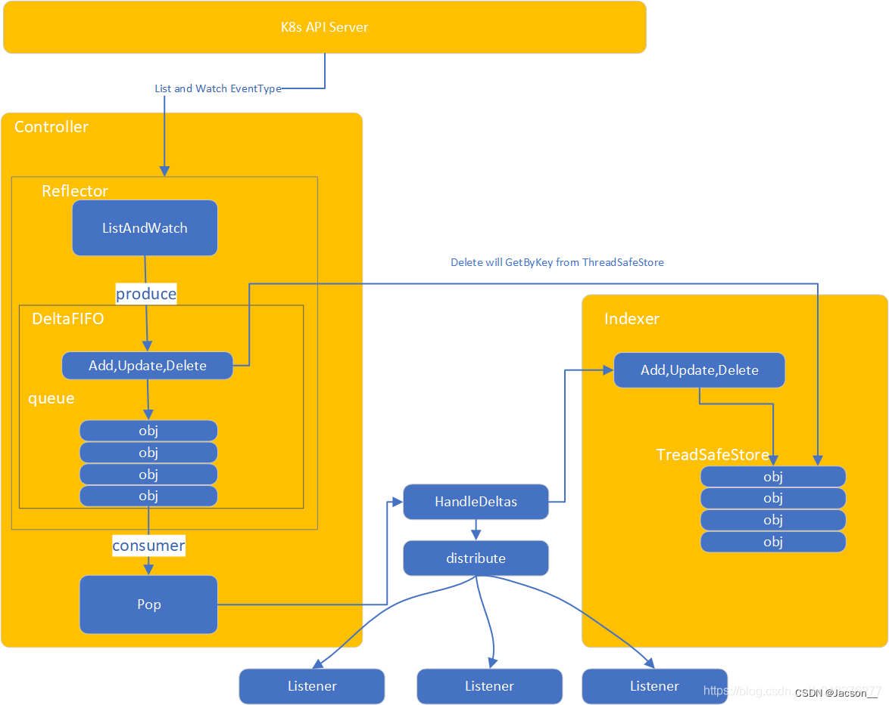

# Client-go

## 简介

client-go是对K8s集群的二次开发工具，所以client-go是k8s开发者的必备工具之一。client-go实现对kubernetes集群中资源对象（包括deployment、service、ingress、replicaSet、pod、namespace、node等）的增删改查等操作。


client-go主要提供了四种类型的客户端：
1. RESTClient： 是对HTTP Request进行了封装，实现了RESTful风格的API。其他客户端都是在RESTClient基础上的实现。可与用于k8s内置资源和CRD资源

2. ClientSet:是对k8s内置资源对象的客户端的集合，默认情况下，不能操作CRD资源，但是通过client-gen代码生成的话，也是可以操作CRD资源的。

3. DynamicClient:不仅能对K8S内置资源进行处理，还可以对CRD资源进行处理，不需要client-gen生成代码即可实现。

4. DiscoveryClient：用于发现kube-apiserver所支持的资源组、资源版本、资源信息（即Group、Version、Resources）


### RestClient

RESTClient是对HTTP Request 进行了封装，是实现了RESTful风格的API封装。

```go
package main

import (
	"k8s.io/client-go/rest"
	"k8s.io/client-go/tools/clientcmd"
	"k8s.io/api/core/v1"
	"k8s.io/client-go/kubernetes/scheme"
)

func main() {
	//RESTCLIENT
	//config
	config, err := clientcmd.BuildConfigFromFlags("", clientcmd.RecommendedHomeFile)
	if err != nil {
		panic(err)
	}
	config.GroupVersion = &v1.SchemeGroupVersion
	config.NegotiatedSerializer = scheme.Codecs
	config.APIPath = "/api"

	//client
	restClient, err := rest.RESTClientFor(config)
	if err != nil {
		panic(err)
	}

	//get data
	pod := v1.Pod{}
	err = restClient.Get().Namespace("default").Resource("pods").Name("test").Do(context.TODO()).Into(&pod)

	if err != nil {
		println(err)
	}else {
		println(pod.Name)
	}
}
```


### clientSet

ClientSet客户端默认是对k8s内置资源对象客户端的集合，通过ClientSet客户端可以操作k8s的内置资源对象。

```go
package main

import (
	"context"
	v1 "k8s.io/apimachinery/pkg/apis/meta/v1"
	"k8s.io/client-go/kubernetes"
	"k8s.io/client-go/tools/clientcmd"

)

func main() {
	//clientset
	config, err := clientcmd.BuildConfigFromFlags("", clientcmd.RecommendedHomeFile)
	if err != nil {
		panic(err)
	}
	clientset, err := kubernetes.NewForConfig(config)
	if err != nil {
		panic(err)
	}

	pod, err := clientset.CoreV1().Pods("default").Get(context.TODO(), "test", v1.GetOptions{})
	if err != nil {
		println(err)
	}else {
		println(pod.Name)
	}

}
```


### DynamicClient

DynamicClient的特点就是除了可以使用k8s内置资源外，还可以使用CRD资源。dynamicClient的原理就是传入的资源数据都是使用map[string]interface{}结构。dynamicClient内部还是restClient.

```go
package main

import (
	"context"
	"fmt"
	v1 "k8s.io/apimachinery/pkg/apis/meta/v1"
	"k8s.io/apimachinery/pkg/apis/meta/v1/unstructured"
	"k8s.io/apimachinery/pkg/runtime/schema"
	"k8s.io/client-go/dynamic"
	"k8s.io/client-go/tools/clientcmd"
)


func getDynamicClientExample(kubeconfig string) {
	config, err := clientcmd.BuildConfigFromFlags("", kubeconfig)
	if err != nil {
		panic(err)
	}
	client, err := dynamic.NewForConfig(config)
	if err != nil {
		panic(err)
	}


	deployment := &unstructured.Unstructured{
		Object: map[string]interface{}{
			"apiVersion": "apps/v1",
			"kind":       "Deployment",
			"metadata": map[string]interface{}{
				"name": "demo-deployment",
			},
			"spec": map[string]interface{}{
				"replicas": 2,
				"selector": map[string]interface{}{
					"matchLabels": map[string]interface{}{
						"app": "demo",
					},
				},
				"template": map[string]interface{}{
					"metadata": map[string]interface{}{
						"labels": map[string]interface{}{
							"app": "demo",
						},
					},

					"spec": map[string]interface{}{
						"containers": []map[string]interface{}{
							{
								"name":  "web",
								"image": "nginx:1.12",
								"ports": []map[string]interface{}{
									{
										"name":          "http",
										"protocol":      "TCP",
										"containerPort": 80,
									},
								},
							},
						},
					},
				},
			},
		},
	}
	deploymentRes := schema.GroupVersionResource{Group: "apps", Version: "v1", Resource: "deployments"}
	ctx := context.Background()
	// Create Deployment
	fmt.Println("Creating deployment...")
	result, err := client.Resource(deploymentRes).Namespace("default").Create(ctx,deployment, v1.CreateOptions{})
	if err != nil {
		panic(err)
	}
	fmt.Printf("Created deployment %q.\n", result.GetName())
}
```

### DiscoveryClient

DiscoveryClient是发现客户端，主要用于发现k8s api-server所支持的资源组、资源版本及资源信息。


```go
package main

import (
	"fmt"
	"k8s.io/client-go/discovery"
	"k8s.io/client-go/tools/clientcmd"
)

func getDisCoveryClient(kubeconfig string) {
	config, err := clientcmd.BuildConfigFromFlags("", kubeconfig)
	if err != nil {
		panic(err)
	}
	discoveryClient, err := discovery.NewDiscoveryClientForConfig(config)
	if err != nil {
		panic(err)
	}
	_, APIResourceList, err := discoveryClient.ServerGroupsAndResources()
	if err != nil {
		panic(err)
	}
	for _, list := range APIResourceList {
		fmt.Println(list)
	}
}
```

## 2 Informer机制

informer在kubernetes系统中，保证各个组件之间消息的实时性、可靠性、顺序性等。k8s各组件通过client-go的informer机制与k8s apiserver通信。

Informer：controller机制的基础，循环处理object对象，从Reflector取出数据，然后将数据给到Indexer去缓存，提供对象事件的handler接口

Informer机制中的ListAndWatch、DeltaFIFO队列和Indexer等对于实现以上特性非常重要。下面这张图就是Informer机制运行原理图：



起点是自定义的Controller，Controller会通过ListAndWatch机制从apiserver获取感兴趣的资源对象信息（初始化controller时，会指定感兴趣资源对象的List和watch方法）。controller的内部包含了reflector和DeltaFIFO，controller就是通过reflector中的list和watch将资源对象信息装入DeltaFIFO队列，然后Controller会一直尝试从队列中pop数据，并根据数据中对象的操作类型作事件通知给各Listener并将资源对象存入本地存储Indexer中。

### 1、Reflector
用于监控（Watch）指定的kubernetes资源，当监控的资源发生变化时，触发相应的变更事件，如add、update、delete等，并将其资源对象存入本地缓存DeltaFIFO中，然后Informer会从队列里面取数据。

https://blog.csdn.net/u013276277/article/details/108592288

### 2、DeltaFIFO队列
DeltaFIFO可以分开理解，FIFO是一个先进先出的队列，它拥有队列操作的基本方法，例如Add、Update、Delete、List、Pop、Close等，而Delta是一个资源对象存储，它可以保存资源对象的操作类型，例如Added（添加）操作类型、Updated（更新）操作类型、Deleted（删除）操作类型、Sync（同步）操作类型等

https://blog.csdn.net/u013276277/article/details/108653733

### 3、Indexer
是client-go用来存储资源对象冰紫带索引功能的本地存储，Refelctor从DeltaFIFO消费出来的资源对象存储至indexer。indexer与etcd集群保持一致。client-go可以很方便的从本地存储中读取响应的资源对象数据，而无需每次从etcd读取，以减轻kubernetes apiserver对etcd的压力。

https://blog.csdn.net/u013276277/article/details/108657739

https://mp.weixin.qq.com/s/xCa6yZTk0X76IZhOx6IbHQ