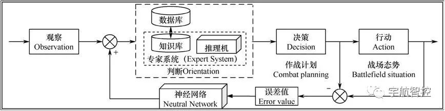

# OODA环

## 1 OODA环结构
观察-判断-决策-执行

## 2 过程

* 第一阶段为观察(Observation), 要是通过各种传感设备和网络的运用进行情报收集，例如，预警探测的信息、战场环境的信息、敌方坐标信息等。
* 第二阶段为判断(Orientation) ，战场态势瞬息万变、并且有很大的不确定性,判断就是将数据转化为有用的信息,有效、快速地判断结果能够辅助指挥员做出正确的决策，甚至改变战场态势。
* 第三阶段为决策(Decision) ，就是指挥员明确制定任务方案、下达作战计划。 决策的迅速形成对战场态势有着决定性意义。
* 第四阶段为行动(Action) ， 战场上的行动通常描述为根据上级下达的作战计划采取相应的作战部署，并进行动作行为。

## 3 改进

* 第一是在判断阶段引入专家系统，并将专家系统的规则库与数据库相结合。首先先，专家系统能够辅助指挥员在信息处理过程中迅速、精准地做出决策建议。其次，将作战指挥数据库中的数据按照专家系统规则库的规则模式存储,利用作战指挥数据库信息丰富的优势扩充专家系统的判断范围，进而为作战决策提供更为精准的辅助指导。
* 第二是对整个系统引入反馈机制，即通过神经网络的自学习能力不断丰富作战指挥数据库。将决策阶段的作战计划和行动阶段的战场实际态势做差值计算得出误差值，将误差值按照一定规则输入神经网络;神经网络通过其自学习功能将本次作战情况输送至判断阶段用于辅助下一次作战决策判断。可以看到，引入反馈机制可将作战情况及时地以某种方式传递给作战指挥数据库，丰富其信量,从而有效缩短辅助判断时间，并提高辅助决策的精准度。
