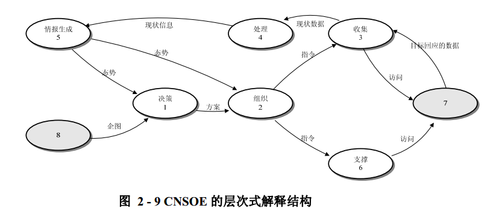
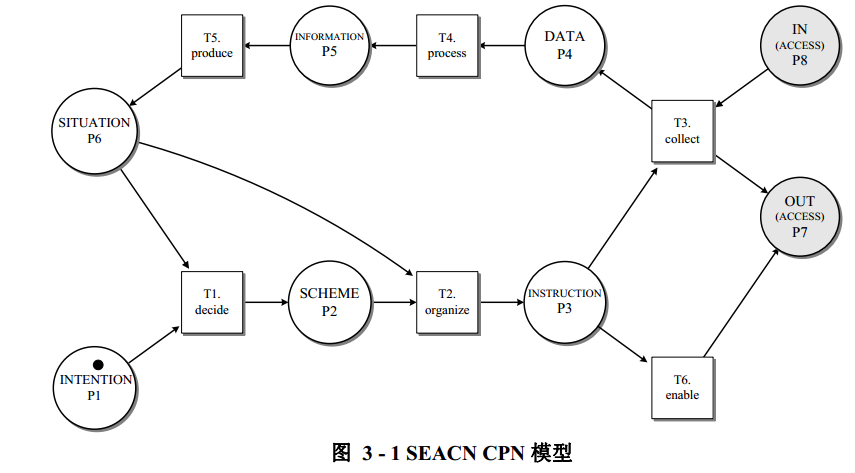
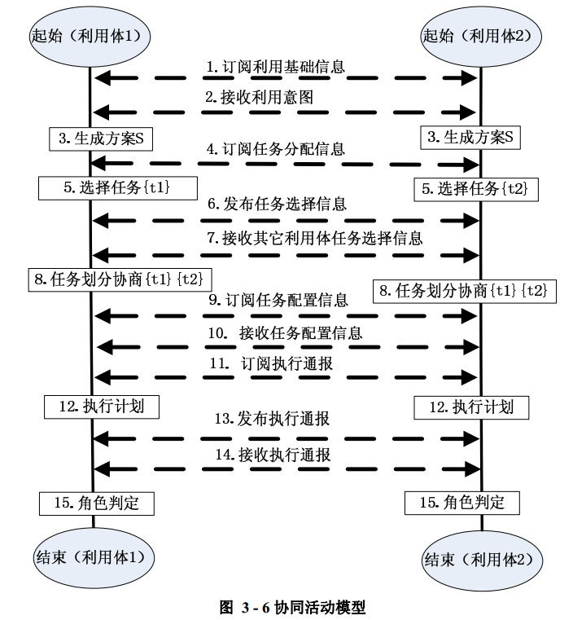

# 计算机网络自组织利用研究——焦健

> 首先看完这篇文章
> 思考自己能做什么，找到相关的方法，应用到这上边。你已经很慢了，得加快速度了。

论文的架构说明
* 第一章：首先提出了CPN研究过程中出现的**问题描述**
* 第二章：然后针对问题，对问题进行抽象，定义相关概念，给出相应的**理论依据**。即**数学抽象**。
* 第三章：针对定义的基本概念，结合实际情况，生成**理论模型**。
* 第四章：对模型中的**关键技术**进行解读。

## 1 第一章：总体-提出问题（文章总体介绍，模型总体介绍）
* 计算机网络自组织利用CNSE，获取网络对抗情报，完成支撑活动
* 活动：决策、组织、数据收集处理、情报生成支撑
* 利用体。利用体网络。
* 问题：利用体网络共同承担利用任务。
* 给出了理论依据与关键技术
* 理论依据：
  * 定义对象
  * 定义活动
  * 定义体系结构（活动关系）
  * 定义描述语言
* 关键技术：
  * 基于产生式推理规则的任务生成和情报生成
  * 基于蜂群群之行为的任务自部署
  * 基于框架匹配技术的特征识别
* CNO----CNA，CND，CNE。攻击防御与利用有本质区别。
* CNE利用，包括，支撑活动与收集活动
* 决策与组织模式的理论与技术：阶段性、有序性和周期性
* 自组织机制及其算法：自组织是在一定条件下，由于系统内子系统的相互作用，使系统形成具有一定功能和结构的过程。它具有自创生、自复制、自生长和自适应等形式。 对于 CNSOE 来讲，自组织性主要体现在自适应性上。
* 自组织的逆向工程方案为了协调系统的复杂行为，不是直接控制系统进化，也不能使系统按照需求进化，但可以通过模拟保证系统的进化最终达到所要求的目标。
* 蜂群算法可能是一个不错的思路。寻找对蜂群算法的优化，或者其他的群体智能算法。
* 解决了一下问题：（文章解决了以下四个问题）
  * 需明确计算机网络利用的对象
  * 界定关于计算机网络利用对象的具体收集活动
  * 明确关于计算机网络利用对象的行动支撑概念
  * 明确计算机网络利用的决策和自组织机制（这也是我主要研究的问题）

## 2 第二章：理论依据（体系结构与自动机。）

### 基本定义
* 定义：CNE活动$\varphi$包括：收集活动和支撑活动
* 定义：CNSOE活动$\varphi$包括：收集活动、支撑活动、决策活动、组织活动、数据处理活动、情报生成活动。
* 定义：CNO对象==目标$t$包括。网络、节点、进程、服务、文件、网络层连接、传输层连接、服务连接。
* 定义：节点特征S包括（静态属性）：操作系统内核特征、节点的协议栈特征、进程特征、服务特征、文件特征。
* 定义：目标状态r包括（动态属性）：节点运行状态、进程运行状态、服务运行状态、链路运行状态。
* 定义：网络情况=特征+状态

### 活动定义
* 定义：行动支撑：支撑活动：获权、传递、激活，及其定义（用来达到CNOSE的活动的支撑）
* 定义：数据收集：收集互动：获取活动、预处理活动，及其定义。
* 定义：数据处理：信号关联、图像利用、文档翻译、数据格式化。
* 定义：情报：目标运行状态、网络拓扑、安全漏洞、对抗手段推论
* 定义：情报生成：综合、评估、分析、解释。及其关系组成的耳机和。

### 决策与组织活动定义（它是一个统筹的活动）
* 定义：决策与组织：决策活动负责将企图转换为收集方案。包括理解企图、拟定方案、评估选优。
* 定义：决策与组织：组织活动负责将方案部署为自身的计划，根据当前的情报信息将计划中的任务逐一转换为指令。
* 定义：意图：目标、期望、手段的三元组。
* 定义：使命：具体目标、期望、手段的三元组
* 定义：方案：彼此关联的任务的集合。
* 定义：任务：任务表示、任务前约束、具体目标、期望、打算采取的手段、任务后约束
* 定义：计划：赋予执行主体关联任务的集合，就是将具体的关联任务分配到执行主体上。
* 定义：指令：具体目标、有待解决的问题、必须采取的手段、任务后约束的4元组

* 决策技术：基于规则推理的方案拟定活动。给出一个可能的执行路径。一个可行的方案，决策不考虑评估优选。
* 决策活动：理解意图活动、拟定方案活动、优选活动。
* 决策活动是企图和情报到方案的映射。
* 组织：决策活动给出方案之后，参照活动的需要和当前的目标状态以及利用执行体的能力，生成具体的利用计划，转化为可以交给利用体直接执行的指令，这一过程统称为组织
* 组织活动：分配任务活动、下达指令活动组成的集合。及其关系集合构成的二元组。

### 体系结构定义

## 3 第三章：模型（文章中的数学模型）

* CPN模型。CNP是组成整个CNSOE的最基本单元。方框表示库所，圆圈表示变迁。

* CPN模型细节

* CNSOE协同行为模型。CNSOE 系统由多个 SEACN 个体（以下简称利用体）组成，如上一节所述，每个利用体都具有独立的从决策、组织到情报生成的能力。多个利用体在执行完整的方案时，需要利用体之间交换信息，协调行动步骤。对抗体之间的通信使用订阅发布（pub-sub）机制实现，

* 数据收集自动机
* 数据处理自动机
* 情报生成自动机
* 任务生成自动机
* 组织行为自动机
* DEACN扩散自动机
* 网络拓扑双向发现自动机

## 4 第四章：关键技术（涉及到的技术，入手点）

### 自组织利用机制

方案生成算法、自部署算法、特征识别算法、情报推理算法。

### 方案生成算法

完成决策任务。有目标、期望、手段转换为方案。包括目标分解和任务推理机制。将目标分解为活动所需要的基本目标单位。使用产生式推理获得利用方案。

在决策过程开始阶段，目标分解后得到由目标、期望和手段组成的谓词表达式，利用谓词公式在决策树中进行推导，自动生成方案。

反演树遍历算法和基于规则推理的任务区分算法包括消解反演树的生成算法， 用于生成基本目标的利用方案。

方案生成算法是决策活动的算法，主要完成了意图到方案的转换，并完成了方案的分解，形成了基本的任务。

### 基于蜂群的自部署算法

利用方案自动产生之后，每一个负责执行任务的利用体都拥有一份相同的方案。利用体通过个体间协商，使用自部署算法完成对方案到任务的转化，即将原有的方案转化为具体行动计划，按照若干行动计划，派发到每个利用体中。

行动角色判定算法：对利用角色进行判定，群体只能种的三个角色。

算法的描述。将利用体划分成不同的角色。首先发现蜂R获取执行目标计划的收益值。部分成为引领峰，部分成为跟随峰，向引领峰靠近，发现更大收益的节点；部分还是发现蜂，继续随机发现可能的最大收益节点。重新判定角色前，需要订阅其他利用体的消息，辅助判定角色。

任务划分算法：方案中任务的划分。按照目标划分任务。任务目标已知，任务目标未知。

基于蜂群的自部署算法是组织活动的算法。主要完成了任务的协同执行。每一个利用体保留一份总体的方案。

这里很关键一点。每一个利用体保留一份总体的任务方案，这与自己原来设计的模型，是完全不同，原来的模型中，只有一个大脑保留完整的方案，通过全局动态的智能方式（蜂群算法）进行任务调度，蜂群算法本身具有自组织性，但是在解决任务调度问题的任务调度模型不是分布式的也不具有组织性，它必须由一个大脑统一分配任务。所以不是自组织的。

### 特征识别算法

完成数据到信息的转换。主要指目标特征：操作系统类型、进程、服务等信息。
### 主要描述语言

协同描述语言和支撑描述语言。

协同描述语言的主要功能实现利用体之间的信息共享。
支撑描述语言作为支撑活动的一种实例化，完成利用体在网络节点间的移动。

### 情报推理算法
计算机网络利用活动的最终目的在于产生可以为对抗所需要的网络情报。情报中除了信息处理得到的内容外，主要为对抗中关于网络目标的安全漏洞和拓扑，这些内容不能通过简单模式匹配的方式获得，而需要按照一定的规则推理产生，因此引入情报的推理算法

### 拓扑双向发现
## 5 思考（明白自己要做的东西，面向的问题）

* 大论文中的，逆向工程，需要用群体智能算法，优化搜索逻辑的执行。
* 大论文中的，蜂群算法，在自组织利用模型中的应用，使用群体智能方法，替换这种方法。
* 大论文中的，三个循环，群体智能的应用。你需要知道，这三个循环是什么，怎么样完成循环。
* 需要抽象成数学问题，使用群体智能算法，建立数学模型，解决数学问题。
* 意图-》方案-》计划-》指令

## 6 思路（用来解决思考中的问题）

## 7 启发
当你完成以上6部分以后。应该重新认真的阅读一遍论文。然后对“项目支撑：网络探测”篇与“研究方向：群体协同”篇的部分进补充与完善。给出最新的问题描述、数学抽象、模型求解、关键技术。准确的说，这片文章，给出的论文架构非常值得借鉴，同时，这篇论文给出的思考问题的方式也非常值得借鉴。

以后，无论遇到求解什么问题。无非都是这样。
$$
问题描述-》数学抽象-》模型求解-》关键技术
$$
* 问题描述，将面对的主要矛盾，需要解决的主要问题、次要问题进行罗列。给问题划定范围，给问题定界。找到问题的外部输入和输出。通过对问题的论述，明确以上内容。
* 数学抽象（理论抽象），一个问题往往与实际的应用场景相关性非常大，应该将问题抽象为具有普遍性的数学问题，然后定义相关的概念，实现对问题本身、问题界限、问题的输入输出、问题对象的数学描述。有了数学描述，就可以查阅相关的文献资料。
* 模型求解。可以分为，建立模型与模型求解。通过阅读资料，建立解决问题的数学模型。定义相关的算法、协议、机制。使其能够很好的解决数学问题，达到期望效果。然后对模型进行求解，验证模型的准确性，对模型进行评估。
* 关键技术。模型中存在关键的步骤。可以对其进行单独说明。应用的具体方案。一些关键的算法。

