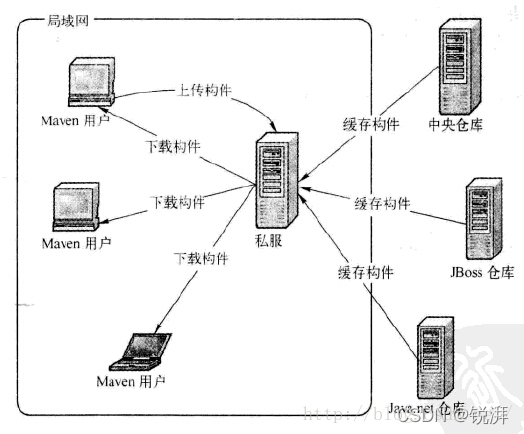

## 1 概述
> 参考文档 http://heavy_code_industry.gitee.io/code_heavy_industry/pro002-maven/chapter10/verse02.html
### 应用场景


在项目开发中用到的三大仓库说明
* git仓库：源码的版本管理和仓库。代码管理。
* maven仓库：源码中第三方包的管理和版本控制。依赖管理。
* docker仓库：基础镜像仓库的管理。镜像管理。



### nexus私服
企业可以创建内部的公用仓库

* nexus是一个强大的maven仓库管理器,它极大的简化了本地内部仓库的维护和外部仓库的访问.
* nexus是一套开箱即用的系统不需要数据库,它使用文件系统加Lucene来组织数据
* nexus使用ExtJS来开发界面,利用Restlet来提供完整的REST APIs,通过IDEA和Eclipse集成使用
* nexus支持webDAV与LDAP安全身份认证.
* nexus提供了强大的仓库管理功能,构件搜索功能,它基于REST,友好的UI是一个extjs的REST客户端,占用较少的内存,基于简单文件系统而非数据库.


### 基本概念

Maven 是一个项目管理工具，可以对 Java 项目进行构建、依赖管理。Maven利用一个中央信息片断能管理一个项目的构建、报告和文档等步骤。


* 项目对象模型POM：，xml文件，项目基本信息，描述项目构建过程，声明项目依赖。
* 构件：任何一个依赖、插件或者项目构建输出，都可以称之为构件。
* 插件Plugin：maven是依赖插件完成任务的，项目管理工具。
* 仓库Repository：maven仓库能够帮我们管理构件

### 基本作用

1. **项目构建**。提供标准的跨平台的项目构建方法。
2. **依赖管理**。方便快捷地管理项目依赖的资源，避免资源间的版本冲突。
   1. 打java包或者war包
3. **统一开发结构**。提供标准的、统一的项目结构。

### 基本原理


## 2 maven相关概念

### POM项目对象模型
项目对象模型（Project Object Management,POM）是一种模型化思想。与DOM、BOM等文档对象模型、浏览器对象模型类似。POM将工程抽象为一个模型，用程序中的对象来描述这个模型，实现项目的管理。

POM的理念集中体现在POM.xml文件中，pom.xml是maven的核心配置文件


### 仓库
* 本地仓库：在本地维护的maven的仓库。
* 远程仓库：不在电脑上的。
  * 中央仓库：maven维护的服务器上的仓库。
  * 私服仓库：在局域网内维护的仓库。一方面是快，小范围内进行共享的资源。


### 坐标
坐标的组成。坐标也是仓库中存放包的路径。
* groupId:定义当前maven项目所属的组织名称，域名反写
* artifactId:定义当前maven项目的名称。通常是模块名字
* version:定义当前版本号。
  * SNAPSHOT 快照版本
  * RLEASE 发行版本

> packaging 能够规定打包方式。例如可以打包成jar/war

使用唯一标识。定位资源的位置。

### 镜像

* 在maven目录conf下的setting.xml中可以配置全局镜像mirrors
* 在.m2目录下的setting.xml中可以配置用户镜像mirrors


## 3 Maven项目构建


### 约定的工程目录结构

```
工程-项目-src源代码+target编译结果-main+test-java+resource-groupId-fileID
```

1. 最顶层是工程，次顶层是模块或项目，可以自行编译执行的模块或项目。模块或项目下有src和target目录，即源代码和编译生成的代码。


2. 在src同层目录下创建pom.xml。即模块或项目的顶层目录下使用pom.xml进行配置。

```xml
<?xml version="1.0" encoding="UTF-8"?>
<project xmlns="http://maven.apache.org/POM/4.0.0"
         xmlns:xsi="http://www.w3.org/2001/XMLSchema-instance"
         xsi:schemaLocation="http://maven.apache.org/POM/4.0.0 http://maven.apache.org/xsd/maven-4.0.0.xsd">
    <modelVersion>4.0.0</modelVersion>

    <groupId>com.ykl</groupId>
    <artifactId>project-maven</artifactId>
    <version>1.0.2</version>

    <packaging>jar</packaging>
    <dependencies>
        <dependency>
            <groupId>junit</groupId>
            <artifactId>junit</artifactId>
            <version>4.12</version>
        </dependency>
    </dependencies>
</project>
```
> 约定大于配置，配置大于编码。为了简化，不断进行抽象。

### maven命令
maven命令必须在pom文件所在的目录执行。

* mvn compile 下载插件、下载依赖、编译项目的源代码、将编译后的代码放到target目录下。
* mvn test-compile 编译test文件夹下的类
* mvn clean 删除target目录，即本项目编译生成的文件。
* mvn test 下载对应插件，编译后，运行Test目录下的测试脚本。
* mvn package 首先进行compile，然后进行test，最后打包程序。 
* mvn install 把打包好的jar包放到仓库里。一次运行compile/test/package命令，最后将jar包安装到本地仓库中。


### maven创建工程
maven提供了工程创建的命令
1. 创建一个java工程
```shell
mvn archetype:generate -DgroupId=com.demo -DartifactId=javaproject -DarchetypeArtifactId=maven-archetype-quickstart -Dversion=0.0.1-snapshot -DinteractiveMode=false
```
2. 创建一个web工程

```
mvn archetype:generate -DgroupId=com.demo -DartifactId=webproject -DarchetypeArtifactId=maven-archetype-webapp -Dversion=0.0.1-snapshot -DinteractiveMode=false
```


### idea创建maven工程

1. 需要自己指定源代码、测试代码、源代码资源文件和测试资源文件。
2. 可以在idea中自动创建启动参数。edit configuration
3. 使用原型创建Maven模块。选择不同的Maven原型文件。
4. 直接在web中添加tomcat插件，即可在本地展示网站。

## maven简介

> 纯java开源项目。**项目管理工具**，对java项目进行构建、依赖管理。也可以用于构建和管理其他项目（c#,Ruby,Scala)

> 在上一次做handoop mapreduce的时候，发现了pom文件，然后配置了maven，作为maven工程打开过。但是具体的过程，为啥忘得一干二净，只记得自己曾经对maven的setting文件进行修改，那个时候应该还创建了本地库。但是完全记不清了。

## 4 maven主要功能

* 项目构建
* 依赖管理
* 项目管理
  * 文档生成
  * 报告
  * SCMs
  * 发布
  * 分发
  * 邮件列表


### maven项目目录结构
| 目录|	目的|
|-|-|
| ${basedir}	|存放pom.xml和所有的子目录|
| ${basedir}/src/main/java	|项目的java源代码|
| ${basedir}/src/main/resources	|项目的资源，比如说property文件，springmvc.xml|
| ${basedir}/src/test/java	|项目的测试类，比如说Junit代码|
| ${basedir}/src/test/resources	|测试用的资源|
| ${basedir}/src/main/webapp/WEB-INF	|web应用文件目录，web项目的信息，比如存放web.xml、本地图片、jsp视图页面|
| ${basedir}/target	|打包输出目录|
| ${basedir}/target/classes	|编译输出目录|
| ${basedir}/target/test-classes	|测试编译输出目录|
| Test.java	|Maven只会自动运行符合该命名规则的测试类|
| ~/.m2/repository	|Maven默认的本地仓库目录位置|


### maven项目的优势
* 基于模型的构建 − Maven能够将任意数量的项目构建到预定义的输出类型中，如 JAR，WAR 或基于项目元数据的分发，而不需要在大多数情况下执行任何脚本。
* 项目信息的一致性站点 − 使用与构建过程相同的元数据，Maven 能够生成一个网站或PDF，包括您要添加的任何文档，并添加到关于项目开发状态的标准报告中。
* 发布管理和发布单独的输出 − Maven 将不需要额外的配置，就可以与源代码管理系统（如 Subversion 或 Git）集成，并可以基于某个标签管理项目的发布。它也可以将其发布到分发位置供其他项目使用。Maven 能够发布单独的输出，如 JAR，包含其他依赖和文档的归档，或者作为源代码发布。
* 向后兼容性 − 您可以很轻松的从旧版本 Maven 的多个模块移植到 Maven 3 中。
* 子项目使用父项目依赖时，正常情况子项目应该继承父项目依赖，无需使用版本号
* 并行构建 − 编译的速度能普遍提高20 - 50 %。
* 更好的错误报告 − Maven 改进了错误报告，它为您提供了 Maven wiki 页面的链接，您可以点击链接查看错误的完整描述。
