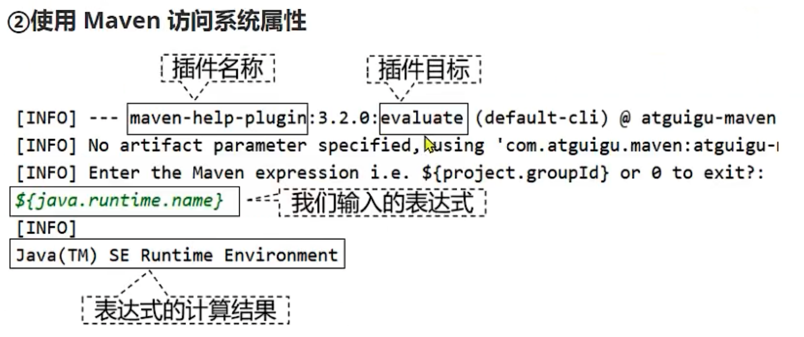
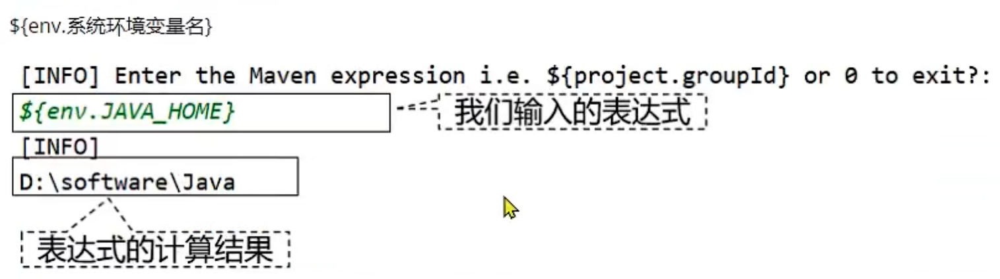
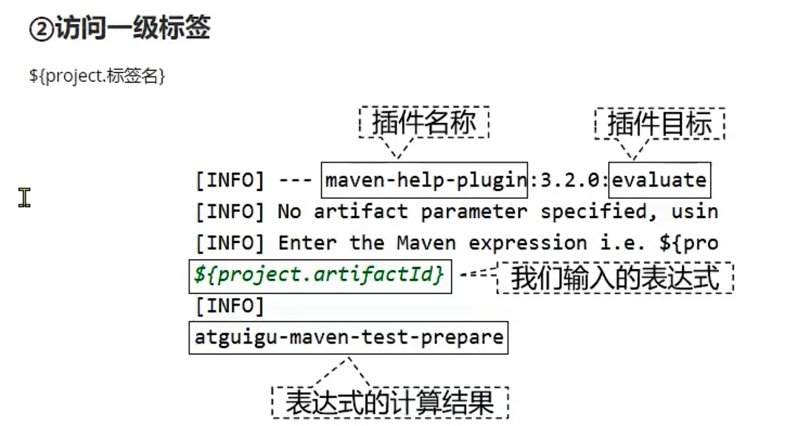
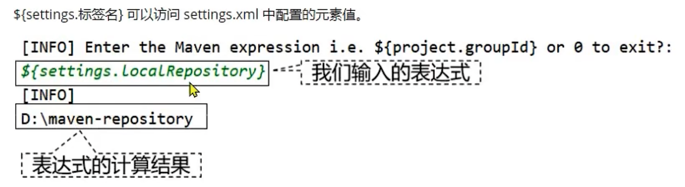

# 属性的生命与使用


## 1 自定义maven属性值

### 创建属性值
```
  <properties>
    <com.ykl.hello>temp</com.ykl.hello>
    <com.ykl.world>world</com.ykl.world>
  </properties>
```

### 查看属性值
```
mvn help:evaluate
```

### 访问属性值

```
${a.b}
```

## 2 maven中的其他属性

### maven访问的系统属性


这里的系统属性指的是Java虚拟机中定义的变量。

```java
Properties properties = System.getProperties();

Set<Object> properitesSet = properties.keySet();

for (Object propName :propertiesSet){
    String propValue = properties.getProperty((String)propName);
    System.out.println(propName + ": " + propValue);
}
```

得到如下的结果

```shell
java.runtime.name: Java(TM) SE Runtime Environment
sun.boot.library.path: /Library/Java/JavaVirtualMachines/jdk1.8.0_291.jdk/Contents/Home/jre/lib
java.vm.version: 25.291-b10
gopherProxySet: false
java.vm.vendor: Oracle Corporation
java.vendor.url: http://java.oracle.com/
path.separator: :
java.vm.name: Java HotSpot(TM) 64-Bit Server VM
file.encoding.pkg: sun.io
user.country: CN
sun.java.launcher: SUN_STANDARD
sun.os.patch.level: unknown
java.vm.specification.name: Java Virtual Machine Specification
user.dir: /Users/yinkanglong/work/notes/maven/maven源码/project01-maven-java/target/classes
java.runtime.version: 1.8.0_291-b10
java.awt.graphicsenv: sun.awt.CGraphicsEnvironment
java.endorsed.dirs: /Library/Java/JavaVirtualMachines/jdk1.8.0_291.jdk/Contents/Home/jre/lib/endorsed
os.arch: x86_64
java.io.tmpdir: /var/folders/w5/xwpp23dd6qxfb4b8kw2512nr0000gp/T/
line.separator: 

java.vm.specification.vendor: Oracle Corporation
os.name: Mac OS X
sun.jnu.encoding: UTF-8
java.library.path: /Users/yinkanglong/Library/Java/Extensions:/Library/Java/Extensions:/Network/Library/Java/Extensions:/System/Library/Java/Extensions:/usr/lib/java:.
java.specification.name: Java Platform API Specification
java.class.version: 52.0
sun.management.compiler: HotSpot 64-Bit Tiered Compilers
os.version: 10.16
user.home: /Users/yinkanglong
user.timezone: 
java.awt.printerjob: sun.lwawt.macosx.CPrinterJob
file.encoding: UTF-8
java.specification.version: 1.8
java.class.path: .
user.name: yinkanglong
java.vm.specification.version: 1.8
sun.java.command: com.ykl.App
java.home: /Library/Java/JavaVirtualMachines/jdk1.8.0_291.jdk/Contents/Home/jre
sun.arch.data.model: 64
user.language: zh
java.specification.vendor: Oracle Corporation
awt.toolkit: sun.lwawt.macosx.LWCToolkit
java.vm.info: mixed mode
java.version: 1.8.0_291
java.ext.dirs: /Users/yinkanglong/Library/Java/Extensions:/Library/Java/JavaVirtualMachines/jdk1.8.0_291.jdk/Contents/Home/jre/lib/ext:/Library/Java/Extensions:/Network/Library/Java/Extensions:/System/Library/Java/Extensions:/usr/lib/java
sun.boot.class.path: /Library/Java/JavaVirtualMachines/jdk1.8.0_291.jdk/Contents/Home/jre/lib/resources.jar:/Library/Java/JavaVirtualMachines/jdk1.8.0_291.jdk/Contents/Home/jre/lib/rt.jar:/Library/Java/JavaVirtualMachines/jdk1.8.0_291.jdk/Contents/Home/jre/lib/sunrsasign.jar:/Library/Java/JavaVirtualMachines/jdk1.8.0_291.jdk/Contents/Home/jre/lib/jsse.jar:/Library/Java/JavaVirtualMachines/jdk1.8.0_291.jdk/Contents/Home/jre/lib/jce.jar:/Library/Java/JavaVirtualMachines/jdk1.8.0_291.jdk/Contents/Home/jre/lib/charsets.jar:/Library/Java/JavaVirtualMachines/jdk1.8.0_291.jdk/Contents/Home/jre/lib/jfr.jar:/Library/Java/JavaVirtualMachines/jdk1.8.0_291.jdk/Contents/Home/jre/classes
java.vendor: Oracle Corporation
file.separator: /
java.vendor.url.bug: http://bugreport.sun.com/bugreport/
sun.io.unicode.encoding: UnicodeBig
sun.cpu.endian: little
sun.cpu.isalist: 
```

### maven能够访问的系统环境变量
使用env前缀能够访问系统环境变量

这里的系统环境变量指的是操作系统env中当前定义的变量
通过`${env.JAVA_HOME}`实现。
```
[INFO] Enter the Maven expression i.e. ${project.groupId} or 0 to exit?:
${env.JAVA_HOME}
[INFO] 
/Library/Java/JavaVirtualMachines/jdk1.8.0_291.jdk/Contents/Home
```


### maven 能够访问POM标签
使用 project前缀可以访问POM标签



使用表达式`${project.xxx}`可以访问当前POM中定义的元素值。也就是POM中配置的任何元素都可以用属性值进行访问解析。

```
[INFO] Enter the Maven expression i.e. ${project.groupId} or 0 to exit?:
${project.groupId}   
[INFO] 
org.apache.maven
```

### maven能够访问settings全局配置


使用settings前缀访问settingsxml中配置文件

```xml
[INFO] Enter the Maven expression i.e. ${project.groupId} or 0 to exit?:
${settings.localRepository}
[INFO] 
/Users/yinkanglong/.m2/repository
```


## 3 maven属性的用途

在当前的pom.xml文件中引用属性

资源过滤功能：在非maven配置文件中引用属性，由于maven在处理资源师将引用属性的表达式替换为属性值。

针对不同环境的profile一般不常用，一般是在框架中做的。

