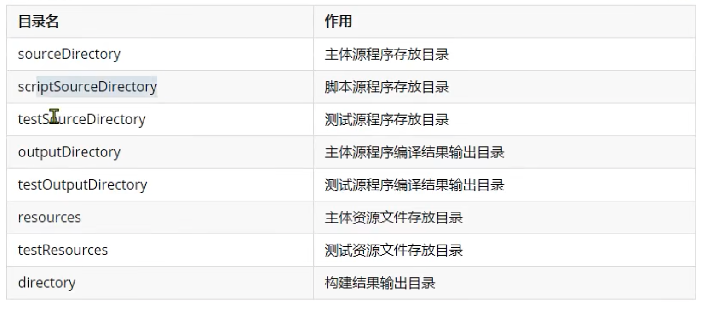
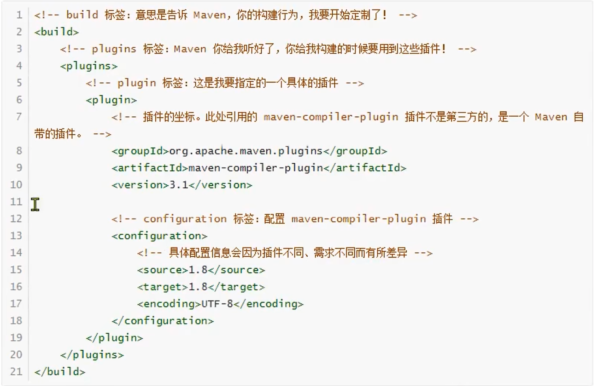
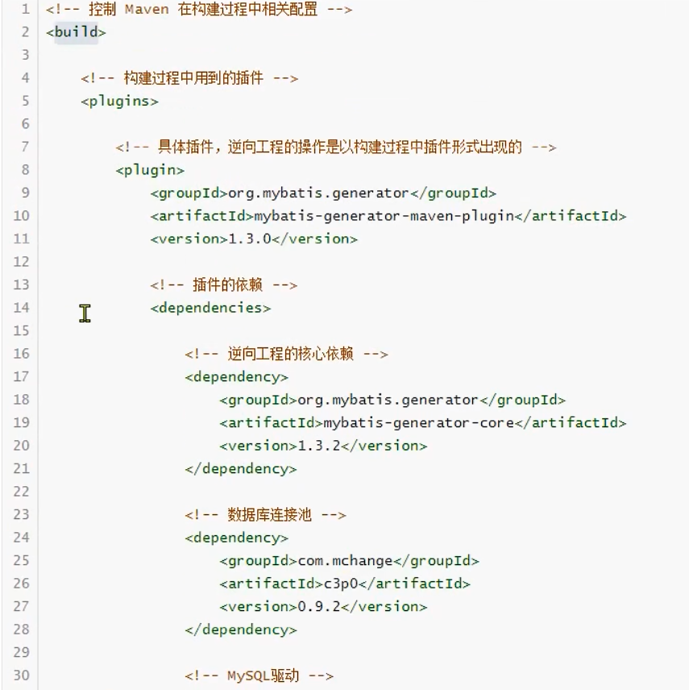
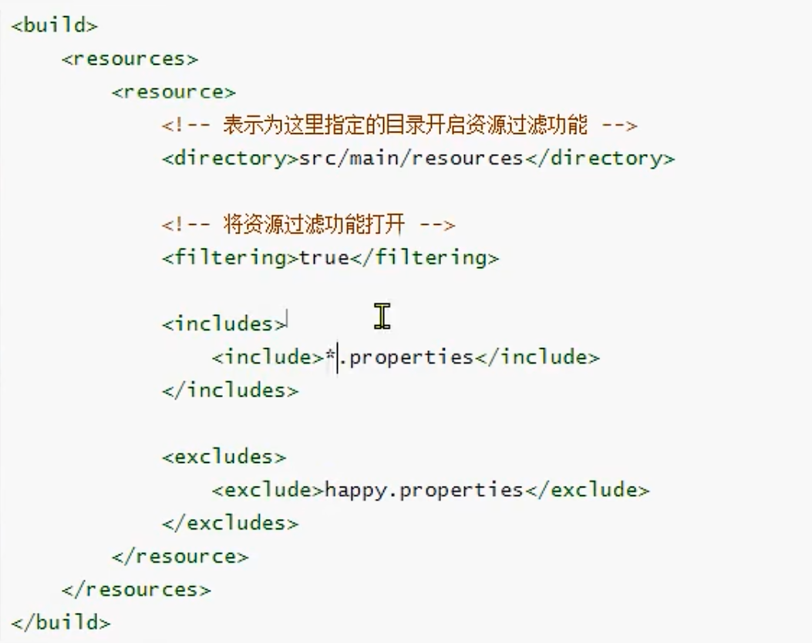

## 1 概述

本质上配置的Build标签是对超级POM配置的Build标签的叠加。（猜想 sofaboot的目录结构也是通过build标签定义了约定的目录结构。）


## 2 作用
### 配置约定的目录结构Dir


```
   <build>
      <sourceDirectory>/Users/yinkanglong/work/notes/maven/maven源码/project03-maven-test/src/main/java</sourceDirectory>
      <scriptSourceDirectory>/Users/yinkanglong/work/notes/maven/maven源码/project03-maven-test/src/main/scripts</scriptSourceDirectory>
      <testSourceDirectory>/Users/yinkanglong/work/notes/maven/maven源码/project03-maven-test/src/test/java</testSourceDirectory>
      <outputDirectory>/Users/yinkanglong/work/notes/maven/maven源码/project03-maven-test/target/classes</outputDirectory>
      <testOutputDirectory>/Users/yinkanglong/work/notes/maven/maven源码/project03-maven-test/target/test-classes</testOutputDirectory>
      <resources>
        <resource>
          <directory>/Users/yinkanglong/work/notes/maven/maven源码/project03-maven-test/src/main/resources</directory>
        </resource>
      </resources>
      <testResources>
        <testResource>
          <directory>/Users/yinkanglong/work/notes/maven/maven源码/project03-maven-test/src/test/resources</directory>
        </testResource>
      </testResources>
      <directory>/Users/yinkanglong/work/notes/maven/maven源码/project03-maven-test/target</directory>
      <finalName>project03-maven-test-0.0.1-snapshot</finalName>
      
```

### 备用插件管理pluginManagement

pluginManagement标签存放着多个插件

* maven-antrun-plugin
* maven-assembly-plugin
* mavne-dependency-plugin
* maven-release-plugin

通过pluginMangement标签管理起来的插件，和dependencyManagement一样。子工程使用时可以忽略版本号，在父工程中统一管理版本。父子工程仍旧能够起到版本管理的作用。

* spring-boot-dependencies管理的插件信息
```
<build>
    <pluginManagement>
      <plugins>
        <plugin>
          <groupId>org.codehaus.mojo</groupId>
          <artifactId>build-helper-maven-plugin</artifactId>
          <version>${build-helper-maven-plugin.version}</version>
        </plugin>
        <plugin>
          <groupId>org.flywaydb</groupId>
          <artifactId>flyway-maven-plugin</artifactId>
          <version>${flyway.version}</version>
        </plugin>
        <plugin>
          <groupId>pl.project13.maven</groupId>
          <artifactId>git-commit-id-plugin</artifactId>
          <version>${git-commit-id-plugin.version}</version>
        </plugin>
        <plugin> 
```

### 生命周期插件plugins

plugins 标签存放的是默认生命周期中实际会用到的插件。这是正式使用的插件。正如dependencyManagement一样，是备用的依赖。

* 是execution不是exculusion

```xml
  <build>
    <plugins>
      <plugin>
        <artifactId>maven-clean-plugin</artifactId>
        <version>3.1.0</version>
        <executions>
          <execution>
            <id>default-clean</id>
            <phase>clean</phase>
            <goals>
              <goal>clean</goal>
            </goals>
          </execution>
        </executions>
      </plugin>
      <plugin>
        <artifactId>maven-install-plugin</artifactId>
        <version>2.5.2</version>
        <executions>
          <execution>
            <id>default-install</id>
            <phase>install</phase>
            <goals>
              <goal>install</goal>
            </goals>
          </execution>
        </executions>
      </plugin>
      <plugin>
        <artifactId>maven-deploy-plugin</artifactId>
        <version>2.8.2</version>
        <executions>
          <execution>
            <id>default-deploy</id>
            <phase>deploy</phase>
            <goals>
              <goal>deploy</goal>
            </goals>
          </execution>
        </executions>
      </plugin>
      <plugin>
        <artifactId>maven-site-plugin</artifactId>
        <version>3.3</version>
        <executions>
          <execution>
            <id>default-site</id>
            <phase>site</phase>
            <goals>
              <goal>site</goal>
            </goals>
            <configuration>
              <outputDirectory>/Users/yinkanglong/work/notes/maven/maven源码/project03-maven-test/target/site</outputDirectory>
              <reportPlugins>
                <reportPlugin>
                  <groupId>org.apache.maven.plugins</groupId>
                  <artifactId>maven-project-info-reports-plugin</artifactId>
                </reportPlugin>
              </reportPlugins>
            </configuration>
          </execution>
          <execution>
            <id>default-deploy</id>
            <phase>site-deploy</phase>
            <goals>
              <goal>deploy</goal>
            </goals>
            <configuration>
              <outputDirectory>/Users/yinkanglong/work/notes/maven/maven源码/project03-maven-test/target/site</outputDirectory>
              <reportPlugins>
                <reportPlugin>
                  <groupId>org.apache.maven.plugins</groupId>
                  <artifactId>maven-project-info-reports-plugin</artifactId>
                </reportPlugin>
              </reportPlugins>
            </configuration>
          </execution>
        </executions>
        <configuration>
          <outputDirectory>/Users/yinkanglong/work/notes/maven/maven源码/project03-maven-test/target/site</outputDirectory>
          <reportPlugins>
            <reportPlugin>
              <groupId>org.apache.maven.plugins</groupId>
              <artifactId>maven-project-info-reports-plugin</artifactId>
            </reportPlugin>
          </reportPlugins>
        </configuration>
      </plugin>
    </plugins>
  </build>
```

## 3 典型应用

### source标签和target标签
* Idea读取的是maven的settings.xml种jdk的版本进行编译的执行。
* 在settings.xml中的profile配置的jdk版本，注释掉。则IDEA无法正常调用指定版本的jdk编译器，编译程序。
* 在plugins能够通过指定jdk的版本，实现当前步骤的正常编译。
  * source的配置就是指定的版本。java编译的时候的source参数
  * target是调用编译器时指定的。java编译的时候target参数。




* 在settings.xml中配置jdk版本：尽在本地剩下，如果驼鹿当前settings。xml能够覆盖的范围，则无法生效
* 在当前maven工程的pom.xml种配置：无论在哪个环境执行编译等构建操作都有效。


### springboot定制化打包

* Spring-boot-maven-plugin，用来改变maven默认的构建行为。具体来说就是改变打包的行为。
  * 默认情况下maven调用maven-jar-plugin插件的jar目标，生成普通的jar
  * 普通jar没办法通过java -jar xxx.jar命令启动运行，
  * 但是Springboot的设计理念就是每一个微服务导出一个jar包。这个jar包可以使用jar -jar命令直接启动。例如需要web的时候，就需要讲tomcat等插件打包到一起。
* 使用方式，配置Spring-boot-maven-plugin插件。即可使用springboot的打包方式进行打包。

```xml
<build>
  <plugins>
    <plugin>
      <groupId>org.springframework.boot</groupId>
        <artifactId>spring-boot-maven-plugin</artifactId>
        <version>2.6.2</version>
    </plugin>
  </plugins>
</build>
```

插件提供了6个maven goal

* build-info：生成项目的构建信息文件 build-info.properties
* help：用于展示spring-boot-maven-plugin的帮助信息。使用命令行mvn spring-boot:help -Ddetail=true -Dgoal=<goal-name>可展示goal的参数描述信息。
* repackage：可生成可执行的jar包或war包。插件的核心goal。
* run：运行 Spring Boot 应用
* start：在集成测试阶段，控制生命周期
* stop：在集成测试阶段，控制生命周期


### mybatis的逆向工程

插件也可以有自己的依赖。




### resources

resource可以配置资源过滤

* directory指定资源过滤的目录
* filtering是否打开资源过滤
* include 包含资源过滤的文件
* exclude 排除资源过滤的文件。不会被打包的target目标文件夹当中。




## 总结

maven的POM中的一些内容。