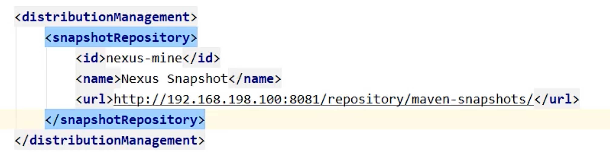
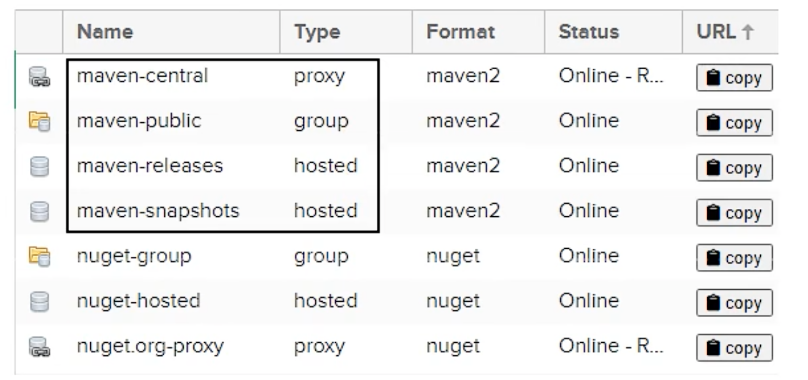
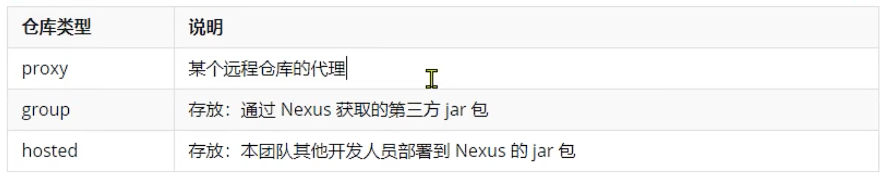
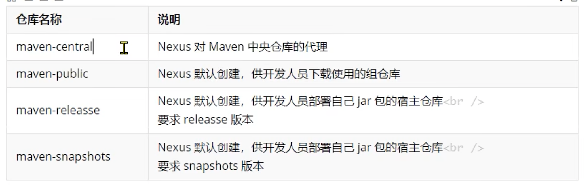

用于快速的模块化的版本迭代。


## 1 步骤

1. 下载nexus的执行程序。也可以直接下载nexus的docker，然后运行。


2. 运行启动nexus执行程序，并查看nexus占用的端口号。
```
netstat anl |grep nexus
```

3. 然后登录nexus服务器的管理端。


4. 复制黏贴自己的私服地址和用户名密码到settings.xml当中。


5. 配置当前工程pom中的distributionManagement


6. 执行部署。默认情况下，mvn deploy会不数到上述配置中的仓库里。


7. 使用别人部署的jar。必须配置别人部署的nexus仓库。


## 2 概述

nexus仓库的仓库



nexus仓库的类型



nexus仓库的名称




## 3 实验实践


