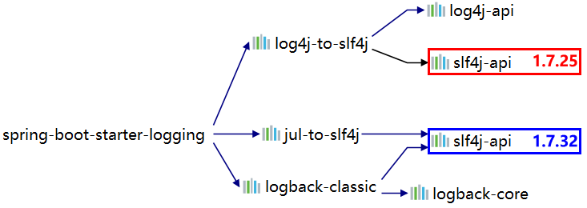
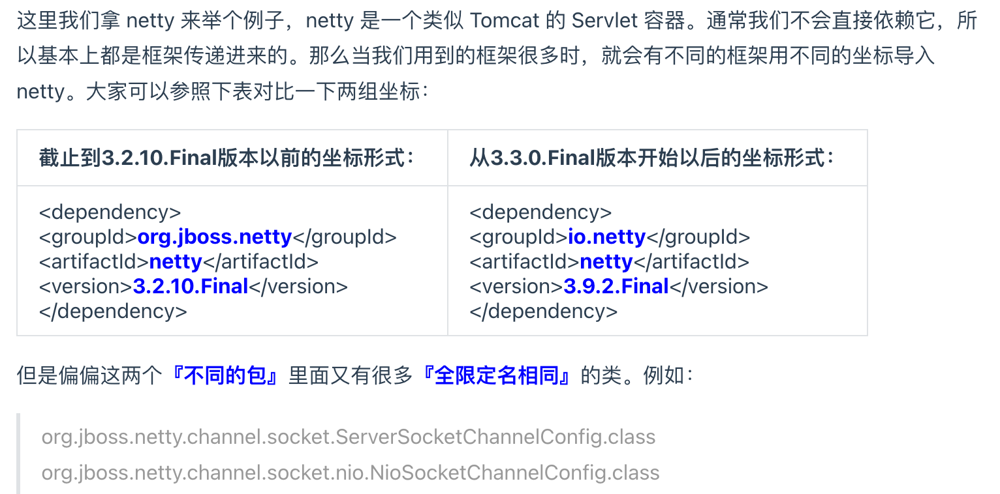
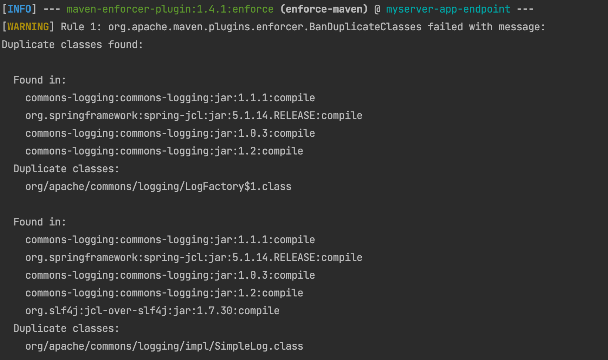

# jar包冲突问题

## 1 解决依赖冲突

### 冲突的引入
1. 编订依赖列表的时候需要解决依赖冲突
2. 在引入多个jar包时产生了冲突

### 冲突的本质
* 统一jar包，不同版本（名称不一样，版本仲裁机制无法生效，导入了多个包，或者仲裁的包错误）

* 不同jar包包含同类名（全限定名相同的类）



## 2 表现形式

表现形式：整个错误信息全部是框架、第三方工具包中的类报错，往往就是jar包的问题引起的。并且maven的版本仲裁机制无法生效的情况下。

### 抛异常：找不到类

* java.lang.ClassNotFoundException:编译过程找不到类
* java.lang.NoClassDefFoundError：运行过程找不到类
* java.lang.LinkageError：不同类加载器分别加在的多个类具有相同的全类名。

### 抛异常找不到哦啊方法
* java.lang.NoSuchMethodException:反射过程找不到类。
  * 经过仲裁选中了版本，但是显示包中没有该版本的方法。

### 没有报错单结果不对
* 两个 jar 包中的类分别实现了同一个接口，这本来是很正常的。但是问题在于：由于没有注意命名规范，两个不同实现类恰巧是同一个名字。
  * 具体例子是有的同学在实际工作中遇到过：项目中部分模块使用 log4j 打印日志；其它模块使用 logback，编译运行都不会冲突，但是会引起日志服务降级，让你的 log 配置文件失效。比如：你指定了 error 级别输出，但是冲突就会导致 info、debug 都在输出。


## 解决方法

1. 找到冲突的jar包。
2. 把彼此冲突的jar包解决掉。
   1. exclusions排除
   2. 明确声明依赖。


### IDEA中找到依赖冲突

在IDEA中安装maven helper插件。基于pom.xml的依赖冲突分析。能够分析冲突的版本，但不能分析冲突的全类名。
* 在POM文件下有Analyzer标签。打开可以看到依赖列表、冲突列表。查找所有依赖、展开依赖列表等。

也可以使用idea自带的maven功能，也能自动分析maven工程，查看依赖树和查找依赖包。


### maven的enforcer插件

检测同一个jar包的不同版本和不同jar包中的同类名。

1. 配置build enforcer插件

```xml
<build>
    <pluginManagement>
        <plugins>
            <plugin>
                <groupId>org.apache.maven.plugins</groupId>
                <artifactId>maven-enforcer-plugin</artifactId>
                <version>1.4.1</version>
                <executions>
                    <execution>
                        <id>enforce-dependencies</id>
                        <phase>validate</phase>
                        <goals>
                            <goal>display-info</goal>
                            <goal>enforce</goal>
                        </goals>
                    </execution>
                </executions>
                <dependencies>
                    <dependency>
                        <groupId>org.codehaus.mojo</groupId>
                        <artifactId>extra-enforcer-rules</artifactId>
                        <version>1.0-beta-4</version>
                    </dependency>
                </dependencies>
                <configuration>
                    <rules>
                        <banDuplicateClasses>
                            <findAllDuplicates>true</findAllDuplicates>
                        </banDuplicateClasses>
                    </rules>
                </configuration>
            </plugin>
        </plugins>
    </pluginManagement>
</build>
```
2. 执行冲突分析命令
```
<build>
        <plugins>
            <plugin>
                <groupId>org.apache.maven.plugins</groupId>
                <artifactId>maven-enforcer-plugin</artifactId>
                <version>1.4.1</version>
                <executions>
                    <execution>
                        <id>enforce-dependencies</id>
                        <phase>validate</phase>
                        <goals>
                            <goal>display-info</goal>
                            <goal>enforce</goal>
                        </goals>
                    </execution>
                </executions>
                <dependencies>
                    <dependency>
                        <groupId>org.codehaus.mojo</groupId>
                        <artifactId>extra-enforcer-rules</artifactId>
                        <version>1.0-beta-4</version>
                    </dependency>
                </dependencies>
                <configuration>
                    <rules>
                        <banDuplicateClasses>
                            <findAllDuplicates>true</findAllDuplicates>
                        </banDuplicateClasses>
                    </rules>
                </configuration>
            </plugin>
        </plugins>
</build>
```

3. 查看并分析冲突的内容


