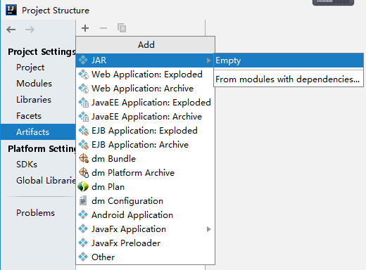
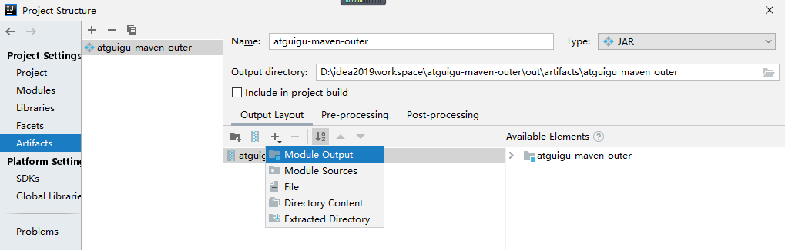

## 1 概述


### 提出问题

而实际开发中确实有可能用到一些 jar 包并非是用 Maven 的方式发布，那自然也没法通过 Maven 导入。

此时如果我们能够拿到该 jar 包的源码那还可以自己建一个 Maven 工程，自己打包。

## 2 手动打包一个可执行文件

1. 生成.class 文件。利用javac命令进行编译
```sh
➜  src git:(master) ✗ javac com/ykl/Main.java -d ./out/
➜  src git:(master) ✗ ls
com out
```

2. 编写manifest文件。manifest文件命名和格式按照要求，可以少写几个参数。

```
➜  out git:(master) ✗ cat MANIFEST.MF 
Manifest-Version: 1.0
Main-Class: com.ykl.Main
```


3. jar打包文件。jar命令在工作目录下执行。out/目录下打包所有内容。如果没有主类，则使用jar -cvf。 如果有主类则使用jar -cvfm

```
➜  out git:(master) ✗ jar -cvfm hello.jar *
已添加清单
正在添加: com/(输入 = 0) (输出 = 0)(存储了 0%)
正在添加: com/ykl/(输入 = 0) (输出 = 0)(存储了 0%)
正在添加: com/ykl/MANIFEST.MF(输入 = 48) (输出 = 48)(压缩了 0%)
正在添加: com/ykl/hello.jar(输入 = 3072) (输出 = 474)(压缩了 84%)
正在添加: com/ykl/Main.class(输入 = 422) (输出 = 293)(压缩了 30%)
```

4. 执行文件

```
➜  out git:(master) ✗ java -jar hello.jar   
hello world!
```

## 3 使用IDEA打包一个可执行文件

1. 创建一个Java工程


2. 配置artifacts，打包成jar。project structure -> artifact -> moudule import。利用IDEA自动打包过程会添加MANIFEST.MF 文件到打包文件中。






## 4 导入一个非maven的jar包。

1. 将jar包安装到maven仓库中。install

```java
mvn install:install-file -Dfile=./hello.jar \
-DgroupId=com.ykl \
-DartifactId=java-main-project \
-Dversion=1 \
-Dpackaging=jar
```

```
➜  out git:(master) ✗ mvn install:install-file -Dfile=./hello.jar \
-DgroupId=com.ykl \
-DartifactId=java-main-project \
-Dversion=1 \
-Dpackaging=jar
[INFO] Scanning for projects...
[INFO] 
[INFO] ------------------< org.apache.maven:standalone-pom >-------------------
[INFO] Building Maven Stub Project (No POM) 1
[INFO] --------------------------------[ pom ]---------------------------------
[INFO] 
[INFO] --- maven-install-plugin:2.4:install-file (default-cli) @ standalone-pom ---
[INFO] Installing /Users/yinkanglong/work/notes/maven/maven源码/project04-maven-import/purejavamoudle/src/out/hello.jar to /Users/yinkanglong/.m2/repository/com/ykl/java-main-project/1/java-main-project-1.jar
[INFO] Installing /var/folders/w5/xwpp23dd6qxfb4b8kw2512nr0000gp/T/mvninstall3747814679268417305.pom to /Users/yinkanglong/.m2/repository/com/ykl/java-main-project/1/java-main-project-1.pom
[INFO] ------------------------------------------------------------------------
[INFO] BUILD SUCCESS
[INFO] ------------------------------------------------------------------------
[INFO] Total time:  0.379 s
[INFO] Finished at: 2022-11-07T14:07:10+08:00
[INFO] ------------------------------------------------------------------------
```

2. 查看maven仓库中的jar包


3. 引入自定义安装的jar包

```xml
    <dependency>
      <groupId>com.ykl</groupId>
      <artifactId>java-main-project</artifactId>
      <version>1</version>
    </dependency>
```

4. 测试程序。创建这个方法，并运行成功。

```java
package com.ykl;
import com.ykl.Main;
/**
 * Hello world!
 *
 */
public class App 
{
    public static void main( String[] args )
    {
        Main.main( args );
    }
}
```