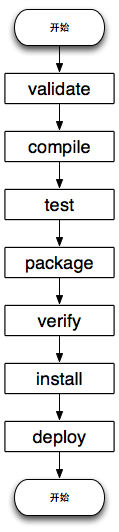

## 一个普通项目的生命周期

| 阶段	|处理	|描述|
|-|-|-|-|
| 验证 validate	|验证项目	|验证项目是否正确且所有必须信息是可用的|
| 编译 compile	|执行编译	|源代码编译在此阶段完成|
| 测试 Test	|测试	|使用适当的单元测试框架（例如JUnit）运行测试。|
| 包装 package	|打包	|创建JAR/WAR包如在 pom.xml 中定义提及的包|
| 检查 verify	|检查	|对集成测试的结果进行检查，以保证质量达标|
| 安装 install	|安装	|安装打包的项目到本地仓库，以供其他项目使用|
| 部署 deploy	|部署	|拷贝最终的工程包到远程仓库中，以共享给其他开发人员和工程|

## maven项目的三个生命周期

### clean生命周期：清理项目，包含三个phase。

1. pre-clean：执行清理前需要完成的工作
2. clean：清理上一次构建生成的文件
3. post-clean：执行清理后需要完成的工作

### default生命周期：构建项目，重要的phase如下。

1. validate：验证工程是否正确，所有需要的资源是否可用。
1. compile：编译项目的源代码。  
1. test：使用合适的单元测试框架来测试已编译的源代码。这些测试不需要已打包和布署。
1. Package：把已编译的代码打包成可发布的格式，比如jar。
1. integration-test：如有需要，将包处理和发布到一个能够进行集成测试的环境。
1. verify：运行所有检查，验证包是否有效且达到质量标准。
1. install：把包安装到maven本地仓库，可以被其他工程作为依赖来使用。
1. Deploy：在集成或者发布环境下执行，将最终版本的包拷贝到远程的repository，使得其他的开发者或者工程可以共享。

### site生命周期：建立和发布项目站点，phase如下

1. pre-site：生成项目站点之前需要完成的工作
2. site：生成项目站点文档
3. post-site：生成项目站点之后需要完成的工作
4. site-deploy：将项目站点发布到服务器