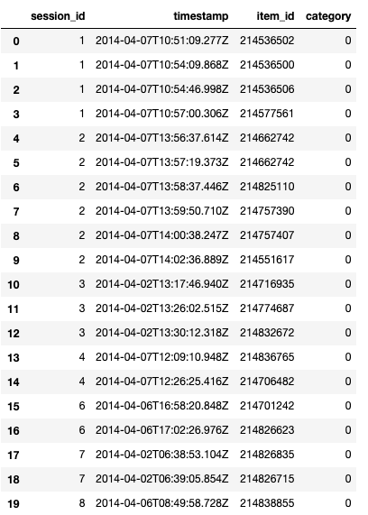

## 1 图分类示例

### 创建数据集
```

import torch
from torch_geometric.datasets import TUDataset

dataset = TUDataset('/home/ykl/TUDataset', name = 'MUTAG')

print()
print(f'Dataset: {dataset}:')
print('====================')
print(f'Number of graphs: {len(dataset)}')
print(f'Number of features: {dataset.num_features}')
print(f'Number of classes: {dataset.num_classes}')

data = dataset[0]  # Get the first graph object.

print()
print(data)
print('=============================================================')

# Gather some statistics about the first graph.
print(f'Number of nodes: {data.num_nodes}')
print(f'Number of edges: {data.num_edges}')
print(f'Average node degree: {data.num_edges / data.num_nodes:.2f}')
print(f'Has isolated nodes: {data.has_isolated_nodes()}')
print(f'Has self-loops: {data.has_self_loops()}')
print(f'Is undirected: {data.is_undirected()}')
```

### 划分测试集和训练集
```py
torch.manual_seed(12345)
dataset = dataset.shuffle()

train_dataset = dataset[:150]
test_dataset = dataset[150:]

print(f'Number of training graphs: {len(train_dataset)}')
print(f'Number of test graphs: {len(test_dataset)}')
```

###  加载数据集
```py
from torch_geometric.loader import DataLoader

train_loader = DataLoader(train_dataset, batch_size=64, shuffle=True)
test_loader = DataLoader(test_dataset, batch_size=64, shuffle=False)

for step, data in enumerate(train_loader):
    print(f'Step {step + 1}:')
    print('=======')
    print(f'Number of graphs in the current batch: {data.num_graphs}')
    print(data)
    print()
```

### 创建模型
```py
from torch.nn import Linear
import torch.nn.functional as F
from torch_geometric.nn import GCNConv
from torch_geometric.nn import global_mean_pool

class GCN(torch.nn.Module):
    def __init__(self, hidden_channels):
        super(GCN, self).__init__()
        torch.manual_seed(12345)
        self.conv1 = GCNConv(dataset.num_node_features, hidden_channels)
        self.conv2 = GCNConv(hidden_channels, hidden_channels)
        self.conv3 = GCNConv(hidden_channels, hidden_channels)
        self.lin = Linear(hidden_channels, dataset.num_classes)
        
    def forward(self, x, edge_index, batch):
        # 1. 获得节点嵌入
        x = self.conv1(x, edge_index)
        x = x.relu()
        x = self.conv2(x, edge_index)
        x = x.relu()
        x = self.conv3(x, edge_index)
        
        # 2. Readout layer
        x = global_mean_pool(x, batch)   # [batch_size, hidden_channels]
        
        # 3. 分类器
        x = F.dropout(x, p=0.5, training=self.training)
        x = self.lin(x)
        
        return x

model = GCN(hidden_channels=64)
print(model)
```
### 开始训练
```py
model = GCN(hidden_channels=64)
optimizer = torch.optim.Adam(model.parameters(), lr=0.01)
criterion = torch.nn.CrossEntropyLoss()

def train():
    model.train()
    
    for data in train_loader:
        optimizer.zero_grad()
        
        out = model(data.x, data.edge_index, data.batch)
        loss = criterion(out, data.y)

        loss.backward()
        optimizer.step()

def test(loader):
    model.eval()
    
    correct = 0
    for data in loader:                            # 批遍历测试集数据集。
        out = model(data.x, data.edge_index, data.batch) # 一次前向传播
        pred = out.argmax(dim=1)                         # 使用概率最高的类别
        correct += int((pred == data.y).sum())           # 检查真实标签
    return correct / len(loader.dataset)

for epoch in range(1, 121):
    train()
    train_acc = test(train_loader)
    test_acc = test(test_loader)
    print(f'Epoch: {epoch:03d}, Train Acc: {train_acc:.4f}, Test Acc: {test_acc:.4f}')
```


## 2 图节点分类实例


1. 增加自连接到邻接矩阵，即邻接矩阵的对角线元素为1，得到[公式];
2. 对节点的特征矩阵进行线性变换，将特征变换到维度D;
3. 使用函数​ [公式] 对节点特征进行规范化， 也就是乘以参数矩阵 [公式] 再乘以归一化的拉普拉斯矩阵;
4. 对邻居节点特征进行聚合操作，这里是求和；
5. 返回新的节点embedding


将卷积操作推广到不规则数据通常表示为邻域聚合（neighborhood aggregation）或消息传递（message passing）。在 PyTorch Geometric 中将各种图神经网络中的邻域聚合方法统一到一种消息传递网络的架构中。

```py
import torch
import torch.nn.functional as F
from torch_geometric.nn import GCNConv

#数据集加载
from torch_geometric.datasets import Planetoid
dataset = Planetoid(root='/home/ykl/Cora', name='Cora')

#网络定义
class Net(torch.nn.Module):
    def __init__(self):
        super(Net, self).__init__()
        self.conv1 = GCNConv(dataset.num_node_features, 16)
        self.conv2 = GCNConv(16, dataset.num_classes)

    def forward(self, data):
        x, edge_index = data.x, data.edge_index

        x = self.conv1(x, edge_index)
        x = F.relu(x)
        x = F.dropout(x, training=self.training)
        x = self.conv2(x, edge_index)

        return F.log_softmax(x, dim=1)

device = torch.device('cuda' if torch.cuda.is_available() else 'cpu')
model = Net().to(device)
data = dataset[0].to(device)
optimizer = torch.optim.Adam(model.parameters(), lr=0.01, weight_decay=5e-4)

#网络训练
model.train()
for epoch in range(200):
    optimizer.zero_grad()
    out = model(data)
    loss = F.nll_loss(out[data.train_mask], data.y[data.train_mask])
    loss.backward()
    optimizer.step()

#测试
model.eval()
_, pred = model(data).max(dim=1)
correct = float(pred[data.test_mask].eq(data.y[data.test_mask]).sum().item())
acc = correct / data.test_mask.sum().item()
print('Accuracy: {:.4f}'.format(acc))
```


## 3 自己创建数据集分类的实例

### 获取数据集
RecSys Challenge 2015 是一个挑战赛，主要目的是创建一个 session-based recommender system。主要任务有两个：

* 预测经过一系列的点击后，是否会产生购买行为。
* 预测购买的商品。





### 数据预处理


下载好数据后，我们先进行一些预处理：
```py
from sklearn.preprocessing import LabelEncoder

df = pd.read_csv('../input/yoochoose-click.dat', header=None)
df.columns=['session_id','timestamp','item_id','category']

buy_df = pd.read_csv('../input/yoochoose-buys.dat', header=None)
buy_df.columns=['session_id','timestamp','item_id','price','quantity']

item_encoder = LabelEncoder()
df['item_id'] = item_encoder.fit_transform(df.item_id)
df.head()
```

因为数据太多，我们随机进行取样以方便讲解：

```
#randomly sample a couple of them
sampled_session_id = np.random.choice(df.session_id.unique(), 1000000, replace=False)
df = df.loc[df.session_id.isin(sampled_session_id)]
df.nunique()
```

获取标签，即对于某个特定的 session，是否产生了购买行为，我们只需要检查文件 yoochoose-clicks.dat 中的 session_id 是否在文件 yoochoose-buys.dat 中出现即可：
```py
df['label'] = df.session_id.isin(buy_df.session_id)
df.head()
```


### 创建 Dataset


这里我们将预处理过的数据创建成为 Dataset 对象。对于每个 session，里面的每个商品（item）看作一个节点，因此每个 session 里所有的商品组成一个图。

我们将数据集按照 session_id 进行分组，分组过程中 item_id 也要被重新编码，因为对于每个图，每个节点的 index 应该从 0 开始

```py
import torch
from torch_geometric.data import InMemoryDataset
from tqdm import tqdm
 
class YooChooseBinaryDataset(InMemoryDataset):
    def __init__(self, root, transform=None, pre_transform=None):
        super(YooChooseBinaryDataset, self).__init__(root, transform, pre_transform)
        self.data, self.slices = torch.load(self.processed_paths[0])
 
    @property
    def raw_file_names(self):
        return []
    @property
    def processed_file_names(self):
        return ['../input/yoochoose_click_binary_1M_sess.dataset']
 
    def download(self):
        pass
    
    def process(self):
        
        data_list = []
 
        # process by session_id
        grouped = df.groupby('session_id')
        for session_id, group in tqdm(grouped):
            sess_item_id = LabelEncoder().fit_transform(group.item_id)
            group = group.reset_index(drop=True)
            group['sess_item_id'] = sess_item_id
            node_features = group.loc[group.session_id==session_id,['sess_item_id','item_id']].sort_values('sess_item_id').item_id.drop_duplicates().values
 
            node_features = torch.LongTensor(node_features).unsqueeze(1)
            target_nodes = group.sess_item_id.values[1:]
            source_nodes = group.sess_item_id.values[:-1]
 
            edge_index = torch.tensor([source_nodes, target_nodes], dtype=torch.long)
            x = node_features
 
            y = torch.FloatTensor([group.label.values[0]])
 
            data = Data(x=x, edge_index=edge_index, y=y)
            data_list.append(data)
        
        data, slices = self.collate(data_list)
        torch.save((data, slices), self.processed_paths[0])
```

然后我们对数据集进行随机排序，分成 training, validation 和 testing 三个子数据集：
```py
dataset = dataset.shuffle()
train_dataset = dataset[:800000]
val_dataset = dataset[800000:900000]
test_dataset = dataset[900000:]
len(train_dataset), len(val_dataset), len(test_dataset)
```

### 定义模型

```py
embed_dim = 128
from torch_geometric.nn import TopKPooling
from torch_geometric.nn import global_mean_pool as gap, global_max_pool as gmp
import torch.nn.functional as F
class Net(torch.nn.Module):
    def __init__(self):
        super(Net, self).__init__()
 
        self.conv1 = SAGEConv(embed_dim, 128)
        self.pool1 = TopKPooling(128, ratio=0.8)
        self.conv2 = SAGEConv(128, 128)
        self.pool2 = TopKPooling(128, ratio=0.8)
        self.conv3 = SAGEConv(128, 128)
        self.pool3 = TopKPooling(128, ratio=0.8)
        self.item_embedding = torch.nn.Embedding(num_embeddings=df.item_id.max() +1, embedding_dim=embed_dim)
        self.lin1 = torch.nn.Linear(256, 128)
        self.lin2 = torch.nn.Linear(128, 64)
        self.lin3 = torch.nn.Linear(64, 1)
        self.bn1 = torch.nn.BatchNorm1d(128)
        self.bn2 = torch.nn.BatchNorm1d(64)
        self.act1 = torch.nn.ReLU()
        self.act2 = torch.nn.ReLU()        
  
    def forward(self, data):
        x, edge_index, batch = data.x, data.edge_index, data.batch
        x = self.item_embedding(x)
        x = x.squeeze(1)        
 
        x = F.relu(self.conv1(x, edge_index))
 
        x, edge_index, _, batch, _ = self.pool1(x, edge_index, None, batch)
        x1 = torch.cat([gmp(x, batch), gap(x, batch)], dim=1)
 
        x = F.relu(self.conv2(x, edge_index))
     
        x, edge_index, _, batch, _ = self.pool2(x, edge_index, None, batch)
        x2 = torch.cat([gmp(x, batch), gap(x, batch)], dim=1)
 
        x = F.relu(self.conv3(x, edge_index))
 
        x, edge_index, _, batch, _ = self.pool3(x, edge_index, None, batch)
        x3 = torch.cat([gmp(x, batch), gap(x, batch)], dim=1)
 
        x = x1 + x2 + x3
 
        x = self.lin1(x)
        x = self.act1(x)
        x = self.lin2(x)
        x = self.act2(x)      
        x = F.dropout(x, p=0.5, training=self.training)
 
        x = torch.sigmoid(self.lin3(x)).squeeze(1)
 
        return x
```


### 训练模型

训练
训练过程中，我们使用 Adam 优化器，学习率 0.005，损失函数是 BCE：
```py
def train():
    model.train()

    loss_all = 0
    for data in train_loader:
        data = data.to(device)
        optimizer.zero_grad()
        output = model(data)
        label = data.y.to(device)
        loss = crit(output, label)
        loss.backward()
        loss_all += data.num_graphs * loss.item()
        optimizer.step()
    return loss_all / len(train_dataset)
    
device = torch.device('cuda')
model = Net().to(device)
optimizer = torch.optim.Adam(model.parameters(), lr=0.005)
crit = torch.nn.BCELoss()
train_loader = DataLoader(train_dataset, batch_size=batch_size)
for epoch in range(num_epochs):
    train()
```


### 验证模型

Validation
这个数据集非常的不平衡，因为大多数的 session 里没有购买行为。也就是说，如果一个模型将所有的结果都预测为 false，也能达到 90% 的准确率。因此，这里我们不使用 accuracy 作为评测标准，而是使用 Area Under Curve (AUC)：
```py
def evaluate(loader):
    model.eval()

    predictions = []
    labels = []

    with torch.no_grad():
        for data in loader:

            data = data.to(device)
            pred = model(data).detach().cpu().numpy()

            label = data.y.detach().cpu().numpy()
            predictions.append(pred)
            labels.append(label)
```


### 训练结果

```
for epoch in range(1):
    loss = train()
    train_acc = evaluate(train_loader)
    val_acc = evaluate(val_loader)    
    test_acc = evaluate(test_loader)
    print('Epoch: {:03d}, Loss: {:.5f}, Train Auc: {:.5f}, Val Auc: {:.5f}, Test Auc: {:.5f}'.
          format(epoch, loss, train_acc, val_acc, test_acc))
```