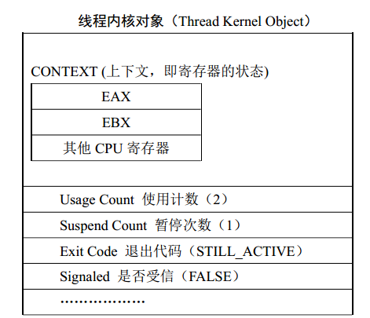

**线程创建**

DWORD WINAPI ThreadProc(LPVOID lpParam); // 线程函数名称 ThreadProc 可以是任意的

WINAPI
是一个宏明，用来说明调用参数的进栈方式和出栈方式。Windows规定，由内核函数负责调用的用户函数，必须定义为这个类型。

线程创建函数

HANDLE CreateThread (

>   LPSECURITY_ATTRIBUTES lpThreadAttributes, // 线程的安全属性

>   DWORD dwStackSize, // 指定线程堆栈的大小

>   LPTHREAD_START_ROUTINE lpStartAddress, // 线程函数的起始地址

>   LPVOID lpParameter, // 传递给线程函数的参数

>   DWORD dwCreationFlags, // 指定创线程建后是否立即启动

>   DWORD\* lpThreadId // 用于取得内核给新生成的线程分配的线程 ID 号

>   );

创建线程的具体示例

\#include \<stdio.h\>

>   \#include \<windows.h\>

>   // 线程函数

>   DWORD WINAPI ThreadProc(LPVOID lpParam)

>   { int i = 0;

>   while(i \< 20)

>   { printf(" I am from a thread, count = %d \\n", i++); }

>   return 0;

>   }

>   int main(int argc, char\* argv[])

>   { HANDLE hThread;

>   DWORD dwThreadId;

>   // 创建一个线程

>   hThread = ::CreateThread (

>   NULL, // 默认安全属性

>   NULL, // 默认堆栈大小

>   ThreadProc, // 线程入口地址（执行线程的函数）

>   NULL, // 传给函数的参数

>   0, // 指定线程立即运行

>   &dwThreadId); // 返回线程的 ID 号

>   printf(" Now another thread has been created. ID = %d \\n", dwThreadId);

>   // 等待新线程运行结束

>   ::WaitForSingleObject (hThread, INFINITE);

>   ::CloseHandle (hThread);

>   return 0;

>   }

WaitForSingleObject
函数用来等待制定对象变为受信状态。默认情况下为INFINITE，但在指定对象变为受信状态时会自动结束

**线程内核对象**

与进程内核对象相似，都是存储对象的基本信息，用来管理线程、进程的对象。

SuspendCount，制定了当前线程的状态。0 表示处于可调度状态，1，表示处于挂起状态。

获取线程的句柄函数

>   HANDLE OpenThread(

>   DWORD dwDesiredAccess, // 想要的访问权限，可以为 THREAD_ALL_ACCESS 等

>   BOOL bInheritHandle, // 指定此函数返回的句柄是否可以被子进程继承

>   DWORD dwThreadId // 目标线程 ID 号

>   );

>   唤醒一个挂起的线程

>   DWORD ResumeThread (HANDLE hThread); // 唤醒一个挂起的线程

>   挂起一个可调度的线程

>   DWORD SuspendThread (HANDLE hThread); // 挂起一个线程

ExitCode退出代码

DWORD dwExitCode;

>   if(::GetExitCodeThread(hThread, &dwExitCode))

>   { if(dwExitCode == STILL_ACTIVE)

>   { // 目标线程还在运行 }

>   else

>   { // 目标线程已经中止，退出代码为 dwExitCode }

>   }

Signaled是否受信。线程运行期间，Signaled的值为False，线程结束后，Signaled的值为True

**线程终止**

-   线程执行结束自然终止

-   使用ExitTread函数来终止自身。

void ExitThread( DWORD dwExitCode); // 线程的退出代码

-   使用TerminateThread函数强行终止另一个线程

BOOL TerminateThread(

>   HANDLE hThread, // 目标线程句柄

>   DWORD dwExitCode // 目标线程的退出代码

>   );

-   使用ExitProcess函数结束进程，相关县城就会结束。

**线程的优先级**

**Windows**的6个优先级类：idle、below normal、normal、above normal、
high、real-time。

CPU支持0-31优先级号（数字越大优先级越高。）

优先级设置函数

BOOL SetThreadPriority(HANDLE hThread,int nPriority );

线程同步

……

设计自己的线程局部存储

……

设计线程类

……

多线程文件搜索器

……

OHIUHI

**回调函数的定义**

>   回调函数就是一个通过函数指针调用的函数。如果你把函数的[指针](https://baike.baidu.com/item/%E6%8C%87%E9%92%88)（地址）作为[参数传递](https://baike.baidu.com/item/%E5%8F%82%E6%95%B0%E4%BC%A0%E9%80%92)给另一个函数，当这个指针被用来调用其所指向的函数时，我们就说这是回调函数。回调函数不是由该函数的实现方直接调用，而是在特定的事件或条件发生时由另外的一方调用的，用于对该事件或条件进行响应。

**::含义**

类作用域，类名::成员变量。用来表示类和他的成员变量

命名空间作用域，命名空间::变量或函数。命名空间中的成员

全局作用域，::变量。全局的变量或函数，好像可以省略。
