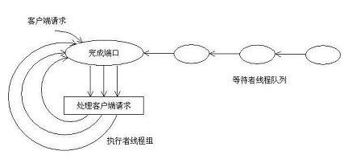

## 1 简介
　　IOCP模型属于一种通讯模型，适用于Windows平台下高负载服务器的一个技术。在处理大量用户并发请求时，如果采用一个用户一个线程的方式那将造成CPU在这成千上万的线程间进行切换，后果是不可想象的。而IOCP完成端口模型则完全不会如此处理，它的理论是并行的线程数量必须有一个上限-也就是说同时发出500个客户请求，不应该允许出现500个可运行的线程。目前来说，IOCP完成端口是Windows下性能最好的I/O模型，同时它也是最复杂的内核对象。它避免了大量用户并发时原有模型采用的方式，极大的提高了程序的并行处理能力。

## 2 原理图



一共包括三部分：完成端口（存放重叠的I/O请求），客户端请求的处理，等待者线程队列（一定数量的工作者线程，一般采用CPU*2个）

　　完成端口中所谓的[端口]并不是我们在TCP/IP中所提到的端口，可以说是完全没有关系。它其实就是一个通知队列，由操作系统把已经完成的重叠I/O请求的通知放入其中。当某项I/O操作一旦完成，某个可以对该操作结果进行处理的工作者线程就会收到一则通知。

　　通常情况下，我们会在创建一定数量的工作者线程来处理这些通知，也就是线程池的方法。线程数量取决于应用程序的特定需要。理想的情况是，线程数量等于处理器的数量，不过这也要求任何线程都不应该执行诸如同步读写、等待事件通知等阻塞型的操作，以免线程阻塞。每个线程都将分到一定的CPU时间，在此期间该线程可以运行，然后另一个线程将分到一个时间片并开始执行。如果某个线程执行了阻塞型的操作，操作系统将剥夺其未使用的剩余时间片并让其它线程开始执行。也就是说，前一个线程没有充分使用其时间片，当发生这样的情况时，应用程序应该准备其它线程来充分利用这些时间片。

## 3 IOCP优点
　　基于IOCP的开发是异步IO的，决定了IOCP所实现的服务器的高吞吐量。

　　通过引入IOCP，会大大减少Thread切换带来的额外开销，最小化的线程上下文切换，减少线程切换带来的巨大开销，让CPU把大量的事件用于线程的运行。当与该完成端口相关联的可运行线程的总数目达到了该并发量，系统就会阻塞，

## 4 IOCP应用
### 4.1 创建和关联完成端口
```c++
//功能：创建完成端口和关联完成端口
 HANDLE WINAPI CreateIoCompletionPort(
     *    __in   HANDLE FileHandle,              // 已经打开的文件句柄或者空句柄，一般是客户端的句柄
     *    __in   HANDLE ExistingCompletionPort,  // 已经存在的IOCP句柄
     *    __in   ULONG_PTR CompletionKey,        // 完成键，包含了指定I/O完成包的指定文件
     *    __in   DWORD NumberOfConcurrentThreads // 真正并发同时执行最大线程数，一般推介是CPU核心数*2
     * );

//创建完成端口句柄
HANDLE completionPort = CreateIoCompletionPort(INVALID_HANDLE_VALUE, NULL, 0, 0)；
```
### 4.2 与socket进行关联
```
typedef struct{
    SOCKET socket;//客户端socket
    SOCKADDR_STORAGE ClientAddr;//客户端地址
}PER_HANDLE_DATA, *LPPER_HANDLE_DATA;
//与socket进行关联
CreateIoCompletionPort((HANDLE)(PerHandleData -> socket), 
　　　　　　　　　　completionPort, (DWORD)PerHandleData, 0);
```
4.3 获取队列完成状态
```
//功能：获取队列完成状态
/*
返回值：
调用成功，则返回非零数值，相关数据存于lpNumberOfBytes、lpCompletionKey、
lpoverlapped变量中。失败则返回零值。
*/
BOOL   GetQueuedCompletionStatus(
    HANDLE   CompletionPort,          //完成端口句柄
    LPDWORD   lpNumberOfBytes,    //一次I/O操作所传送的字节数
    PULONG_PTR   lpCompletionKey, //当文件I/O操作完成后，用于存放与之关联的CK
    LPOVERLAPPED   *lpOverlapped, //IOCP特定的结构体
    DWORD   dwMilliseconds);           //调用者的等待时间
/*
```

### 4.4 用于IOCP的特点函数
```
//用于IOCP的特定函数
typedef struct _OVERLAPPEDPLUS{
    OVERLAPPED ol;      //一个固定的用于处理网络消息事件返回值的结构体变量
    SOCKET s, sclient;  int OpCode;  //用来区分本次消息的操作类型（在完成端口的操作里面，
　　　　　　　　　　　　　　　　　　　　　　　是以消息通知系统，读数据/写数据，都是要发这样的
　　　　　　　　　　　　　　　　　　　　　　  消息结构体过去的）
    WSABUF wbuf;　　　　 //读写缓冲区结构体变量 
    DWORD dwBytes, dwFlags; //一些在读写时用到的标志性变量 
}OVERLAPPEDPLUS;
```
### 4.5 投递一个队列完成状态
```
//功能：投递一个队列完成状态
BOOL PostQueuedCompletionStatus( 
　　HANDLE CompletlonPort, //指定想向其发送一个完成数据包的完成端口对象
　　DW0RD dwNumberOfBytesTrlansferred, //指定—个值,直接传递给GetQueuedCompletionStatus
　　　　　　　　　　　　　　　　　　　　　　　　函数中对应的参数 
　　DWORD dwCompletlonKey, //指定—个值,直接传递给GetQueuedCompletionStatus函数中对应的参数
　　LPOVERLAPPED lpoverlapped, ); //指定—个值,直接传递给GetQueuedCompletionStatus
　　　　　　　　　　　　　　　　　　　　函数中对应的参数
```
## 5 示例

```c
#include <winsock2.h>
#include <windows.h>
#include <string>
#include <iostream>
using namespace std;

#pragma comment(lib,"ws2_32.lib")
#pragma comment(lib,"kernel32.lib")

HANDLE g_hIOCP;

enum IO_OPERATION{IO_READ,IO_WRITE};

struct IO_DATA{
    OVERLAPPED                  Overlapped;
    WSABUF                      wsabuf;
    int                         nBytes;
    IO_OPERATION                opCode;
    SOCKET                      client;
};

char buffer[1024];

DWORD WINAPI WorkerThread (LPVOID WorkThreadContext) {
    IO_DATA *lpIOContext = NULL; 
    DWORD nBytes = 0;
    DWORD dwFlags = 0; 
    int nRet = 0;

    DWORD dwIoSize = 0; 
    void * lpCompletionKey = NULL;
    LPOVERLAPPED lpOverlapped = NULL;

    while(1){
        GetQueuedCompletionStatus(g_hIOCP, &dwIoSize,(LPDWORD)&lpCompletionKey,(LPOVERLAPPED *)&lpOverlapped, INFINITE);

        lpIOContext = (IO_DATA *)lpOverlapped;
        if(dwIoSize == 0)
        {
            cout << "Client disconnect" << endl;
            closesocket(lpIOContext->client);
            delete lpIOContext;
            continue;
        }

        if(lpIOContext->opCode == IO_READ) // a read operation complete
        {
            ZeroMemory(&lpIOContext->Overlapped, sizeof(lpIOContext->Overlapped));
            lpIOContext->wsabuf.buf = buffer;
            lpIOContext->wsabuf.len = strlen(buffer)+1;
            lpIOContext->opCode = IO_WRITE;
            lpIOContext->nBytes = strlen(buffer)+1;
            dwFlags = 0;
            nBytes = strlen(buffer)+1;
            nRet = WSASend(
                lpIOContext->client,
                &lpIOContext->wsabuf, 1, &nBytes,
                dwFlags,
                &(lpIOContext->Overlapped), NULL);
            if( nRet == SOCKET_ERROR && (ERROR_IO_PENDING != WSAGetLastError()) ) {
                cout << "WASSend Failed::Reason Code::"<< WSAGetLastError() << endl;
                closesocket(lpIOContext->client);
                delete lpIOContext;
                continue;
            }
            memset(buffer, NULL, sizeof(buffer));
        }
        else if(lpIOContext->opCode == IO_WRITE) //a write operation complete
        {
            // Write operation completed, so post Read operation.
            lpIOContext->opCode = IO_READ; 
            nBytes = 1024;
            dwFlags = 0;
            lpIOContext->wsabuf.buf = buffer;
            lpIOContext->wsabuf.len = nBytes;
            lpIOContext->nBytes = nBytes;
            ZeroMemory(&lpIOContext->Overlapped, sizeof(lpIOContext->Overlapped));

            nRet = WSARecv(
                lpIOContext->client,
                &lpIOContext->wsabuf, 1, &nBytes,
                &dwFlags,
                &lpIOContext->Overlapped, NULL);
            if( nRet == SOCKET_ERROR && (ERROR_IO_PENDING != WSAGetLastError()) ) {
                cout << "WASRecv Failed::Reason Code1::"<< WSAGetLastError() << endl;
                closesocket(lpIOContext->client);
                delete lpIOContext;
                continue;
            } 
            cout<<lpIOContext->wsabuf.buf<<endl;
        }
    }
    return 0;
}
void main ()
{
    WSADATA wsaData;
    WSAStartup(MAKEWORD(2,2), &wsaData);

    SOCKET    m_socket = WSASocket(AF_INET,SOCK_STREAM, IPPROTO_TCP, NULL,0,WSA_FLAG_OVERLAPPED);

    sockaddr_in server;
    server.sin_family = AF_INET;
    server.sin_port = htons(6000);
    server.sin_addr.S_un.S_addr = htonl(INADDR_ANY);

    bind(m_socket ,(sockaddr*)&server,sizeof(server));

    listen(m_socket, 8);

    SYSTEM_INFO sysInfo;
    GetSystemInfo(&sysInfo);
    int g_ThreadCount = sysInfo.dwNumberOfProcessors * 2;

    g_hIOCP = CreateIoCompletionPort(INVALID_HANDLE_VALUE,NULL,0,g_ThreadCount);

    //CreateIoCompletionPort((HANDLE)m_socket,g_hIOCP,0,0);

    for( int i=0;i < g_ThreadCount; ++i){
        HANDLE  hThread;
        DWORD   dwThreadId;
        hThread = CreateThread(NULL, 0, WorkerThread, 0, 0, &dwThreadId);
        CloseHandle(hThread);
    }

    while(1)
    {
        SOCKET client = accept( m_socket, NULL, NULL );
        cout << "Client connected." << endl;


        if (CreateIoCompletionPort((HANDLE)client, g_hIOCP, 0, 0) == NULL){
            cout << "Binding Client Socket to IO Completion Port Failed::Reason Code::"<< GetLastError() << endl;
            closesocket(client);
        }
        else { //post a recv request
            IO_DATA * data = new IO_DATA;
            memset(buffer, NULL ,1024);
            memset(&data->Overlapped, 0 , sizeof(data->Overlapped));
            data->opCode = IO_READ;
            data->nBytes = 0;
            data->wsabuf.buf  = buffer;
            data->wsabuf.len  = sizeof(buffer);
            data->client = client;
            DWORD nBytes= 1024 ,dwFlags=0;
            int nRet = WSARecv(client,&data->wsabuf, 1, &nBytes,
                &dwFlags,
                &data->Overlapped, NULL);
            if(nRet == SOCKET_ERROR  && (ERROR_IO_PENDING != WSAGetLastError())){
                cout << "WASRecv Failed::Reason Code::"<< WSAGetLastError() << endl;
                closesocket(client);
                delete data;
            }
            cout<<data->wsabuf.buf<<endl;
        }
    }
    closesocket(m_socket);
    WSACleanup();
}
```
```c
#include <iostream>
#include <WinSock2.h>
using namespace std;

#pragma comment(lib,"ws2_32.lib")

void main()
{
    WSADATA wsaData;  
    WSAStartup(MAKEWORD(2,2), &wsaData);

    sockaddr_in server;
    server.sin_family = AF_INET;
    server.sin_port   = htons(6000);
    server.sin_addr.S_un.S_addr = inet_addr("127.0.0.1");

    SOCKET client = socket(AF_INET, SOCK_STREAM, IPPROTO_TCP);

    int flag;
    flag = connect(client, (sockaddr*)&server, sizeof(server));
    if(flag < 0){
        cout<<"error!"<<endl;
        return;
    }
    while(1){
        cout<<"sent hello!!!!"<<endl;
        char buffer[1024];
        strcpy(buffer,"hello");
        send(client, buffer, 1024, 0);

        memset(buffer, NULL, sizeof(buffer));

        cout<<"recv: "<<endl;
        int rev = recv(client, buffer, 1024, 0);
        if(rev == 0)
            cout<<"recv nothing!"<<endl;
        cout<<buffer<<endl;
        Sleep(10000);
    }

    closesocket(client);
    WSACleanup();
}
```