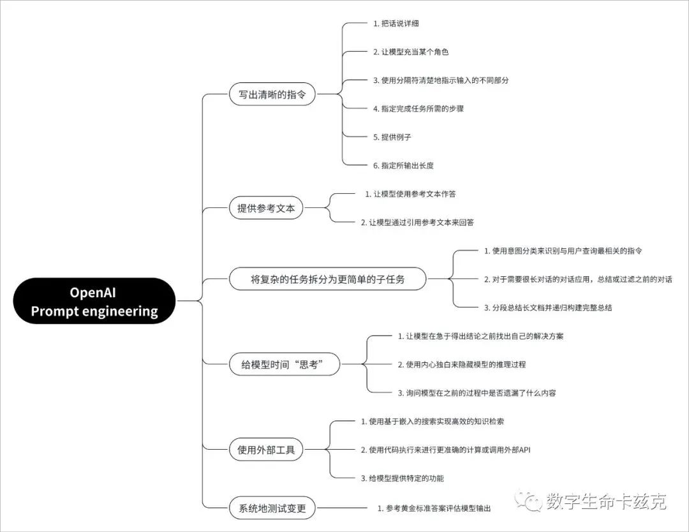
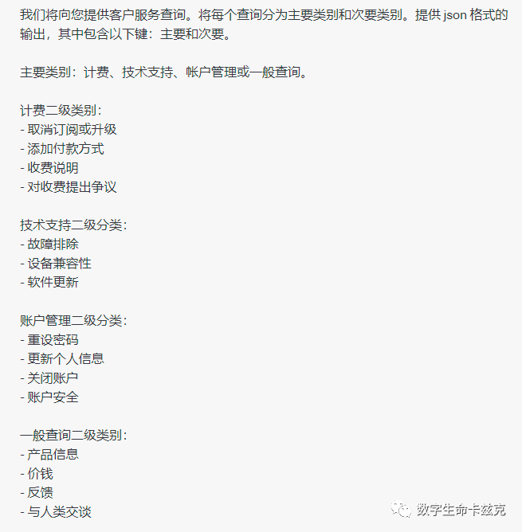
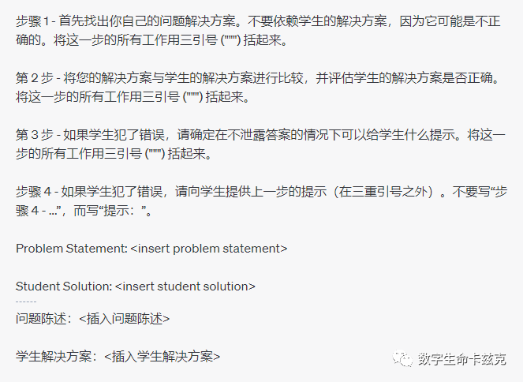
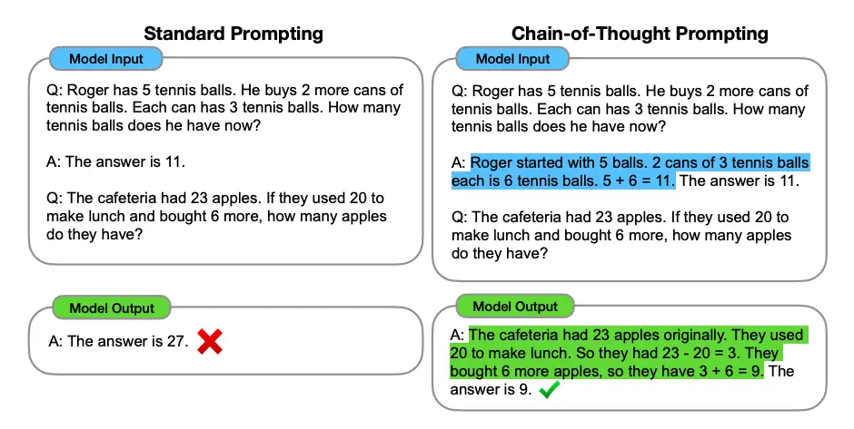
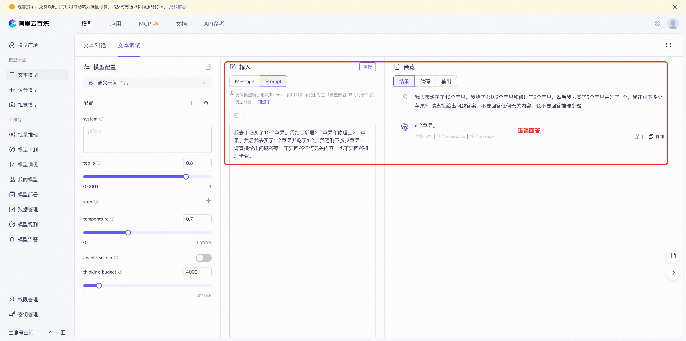
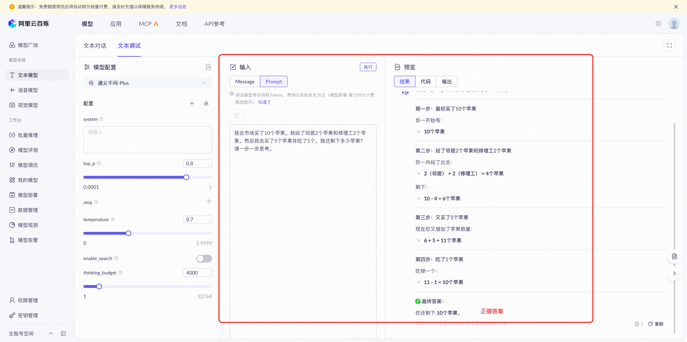
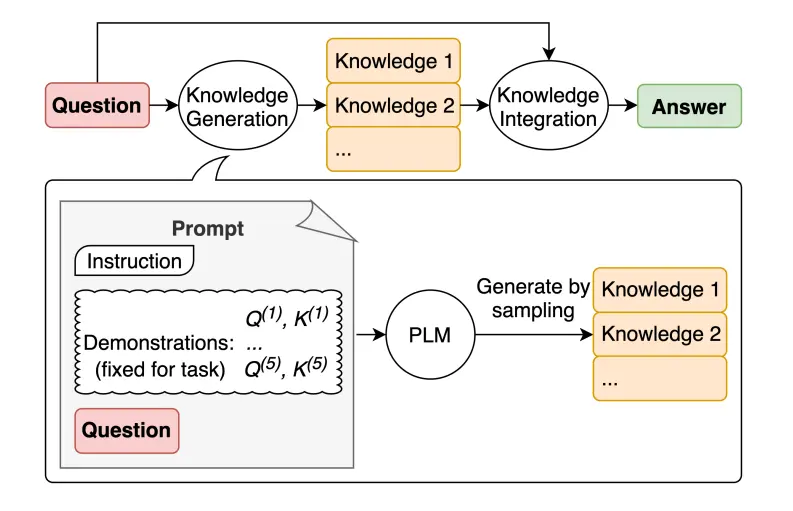
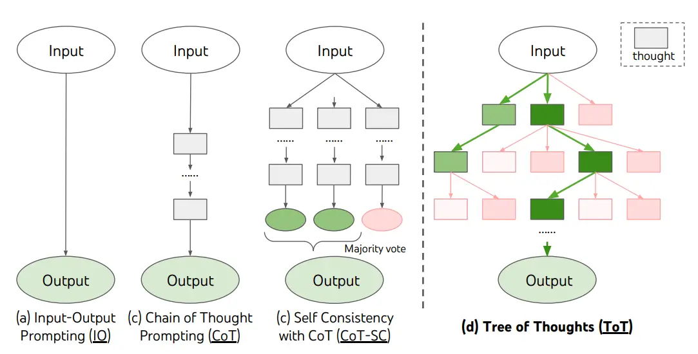

> 参考文献  
> https://hub.baai.ac.cn/view/33671  
> https://prompt-guide.xiniushu.com/  
> https://prompt-engineering.xiniushu.com/guides/conclusion  

## 1、 提示词的六大原则

1. Write clear instructions（写出清晰的指令）
2. Provide reference text（提供参考文本）
3. Split complex tasks into simpler subtasks（将复杂的任务拆分为更简单的子任务）
4. Give the model time to "think"（给模型时间「思考」）
5. Use external tools（使用外部工具）
6. Test changes systematically（系统地测试变更）



### 1. 写出清晰的指令
这个其实就是我天天说的，任何 Prompt 技巧都不如清晰的表达你的需求，这就像人与人沟通一样，话都说不明白，怎么能让对面理解你呢？一味的靠抄 Prompt 模板，其实不是长久之计。
所以，写出清晰的指令，是核心中的核心。

如何写出清晰的指令，OpenAI 给出了 6 条小技巧：

1. 把话说详细

尽量多的提供任何重要的详细信息和上下文，说白了，就是把话说明白一点，不要一个太笼统。

比如：
```
不要说：「总结会议记录」
```
而是说：
```
「用一个段落总结会议记录。然后写下演讲者的 Markdown 列表以及他们的每个要点。
```

最后，列出发言人建议的后续步骤或行动项目（如果有）。」

2. 让模型充当某个角色
你可以把大模型想象成一个演员，你要告诉他让他演什么角色，他就会更专业更明确，一个道理。

比如：
```
充当一个喜欢讲笑话的喜剧演员，每当我当我请求帮助写一些东西时，你会回复一份文档，其中每个段落至少包含一个笑话或有趣的评论。
```
3. 使用分隔符清楚地指示输入的不同部分
三引号、XML 标签、节标题等分隔符可以帮助划分要区别对待的文本节。可以帮助大模型更好的理解文本内容。我最喜欢用"""把内容框起来。

比如：
```
用 50 个字符总结由三引号分隔的文本。"""在此插入文字"""
```
4. 指定完成任务所需的步骤
有些任务能拆就拆，最好指定为一系列步骤。明确地写出这些步骤可以使模型更容易去实现它们。

比如：
```
使用以下分步说明来响应用户输入。
步骤 1 - 用户将为您提供三引号中的文本。用一个句子总结这段文字，并加上前缀「Summary:」。
步骤 2 - 将步骤 1 中的摘要翻译成西班牙语，并添加前缀「翻译：」。
```
5. 提供例子
也就是经典的少样本提示，few-shot prompt，先扔给大模型例子，让大模型按你的例子来输出。

比如：
```
按这句话的风格来写 XX 文章："""落霞与孤鹜齐飞，秋水共长天一色。渔舟唱晚，响穷彭蠡之滨"""
```
6. 指定所输出长度
可以要求模型生成给定目标长度的输出。目标输出长度可以根据单词、句子、段落、要点等的计数来指定。中文效果不明显，同时你给定的长度只是个大概，多少个字这种肯定会不精准，但是像多少段这种效果就比较好。

比如：
```
用两个段落、100 个字符概括由三引号分隔的文本。"""在此插入文字"""
```
### 2. 提供参考文本
给大模型文本或者文档，能大幅度降低大模型胡说八道的概率。其实就是把大模型当知识库来用。
1. 让模型使用参考文本作答

知识库的经典用法，让大模型使用我们提供的信息来组成其答案。

比如：
```
使用提供的由三重引号引起来的文章来回答问题。如果在文章中找不到答案，请写「我找不到答案」。"""<在此插入文档""""""<在此插入文档"""

问题：<在此插入问题>
```
2. 让模型通过引用参考文本来回答
如果已经给了文本，则可以直接要求模型通过引用所提供文档中的段落来为其答案添加引用。可以提高正确性，增加可验证性。

比如：
```
您将获得一份由三重引号和一个问题分隔的文档。您的任务是仅使用提供的文档回答问题，并引用用于回答问题的文档段落。如果文档不包含回答此问题所需的信息，则只需写：「信息不足」。如果提供了问题的答案，则必须附有引文注释。使用以下格式引用相关段落（{「引用」：…}）。

"""<在此插入文档>"""

问题：<在此插入问题>
```

### 03. 将复杂的任务拆分为更简单的子任务
其实跟人类一样，你作为 Leader，让下属一次性去做一个非常大的事，出错的概率是很大的，很多大项目也是这样，你甚至无从下手。所以经常我们在工作中，都说的是要拆，拆各种细节、子任务、子目标等等。大模型也是同样的道理。

把复杂的任务给拆给更为简单的子任务，大模型会有更好的表现。

1. 使用意图分类来识别与用户查询最相关的指令

意图识别是一个很经典的例子。比如在客服场景中，用户问了一个问题「我断网了咋整」，你让大模型直接回复其实是挺蛋疼的，但是这时候就可以拆，先拆大分类下的意图识别，再回答具体的问题。

比如还是「我断网了咋整」这个问题：

步骤 1，先判断问题类别：



现在，大模型根据步骤 1，知道「我断网了咋整」是属于技术支持中的故障排除了，我们就可以再继续步骤 2：


这时候，用户的「我断网了咋整」就能得到非常有效的回答了。

2. 对于需要很长对话的对话应用，总结或过滤之前的对话

这个技巧偏开发者。普通用户可以跳过。

因为模型具有固定的上下文长度，因此用户和助手之间的对话无法无限期地继续。

解决此问题有多种解决方法，第一个是总结对话中的历史记录。一旦输入的大小达到预定的阈值长度，这可能会触发总结部分对话的查询，并且先前对话的摘要可以作为系统消息的一部分包括在内。或者，可以在整个对话过程中在后台异步总结之前的对话。

这两种方法都行，或者还可以把过去的所有聊天记录存成向量库，后续跟用户对话的时候动态查询嵌入，也可以。

3. 分段总结长文档并递归构建完整总结

同样偏开发者。普通用户可以跳过。

其实就是总结几百页 PDF 文档的原理，比如让大模型总结一本书，肯定是超 Token 上限了嘛，所以可以使用一系列查询来总结文档的每个部分。章节摘要可以连接和总结，生成摘要的摘要。这个过程可以递归地进行，直到总结整个文档。OpenAI 在之前的研究中已经使用 GPT-3 的变体研究了这种总结书籍的过程的有效性。


### 04. 给模型时间「思考」
Think step by step（一步步思考）这个神级提示词的源头。其实也就是链式思考（CoT），Chain-of-Thought Prompting，非常非常有用的一个策略。

还是跟人一样，我直接问你 12314992*177881 等于多少你肯定也懵逼，但是我要是给你时间让你一步步计算，学过小学数学的我觉得都能算出来对吧。

OpenAI 在 CoT 的基础上，又详细给出了 3 个技巧：

1. 让模型在急于得出结论之前找出自己的解决方案

比如你扔个数学题给大模型，你让他判断对或者不对，你会发现结果很随机，一会对或者不对，但是如果你先让他自己做一遍，再去判断对与不对，结果就会准非常多了。

比如你可以说：
```
首先制定自己的问题解决方案。然后将你的解决方案与学生的解决方案进行比较，并评估学生的解决方案是否正确。在你自己完成问题之前，不要决定学生的解决方案是否正确。
```
2. 使用内心独白来隐藏模型的推理过程
非常有意思的一个技巧，你可能会问不是说一步一步思考把推理过程放出来效果会更好嘛。

你说的对，但是这条技巧是面对开发者的，对于某些应用程序，大模型用于得出最终答案的推理过程不适合与用户共享。例如，在辅导应用程序中，我们可能希望鼓励学生得出自己的答案，但模型关于学生解决方案的推理过程可能会向学生揭示答案。

所以就有了这么一个内心独白的技巧。内心独白的想法是让模型将原本对用户隐藏的部分输出放入结构化格式中，以便于解析它们。然后，在向用户呈现输出之前，将解析输出并且仅使部分输出可见。

比如：



接下来，我们可以让模型使用所有可用信息来评估学生解决方案的正确性。


最后，我们可以让大模型使用自己的分析来以乐于助人的导师的角色构建回复。


用多次跟 API 通讯的方式，同时隐藏模型的推理过程，来完成一次学生的辅导方案对话。

3. 询问模型在之前的过程中是否遗漏了什么内容

这个技巧在长文本问答中常用，比如我们给了一个文档，要让大模型模型来列出与一个特定问题相关的信息。如果源文档很大，模型通常会过早停止并且无法列出所有相关信息。在这种情况下，通过使用后续的 promtp 让模型查找之前传递中错过的任何相关信息，通常可以获得更好的性能。

比如我让他根据我的文档，给我列出这个问题在文档中的相关片段：「北京烤鸭到底好吃在哪」，然后让他用 JSON 格式输出
```
[{"相关片段"："..."}，
```
在输出停止以后，我们可以再问一句：
```
还有更多相关片段吗？注意不要重复摘录。还要确保相关片段包含解释它们所需的所有相关上下文 - 换句话说，不要提取缺少重要上下文的小片段。
```

### 05. 使用外部工具
大模型并不是万能的，很多东西吧，大模型的效果并没有那么好，比如数学、比如一些实时问题等等，所以需要一些外部工具来帮助处理。
换句话说，如果第三方工具能稳定的获得结果，那其实并不需要大模型去做什么，或者只让大模型做一个答案组装类的工作就够了。

1. 使用基于嵌入的搜索实现高效的知识检索

绝大部分知识库的原理，检索增强生成 (RAG)，Retrieval Augmented Generation，比如我问如何评价马上要上映的电影《海王 2》，你让大模型自己去答肯定就废了，它是静态的，根本不知道《海王 2》要上映了，所以需要先去联网进行查询，查完以后把一堆资料灌回来，让大模型自己根据自己查到的这些资料进行回答。这是动态的信息。

但是也有静态的知识库，就是用的向量匹配的方式，常见步骤：加载文件 -> 读取文本 -> 文本分割 -> 文本向量化 -> 问句向量化 -> 在文本向量中匹配出与问句向量最相似的 top k 个 -> 匹配出的文本作为上下文和问题一起添加到 prompt 中 -> 提交给大模型生成回答。

就是这么玩的。

2. 使用代码执行来进行更准确的计算或调用外部API

都知道大模型自己的计算能力垃圾，所以 OpenAI 建议，如果遇到需要计算的东西，最好让大模型写一段计算的 Python 代码，毕竟 Python 最计算题很成熟了。

比如：
```
求以下多项式的所有实值根：3*x**5 - 5*x**4 - 3*x**3 - 7*x - 10。您需要通过将 Python 代码括在三个反引号中来编写和执行，例如"""代码放在这里"""。用它来执行计算。
```
当然，都用 Python 了，你也可以把自己的 API 文档复制给它，让大模型知道该如何写代码调用你的 API。

3. 给模型提供特定的功能

很偏开发者的一个技巧，普通用户可以直接跳过。

简而言之，你可以通过 API 请求，传递一系列特定的函数描述。告诉模型哪些函数是可用的，以及这些函数的参数应该是什么样的。然后模型模可以生成相应的函数参数，这些参数随后会以 JSON 格式通过 API 返回。

你都拿到 JSON 数组了，跟数据库可以做多少交互相信也不用我多说了吧，做数据查询、数据处理等等，啥玩意都行。

处理完以后再返回一个 JSON 数组给大模型，让大模型变成人类语言输出给用户，完事。


### 06. 系统地测试变更
主要是帮助开发者判断更改 Prompt（例如新指令或新设计）是否使系统变得更好或更差。毕竟大部分时间的样本量都比较小，很难区分真正有改进还是纯粹的运气。

所以，OpenAI 建议搞个评估程序，用来判断优化系统的设计是否有效。

## 2、提示词的八个技巧

### 技巧1、使用标签

使用分隔符清晰地表示输入的不同部分
分隔符可以是：```、""、<>、\<tag><\tag>、:等。

你可以使用任何明显的标点符号将特定的文本部分与提示的其余部分分开，这可以是任何可以使模型明确知道这是一个单独部分的标记。使用分隔符是一种可以避免提示注入的有用技术，提示注入是指如果用户将某些输入添加到提示中，则可能会向模型提供与您想要执行的操作相冲突的指令，从而使其遵循冲突的指令而不是执行您想要的操作。即，输入里面可能包含其他指令，会覆盖掉你的指令。对此，使用分隔符是一个不错的策略。

以下是一个例子，我们给出一段话并要求 GPT 进行总结，在该示例中我们使用 ``` 来作为分隔符。
输入：
```
text = f"""
你应该提供尽可能清晰、具体的指示，以表达你希望模型执行的任务。\
这将引导模型朝向所需的输出，并降低收到无关或不正确响应的可能性。\
不要将写清晰的提示与写简短的提示混淆。\
在许多情况下，更长的提示可以为模型提供更多的清晰度和上下文信息，从而导致更详细和相关的输出。
"""
# 需要总结的文本内容
prompt = f"""
把用三个反引号括起来的文本总结成一句话。
-```{text}```
"""
# 指令内容，使用 ``` 来分隔指令和待总结的内容
response = get_completion(prompt)
print(response)
```

输出：
```
提供清晰具体的指示，避免无关或不正确响应，不要混淆写清晰和写简短，更长的提示可以提供更多清晰度和上下文信息，导致更详细和相关的输出。
```


### 技巧2、规范输出

要求一个结构化的输出
结构化输出可以是 JSON、HTML 等格式。

第二个策略是要求生成一个结构化的输出，这可以使模型的输出更容易被我们解析，例如，你可以在 Python 中将其读入字典或列表中。

在以下示例中，我们要求 GPT 生成三本书的标题、作者和类别，并要求 GPT 以 JSON 的格式返回给我们，为便于解析，我们指定了 JSON 的键。

输入：

prompt = f"""
请生成包括书名、作者和类别的三本虚构书籍清单，\
并以 JSON 格式提供，其中包含以下键:book_id、title、author、genre。
"""
response = get_completion(prompt)
print(response)

输出：

{
  "books": [
    {
      "book_id": 1,
      "title": "The Shadow of the Wind",
      "author": "Carlos Ruiz Zafón",
      "genre": "Mystery"
    },
    {
      "book_id": 2,
      "title": "The Name of the Wind",
      "author": "Patrick Rothfuss",
      "genre": "Fantasy"
    },
    {
      "book_id": 3,
      "title": "The Hitchhiker's Guide to the Galaxy",
      "author": "Douglas Adams",
      "genre": "Science Fiction"
    }
  ]
}

### 技巧3、确定边界和自我检查

策略三：要求模型检查是否满足条件
如果任务做出的假设不一定满足，我们可以告诉模型先检查这些假设，如果不满足，指示并停止执行。你还可以考虑潜在的边缘情况以及模型应该如何处理它们，以避免意外的错误或结果。

在如下示例中，我们将分别给模型两段文本，分别是制作茶的步骤以及一段没有明确步骤的文本。我们将要求模型判断其是否包含一系列指令，如果包含则按照给定格式重新编写指令，不包含则回答未提供步骤。

输入：
```
# 有步骤的文本
text_1 = f"""
泡一杯茶很容易。首先，需要把水烧开。\
在等待期间，拿一个杯子并把茶包放进去。\
一旦水足够热，就把它倒在茶包上。\
等待一会儿，让茶叶浸泡。几分钟后，取出茶包。\
如果你愿意，可以加一些糖或牛奶调味。\
就这样，你可以享受一杯美味的茶了。
"""
prompt = f"""
您将获得由三个引号括起来的文本。\
如果它包含一系列的指令，则需要按照以下格式重新编写这些指令：

第一步 - ...
第二步 - …
…
第N步 - …

如果文本中不包含一系列的指令，则直接写“未提供步骤”。"
\"\"\"{text_1}\"\"\"
"""
response = get_completion(prompt)
print("Text 1 的总结:")
print(response)
```
输出：
```
Text 1 的总结:
第一步 - 把水烧开。
第二步 - 拿一个杯子并把茶包放进去。
第三步 - 把热水倒在茶包上。
第四步 - 等待几分钟，让茶叶浸泡。
第五步 - 取出茶包。
第六步 - 如果你愿意，可以加一些糖或牛奶调味。
第七步 - 就这样，你可以享受一杯美味的茶了。
```
输入：
```
# 无步骤的文本
text_2 = f"""
今天阳光明媚，鸟儿在歌唱。\
这是一个去公园散步的美好日子。\
鲜花盛开，树枝在微风中轻轻摇曳。\
人们外出享受着这美好的天气，有些人在野餐，有些人在玩游戏或者在草地上放松。\
这是一个完美的日子，可以在户外度过并欣赏大自然的美景。
"""
prompt = f"""
您将获得由三个引号括起来的文本。\
如果它包含一系列的指令，则需要按照以下格式重新编写这些指令：

第一步 - ...
第二步 - …
…
第N步 - …

如果文本中不包含一系列的指令，则直接写“未提供步骤”。"
\"\"\"{text_2}\"\"\"
"""
response = get_completion(prompt)
print("Text 2 的总结:")
print(response)
```
输出：
```
Text 2 的总结:
未提供步骤。
```
### 技巧4、少样本提示


少样本提示可以作为一种技术，以启用上下文学习，我们在提示中提供演示以引导模型实现更好的性能。演示作为后续示例的条件，我们希望模型生成响应。
```
识别文本的情绪，包括Negative和Postive两种。
实例：
这太棒了！// Negative
这太糟糕了！// Positive
哇，那部电影太棒了！// Positive

输出限制：
仅输出答案，不要包含其他的内容

用户提问：
多么可怕的节目！//

```
即在要求模型执行实际任务之前，提供给它少量成功执行任务的示例。

例如，在以下的示例中，我们告诉模型其任务是以一致的风格回答问题，并先给它一个孩子和一个祖父之间的对话的例子。孩子说，“教我耐心”，祖父用这些隐喻回答。因此，由于我们已经告诉模型要以一致的语气回答，现在我们说“教我韧性”，由于模型已经有了这个少样本示例，它将以类似的语气回答下一个任务。

输入：
```
prompt = f"""
你的任务是以一致的风格回答问题。

<孩子>: 教我耐心。

<祖父母>: 挖出最深峡谷的河流源于一处不起眼的泉眼；最宏伟的交响乐从单一的音符开始；最复杂的挂毯以一根孤独的线开始编织。

<孩子>: 教我韧性。
"""
response = get_completion(prompt)
print(response)
```
输出:
```
<祖父母>: 韧性就像是一棵树，它需要经历风吹雨打、寒冬酷暑，才能成长得更加坚强。所以，当你遇到挫折和困难时，不要轻易放弃，要像树一样坚定地扎根，不断成长，最终成为一棵高大的树。
```
### 技巧5、思维链

#### 指定步骤

指定完成任务所需的步骤
接下来我们将通过给定一个复杂任务，给出完成该任务的一系列步骤，来展示这一策略的效果。

首先我们描述了杰克和吉尔的故事，并给出一个指令。该指令是执行以下操作。首先，用一句话概括三个反引号限定的文本。第二，将摘要翻译成法语。第三，在法语摘要中列出每个名称。第四，输出包含以下键的 JSON 对象：法语摘要和名称数。然后我们要用换行符分隔答案。

文本：
```
text = f"""
在一个迷人的村庄里，兄妹杰克和吉尔出发去一个山顶井里打水。\
他们一边唱着欢乐的歌，一边往上爬，\
然而不幸降临——杰克绊了一块石头，从山上滚了下来，吉尔紧随其后。\
虽然略有些摔伤，但他们还是回到了温馨的家中。\
尽管出了这样的意外，他们的冒险精神依然没有减弱，继续充满愉悦地探索。
"""
```
输入：
```
# example 1
prompt_1 = f"""
执行以下操作：
1-用一句话概括下面用三个反引号括起来的文本。
2-将摘要翻译成法语。
3-在法语摘要中列出每个人名。
4-输出一个 JSON 对象，其中包含以下键：French_summary，num_names。

请用换行符分隔您的答案。

Text:
```{text}```
"""
response = get_completion(prompt_1)
print("prompt 1:")
print(response)
```
输出：
```
prompt 1:
1-兄妹在山顶井里打水时发生意外，但仍然保持冒险精神。
2-Dans un charmant village, les frère et sœur Jack et Jill partent chercher de l'eau dans un puits au sommet de la montagne. Malheureusement, Jack trébuche sur une pierre et tombe de la montagne, suivi de près par Jill. Bien qu'ils soient légèrement blessés, ils retournent chez eux chaleureusement. Malgré cet accident, leur esprit d'aventure ne diminue pas et ils continuent à explorer joyeusement.
3-Jack, Jill
4-{
   "French_summary": "Dans un charmant village, les frère et sœur Jack et Jill partent chercher de l'eau dans un puits au sommet de la montagne. Malheureusement, Jack trébuche sur une pierre et tombe de la montagne, suivi de près par Jill. Bien qu'ils soient légèrement blessés, ils retournent chez eux chaleureusement. Malgré cet accident, leur esprit d'aventure ne diminue pas et ils continuent à explorer joyeusement.",
   "num_names": 2
}
```

上述输出仍然存在一定问题，例如，键“姓名”会被替换为法语，因此，我们给出一个更好的 Prompt，该 Prompt 指定了输出的格式。

输入：
```
# example 2
prompt_2 = f"""
1-用一句话概括下面用<>括起来的文本。
2-将摘要翻译成英语。
3-在英语摘要中列出每个名称。
4-输出一个 JSON 对象，其中包含以下键：English_summary，num_names。

请使用以下格式：
文本：<要总结的文本>
摘要：<摘要>
翻译：<摘要的翻译>
名称：<英语摘要中的名称列表>
输出 JSON：<带有 English_summary 和 num_names 的 JSON>

Text: <{text}>
"""
response = get_completion(prompt_2)
print("\nprompt 2:")
print(response)
```
输出：
```
prompt 2:
摘要：兄妹杰克和吉尔在迷人的村庄里冒险，不幸摔伤后回到家中，但仍然充满冒险精神。
翻译：In a charming village, siblings Jack and Jill set out to fetch water from a mountaintop well. While climbing and singing, Jack trips on a stone and tumbles down the mountain, with Jill following closely behind. Despite some bruises, they make it back home safely. Their adventurous spirit remains undiminished as they continue to explore with joy.
名称：Jack，Jill
输出 JSON：{"English_summary": "In a charming village, siblings Jack and Jill set out to fetch water from a mountaintop well. While climbing and singing, Jack trips on a stone and tumbles down the mountain, with Jill following closely behind. Despite some bruises, they make it back home safely. Their adventurous spirit remains undiminished as they continue to explore with joy.", "num_names": 2}
```
#### 少样本思维链




#### 零样本思维链

零样本CoT（ Kojima 等人，2022年），它基本上涉及将“让我们逐步思考”添加到原始提示中。
```
"请一步一步思考，并确保答案正确"
```
如果没有思维链


使用零样本思维链




### 技巧6、外部知识（检索增强生成）



LLM 继续得到改进，其中一种流行的技术是能够融合知识或信息，以帮助模型做出更准确的预测。


### 技巧7、多轮对话（链式提示）

可以首先将任务分解成多个步骤，然后按照步骤调用大模型分别获取结果，最后将结果进行整合。

链式提示可以完成很复杂的任务。LLM 可能无法仅用一个非常详细的提示完成这些任务。在链式提示中，提示链对生成的回应执行转换或其他处理，直到达到期望结果。

除了提高性能，链式提示还有助于提高 LLM 应用的透明度，增加控制性和可靠性。这意味着您可以更容易地定位模型中的问题，分析并改进需要提高的不同阶段的性能。


### 技巧8、意图识别（思维树）

思维树（Tree of Thoughts，ToT）框架，该框架基于思维链提示进行了总结，引导语言模型探索把思维作为中间步骤来解决通用问题。

ToT 维护着一棵思维树，思维由连贯的语言序列表示，这个序列就是解决问题的中间步骤。使用这种方法，LM 能够自己对严谨推理过程的中间思维进行评估。LM 将生成及评估思维的能力与搜索算法（如广度优先搜索和深度优先搜索）相结合，在系统性探索思维的时候可以向前验证和回溯。




