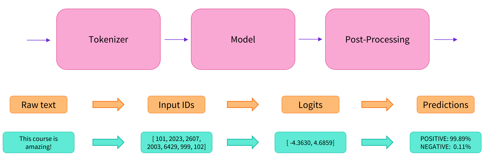
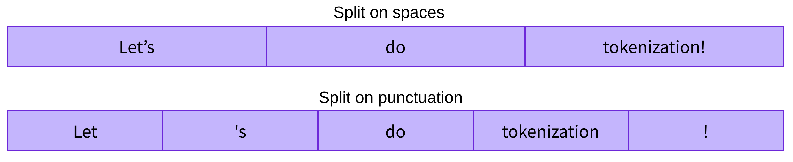

## transofrmers最简单的说明
> 参考文档https://transformers.run/c2/2021-12-08-transformers-note-1/
> https://fancyerii.github.io/2021/05/11/huggingface-transformers-1/#%E7%AE%80%E4%BB%8B
> 官方文档https://huggingface.co/docs/transformers/v4.36.1/zh/index

### 是什么

目前各种Pretraining的Transformer模型层出不穷，虽然这些模型都有开源代码，但是它们的实现各不相同，我们在对比不同模型时也会很麻烦。Huggingface Transformer能够帮我们跟踪流行的新模型，并且提供统一的代码风格来使用BERT、XLNet和GPT等等各种不同的模型。

### 基本原则
huggingface的transfomers工具库，只有configuration，models和tokenizer三个主要类。所有的模型都可以通过统一的from_pretrained()函数来实现加载，transformers会处理下载、缓存和其它所有加载模型相关的细节。而所有这些模型都统一在Hugging Face Models管理。基于上面的三个类，提供更上层的pipeline和Trainer/TFTrainer，从而用更少的代码实现模型的预测和微调。

因此它不是一个基础的神经网络库来一步一步构造Transformer，而是把常见的Transformer模型封装成一个building block，我们可以方便的在PyTorch或者TensorFlow里使用它。


## 2 快速开始
使用预训练模型最简单的方法就是使用pipeline函数，它支持如下的任务：

情感分析(Sentiment analysis)：一段文本是正面还是负面的情感倾向
文本生成(Text generation)：给定一段文本，让模型补充后面的内容
命名实体识别(Name entity recognition)：识别文字中出现的人名地名的命名实体
问答(Question answering)：给定一段文本以及针对它的一个问题，从文本中抽取答案
填词(Filling masked text)：把一段文字的某些部分mask住，然后让模型填空
摘要(Summarization)：根据一段长文本中生成简短的摘要
翻译(Translation)：把一种语言的文字翻译成另一种语言
特征提取(Feature extraction)：把一段文字用一个向量来表示

### 情感分析

借助情感分析 pipeline，我们只需要输入文本，就可以得到其情感标签（积极/消极）以及对应的概率：
```
from transformers import pipeline

classifier = pipeline("sentiment-analysis")
result = classifier("I've been waiting for a HuggingFace course my whole life.")
print(result)
results = classifier(
  ["I've been waiting for a HuggingFace course my whole life.", "I hate this so much!"]
)
print(results)
No model was supplied, defaulted to distilbert-base-uncased-finetuned-sst-2-english (https://huggingface.co/distilbert-base-uncased-finetuned-sst-2-english)

[{'label': 'POSITIVE', 'score': 0.9598048329353333}]
[{'label': 'POSITIVE', 'score': 0.9598048329353333}, {'label': 'NEGATIVE', 'score': 0.9994558691978455}]
```

pipeline 模型会自动完成以下三个步骤：

将文本预处理为模型可以理解的格式；
将预处理好的文本送入模型；
对模型的预测值进行后处理，输出人类可以理解的格式。
pipeline 会自动选择合适的预训练模型来完成任务。例如对于情感分析，默认就会选择微调好的英文情感模型 distilbert-base-uncased-finetuned-sst-2-english。

Transformers 库会在创建对象时下载并且缓存模型，只有在首次加载模型时才会下载，后续会直接调用缓存好的模型。


## 3 原理

实际上它的背后经过了三个步骤：

预处理 (preprocessing)，将原始文本转换为模型可以接受的输入格式；
将处理好的输入送入模型；
对模型的输出进行后处理 (postprocessing)，将其转换为人类方便阅读的格式。




### 使用分词器进行预处理
因为神经网络模型无法直接处理文本，因此首先需要通过预处理环节将文本转换为模型可以理解的数字。具体地，我们会使用每个模型对应的分词器 (tokenizer) 来进行：

将输入切分为词语、子词或者符号（例如标点符号），统称为 tokens；
根据模型的词表将每个 token 映射到对应的 token 编号（就是一个数字）；
根据模型的需要，添加一些额外的输入。
我们对输入文本的预处理需要与模型自身预训练时的操作完全一致，只有这样模型才可以正常地工作。注意，每个模型都有特定的预处理操作，如果对要使用的模型不熟悉，可以通过 Model Hub 查询。这里我们使用 AutoTokenizer 类和它的 from_pretrained() 函数，它可以自动根据模型 checkpoint 名称来获取对应的分词器。

情感分析 pipeline 的默认 checkpoint 是 
distilbert-base-uncased-finetuned-sst-2-english，下面我们手工下载并调用其分词器：
```
from transformers import AutoTokenizer

checkpoint = "distilbert-base-uncased-finetuned-sst-2-english"
tokenizer = AutoTokenizer.from_pretrained(checkpoint)

raw_inputs = [
    "I've been waiting for a HuggingFace course my whole life.",
    "I hate this so much!",
]
inputs = tokenizer(raw_inputs, padding=True, truncation=True, return_tensors="pt")
print(inputs)
```
```
{
    'input_ids': tensor([
        [  101,  1045,  1005,  2310,  2042,  3403,  2005,  1037, 17662, 12172, 2607,  2026,  2878,  2166,  1012,   102],
        [  101,  1045,  5223,  2023,  2061,  2172,   999,   102,     0,     0,
             0,     0,     0,     0,     0,     0]
    ]), 
    'attention_mask': tensor([
        [1, 1, 1, 1, 1, 1, 1, 1, 1, 1, 1, 1, 1, 1, 1, 1],
        [1, 1, 1, 1, 1, 1, 1, 1, 0, 0, 0, 0, 0, 0, 0, 0]
    ])
}
```
可以看到，输出中包含两个键 input_ids 和 attention_mask，其中 input_ids 对应分词之后的 tokens 映射到的数字编号列表，而 attention_mask 则是用来标记哪些 tokens 是被填充的（这里“1”表示是原文，“0”表示是填充字符）。

先不要关注 padding、truncation 这些参数，以及 attention_mask 项，后面我们会详细介绍:)。


### 将预处理好的输入送入模型
预训练模型的下载方式和分词器 (tokenizer) 类似，Transformers 包提供了一个 AutoModel 类和对应的 from_pretrained() 函数。下面我们手工下载这个 distilbert-base 模型：
```
from transformers import AutoModel

checkpoint = "distilbert-base-uncased-finetuned-sst-2-english"

model = AutoModel.from_pretrained(checkpoint)
```
预训练模型的本体只包含基础的 Transformer 模块，对于给定的输入，它会输出一些神经元的值，称为 hidden states 或者特征 (features)。对于 NLP 模型来说，可以理解为是文本的高维语义表示。这些 hidden states 通常会被输入到其他的模型部分（称为 head），以完成特定的任务，例如送入到分类头中完成文本分类任务。


Transformer 模块的输出是一个维度为 (Batch size, Sequence length, Hidden size) 的三维张量，其中 Batch size 表示每次输入的样本（文本序列）数量，即每次输入多少个句子，上例中为 2；Sequence length 表示文本序列的长度，即每个句子被分为多少个 token，上例中为 16；Hidden size 表示每一个 token 经过模型编码后的输出向量（语义表示）的维度。

预训练模型编码后的输出向量的维度通常都很大，例如 Bert 模型 base 版本的输出为 768 维，一些大模型的输出维度为 3072 甚至更高。

我们可以打印出这里使用的 distilbert-base 模型的输出维度：

from transformers import AutoTokenizer, AutoModel

checkpoint = "distilbert-base-uncased-finetuned-sst-2-english"
tokenizer = AutoTokenizer.from_pretrained(checkpoint)
model = AutoModel.from_pretrained(checkpoint)

raw_inputs = [
    "I've been waiting for a HuggingFace course my whole life.",
    "I hate this so much!",
]
inputs = tokenizer(raw_inputs, padding=True, truncation=True, return_tensors="pt")
outputs = model(**inputs)
print(outputs.last_hidden_state.shape)
torch.Size([2, 16, 768])
Transformers 模型的输出格式类似 namedtuple 或字典，可以像上面那样通过属性访问，也可以通过键（outputs["last_hidden_state"]），甚至索引访问（outputs[0]）。

对于情感分析任务，很明显我们最后需要使用的是一个文本分类 head。因此，实际上我们不会使用 AutoModel 类，而是使用 AutoModelForSequenceClassification：

from transformers import AutoTokenizer
from transformers import AutoModelForSequenceClassification

checkpoint = "distilbert-base-uncased-finetuned-sst-2-english"
tokenizer = AutoTokenizer.from_pretrained(checkpoint)
model = AutoModelForSequenceClassification.from_pretrained(checkpoint)

raw_inputs = [
    "I've been waiting for a HuggingFace course my whole life.",
    "I hate this so much!",
]
inputs = tokenizer(raw_inputs, padding=True, truncation=True, return_tensors="pt")
outputs = model(**inputs)
print(outputs.logits.shape)
torch.Size([2, 2])
可以看到，对于 batch 中的每一个样本，模型都会输出一个两维的向量（每一维对应一个标签，positive 或 negative）。

### 对模型输出进行后处理
由于模型的输出只是一些数值，因此并不适合人类阅读。例如我们打印出上面例子的输出：

from transformers import AutoTokenizer
from transformers import AutoModelForSequenceClassification

checkpoint = "distilbert-base-uncased-finetuned-sst-2-english"
tokenizer = AutoTokenizer.from_pretrained(checkpoint)
model = AutoModelForSequenceClassification.from_pretrained(checkpoint)

raw_inputs = [
    "I've been waiting for a HuggingFace course my whole life.",
    "I hate this so much!",
]
inputs = tokenizer(raw_inputs, padding=True, truncation=True, return_tensors="pt")
outputs = model(**inputs)
print(outputs.logits)
tensor([[-1.5607,  1.6123],
        [ 4.1692, -3.3464]], grad_fn=<AddmmBackward0>)
模型对第一个句子输出 
，对第二个句子输出 
，它们并不是概率值，而是模型最后一层输出的 logits 值。要将他们转换为概率值，还需要让它们经过一个 SoftMax 层，例如：

import torch
predictions = torch.nn.functional.softmax(outputs.logits, dim=-1)
print(predictions)
tensor([[4.0195e-02, 9.5980e-01],
        [9.9946e-01, 5.4418e-04]], grad_fn=<SoftmaxBackward0>)
所有 Transformers 模型都会输出 logits 值，因为训练时的损失函数通常会自动结合激活函数（例如 SoftMax）与实际的损失函数（例如交叉熵 cross entropy）。

这样模型的预测结果就是容易理解的概率值：第一个句子 
，第二个句子 
。最后，为了得到对应的标签，可以读取模型 config 中提供的 id2label 属性：

print(model.config.id2label)
{0: 'NEGATIVE', 1: 'POSITIVE'}
于是我们可以得到最终的预测结果：

第一个句子: NEGATIVE: 0.0402, POSITIVE: 0.9598
第二个句子: NEGATIVE: 0.9995, POSITIVE: 0.0005


## Model 与 Tokenizer

### 加载模型
除了像之前使用 AutoModel 根据 checkpoint 自动加载模型以外，我们也可以直接使用模型对应的 Model 类，例如 BERT 对应的就是 BertModel：
```
from transformers import BertModel

model = BertModel.from_pretrained("bert-base-cased")
```
> 注意，在大部分情况下，我们都应该使用 AutoModel 来加载模型。这样如果我们想要使用另一个模型（比如把 BERT 换成 RoBERTa），只需修改 checkpoint，其他代码可以保持不变。

所有存储在 HuggingFace Model Hub 上的模型都可以通过 Model.from_pretrained() 来加载权重，参数可以像上面一样是 checkpoint 的名称，也可以是本地路径（预先下载的模型目录），例如：
```
from transformers import BertModel

model = BertModel.from_pretrained("./models/bert/")
```
Model.from_pretrained() 会自动缓存下载的模型权重，默认保存到 ~/.cache/huggingface/transformers，我们也可以通过 HF_HOME 环境变量自定义缓存目录。

> 由于 checkpoint 名称加载方式需要连接网络，因此在大部分情况下我们都会采用本地路径的方式加载模型。
> 部分模型的 Hub 页面中会包含很多文件，我们通常只需要下载模型对应的 config.json 和 pytorch_model.bin，以及分词器对应的 tokenizer.json、tokenizer_config.json 和 vocab.txt。
>


### 保存模型
保存模型通过调用 Model.save_pretrained() 函数实现，例如保存加载的 BERT 模型：

from transformers import AutoModel

model = AutoModel.from_pretrained("bert-base-cased")
model.save_pretrained("./models/bert-base-cased/")
这会在保存路径下创建两个文件：

config.json：模型配置文件，存储模型结构参数，例如 Transformer 层数、特征空间维度等；
pytorch_model.bin：又称为 state dictionary，存储模型的权重。
简单来说，配置文件记录模型的结构，模型权重记录模型的参数，这两个文件缺一不可。我们自己保存的模型同样通过 Model.from_pretrained() 加载，只需要传递保存目录的路径。


### 加载与保存分词器
分词策略
根据切分粒度的不同，分词策略可以分为以下几种：

* 按词切分 (Word-based)

word_based_tokenization

例如直接利用 Python 的 split() 函数按空格进行分词：

tokenized_text = "Jim Henson was a puppeteer".split()
print(tokenized_text)
['Jim', 'Henson', 'was', 'a', 'puppeteer']
这种策略的问题是会将文本中所有出现过的独立片段都作为不同的 token，从而产生巨大的词表。而实际上很多词是相关的，例如 “dog” 和 “dogs”、“run” 和 “running”，如果给它们赋予不同的编号就无法表示出这种关联性。

词表就是一个映射字典，负责将 token 映射到对应的 ID（从 0 开始）。神经网络模型就是通过这些 token ID 来区分每一个 token。

当遇到不在词表中的词时，分词器会使用一个专门的 
 token 来表示它是 unknown 的。显然，如果分词结果中包含很多 
 就意味着丢失了很多文本信息，因此一个好的分词策略，应该尽可能不出现 unknown token。

* 按字符切分 (Character-based)

character_based_tokenization

这种策略把文本切分为字符而不是词语，这样就只会产生一个非常小的词表，并且很少会出现词表外的 tokens。

但是从直觉上来看，字符本身并没有太大的意义，因此将文本切分为字符之后就会变得不容易理解。这也与语言有关，例如中文字符会比拉丁字符包含更多的信息，相对影响较小。此外，这种方式切分出的 tokens 会很多，例如一个由 10 个字符组成的单词就会输出 10 个 tokens，而实际上它们只是一个词。

因此现在广泛采用的是一种同时结合了按词切分和按字符切分的方式——按子词切分 (Subword tokenization)。

* **按子词切分 (Subword) **

高频词直接保留，低频词被切分为更有意义的子词。例如 “annoyingly” 是一个低频词，可以切分为 “annoying” 和 “ly”，这两个子词不仅出现频率更高，而且词义也得以保留。下图展示了对 “Let’s do tokenization!“ 按子词切分的结果：

bpe_subword

可以看到，“tokenization” 被切分为了 “token” 和 “ization”，不仅保留了语义，而且只用两个 token 就表示了一个长词。这种策略只用一个较小的词表就可以覆盖绝大部分文本，基本不会产生 unknown token。尤其对于土耳其语等黏着语，几乎所有的复杂长词都可以通过串联多个子词构成。

加载与保存分词器
分词器的加载与保存与模型相似，使用 Tokenizer.from_pretrained() 和 Tokenizer.save_pretrained() 函数。例如加载并保存 BERT 模型的分词器：

from transformers import BertTokenizer

tokenizer = BertTokenizer.from_pretrained("bert-base-cased")
tokenizer.save_pretrained("./models/bert-base-cased/")
同样地，在大部分情况下我们都应该使用 AutoTokenizer 来加载分词器：

from transformers import AutoTokenizer

tokenizer = AutoTokenizer.from_pretrained("bert-base-cased")
tokenizer.save_pretrained("./models/bert-base-cased/")
调用 Tokenizer.save_pretrained() 函数会在保存路径下创建三个文件：

special_tokens_map.json：映射文件，里面包含 unknown token 等特殊字符的映射关系；
tokenizer_config.json：分词器配置文件，存储构建分词器需要的参数；
vocab.txt：词表，一行一个 token，行号就是对应的 token ID（从 0 开始）。