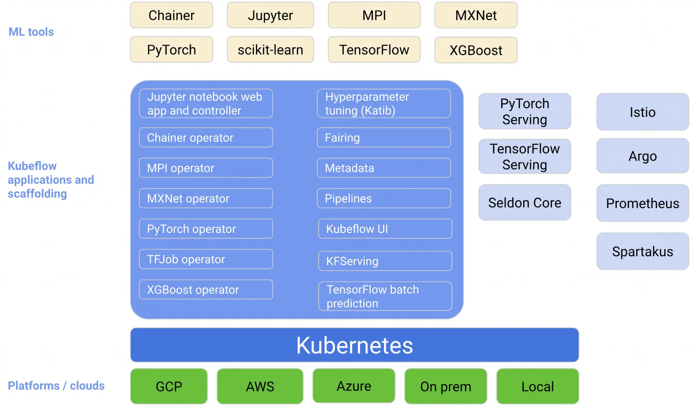
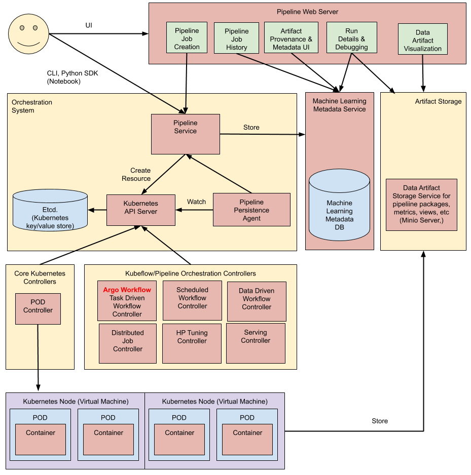
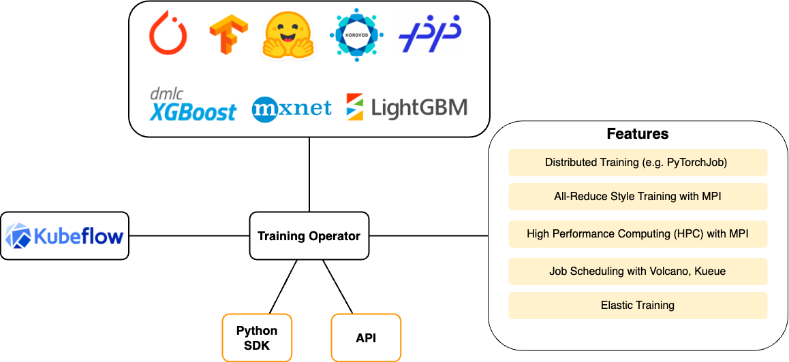
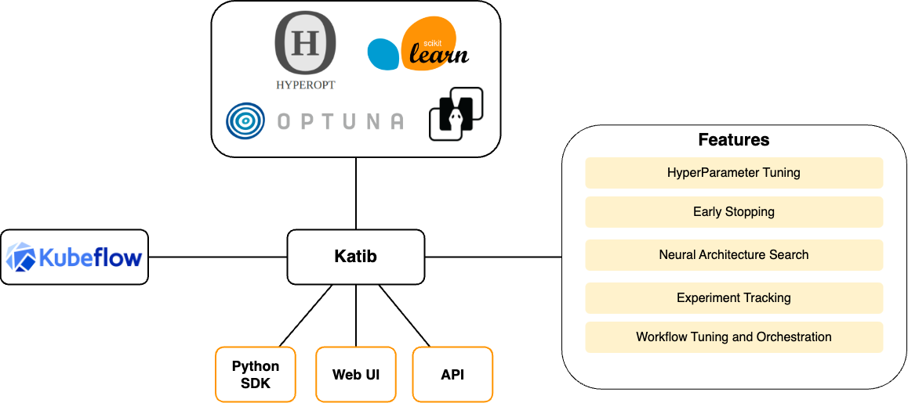

## MLOps

机器学习开发迭代
3. 数据收集
  a. 大数据量下的文件存储与读取 —— HDFS，NFS 等分布式文件存储系统；
  b. 非结构化数据 —— S3 等对象存储；
  c. 向量数据存储 —— milvus 等向量数据库；
  d. 数据的持续采集与入库 —— Kafka，RabbitMQ 等流式处理工具 ；
4. 数据预处理
  a. 清洗、格式化、规范化、脱敏 —— Python Pandas；
  b. 人工标记；
  c. 特征工程，“数据和特征决定了模型的上限，算法只是在帮忙逼近这个上限”
5. 框架选择
  a. 训练框架：PyTorch，TensorFlow，PaddlePaddle，……；
6. 模型训练
  a. 代码开发 —— Python IDE，Notebook；
    ⅰ. 开发阶段会采集小量的数据，经过小次数的迭代，用于正确性验证， Notebook 可以辅助验证；
  b. 训练
    ⅰ. 本地/单节点/单机单卡/单机多卡/多机多卡 —— GPU 管理与调度
    ⅱ. 任务调度/故障转移/checkpoint —— 分布式 AI 任务调度框架
    ⅲ. 任务调度 —— CoScheduling/GangScheduling
  c. 向量数据库 —— milvus，pinecone
  d. 调参，根据训练情况与经验调整模型的超参数 (HyperParameter)
    ⅰ. 神经网络输出的结果是当前网络架构下每个节点函数的系数，其它参数都为超参数，如每个节点使用的函数、权重、输入/输出的节点，甚至网络本身的架构；
    ⅱ. 随着模型复杂度增加，有多种超参自动调优算法（基于网格/贝叶斯/梯度/种群）
  e. 模型生成与版本管理
    ⅰ. 模型文件存储 —— NFS，对象存储，huggingface；
    ⅱ. 模型镜像存储 ——  docker 镜像仓库；

7. 模型部署 —— 运行中的模型服务是标准的无状态应用
   a. 模型的拉取，转化与处理（转化存储格式，单个模型的剪枝，多个模型集成）；
   b. 选择模型运行框架：TensorFlow，Triton server，Seldon Serving，paddlepaddle；
   c. 声明资源配置（如要求 Nvidia 显卡，CUDA 12.2+，40GiB 显存） —— GPU 管理与调度；
   d. 监控（模型服务的流量、模型服务资源使用率、集群资源使用率、推理请求耗时） —— prometheus，grafana；
   e. 自动弹性伸缩 —— 配合指标采集 + hpa 策略；
   f. 版本管理、滚动更新、发布管理 —— 应用发布策略与流量管理策略；

## kubeflow核心组件

### 架构



Central Dashboard：Kubeflow的dashboard看板页面
Metadata：用于跟踪各数据集、作业与模型
Jupyter Notebooks：一个交互式业务IDE编码环境
Frameworks for Training：支持的ML框架
Chainer
MPI
MXNet
PyTorch
TensorFlow
Hyperparameter Tuning:Katib，超参数服务器
Pipelines：一个ML的工作流组件，用于定义复杂的ML工作流
Tools for Serving：提供在Kubernetes上对机器学习模型的部署
KFServing
Seldon Core Serving
TensorFlow Serving(TFJob):提供对Tensorflow模型的在线部署，支持版本控制及无需停止线上服务、切换模型等
NVIDIA Triton Inference Server(Triton以前叫TensorRT)
TensorFlow Batch Prediction
Multi-Tenancy in Kubeflow：Kubeflow中的多租户
Fairing：一个将code打包构建image的组件 Kubeflow中大多数组件的实现都是通过定义CRD来工作。目前Kubeflow主要的组件有：
Operator是针对不同的机器学习框架提供资源调度和分布式训练的能力（TF-Operator，PyTorch-Operator，Caffe2-Operator，MPI-Operator，MXNet-Operator）;
Pipelines是一个基于Argo实现了面向机器学习场景的流水线项目，提供机器学习流程的创建、编排调度和管理，还提供了一个Web UI。
Katib是基于各个Operator实现的超参数搜索和简单的模型结构搜索的系统，支持并行搜索和分布式训练等。超参优化在实际的工作中还没有被大规模的应用，所以这部分的技术还需要一些时间来成熟；
Serving支持部署各个框架训练好的模型的服务化部署和离线预测。Kubeflow提供基于TFServing，KFServing，Seldon等好几种方案。由于机器学习框架很多，算法模型也各种各样。工业界一直缺少一种能真正统一的部署框架和方案。这方面Kubeflow也仅仅是把常见的都集成了进来，但是并没有做更多的抽象和统一。

## 2.1. **JupyterLab Notebook**

**JupyterLab 是一个基于Web的交互式开发环境，它是 Project Jupyter 的一部分，旨在为科学计算、数据科学和机器学习等领域提供强大的工作空间。JupyterLab 是 Jupyter Notebook 的下一代用户界面，它不仅支持笔记本，还支持代码编辑器、终端、数据文件查看器以及其他自定义组件。JupyterLab 的优势和特点如下：**

1. **交互式开发环境** **：J**upyterLab 提供了一个交互式的环境，让用户可以写代码、运行代码、查看结果，并立即获取反馈，这对于数据分析和模型原型设计来说非常有用。
2. **支持多种编程语言：**虽然最初是为 Python 设计的，但 JupyterLab 内核（kernels）支持多种编程语言，包括 R、Julia 和 Scala，满足不同领域研究人员的需求。
3. **数据可视化** **：**JupyterLab 支持丰富的数据可视化库，如 Matplotlib、Seaborn、Plotly 等，这些工具对于理解数据和展示机器学习模型的结果至关重要。
4. **模型原型与实验** **：**机器学习研究者和工程师使用 JupyterLab 来构建、测试和评估模型原型，它提供了一个灵活的环境来实验不同的算法和参数。
5. **可扩展性：**JupyterLab 是高度可扩展的，可以通过安装第三方扩展来增强其功能，例如调试器、版本控制和云服务集成。
6. **生态系统集成：**JupyterLab 可以集成到更广泛的数据科学和 AI 生态系统中，比如可以与大数据处理平台（如 Apache Spark）和机器学习平台（如 TensorFlow、PyTorch）配合使用。

## 2.2. **Pipelines**

**Pipelines 基于 Argo 实现了面向机器学习场景的工作流，提供机器学习流程的创建、编排调度和管理，还提供了一个Web UI。**


**流水线执行过程：**

1. **Python SDK：使用 Kubeflow Pipelines 领域特定语言 (DSL) 创建组件或指定管道。**
2. **DSL 编译器：DSL 编译器将pipeline的 Python 代码转换为静态配置 (YAML)。**
3. **Pipeline Service：调用服务，从静态配置运行流水线。**
4. **Kubernetes APIServer：流水线服务调用APIServer，创建运行所需的CRD**
5. **Orchestration Controllers：一组控制器，如Argo用于编排工作流**
6. **Artifact storage：pod存储两种数据，元数据和中间产物**

   1. **Metadata：实验、作业等聚合指标，存储在MySQL中**
   2. **Artifacts：存储大规模时序指标，如Minio或云存储**
7. **常驻代理和ML元数据服务：**

   1. **agent 监听流水线服务创建的k8s资源，并将资源的状态持久化存储至ML META 服务**
   2. **agent负责记录有哪些容器参与执行，并记录其输入和输出（容器参数和URI）**
8. **Pipeline Web Server ：收集数据并显示相关视图**

## 2.3. **Training Operator**

**Kubeflow Training Operator 是一个 Kubernetes 原生项目，针对不同的机器学习框架提供资源调度和****分布式训练**的能力。比如，用户可以使用 Training Operator 和 MPIJob 运行高性能计算 (HPC) 任务，因为它支持在大量用于 HPC 的 Kubernetes 上运行消息传递接口 (MPI)。


* Central Dashboard：`Kubeflow`的 `dashboard`看板页面
* Metadata：用于跟踪各数据集、作业与模型
* **Jupyter Notebooks** ：一个交互式业务IDE编码环境
* Frameworks for Training：支持的ML框架
  * Chainer
  * MPI
  * MXNet
  * [PyTorch](https://aigc.luomor.com/tag/pytorch/ "PyTorch")
  * TensorFlow
* Hyperparameter Tuning:`Katib`，超参数服务器
* **Pipelines** ：一个ML的工作流组件，用于定义复杂的ML工作流
* Tools for Serving：提供在 `Kubernetes`上对机器学习模型的部署
  * KFServing
  * Seldon Core Serving
  * TensorFlow Serving(TFJob):提供对 `<a href="https://aigc.luomor.com/tag/tensorflow/" target="_blank" title="Tensorflow">Tensorflow</a>`模型的在线部署，支持版本控制及无需停止线上服务、切换模型等
  * NVIDIA Triton Inference Server(Triton以前叫TensorRT)
  * TensorFlow Batch Prediction
* Multi-Tenancy in Kubeflow：Kubeflow中的多租户
* **Fairing** ：一个将 `code`打包构建 `image`的组件 `Kubeflow`中大多数组件的实现都是通过定义 `CRD`来工作。目前 `Kubeflow`主要的组件有：
* **Operator**是针对不同的机器学习框架提供资源调度和分布式训练的能力（`TF-Operator`，`PyTorch-Operator`，`Caffe2-Operator`，`MPI-Operator`，`MXNet-Operator`）;
* **Pipelines**是一个基于 `Argo`实现了面向机器学习场景的流水线项目，提供机器学习流程的创建、编排调度和管理，还提供了一个 `<a href="https://aigc.luomor.com/tag/web/" target="_blank" title="Web">Web</a><span> </span>UI`。
* **Katib**是基于各个 `Operator`实现的超参数搜索和简单的模型结构搜索的系统，支持并行搜索和分布式训练等。超参优化在实际的工作中还没有被大规模的应用，所以这部分的技术还需要一些时间来成熟；
* **Serving**支持部署各个框架训练好的模型的服务化部署和离线预测。`Kubeflow`提供基于 `TFServing`，`KFServing`，`Seldon`等好几种方案。由于机器学习框架很多，算法模型也各种各样。工业界一直缺少一种能真正统一的部署框架和方案。这方面 `Kubeflow`也仅仅是把常见的都集成了进来，但是并没有做更多的抽象和统一。

**针对不同的ML框架，Training Operator创建了不同的自定义资源：**

| **ML Framework** | **Custom Resource**                                                 |
| ---------------------- | ------------------------------------------------------------------------- |
| **PyTorch**      | [PyTorchJob](https://www.kubeflow.org/docs/components/training/pytorch/)     |
| **Tensorflow**   | [TFJob](https://www.kubeflow.org/docs/components/training/tftraining/)       |
| **XGBoost**      | [XGBoostJob](https://www.kubeflow.org/docs/components/training/xgboost/)     |
| **MPI**          | [MPIJob](https://www.kubeflow.org/docs/components/training/mpi/)             |
| **PaddlePaddle** | [PaddleJob](https://www.kubeflow.org/docs/components/training/paddlepaddle/) |

**示例：**

```yaml
apiVersion: "kubeflow.org/v1"
kind: "TFJob"
metadata:
  name: "tf-smoke-gpu"
spec:
  tfReplicaSpecs:
    PS: # 参数服务器
      replicas: 1
      template:
        metadata:
          creationTimestamp: null
        spec:
          containers:
            - args:
                - python
                - tf_cnn_benchmarks.py
                - --batch_size=32
                - --model=resnet50
                - --variable_update=parameter_server
                - --flush_stdout=true
                - --num_gpus=1 
                - --local_parameter_device=cpu
                - --device=cpu
                - --data_format=NHWC
              image: gcr.io/kubeflow/tf-benchmarks-cpu:v20171202-bdab599-dirty-284af3
              name: tensorflow # pod中必须有一个命名为tensorflow的容器
              ports:
                - containerPort: 2222
                  name: tfjob-port
              resources:
                limits:
                  cpu: "1"
              workingDir: /opt/tf-benchmarks/scripts/tf_cnn_benchmarks
          restartPolicy: OnFailure
    Worker: # 工作节点
      replicas: 1
      template:
        metadata:
          creationTimestamp: null
        spec:
          containers:
            - args:
                - python
                - tf_cnn_benchmarks.py
                - --batch_size=32
                - --model=resnet50
                - --variable_update=parameter_server
                - --flush_stdout=true
                - --num_gpus=1 # gpu个数
                - --local_parameter_device=cpu
                - --device=gpu # gpu
                - --data_format=NHWC
              image: gcr.io/kubeflow/tf-benchmarks-gpu:v20171202-bdab599-dirty-284af3
              name: tensorflow
              ports:
                - containerPort: 2222
                  name: tfjob-port
              resources:
                limits:
                  nvidia.com/gpu: 1 # 使用gpu
              workingDir: /opt/tf-benchmarks/scripts/tf_cnn_benchmarks
          restartPolicy: OnFailure
```

在分布式TensorFlow有多个角色协同工作以训练和评估模型，以下是每个进程的基本职责：

1. **Chief** **（主节点）:**

* **Chief节点负责协调训练过程，包括初始化任务、保存检查点、编写TensorBoard日志等。**
* **在训练开始时，Chief节点负责初始化参数。**
* **它通常也是负责恢复训练状态（如果需要的话）和执行最终的同步工作。**

2. **PS** **（Parameter Server，参数服务器）:**

* **参数服务器主要负责管理模型的参数，即存储和更新训练过程中的权重和偏差。**
* **在训练过程中，Worker节点会计算梯度，并将这些梯度发送到参数服务器上进行应用（即更新模型参数）。**

3. **Worker** **:**

* **Worker节点主要负责执行模型的前向和反向传播计算，即计算损失函数和梯度。**
* **Worker节点在接收到最新的模型参数后也负责对它们进行本地更新。**

4. **Evaluator** **:**

* **Evaluator节点负责评估训练好的模型的性能。这是通过对验证集数据的评估来完成的。**
* **Evaluator节点通常在训练过程中独立运行，不参与模型的训练更新过程**

## 2.4. [Katib](https://github.com/kubeflow/katib)

**Katib 是一个用于自动化机器学习 (** **AutoML** **) 的 Kubernetes 原生项目， Katib 支持超参数调整、Early Stopping 和神经架构搜索 (NAS)。**

* **Katib 与机器学习 (ML) 框架无关，它可以调整任何语言编写的应用程序的超参数，并原生支持多种机器学习框架，例如 TensorFlow、MXNet、PyTorch、XGBoost 等。**
* **Katib 支持多种 AutoML 算法，例如贝叶斯优化、Parzen 估计树、随机搜索、协方差矩阵适应进化策略、Hyperband、高效神经架构搜索、可微架构搜索等等。**



## 2.5 KServ

## 3 安装教程

https://cloud.tencent.com/developer/article/2317882
