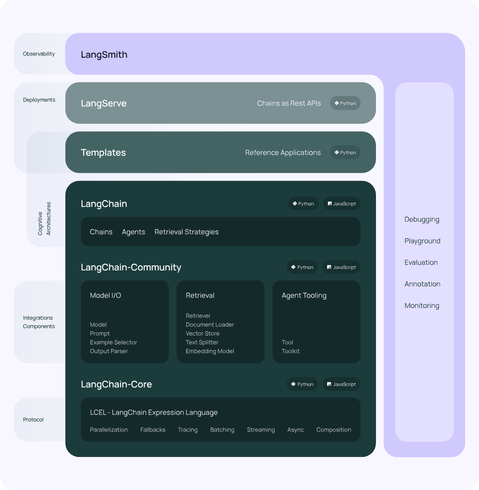
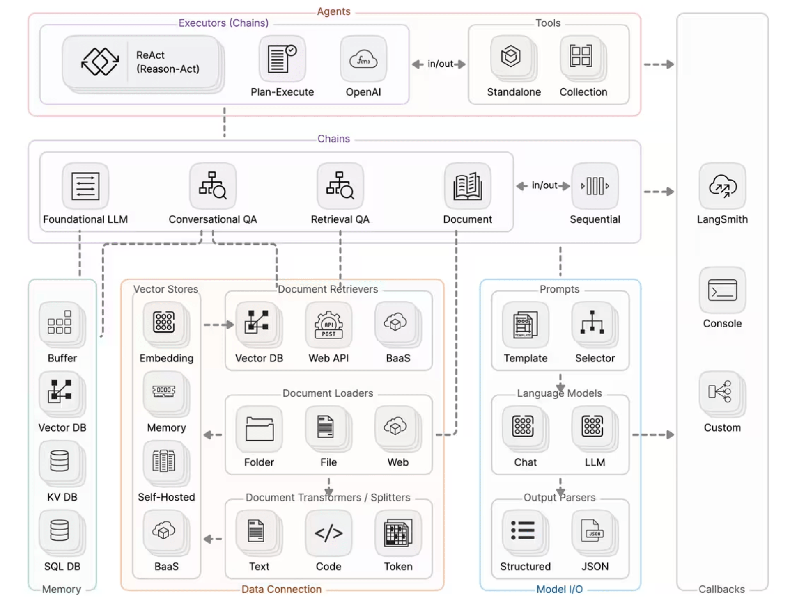
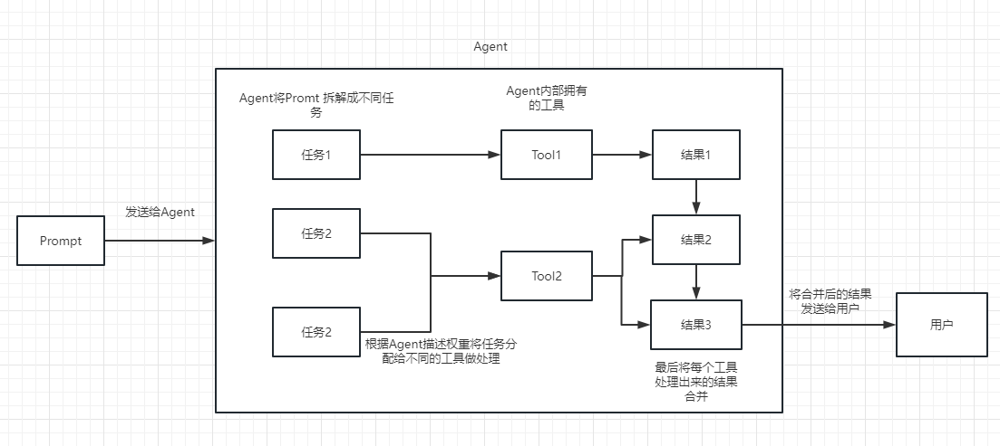

## 架构

* LangChain 库：Python 和 JavaScript 库。包含了各种组件的接口和集成，一个基本的运行时，用于将这些组件组合成链和代理，以及现成的链和代理的实现。
LangChain 模板：一系列易于部署的参考架构，用于各种任务。
LangServe：一个用于将 LangChain 链部署为 REST API 的库。
LangSmith：一个开发者平台，让你可以调试、测试、评估和监控基于任何 LLM 框架构建的链，并且与 LangChain 无缝集成。
langgraph(opens in a new tab)：通过将步骤建模为图中的边缘和节点，使用LLMs构建强大且有状态的多角色应用程序。

