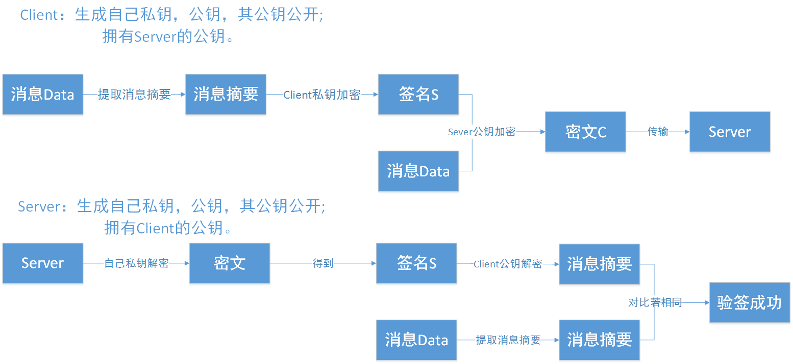
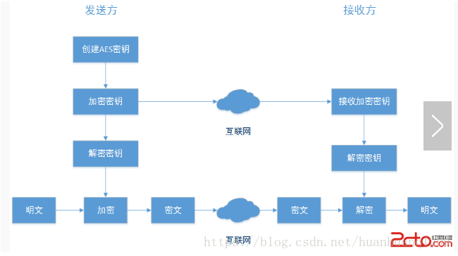
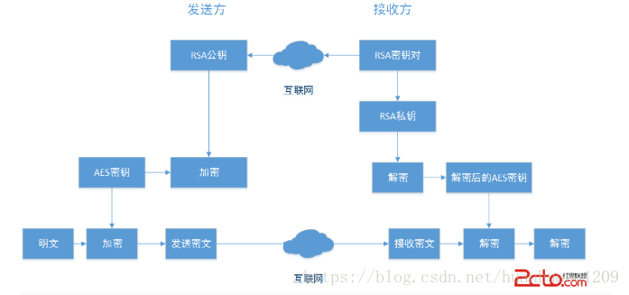
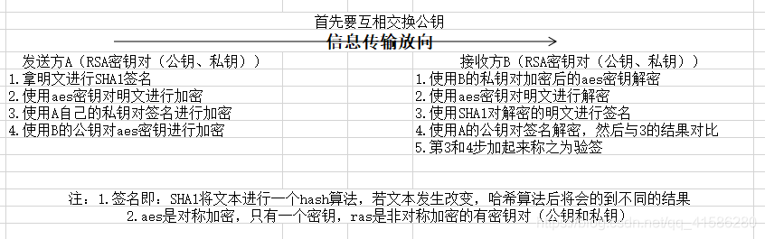

# 公钥秘钥加密原理

> 加密协议的主要目标：
> * 实现两个主体之间的加密数据传输。
> * 防止数据被篡改。签名----数据被篡改后签名不匹配。
> * 防止数据被截获。加密----数据被截获后，无法解密。

## 1 基本概念

### 加密算法
* 对称加密算法：加密和解密都是使用的同一个密钥。因此对称加密算法要保证安全性的话，密钥要做好保密，只能让使用的人知道，不能对外公开。又称私钥加密或会话密钥加密算法，即信息的发送方和接收方使用同一个密钥去加密和解密数据。它的最大优势是加/解密速度快，适合于对大数据量进行加密，但密钥管理困难。
* 非对称加密算法：加密使用的密钥和解密使用的密钥是不同的。 公钥密码体制就是一种非对称加密算法。信息发送者用公开密钥去加密，而信息接收者则用私用密钥去解密。公钥机制灵活，但加密和解密速度却比对称密钥加密慢得多。

### 秘钥概念
* 密钥：一般就是一个字符串或数字，在加密或者解密时传递给加密/解密算法。
* 密钥对，在非对称加密技术中，有两种密钥，分为私钥和公钥，私钥是密钥对所有者持有，不可公布，公钥是密钥对持有者公布给他人的。
  * 公钥，公钥用来给数据加密。
  * 私钥，用来解密公钥加密的数据。

### 加密与解密概念

* 公钥和私钥是通过秘钥生成算法得到的一个密钥对(即一个公钥和一个私钥)，将其中的一个向外界公开，称为公钥；另一个自己保留，称为私钥。通过这种算法得到的密钥对能保证在世界范围内是唯一的。
* 使用这个密钥对的时候，如果用其中一个密钥加密一段数据，必须用另一个密钥解密。比如用公钥加密数据就必须用私钥解密，如果用私钥加密也必须用公钥解密，否则解密将不会成功。

### 签名与签名验证概念
* 摘要，对需要传输的文本，做一个HASH计算，一般采用SHA1，SHA2来获得。
* 签名，首先使用文本摘要算法进行摘要，然后使用私钥对需要传输的文本的摘要进行加密，得到的密文即被称为该次传输过程的签名。
* 签名验证，数据接收端，拿到传输文本，拿自己持有的公钥对签名进行解密，得到了文本的摘要，然后使用与发送方同样的HASH算法计算摘要值，再与解密得到的摘要做对比，发现二者完全一致，则说明文本没有被篡改过。
  * 防止文本被替代，是发送者本人发送的数据（私钥签名）
  * 防止文本被篡改，没有被第三方进行修改（摘要指纹）

### 秘钥算法目标

* 加密,保证数据的隐私性。肯定是不希望别人知道我的消息,所以只要我才能解密。所以得出,公钥负责加密,私钥负责解密。
* 签名,保证数据的完整性。那肯定是不希望有人冒充我发消息，不希望消息被篡改,只有我才能发布这个签名, 所以得出,私钥负责签名,公钥负责验证，并使用消息摘要验证其准确性

## 2 非对称加密RSA实现

有两组四个密钥：A的公钥（PUB_A），A的私钥（PRI_A）；B的公钥（PUB_B），B的私钥（PRI_B）。公钥一般用来加密，私钥用来签名。通常公钥是公开出去的，但是私钥只能自己私密持有。

1. 这时A向B发送信息的整个签名和加密的过程如下：
   1. A先用自己的私钥（PRI_A）对信息（一般是信息的摘要）进行签名。
   2. A接着使用B的公钥（PUB_B）对信息内容和签名信息进行加密。

2. 这样当B接收到A的信息后，获取信息内容的步骤如下：
   1. 用自己的私钥（PRI_B）解密A用B的公钥（PUB_B）加密的内容；
   2. 得到解密后的明文后用A的公钥（PUB_A）解签A用A自己的私钥（PRI_A）的签名。

保证了整个过程发送的信息的防止截获（PUB_B加密），防止篡改（PRI_A签名）。

## 3 对称加密AES实现

AES加密算法涉及4种操作：字节替代（SubBytes）、行移位（ShiftRows）、列混淆（MixColumns）和轮密钥加（AddRoundKey）。下图给出了AES加解密的流程，从图中可以看出：
1. 解密算法的每一步分别对应加密算法的逆操作.
2. 加解密所有操作的顺序正好是相反的。

正是由于这几点（再加上加密算法与解密算法每步的操作互逆）保证了算法的正确性。加解密中每轮的密钥分别由种子密钥经过密钥扩展算法得到。算法中16字节的明文、密文和轮子密钥都以一个4x4的矩阵表示。

## 4 非对称加密RSA+对称加密AES

### RSA加密算法
* 一种公钥密码体制，公钥公开，私钥保密，它的加密解密算法是公开的。 RSA的这一对公钥、私钥都可以用来加密和解密，并且一方加密的内容可以由并且只能由对方进行解密。
* 是公开密钥系统的代表；安全性：建立在具有大素数因子的合数，其因子分解困难这一法则之上；处理速度慢；密钥管理：加解密过程中不必网络传输保密的密钥；密钥管理优于AES算法；RSA加解密速度慢，不适合大量数据文件加密；

### AES加密算法

* Rijndael算法是新一代的高级加密标准，运行时不需计算机有非常高的处理能力和大的内存；操作可以很容易的抵御时间和空间的攻击，在不同的运行环境下始终保持良好的性能；

* AES密钥长度：最长只有256bit，可用软件和硬件实现高速处理；

* 密钥管理：要求在通信前对密钥进行秘密分配，解密的私钥必须通过网络传送至加密数据接收方；

* AES加密速度很快；

### AES+RSA加密算法

* 使用AES对称密码体制对传输数据加密，同时使用RSA不对称密码体制来传送AES的密钥，就可以综合发挥AES和RSA的优点同时

* 避免它们缺点来实现一种新的数据加密方案

## 5 数字证书

### 概念

为了保证公钥的可信性，提供第三方的认证。保证公钥没有被篡改。相当于由第三方可信机构发起的一次消息摘要算法----签名----签名验证过程。主要确认了目标公钥的证书的可信性。

一个证书包含以下内容：
* 可信的证书的发布机构
* 证书的有效期
* 证书所有者（Subject）
* 公钥
* 指纹和指纹算法
* 签名算法

### 指纹和指纹算法
这个是用来保证证书的完整性的，也就是说确保证书没有被修改过。 其原理就是在发布证书时，发布者根据指纹算法(一个hash算法)计算整个证书的hash值(指纹)并和证书放在一起，使用者在打开证书时，自己也根据指纹算法计算一下证书的hash值(指纹)，如果和刚开始的值对得上，就说明证书没有被修改过，因为证书的内容被修改后，根据证书的内容计算的出的hash值(指纹)是会变化的。

### 签名算法

就是指的这个数字证书的数字签名所使用的加密算法，这样就可以使用证书发布机构的证书里面的公钥，根据这个算法对指纹进行解密。指纹的加密结果就是数字签名

> 指纹和指纹算法与RSA生成摘要的方法几乎一致。
> 签名算法，即用服务器的私钥进行签名的方法。

### 流程
* 证书中心用自己的私钥，对公钥和一些相关信息一起加密，生成"数字证书"（Digital Certificate）。相当于服务器用自己的私钥，生成一份签名。
* 拿到数字证书以后，就可以放心了。签名方只要在签名的同时，再附上数字证书（包含验证的公钥）就行了。
* 接收方对证书进行确认，验证公钥的可信性。（证书没有被篡改，没有过期）。即可使用该公钥对数据进行加密传输了。