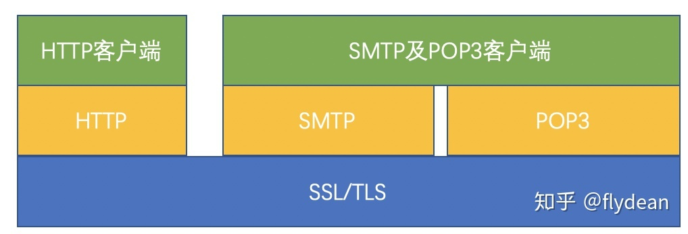
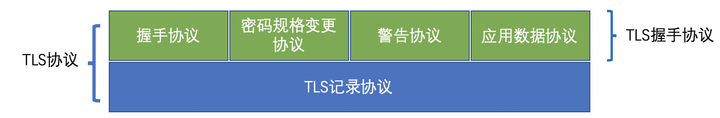
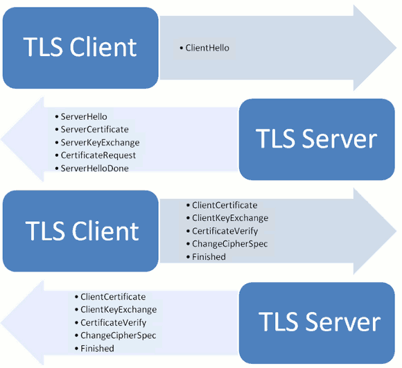
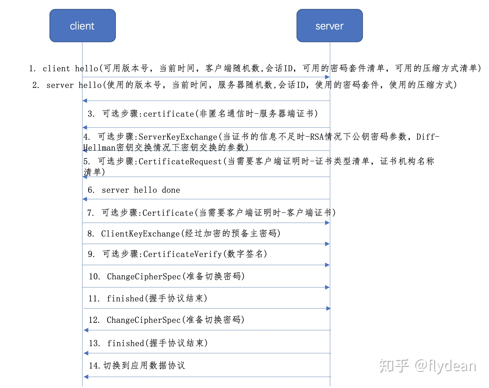
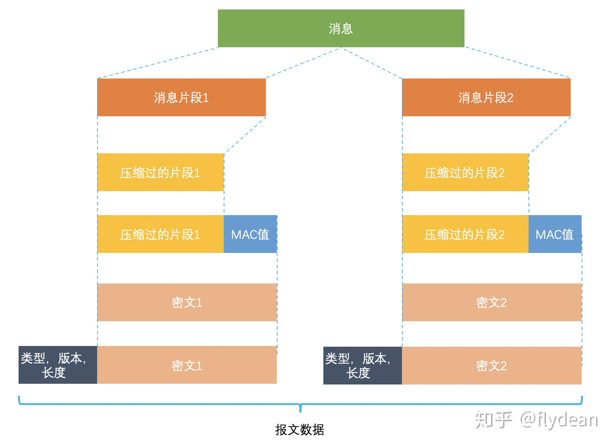

## 1 简介

SSL/TLS是一种密码通信框架，他是世界上使用最广泛的密码通信方法。SSL/TLS综合运用了密码学中的对称密码，消息认证码，公钥密码，数字签名，伪随机数生成器等，可以说是密码学中的集大成者。

SSL(Secure Socket Layer)安全套接层，是1994年由Netscape公司设计的一套协议，并与1995年发布了3.0版本。

TLS(Transport Layer Security)传输层安全是IETF在SSL3.0基础上设计的协议，实际上相当于SSL的后续版本。

## 2 应用

SSL/TLS是一个安全通信框架，上面可以承载HTTP协议或者SMTP/POP3协议等。下层基于TCP可靠数据连接实现。

## 3 架构

TLS主要分为两层
* 底层的是TLS记录协议，主要负责使用对称密码对消息进行加密。

* 上层的是TLS握手协议，主要分为握手协议，密码规格变更协议和应用数据协议4个部分。

* 握手协议负责在客户端和服务器端商定密码算法和共享密钥，包括证书认证，是4个协议中最最复杂的部分。
* 密码规格变更协议负责向通信对象传达变更密码方式的信号
* 警告协议负责在发生错误的时候将错误传达给对方
* 应用数据协议负责将TLS承载的应用数据传达给通信对象的协议。

## 4 握手协议
握手协议是TLS协议中非常重要的协议，通过客户端和服务器端的交互，和共享一些必要信息，从而生成共享密钥和交互证书。

### 1 客户端请求SSL内容

* client hello客户端向服务器端发送一个client hello的消息，包含下面内容：
  1. 可用版本号
  2. 当前时间
  3. 客户端随机数
  4. 会话ID
  5. 可用的密码套件清单
  6. 可用的压缩方式清单

我们之前提到了TLS其实是一套加密框架，其中的有些组件其实是可以替换的，这里可用版本号，可用的密码套件清单，可用的压缩方式清单就是向服务器询问对方支持哪些服务。

客户端随机数是一个由客户端生成的随机数，用来生成对称密钥。

### 2 服务器响应SSL内容

* server hello服务器端收到client hello消息后，会向客户端返回一个server hello消息，包含如下内容：
  1. 使用的版本号。使用的版本号，使用的密码套件，使用的压缩方式是对步骤1的回答。
  2. 当前时间
  3. 服务器随机数。服务器随机数是一个由服务器端生成的随机数，用来生成对称密钥。
  4. 会话ID
  5. 使用的密码套件
  6. 使用的压缩方式

* 可选步骤:certificate服务器端发送自己的证书清单，因为证书可能是层级结构的，所以处理服务器自己的证书之外，还需要发送为服务器签名的证书。客户端将会对服务器端的证书进行验证。如果是以匿名的方式通信则不需要证书。
* 可选步骤:ServerKeyExchange。如果第三步的证书信息不足，则可以发送ServerKeyExchange用来构建加密通道。ServerKeyExchange的内容可能包含两种形式：
  * 如果选择的是RSA协议，那么传递的就是RSA构建公钥密码的参数（E，N）。我们回想一下RSA中构建公钥的公式：密文=明文^E\ mod\ N密文=明文EmodN， 只要知道了E和N，那么就知道了RSA的公钥，这里传递的就是E，N两个数字。具体内容可以参考RSA算法详解
  * 如果选择的是Diff-Hellman密钥交换协议，那么传递的就是密钥交换的参数，具体内容可以参考更加安全的密钥生成方法Diffie-Hellman
* 可选步骤:CertificateRequest如果是在一个受限访问的环境，比如fabric中，服务器端也需要向客户端索要证书。如果并不需要客户端认证，则不需要此步骤。
* server hello done 服务器端发送server hello done的消息告诉客户端自己的消息结束了。

### 3 客户端交换秘钥证书

* 可选步骤:Certificate。对步骤5的回应，客户端发送客户端证书给服务器
* ClientKeyExchange还是分两种情况：
  * 如果是公钥或者RSA模式情况下，客户端将根据客户端生成的随机数和服务器端生成的随机数，生成预备主密码，通过该公钥进行加密，返送给服务器端。
  * 如果使用的是Diff-Hellman密钥交换协议，则客户端会发送自己这一方要生成Diff-Hellman密钥而需要公开的值。具体内容可以参考更加安全的密钥生成方法Diffie-Hellman，这样服务器端可以根据这个公开值计算出预备主密码。
* 可选步骤:CertificateVerify客户端向服务器端证明自己是客户端证书的持有者。
* ChangeCipherSpec(准备切换密码)ChangeCipherSpec是密码规格变更协议的消息，表示后面的消息将会以前面协商过的密钥进行加密。
* finished(握手协议结束)客户端告诉服务器端握手协议结束了。

### 4 服务器交换秘钥证书
* ChangeCipherSpec(准备切换密码)服务器端告诉客户端自己要切换密码了。
* finished(握手协议结束)服务器端告诉客户端，握手协议结束了。
* 切换到应用数据协议。这之后服务器和客户端就是以加密的方式进行沟通了。

### 主密码和预备主密码
* 上面的步骤8生成了预备主密码，主密码是根据密码套件中定义的单向散列函数实现的伪随机数生成器+预备主密码+客户端随机数+服务器端随机数生成的。

* 主密码主要用来生成称密码的密钥，消息认证码的密钥和对称密码的CBC模式所使用的初始化向量。详见分组密码和模式

## 5 记录协议

TLS记录协议主要负责消息的压缩，加密及数据的认证：

消息首先将会被分段，然后压缩，再计算其消息验证码，然后使用对称密码进行加密，加密使用的是CBC模式，CBC模式的初始向量是通过主密码来生成的。

得到密文之后会附加类型，版本和长度等其他信息，最终组成最后的报文数据。

## 6 加密算法

### 对称密码
### 消息认证码
### 公钥密码
### 数字签名
### 伪随机数生成器

## 7 协议关系

### 协议概念

* TCP
  TCP（Transmission Control Protocol 传输控制协议）是一种面向连接的、可靠的、基于字节流的传输层通信协议，是七层协议中的第四层传输层的协议之一，大名鼎鼎的三次握手就发生在这里。

* HTTPS
  HTTPS（全称：Hyper Text Transfer Protocol over Secure Socket Layer），是以安全为目标的HTTP通道，简单讲是HTTP的安全版。

* SSL
  SSL(Secure Sockets Layer 安全套接层)是为网络通信提供安全及数据完整性的一种安全协议。

* TLS
  安全传输层协议（TLS：Transport Layer Security）用于在两个通信应用程序之间提供保密性和数据完整性。该协议由两层组成： TLS 记录协议（TLS Record）和 TLS 握手协议（TLS Handshake），是更新、更安全的SSL版本。

### 关系说明

* HTTPS是应用层的安全协议，TCP是传输层的协议，但是它不安全，因为它是明文传输的，所以SSL的诞生就是给TCP加了一层保险，使HTTPS和TCP之间使用加密传输。而TLS只是SSL的升级版，他们的作用是一样的。
* SSL 凭证安装于伺服器（例如网站服务器）上，但是在浏览器上，使用者仍可看到网站是否受到SSL 的保护。首先，如果SSL 出现在网站上，使用者看到的网址会是以https:// 开头，而不是http:// （多出的一个s 代表「安全」）。按照企业所获得的验证或凭证等级，安全连接会通过挂锁图标或绿色地址栏来显示。
* HTTPS会在网站受到SSL凭证保护时在网址中出现。该凭证的详细资料包括发行机构与网站拥有人的企业名称，可以通过按一下浏览器列上的锁定标记进行检视。
* 应用最广泛的是TLS1.0，接下来是SSL3.0 。但主流浏览器都已经实现了TLS 1.2 的支持。TLS 1.0有时被标示为SSL 3.1，TLS 1.1为SSL 3.2，TLS 1.2为SSL 3.3。TLS和SSL协议理论上属于传输层，在应用层实现，所以我们可以在浏览器中设置是否使用此协议，使用哪一版本的协议。

