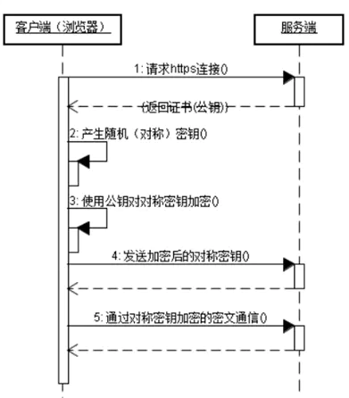

# HTTPS 协议

## 1 HTTPS

### 认证过程

HTTPS在传输数据之前需要客户端（浏览器）与服务端（网站）之间进行一次握手，在握手过程中将确立双方加密传输数据的密码信息。TLS/SSL协议不仅仅是一套加密传输的协议，更是一件经过艺术家精心设计的艺术品，TLS/SSL中使用了非对称加密，对称加密以及HASH算法。握手过程的具体描述如下：

1. 浏览器将自己支持的一套加密规则发送给网站。
2. 网站从中选出一组加密算法与HASH算法，并将自己的身份信息以证书的形式发回给浏览器。证书里面包含了网站地址，加密公钥，以及证书的颁发机构等信息。
3. 浏览器获得网站证书之后浏览器要做以下工作：
   1. 验证证书的合法性（颁发证书的机构是否合法，证书中包含的网站地址是否与正在访问的地址一致等），如果证书受信任，则浏览器栏里面会显示一个小锁头，否则会给出证书不受信的提示。
   2. 如果证书受信任，或者是用户接受了不受信的证书，浏览器会生成一串随机数的密码，并用证书中提供的公钥加密。
   3. 使用约定好的HASH算法计算握手消息，并使用生成的随机数对消息进行加密，最后将之前生成的所有信息发送给网站。
4. 网站接收浏览器发来的数据之后要做以下的操作：
   1. 使用自己的私钥将信息解密取出密码，使用密码解密浏览器发来的握手消息，并验证HASH是否与浏览器发来的一致。
   2. 使用密码加密一段握手消息，发送给浏览器。
5. 浏览器解密并计算握手消息的HASH，如果与服务端发来的HASH一致，此时握手过程结束，之后所有的通信数据将由之前浏览器生成的随机密码并利用对称加密算法进行加密。

### 相关加密算法

* 非对称加密算法：RSA，DSA/DSS
* 对称加密算法：AES，RC4，3DES
* HASH算法：MD5，SHA1，SHA256

## 2 证书签发
### SSL 证书大致分三类:

* 认可的证书颁发机构(如: VeriSign), 或这些机构的下属机构颁发的证书.
* 没有得到认可的证书颁发机构颁发的证书.
* 自签名证书， 自己通过JDK自带工具keytool去生成一个证书，分为临时性的(在开发阶段使用)或在发布的产品中永久性使用的两种.

### CA机构颁发的证书有3种类型：
* 域名型SSL证书（DV SSL）：信任等级普通，只需验证网站的真实性便可颁发证书保护网站；
* 企业型SSL证书（OV SSL）：信任等级强，须要验证企业的身份，审核严格，安全性更高；
* 增强型SSL证书（EV SSL）：信任等级最高，一般用于银行证券等金融机构，审核严格，安全性最高，同时可以激活绿色网址栏。

## 3 HTTPS协议和HTTP协议的区别：
* https协议需要到ca申请证书，一般免费证书很少，需要交费。
* http是超文本传输协议，信息是明文传输，https 则是具有安全性的ssl加密传输协议。
* http和https使用的是完全不同的连接方式用的端口也不一样,前者是80,后者是443。
* http的连接很简单,是无状态的 。
* HTTPS协议是由SSL+HTTP协议构建的可进行加密传输、身份认证的网络协议， 要比http协议安全。
