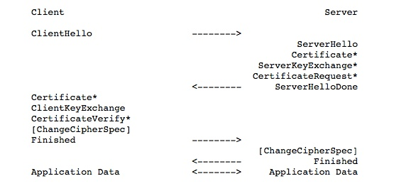
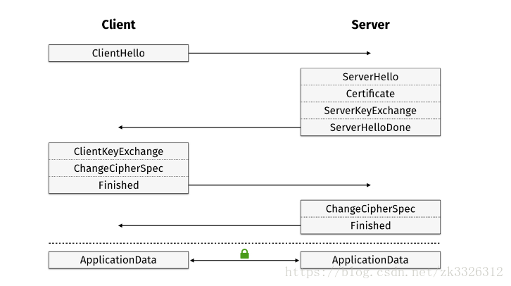
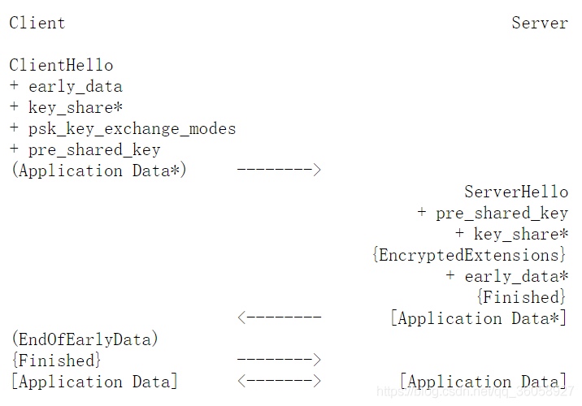
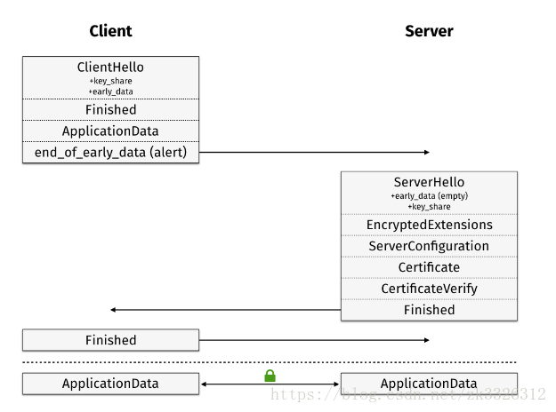

## 1 TSL1.2---->1.3变化

### 密钥协商机制改变

密钥协商机制改变，TLS1.3借助扩展进行密钥交换，TLS1.3只需要三次握手交互，TLS1.2则需要四次握手。相比过去的的版本，引入了新的密钥协商机制 — PSK
* TLS1.2，它通过KeyExchange进行密钥协商，即ServerKeyExchange和ClientKeyExchange，那么密钥交换本身就需要一个交互来回，所以总共有四次握手交互。

* TLS1.2 通过会话重建来加速完成密钥协商过程。

* TLS1.3，通过ClientHello和ServerHello的扩展进行密钥交换，那么就省去了1.2版本中KeyExchange的过程，也就省去了一次握手。

* TLS1.3 0-RTT模式密钥交换。以某些安全属性为代价。当client和server共享一个预共享密钥PSK（从外部获得或通过一个以前的握手获得）时，TLS 1.3允许client在第一个发送出去的消息的early data中携带数据，client使用这个PSK来认证server并加密early data。即在握手之前就有了PSK时，在第一次发送ClientHello时就可以发送加密数据，达到0-RTT数据传输的目的。

### 简化与改进

* 其他还包括新的密钥派生函数，删除多余的报文消息（ChangeCipherSpec，但我抓包测试时还是有）
* 全面使用ECC密码算法，删除不具有前向安全的密码套件。废弃了 3DES、RC4、AES-CBC 等加密组件，废弃了 SHA1、MD5 等哈希算法
* 不再允许对加密报文进行压缩、不再允许双方发起重协商
* DSA 证书不再允许在 TLS 1.3 中使用
* TLS 1.3 的握手不再支持静态的 RSA 密钥交换，这意味着必须使用带有前向安全的 Diffie-Hellman 进行全面握手。
* ServerHello之后的所有握手消息都被加密，引入了加密扩展EncryptedExtension。ServerHello 之后的所有握手消息采取了加密操作，可见明文大大减少

## 2 密钥交换机制(握手协议)

### RSA 秘钥交换（TSL1.2）
1. client 发起请求（Client Hello）
2. server 回复 certificate
3. client使用证书中的公钥，加密预主秘钥，发给 server（Client Key Exchange）
4. server 提取出 预主秘钥，计算主秘钥，然后发送对称秘钥加密的finished。
5. client 计算主秘钥，验证 finished，验证成功后，就可以发送Application Data了。

缺点：RSA秘钥交换不是前向安全算法（证书对应私钥泄漏后，之前抓包的报文都能被解密）。所以在 TLS 1.3中 RSA 已经废弃了。

### ECDHE秘钥交换（TSL1.3）
1. client 发送请求（Client Hello），extension携带支持的椭圆曲线类型。
2. server 回复 Server Hello和certificate等；server选择的椭圆曲线参数，然后 生成私钥（BIGNUM），乘以椭圆曲线的base point得到公钥（POINT），顺便签个名表示自己拥有证书，然后将报文发给client，报文就是Server Key Exchange，其包含了server选择的椭圆曲线参数、自己根据这个参数计算的公钥、自己用证书的私钥对当前报文的签名。
3. client 收到 Server Key Exchange，获得椭圆曲线参数，生成私钥（BIGNUM）后计算公钥（POINT），然后把公钥发出去Client Key Exchange。client使用自己的私钥（BIGNUM）和server的公钥（POINT）计算出主秘钥。
4. server 收到 client的公钥（POINT），使用自己的私钥（BIGNUM），计算主秘钥。两端主秘钥是一致。

### 1-RTT模式密钥交换（TSL1.3）

TLS 1.3 中是这样优化握手的：
1. client 发送请求（Client Hello），extension携带支持的椭圆曲线类型。且对每个自己支持的椭圆曲线类型计算公钥（POINT）。公钥放在extension中的keyshare中。
   1. 支持的加密套件（该作用和之前一样）。
   2. supproted_versions 拓展。包含自己支持的TLS协议版本号。（之前协议没有）
   3. supproted_groups 拓展，表示自己支持的椭圆曲线类型。
   4. key_share拓展。包含supprot_groups中各椭圆曲线对应的public key。（当然可以发送空的，然后server会回复hello request，其中会包含server的key_share，可以用来探测，这里不讨论）。key_share中的椭圆曲线类型必须出现在supproted_groups中。（之前协议没有）
2. server 回复 Server Hello和certificate等；server选择的椭圆曲线参数，然后乘以椭圆曲线的base point得到公钥（POINT）。然后提取Client Hello中的key_share拓展中对应的公钥，计算主秘钥。公钥（POINT）不再和之前的以协议一样放在Server Key Exchange中，而是放在Server Hello的key_share拓展中。client收到server的公钥（POINT）后计算主秘钥。
   1. （1）：supproted_versions 拓展。包含自己从client的supproted_versions中选择的TLS协议版本号。（之前协议没有）
   2. （2）：key_share拓展。包含自己选中的椭圆曲线，以及自己计算出来的公钥。（之前协议没有）
   3. server 发送Change Cipher Spec。（允许不发送）
   4. server发送Encrypted Extension。（加密的）ServerHello之后必须立刻发送Encrypted Extension。这是第一个被加密的数据数据。显然，放在这里的拓展，是和秘钥协商没关系的拓展。（之前协议没有）
   5. server发送Certificate（加密的）。这个报文和之前的协议没有太大区别，，在证书链中的每个证书后面，都有一个extension。（双向认证时也会有区别，有机会再说）。这个extension目前只能是OCSP Status extension和SignedCertificateTimestamps。
   6. server发送Certificate Verify（加密的）这个报文并不陌生，但是以前只出现在双向认证（客户端认证）中，以前Certificate Verify生成的逻辑是将当前所有的握手报文解析解析签名（简单的md+非对称加密）。
   7. server回复Finished（加密的）这个报文的目的和之前协议一样，检验握手报文的完整性。但是计算方法有变化。

### 0-RTT模式密钥交换

* 以某些安全属性为代价。当client和server共享一个预共享密钥PSK（从外部获得或通过一个以前的握手获得）时，TLS 1.3允许client在第一个发送出去的消息的early data中携带数据，client使用这个PSK来认证server并加密early data。即在握手之前就有了PSK时，在第一次发送ClientHello时就可以发送加密数据，达到0-RTT数据传输的目的。

## 3 椭圆曲线

然后我们来看下ECDH的秘钥协商过程，首先EC的意思是椭圆曲线，这个EC提供了一个很厉害的性质，你在曲线上找一个点P，给定一个整数K，求解Q=KP很容易，给定一个点P,Q，知道Q =KP，求K却是个难题。在这个背景下，给定一个大家都知道的大数G，client在每次需要和server协商秘钥时，生成一段随机数a，然后发送A=a*G给server，server收到这段消息（a*G）后，生成一段随机数b，然后发送B=b*G给client，然后server端计算(a*G)*b作为对称秘钥，client端收到后b*G后计算a*(G*b)，因为(a*G)*b = a*(G*b)，所以对称秘钥就是a*G*b啦，攻击者只能截获A=a*G和B=b*G，由于椭圆曲线难题，知道A和G是很难计算a和b的，也就无法计算a*G*b了

## 4 中间人攻击

中间人攻击（Man-in-the-MiddleAttack，简称“MITM攻击”）是一种“间接”的入侵攻击，这种攻击模式是通过各种技术手段将受入侵者控制的一台计算机虚拟放置在网络连接中的两台通信计算机之间，这台计算机就称为“中间人”。