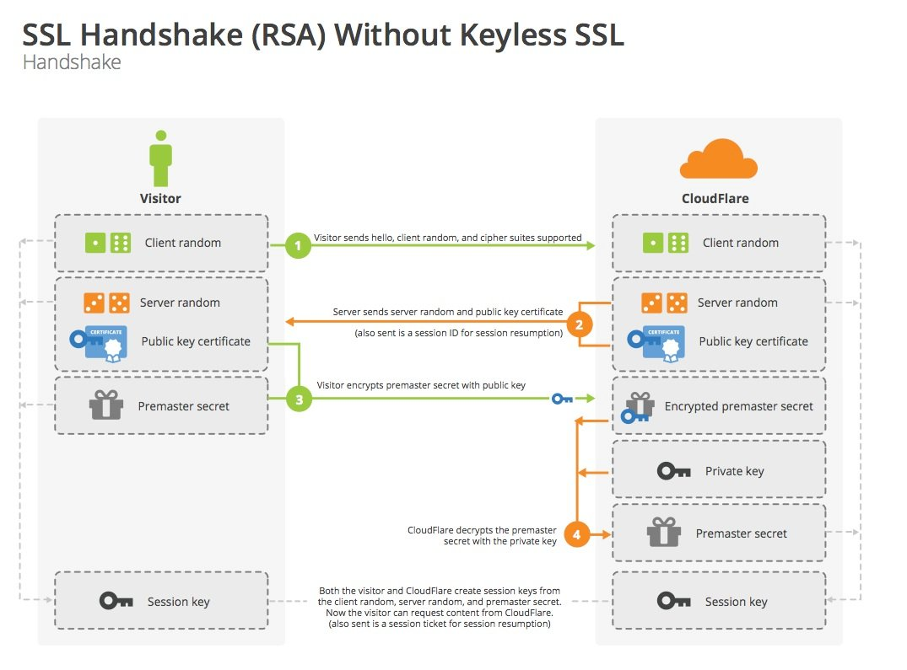
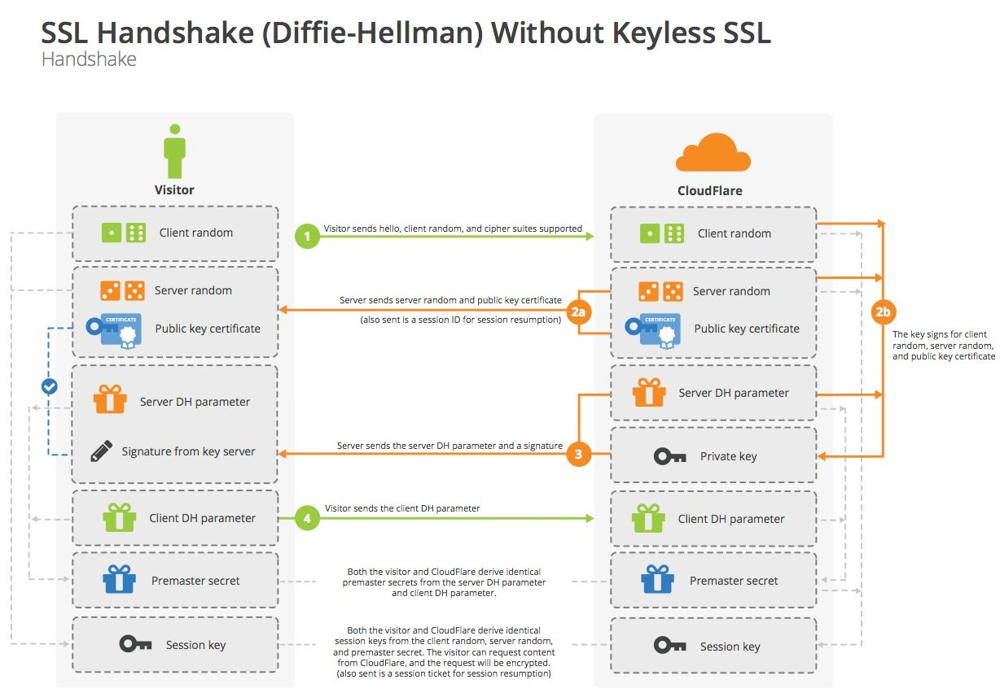

> 握手协议主要包括：**密钥协商机制**和**密钥交换算法**。基本的密钥协商机制是一样的，只是在不同的步骤交换的内容不一样。
> 握手是为了协商出一个client和server端都认可的一个**对称秘钥**，典型的秘钥协商算法有两种，RSA和ECDH，简明介绍下这两种算法会让你对这个过程更加清晰。
## 0 TLS1.1

### 协议构成
```
enum {
      hello_request(0), client_hello(1), server_hello(2),
      certificate(11), server_key_exchange (12),
      certificate_request(13), server_hello_done(14),
      certificate_verify(15), client_key_exchange(16),
      finished(20), (255)
} HandshakeType;

struct {
      HandshakeType msg_type;    /* handshake type */
      uint24 length;             /* bytes in message */
      select (HandshakeType) {
         case hello_request:       HelloRequest;
         case client_hello:        ClientHello;
         case server_hello:        ServerHello;
         case certificate:         Certificate;
         case server_key_exchange: ServerKeyExchange;
         case certificate_request: CertificateRequest;
         case server_hello_done:   ServerHelloDone;
         case certificate_verify:  CertificateVerify;
         case client_key_exchange: ClientKeyExchange;
         case finished:            Finished;
      } body;
} Handshake;


enum { null(0), (255) } CompressionMethod;
struct {
      ProtocolVersion client_version;
      Random random;
      SessionID session_id;
      CipherSuite cipher_suites<2..2^16-1>;
      CompressionMethod compression_methods<1..2^8-1>;
} ClientHello;


struct {
   ProtocolVersion server_version;
   Random random;
   SessionID session_id;
   CipherSuite cipher_suite;
   CompressionMethod compression_method;
} ServerHello;

struct {
      ASN.1Cert certificate_list<0..2^24-1>;
} Certificate;

struct {
      select (KeyExchangeAlgorithm) {
         case diffie_hellman:
            ServerDHParams params;
            Signature signed_params;
         case rsa:
            ServerRSAParams params;
            Signature signed_params;
      };
} ServerKeyExchange;


struct {
      select (SignatureAlgorithm) {
         case anonymous: struct { };
         case rsa:
            digitally-signed struct {
                  opaque md5_hash[16];
                  opaque sha_hash[20];
            };
         case dsa:
            digitally-signed struct {
                  opaque sha_hash[20];
            };
         };
      };
} Signature;

struct {
      ClientCertificateType certificate_types<1..2^8-1>;
      DistinguishedName certificate_authorities<0..2^16-1>;
} CertificateRequest;

struct {
      select (KeyExchangeAlgorithm) {
         case rsa: EncryptedPreMasterSecret;
         case diffie_hellman: ClientDiffieHellmanPublic;
      } exchange_keys;
} ClientKeyExchange;

struct {
      ProtocolVersion client_version;
      opaque random[46];
} PreMasterSecret;
```

### 密钥交换算法

```
Key Exchange Algorithm  Certificate Key Type

RSA                     RSA public key; the certificate MUST
                        allow the key to be used for encryption.

DHE_DSS                 DSS public key.

DHE_RSA                 RSA public key that can be used for
                        signing.

DH_DSS                  Diffie-Hellman key. The algorithm used
                        to sign the certificate MUST be DSS.

DH_RSA                  Diffie-Hellman key. The algorithm used
                        to sign the certificate MUST be RSA.
```

## 1 TLS1.2密钥协商机制


### 协议构成
* This protocol is used to negotiate the secure attributes of a session.  
```
enum {
      hello_request(0), client_hello(1), server_hello(2),
      certificate(11), server_key_exchange (12),
      certificate_request(13), server_hello_done(14),
      certificate_verify(15), client_key_exchange(16),
      finished(20), (255)
} HandshakeType;

struct {
      HandshakeType msg_type;    /* handshake type */
      uint24 length;             /* bytes in message */
      select (HandshakeType) {
         case hello_request:       HelloRequest;
         case client_hello:        ClientHello;
         case server_hello:        ServerHello;
         case certificate:         Certificate;
         case server_key_exchange: ServerKeyExchange;
         case certificate_request: CertificateRequest;
         case server_hello_done:   ServerHelloDone;
         case certificate_verify:  CertificateVerify;
         case client_key_exchange: ClientKeyExchange;
         case finished:            Finished;
      } body;
} Handshake;


enum { null(0), (255) } CompressionMethod;
struct {
      ProtocolVersion client_version;
      Random random;
      SessionID session_id;
      CipherSuite cipher_suites<2..2^16-1>;
      CompressionMethod compression_methods<1..2^8-1>;
} ClientHello;


struct {
   ProtocolVersion server_version;
   Random random;
   SessionID session_id;
   CipherSuite cipher_suite;
   CompressionMethod compression_method;
} ServerHello;

struct {
      ASN.1Cert certificate_list<0..2^24-1>;
} Certificate;

struct {
      select (KeyExchangeAlgorithm) {
         case diffie_hellman:
            ServerDHParams params;
            Signature signed_params;
         case rsa:
            ServerRSAParams params;
            Signature signed_params;
      };
} ServerKeyExchange;


struct {
      select (SignatureAlgorithm) {
         case anonymous: struct { };
         case rsa:
            digitally-signed struct {
                  opaque md5_hash[16];
                  opaque sha_hash[20];
            };
         case dsa:
            digitally-signed struct {
                  opaque sha_hash[20];
            };
         };
      };
} Signature;

struct {
      ClientCertificateType certificate_types<1..2^8-1>;
      DistinguishedName certificate_authorities<0..2^16-1>;
} CertificateRequest;

struct {
      select (KeyExchangeAlgorithm) {
         case rsa: EncryptedPreMasterSecret;
         case diffie_hellman: ClientDiffieHellmanPublic;
      } exchange_keys;
} ClientKeyExchange;

struct {
      ProtocolVersion client_version;
      opaque random[46];
} PreMasterSecret;
```


### FULL Handshake密钥协商机制
* TLS1.2，它通过KeyExchange进行密钥协商，即ServerKeyExchange和ClientKeyExchange，那么密钥交换本身就需要一个交互来回，所以总共有四次握手交互。
```
Client                                               Server

ClientHello                  -------->
                                                ServerHello
                                                Certificate*
                                          ServerKeyExchange*
                                          CertificateRequest*
                              <--------      ServerHelloDone
Certificate*
ClientKeyExchange
CertificateVerify*
[ChangeCipherSpec]
Finished                     -------->
                                          [ChangeCipherSpec]
                              <--------             Finished
Application Data             <------->     Application Data

         Fig. 1. Message flow for a full handshake

```


### Session ID Handshake密钥协商机制
* TLS1.2 通过会话重建来加速完成密钥协商过程。
* 如果找到匹配项，并且服务器愿意重新建立指定会话状态下的连接，它将发送一个具有相同会话 ID 值的 ServerHello。此时，双方客户端和服务器必须发送更改密码规范消息并继续直接到完成的消息。一旦重新建立完成，客户端和服务器可以开始交换应用程序层数据。（请参见下面的流程图。）如果会话 ID 不匹配，服务器生成一个新的会话 ID， TLS 客户端和服务器执行完整的握手。

```
Client                                                Server

ClientHello                   -------->
                                                   ServerHello
                                          [ChangeCipherSpec]
                              <--------             Finished
[ChangeCipherSpec]
Finished                      -------->
Application Data              <------->     Application Data

      Fig. 2. Message flow for an abbreviated handshake
```


### key-exchange-algorithm密钥交换算法

```
Key Exchange Alg.  Certificate Key Type

RSA                RSA public key; the certificate MUST allow the
RSA_PSK            key to be used for encryption (the
                     keyEncipherment bit MUST be set if the key
                     usage extension is present).
                     Note: RSA_PSK is defined in [TLSPSK].
DHE_RSA            RSA public key; the certificate MUST allow the
ECDHE_RSA          key to be used for signing (the
                     digitalSignature bit MUST be set if the key
                     usage extension is present) with the signature
                     scheme and hash algorithm that will be employed
                     in the server key exchange message.
                     Note: ECDHE_RSA is defined in [TLSECC].

DHE_DSS            DSA public key; the certificate MUST allow the
                     key to be used for signing with the hash
                     algorithm that will be employed in the server
                     key exchange message.

DH_DSS             Diffie-Hellman public key; the keyAgreement bit
DH_RSA             MUST be set if the key usage extension is
                     present.

ECDH_ECDSA         ECDH-capable public key; the public key MUST
ECDH_RSA           use a curve and point format supported by the
                     client, as described in [TLSECC].

ECDHE_ECDSA        ECDSA-capable public key; the certificate MUST
                     allow the key to be used for signing with the
                     hash algorithm that will be employed in the
                     server key exchange message.  The public key
                     MUST use a curve and point format supported by
                     the client, as described in  [TLSECC].
```
### RSA key-exchange-algorithm密钥交换算法



RSA 秘钥交换
1. client 发起请求（Client Hello）
2. server 回复 certificate
3. client使用证书中的公钥，加密预主秘钥，发给 server（Client Key Exchange）
4. server 提取出 预主秘钥，计算主秘钥，然后发送对称秘钥加密的finished。
5. client 计算主秘钥，验证 finished，验证成功后，就可以发送Application Data了。

缺点：RSA秘钥交换不是前向安全算法（证书对应私钥泄漏后，之前抓包的报文都能被解密）。所以在 TLS 1.3中 RSA 已经废弃了。

### DH key-exchange-algorithm密钥交换算法


## 2 TLS1.3
### 协议构成
* The handshake protocol is used to negotiate the security parameters of a connection.
```
enum {
      client_hello(1),
      server_hello(2),
      new_session_ticket(4),
      end_of_early_data(5),
      encrypted_extensions(8),
      certificate(11),
      certificate_request(13),
      certificate_verify(15),
      finished(20),
      key_update(24),
      message_hash(254),
      (255)
} HandshakeType;

struct {
      HandshakeType msg_type;    /* handshake type */
      uint24 length;             /* remaining bytes in message */
      select (Handshake.msg_type) {
         case client_hello:          ClientHello;
         case server_hello:          ServerHello;
         case end_of_early_data:     EndOfEarlyData;
         case encrypted_extensions:  EncryptedExtensions;
         case certificate_request:   CertificateRequest;
         case certificate:           Certificate;
         case certificate_verify:    CertificateVerify;
         case finished:              Finished;
         case new_session_ticket:    NewSessionTicket;
         case key_update:            KeyUpdate;
      };
} Handshake;

struct {
      ProtocolVersion legacy_version = 0x0303;    /* TLS v1.2 */
      Random random;
      opaque legacy_session_id<0..32>;
      CipherSuite cipher_suites<2..2^16-2>;
      opaque legacy_compression_methods<1..2^8-1>;
      Extension extensions<8..2^16-1>;
} ClientHello;

      struct {
      ProtocolVersion legacy_version = 0x0303;    /* TLS v1.2 */
      Random random;
      opaque legacy_session_id_echo<0..32>;
      CipherSuite cipher_suite;
      uint8 legacy_compression_method = 0;
      Extension extensions<6..2^16-1>;
} ServerHello;

      struct {
   ExtensionType extension_type;
   opaque extension_data<0..2^16-1>;
} Extension;

enum {
   server_name(0),                             /* RFC 6066 */
   max_fragment_length(1),                     /* RFC 6066 */
   status_request(5),                          /* RFC 6066 */
   supported_groups(10),                       /* RFC 8422, 7919 */
   signature_algorithms(13),                   /* RFC 8446 */
   use_srtp(14),                               /* RFC 5764 */
   heartbeat(15),                              /* RFC 6520 */
   application_layer_protocol_negotiation(16), /* RFC 7301 */
   signed_certificate_timestamp(18),           /* RFC 6962 */
   client_certificate_type(19),                /* RFC 7250 */
   server_certificate_type(20),                /* RFC 7250 */
   padding(21),                                /* RFC 7685 */
   pre_shared_key(41),                         /* RFC 8446 */
   early_data(42),                             /* RFC 8446 */
   supported_versions(43),                     /* RFC 8446 */
   cookie(44),                                 /* RFC 8446 */
   psk_key_exchange_modes(45),                 /* RFC 8446 */
   certificate_authorities(47),                /* RFC 8446 */
   oid_filters(48),                            /* RFC 8446 */
   post_handshake_auth(49),                    /* RFC 8446 */
   signature_algorithms_cert(50),              /* RFC 8446 */
   key_share(51),                              /* RFC 8446 */
   (65535)
} ExtensionType;

struct {
      select (Handshake.msg_type) {
         case client_hello:
               ProtocolVersion versions<2..254>;

         case server_hello: /* and HelloRetryRequest */
               ProtocolVersion selected_version;
      };
} SupportedVersions;


```
### 密钥协商机制+密钥交换算法
- Full Handshake 
-  (EC)DHE (Diffie-Hellman over either finite fields or elliptic
   curves)

-  PSK-only

-  PSK with (EC)DHE

- 0-RTT Handshake

### FULL Handshake密钥协商机制
* TLS1.3，通过ClientHello和ServerHello的扩展进行密钥交换，那么就省去了1.2版本中KeyExchange的过程，也就省去了一次握手。
```
   Figure 1 below shows the basic full TLS handshake:

       Client                                           Server

Key  ^ ClientHello
Exch | + key_share*
     | + signature_algorithms*
     | + psk_key_exchange_modes*
     v + pre_shared_key*       -------->
                                                  ServerHello  ^ Key
                                                 + key_share*  | Exch
                                            + pre_shared_key*  v
                                        {EncryptedExtensions}  ^  Server
                                        {CertificateRequest*}  v  Params
                                               {Certificate*}  ^
                                         {CertificateVerify*}  | Auth
                                                   {Finished}  v
                               <--------  [Application Data*]
     ^ {Certificate*}
Auth | {CertificateVerify*}
     v {Finished}              -------->
       [Application Data]      <------->  [Application Data]

Figure 1: Message Flow for Full TLS Handshake
```


1. client 发送请求（Client Hello），extension携带支持的椭圆曲线类型。且对每个自己支持的椭圆曲线类型计算公钥（POINT）。公钥放在extension中的keyshare中。
   1. 支持的加密套件（该作用和之前一样）。
   2. supproted_versions 拓展。包含自己支持的TLS协议版本号。（之前协议没有）
   3. supproted_groups 拓展，表示自己支持的椭圆曲线类型。
   4. key_share拓展。包含supprot_groups中各椭圆曲线对应的public key。（当然可以发送空的，然后server会回复hello request，其中会包含server的key_share，可以用来探测，这里不讨论）。key_share中的椭圆曲线类型必须出现在supproted_groups中。（之前协议没有）
2. server 回复 Server Hello和certificate等；server选择的椭圆曲线参数，然后乘以椭圆曲线的base point得到公钥（POINT）。然后提取Client Hello中的key_share拓展中对应的公钥，计算主秘钥。公钥（POINT）不再和之前的以协议一样放在Server Key Exchange中，而是放在Server Hello的key_share拓展中。client收到server的公钥（POINT）后计算主秘钥。
   1. （1）：supproted_versions 拓展。包含自己从client的supproted_versions中选择的TLS协议版本号。（之前协议没有）
   2. （2）：key_share拓展。包含自己选中的椭圆曲线，以及自己计算出来的公钥。（之前协议没有）
   3. server 发送Change Cipher Spec。（允许不发送）
   4. server发送Encrypted Extension。（加密的）ServerHello之后必须立刻发送Encrypted Extension。这是第一个被加密的数据数据。显然，放在这里的拓展，是和秘钥协商没关系的拓展。（之前协议没有）
   5. server发送Certificate（加密的）。这个报文和之前的协议没有太大区别，，在证书链中的每个证书后面，都有一个extension。（双向认证时也会有区别，有机会再说）。这个extension目前只能是OCSP Status extension和SignedCertificateTimestamps。
   6. server发送Certificate Verify（加密的）这个报文并不陌生，但是以前只出现在双向认证（客户端认证）中，以前Certificate Verify生成的逻辑是将当前所有的握手报文解析解析签名（简单的md+非对称加密）。
   7. server回复Finished（加密的）这个报文的目的和之前协议一样，检验握手报文的完整性。但是计算方法有变化。

### DHE share Handshake

* If the client has not provided a sufficient **"key_share"** extension(e.g., it includes only DHE or ECDHE groups)

```

Client                                               Server

ClientHello
+ key_share             -------->
                                          HelloRetryRequest
                        <--------               + key_share
ClientHello
+ key_share             -------->
                                                ServerHello
                                                + key_share
                                       {EncryptedExtensions}
                                       {CertificateRequest*}
                                             {Certificate*}
                                       {CertificateVerify*}
                                                {Finished}
                        <--------       [Application Data*]
{Certificate*}
{CertificateVerify*}
{Finished}              -------->
[Application Data]      <------->        [Application Data]

      Figure 2: Message Flow for a Full Handshake with
                  Mismatched Parameters

```

1. client 发送请求（Client Hello），extension携带支持的椭圆曲线类型。
2. server 回复 Server Hello和certificate等；server选择的椭圆曲线参数，然后 生成私钥（BIGNUM），乘以椭圆曲线的base point得到公钥（POINT），顺便签个名表示自己拥有证书，然后将报文发给client，报文就是Server Key Exchange，其包含了server选择的椭圆曲线参数、自己根据这个参数计算的公钥、自己用证书的私钥对当前报文的签名。
3. client 收到 Server Key Exchange，获得椭圆曲线参数，生成私钥（BIGNUM）后计算公钥（POINT），然后把公钥发出去Client Key Exchange。client使用自己的私钥（BIGNUM）和server的公钥（POINT）计算出主秘钥。
4. server 收到 client的公钥（POINT），使用自己的私钥（BIGNUM），计算主秘钥。两端主秘钥是一致。


### PSK Handshake 

* Resumption and Pre-Shared Key (PSK)
* 由于服务器通过 PSK 进行身份验证，因此它不会发送证书或 CertificateVerify 消息。
* 当客户提供通过 PSK 恢复，它还应该提供“key_share”扩展名到服务器允许服务器拒绝恢复，而是使用正常的full handshake过程。
* 服务器响应一个“pre_shared_key”扩展来协商使用 PSK 密钥。可以使用“key_share”响应扩展做（EC）DHE密钥建立。

```
Client                                               Server

Initial Handshake:
ClientHello
+ key_share               -------->
                                                ServerHello
                                                + key_share
                                    {EncryptedExtensions}
                                    {CertificateRequest*}
                                             {Certificate*}
                                       {CertificateVerify*}
                                                {Finished}
                        <--------     [Application Data*]
{Certificate*}
{CertificateVerify*}
{Finished}                -------->
                        <--------      [NewSessionTicket]
[Application Data]        <------->      [Application Data]


Subsequent Handshake:
ClientHello
+ key_share*
+ pre_shared_key          -------->
                                                ServerHello
                                          + pre_shared_key
                                             + key_share*
                                    {EncryptedExtensions}
                                                {Finished}
                        <--------     [Application Data*]
{Finished}                -------->
[Application Data]        <------->      [Application Data]

   Figure 3: Message Flow for Resumption and PSK
```


### 0-RTT Handshake

* TLS1.3 0-RTT模式密钥交换。以某些安全属性为代价。当client和server共享一个预共享密钥PSK（从外部获得或通过一个以前的握手获得）时，TLS 1.3允许client在第一个发送出去的消息的early data中携带数据，client使用这个PSK来认证server并加密early data。即在握手之前就有了PSK时，在第一次发送ClientHello时就可以发送加密数据，达到0-RTT数据传输的目的。
* This data is not forward secret, as it is encrypted solely under keys derived using the offered PSK.
```
Client                                               Server

ClientHello
+ early_data
+ key_share*
+ psk_key_exchange_modes
+ pre_shared_key
(Application Data*)     -------->
                                                ServerHello
                                             + pre_shared_key
                                                + key_share*
                                       {EncryptedExtensions}
                                                + early_data*
                                                   {Finished}
                        <--------       [Application Data*]
(EndOfEarlyData)
{Finished}              -------->
[Application Data]      <------->        [Application Data]

      Figure 4: Message Flow for a 0-RTT Handshake

```

## 3 椭圆曲线原理

* ECDH的秘钥协商过程，首先EC的意思是椭圆曲线，这个EC提供了一个很厉害的性质，你在曲线上找一个点P，给定一个整数K，求解Q=KP很容易，给定一个点P,Q，知道Q =KP，求K却是个难题。
* 在这个背景下，给定一个大家都知道的大数G，client在每次需要和server协商秘钥时，生成一段随机数a，然后发送A=a\*G给server。
* server收到这段消息（a\*G）后，生成一段随机数b，然后发送B=b\*G给client。
* server端计算(a\*G)\*b作为对称秘钥，client端收到后b\*G后计算a*(G\*b)，因为(a\*G)\*b = a\*(G\*b)，所以对称秘钥就是a\*G\*b啦。
* 攻击者只能截获A=a\*G和B=b\*G，由于椭圆曲线难题，知道A和G是很难计算a和b的，也就无法计算a*G*b了
