<!-- 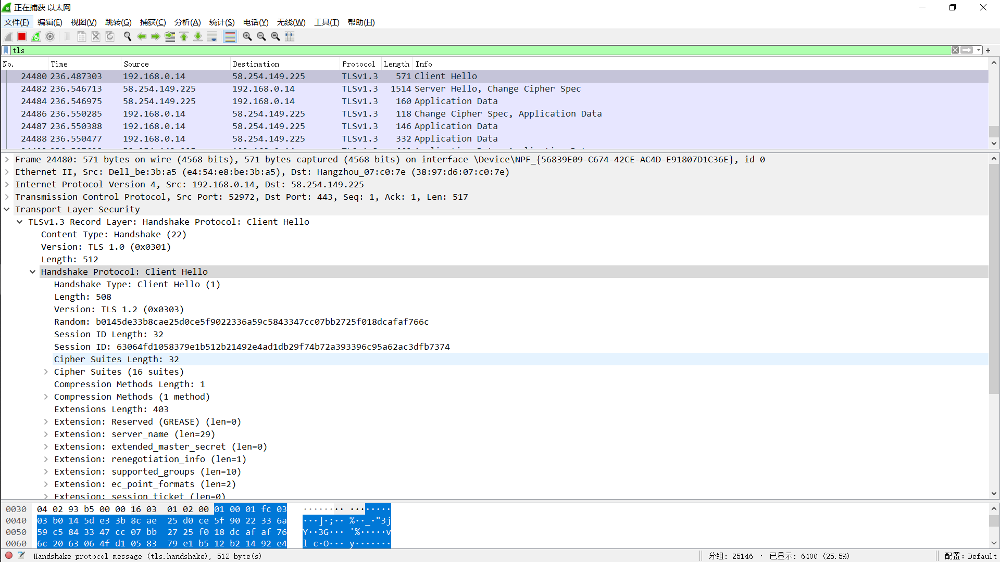 -->

# TLS1.3实验

> 主要包括两部分实验
> * TLS协议数据内容
> * TLS协议交互过程

## TLS1.3数据内容

### 实验截图
* client hello
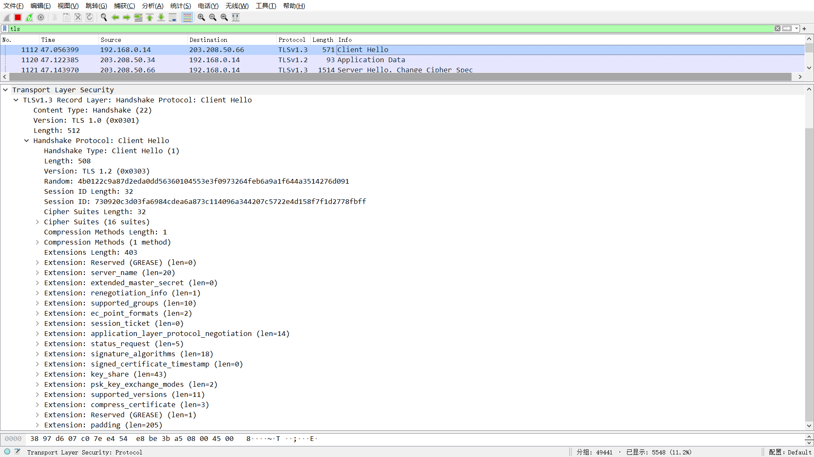
* server hello

* client change cipher spec & client data
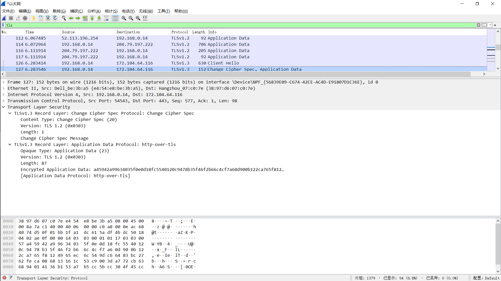
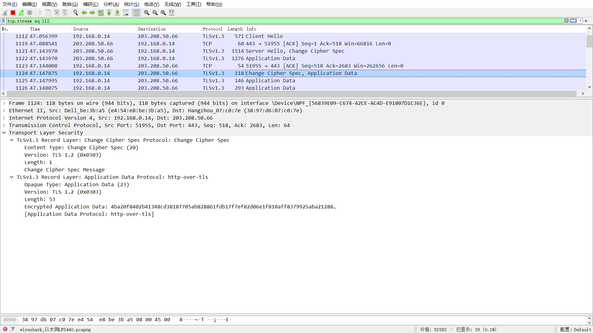

* server data
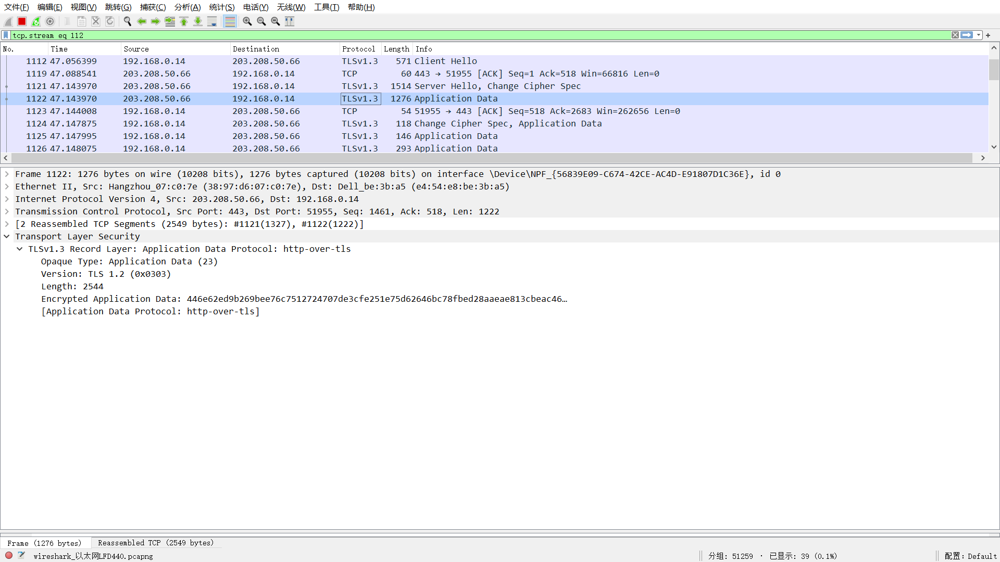

* 证书实例
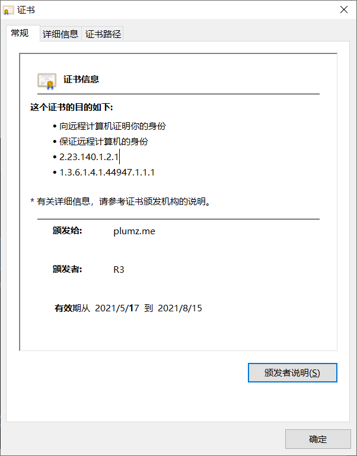
### client hello
* TLSrecordlayer包括content type,TLS version,length。包裹的TLS handshake protocol
* Handshake protocol包括
  * handshake type
  * length
  * version
  * random
  * session id length
  * session id(通过session ID判断是否是同一个会话)
  * cipher suits length
  * cipher suits
  * compress method length
  * compress method 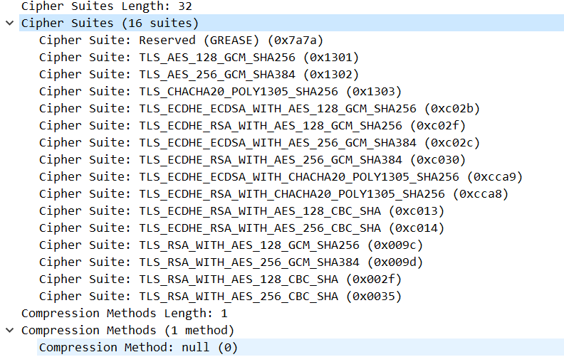
* extensions & extension length
  * extension reserved
  * extension server_name 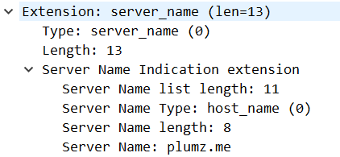包含了服务器的名称
  * extension extended_master_secrete
  * extension renegotiation info
  * extension support_groups 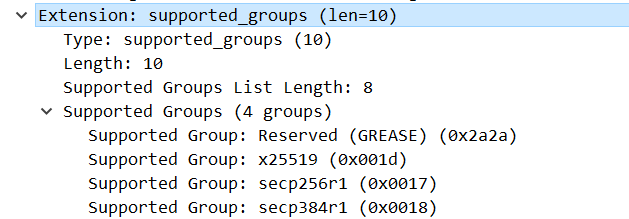 client发送clientHello(extension)消息,extension中的support_groups中携带client支持的椭圆曲线的类型,并且在扩展key_share中计算出了相对应的公钥,一起发送给server
  * extension ec_point_format 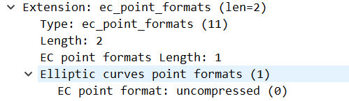 椭圆曲线算法的选择
  * extension  session_ticket
  * extension application_layer_protocol_negotiation(ALPN)ALPN (Application Layer Protocol Negotiation)是TLS的扩展，允许在安全连接的基础上进行应用层协议的协商。 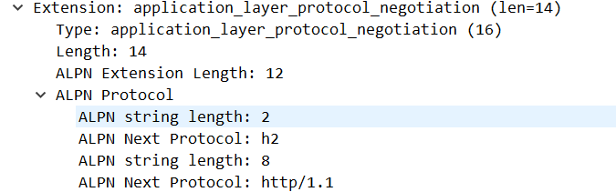
  * extension signature algorithm 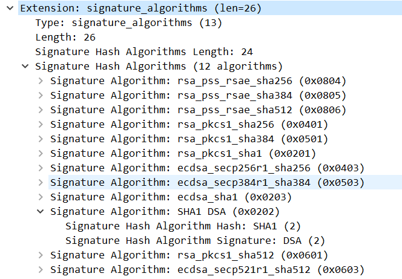包含了一些列签名算法
  * extension signed_certifage_timestamp
  * extension key_share “key_share”带上曲线对应的客户端公钥参数，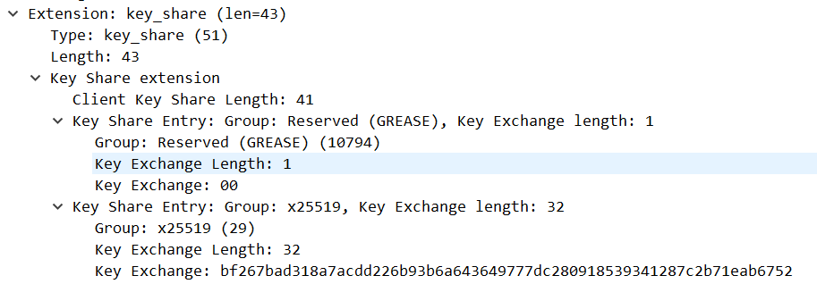
  * extension psk_key_exchange_mode 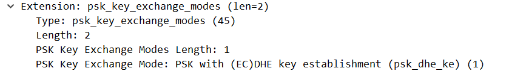
  * extension support versions 向前兼容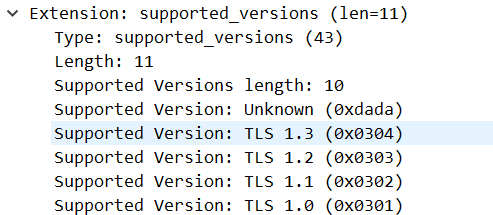
  * extension compress_certificate
  * extension pre_share_key pre_shared_key（对称秘钥）是预共享秘钥认证机制PSK生成的对称秘钥，PSK是一种身份认证机制。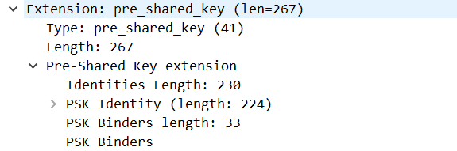

### server hello
* TLSrecordlayer包括content type,TLS version,length。包裹的TLS handshake protocol
* Handshake protocol包括
  * handshake type
  * length
  * version
  * random
  * session id length
  * session id(通过session ID判断是否是同一个会话)
  * cipher suits length
  * cipher suits
  * compress method length
  * compress method 
* extensions length
  * support version支持的版本
  * key share 椭圆曲线算法的公钥
  * pre_share_key PSK算法的密钥

* change cipher spec protocol
  * 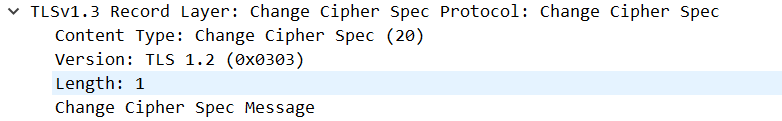
* 加密内容，不会显示
  * Server端发送 Encrypted  Extension （加密）ServerHello 之后必须立刻发送  Encryption Extension ,这是第一个被加密的数据，和秘钥协商没有关系（之前TLS1.2没有）
  * Server端发送 Certificate（加密）这个报文和之前的协议没有太大的差别，唯一的是证书链中的每个证书后面都有一个 extension（双向认证）
  * server端发送certificate verify（加密）certificate verify 生成的额逻辑是当前所有的握手报文解析签名
  * Server端回复Finished （加密）
### client change cipher spec & client data
* Change Cipher Spec
* Client发送加密的Finished
* client加密发送数据

### server data
* server 发送加密数据

## TLS1.3协议交互过程

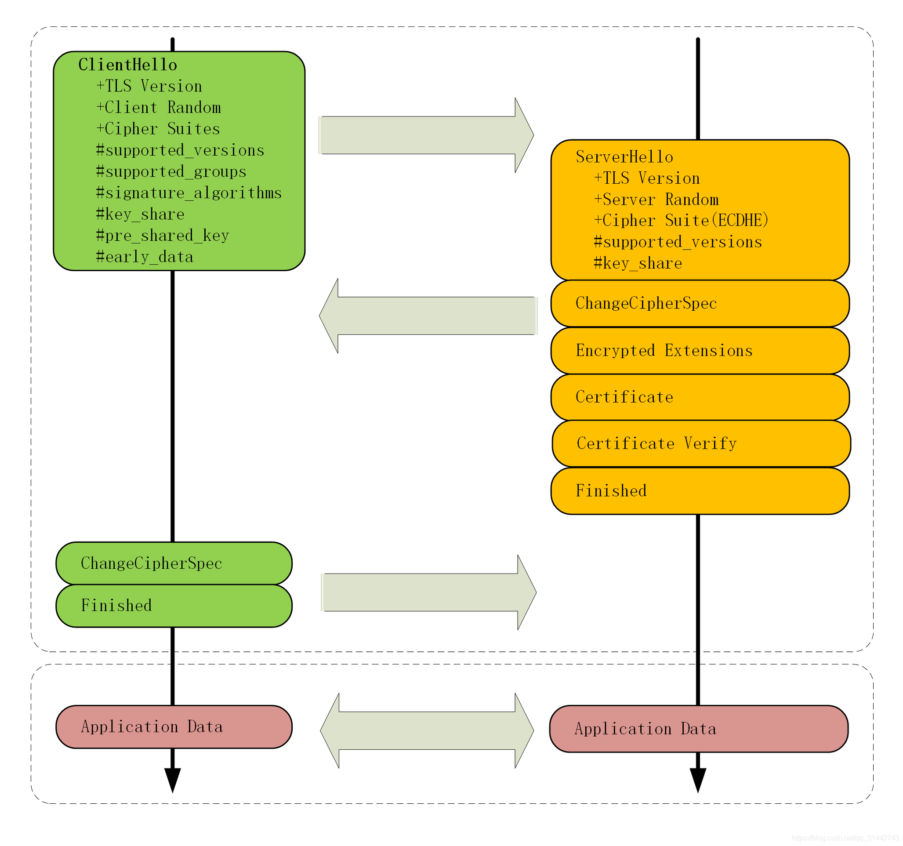
