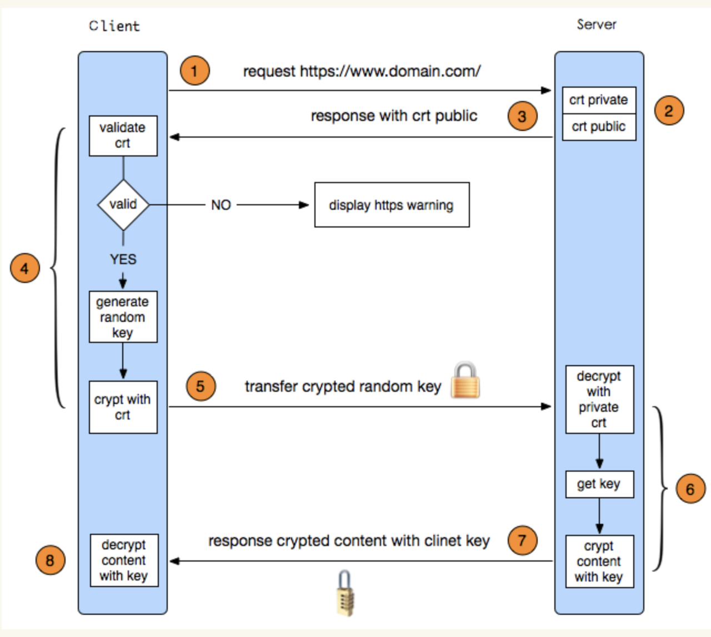

### 认证流程

SSL证书认证的流程可以概括为以下几个主要步骤：

1. **准备与申请** ：

* **确定域名/IP地址** ：首先确定需要为哪个域名或公网IP地址申请SSL证书。
* **生成CSR** ：创建一个Certificate Signing Request（CSR）文件。这个过程中，会在服务器上生成一对公钥和私钥。公钥将包含在CSR中，而私钥则需安全地保存在服务器上。CSR还包含了申请者的详细信息（如组织名称、域名、联系人信息等），这些信息将被包含在最终签发的SSL证书中。

2. **提交与审核** ：

* **提交CSR** ：将生成的CSR文件提交给选定的SSL证书颁发机构（CA）。
* **身份验证** ：根据所申请的SSL证书类型（DV、OV、EV），CA进行相应的身份验证：
  *  **DV（Domain Validation）** ：仅验证域名所有权，通常通过添加指定的DNS记录、回复电子邮件至注册邮箱或上传特定文件至指定位置等方式完成。
  *  **OV（Organization Validation）** ：除域名验证外，还需验证申请组织的真实性和合法性，可能需要提供企业注册信息、电话验证等。
  *  **EV（Extended Validation）** ：最严格的验证级别，除了OV要求的所有信息外，还会进行更深入的企业身份核实，包括法律状态、运营状况等，并可能需要电话验证。

3. **颁发与安装** ：

* **证书签发** ：CA在完成身份验证后，使用其私钥对包含申请者信息和公钥的证书数据进行签名，生成正式的SSL证书（CRT文件）。
* **接收与部署** ：申请者收到签发的SSL证书后，将其安装到服务器上，与之前生成的私钥关联。在Web服务器配置中启用SSL并指向正确的证书和私钥文件。

4. **客户端验证** ：

* **发起HTTPS连接** ：用户访问受SSL保护的网站时，浏览器发起HTTPS请求。
* **证书传输** ：服务器响应请求时，随同其他握手信息一起发送其SSL证书（CRT文件）给客户端。
* **证书验证** ：
  *  **链验证** ：客户端检查证书的有效期、CA的可信性以及证书链的完整性（如有中间证书，需验证其有效性并构建完整的信任链至根证书）。
  *  **域名匹配** ：确认证书中的域名与正在访问的域名一致。
  *  **公钥加密** ：客户端使用接收到的服务器公钥加密一个随机生成的对称会话密钥，用于后续的加密通信。
* **身份确认与加密通信** ：如果所有验证步骤均通过，客户端认为服务器身份可信，开始使用协商的对称密钥进行加密通信。反之，若验证失败，浏览器会显示警告，提示用户连接可能不安全。

以上就是SSL证书从申请到客户端验证的完整流程，旨在确保网络通信的安全性和数据的机密性。

