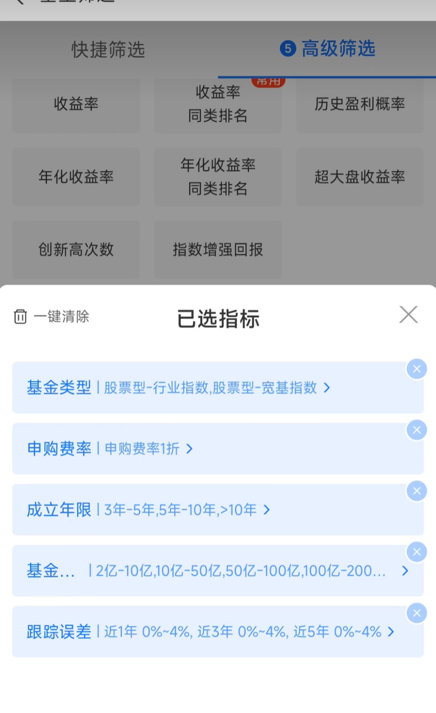
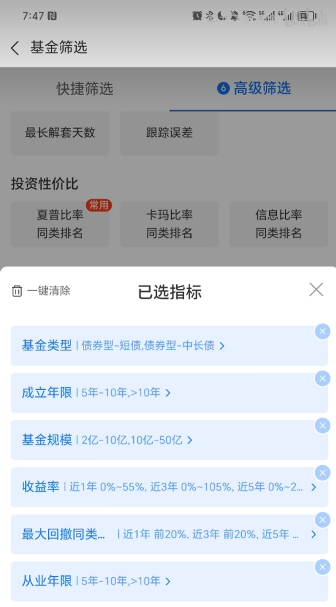

## 1 基金的评价方法

八个主要的方面。

### 资产评估

最重要的是确认基金投资的对象。
* 是否有投资价值，基本面是否是向好的方向发展。

### 规模时长

一般基金规模较大的基金更受市场认可，不容易受到大额申购、赎回的影响，稳定性比较好。

基金成立时间越早，基金公司越靠谱，指数基金管理规模越大，则管理基金的经验更丰富，应对风险的决策能力越强。

### 走势时机

基金和股票一样，有各种算法试图计算出资产价格未来的发展趋势，相对基金来说反而可能简单一些。

分析基金的走势，一个是为了预测未来基金大致的发展方向，另一个是观察过去基金净值变化是否符合规律，进一步获取投资可能面临的风险。

对于基金来说主要的判断点有以下几种
* 是否跑赢行业基准，用来对比同类型基金中哪些好哪些坏。
* 是否超过沪深300。
* 基金持有一般超过3个月，超过一年也十分正常，需要看一下1月、3月、6月、1年、3年等周期性收益率
* 估值水平。如果是股票型基金需要判断一下当前是不是处于低估值水平，避免追涨杀跌。

### 跟踪误差（被动指数型）

对于被动型指数基金，跟踪误差是衡量基金投资准确性的重要指标。

跟踪误差。指数基金收益率和煮熟收益率之间的误差。误差存在的原因分为两部分：
1. 不可避免的差异：交易费用、托管费和管理费、制度限制、现金留存。
2. 可以有效或部分避免的误差：调整成分股、参与配股增发。

选择方案：
1. 应该选择跟踪误差尽可能小的产品。指数基金运作越精确，相对风险较小。
2. 对于指数增强型基金，应该选择跟踪误差较低而超额收益尽可能大的产品。

### 风险收益
权衡投资对象风险和收益 和 自己能够接受的风险和收益。在投资前必须**明确**该基金过往的收益和风险，并进行一定的**平衡**。

### 交易费率

指数基金的费用主要包括管理费、托管费、申购费、赎回费、销售服务费。

### 基金经理（主动型）

对于主动型基金，基金经理也至关重要。基金经理的从业年限，个人经验，往往决定了主动型基金对时机的把握准确性和抗风险能力。

### 流动性（场内基金）

对于主动型基金

流动性是指某项资产以合理价格顺利变现的速度。场外基金和申购和赎回不用太关心流动性问题。场内基金进行二级市场交易时会涉及到流动性问题。场内基金如果缺乏流动性将失去对于场外基金的相对优势。

可以使用日均成交额来衡量流动性的大小。日均成交额越大，流动性越强。越容易以合理价格买卖指数基金。出现大幅折价或溢价的可能性就越小。

## 2 指数型基金的选择策略

### 基金类型：股票型行业指数和股票型宽基指数
投资指数型基金就是投资它背后的市场和行业，一般受基金经理影响较小。

### 申购费率：申购费率1折或0费率

### 成立年限：3年以上

成立时间越久越稳定

### 基金规模：>2亿

### 跟踪误差：0-4%

基金收益与跟踪的指数之间存在的误差，跟踪误差越小，代表基金收益率与跟踪的指数越接近。投资确定性越强。

## 3 稳健型基金的选择策略

### 基金类型：纯债基金

选择短债和中长债类型。
基金资产全部投资于债券的基金。纯债基金不能投资任何股票。

### 成立年限：5年以上

选出成立时间久，并且运营稳定的基金。成立时间短的基金收益率和稳定性有待考验。

### 基金规模：2亿-50亿

基金规模不易过小，基金规模过小有被清盘的风险。基金连续60天地狱50w源或者基金份额持有人连续60天地狱200人。

基金规模太大，投资会受到诸多限制。船大难掉头。

### 收益能力-收益率：1-5年0%-%55

1-5年内收益率都是大于零的，基金经理的投资水平和理念都是正确的。经得住市场的考验。未来继续赚钱的可能性也会很大

### 抗风险波动-最大回撤同类排名：1-3年前20%

最大回撤指的是一只基金在任意时间买入面临的最大亏损风险。通常代表一只基金风险的大小。

1、3、5年最大回撤小于20%，可以认为基金风险低。

### 基金经理-从业年限：5年以上

基金经理是基金的灵魂。

以后继续取得好成绩的可能性也会很大。

