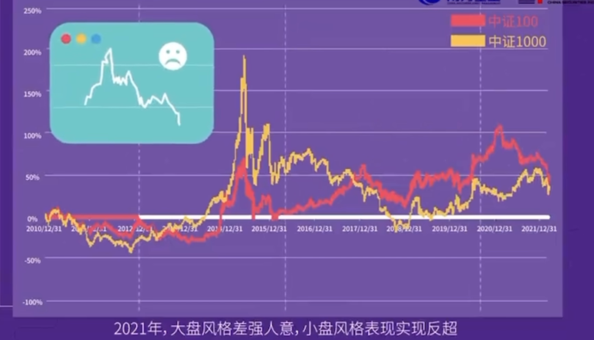

## 1 基本的投资策略

### 什么是策略

投资策略主要关注以下三点内容：

选择一个好的时间（入场退场时机）和空间（横向对比所有板块）

**资产价值**
* 希望获取市场整体收益的投资者更适合买入规模指数。看好个别行业、主题的投资者可以选择买入相应的行业或者主题指数。选择标的指数的投资价值。
* 指数的编制方案。
* 了解指数特征和行业分布
* 资产的估值！估值较低

**入场时机**
* 选择波动中的低点入场。
* 选择PE、PB较低的位置入场

**退场时机**
* 收益目标止盈：持仓的收益率达到目标
* 市场估值止盈：标的资产的市场估值达到目标。股债收益差也可以用来作为估值止盈策略。
* 行业景气度。

### 简单的投资策略
指数型基金的选择策略，是用来选择同类型基金中优势的基金来购买。投资策略是需要看哪个被投资对象、什么时间适合来买。

1. 基本面+消息面。基本面稳定向上的行业主题板块，消息面下跌时补仓。
2. 补仓法，跌就买，涨就卖。
3. 定投法。长期投资储蓄。
4. 稳健型基金投资。在市场行情比较差的时候，对于市场处于不确定的阶段，应该选择稳健的偏债和货币的基金投资方式。
5. 板块主题型投资。看好某一领域的发展，并且有一个最佳入场时机。

## 3 基金的投资方案——定投

### 是什么

### 为什么

一般选择弹性高、波动大、长期向上的权益类产品。

* 淡化择时，分散投资风险

### 怎么做
* 选择什么样的基金：弹性高、波动大、长期向上的权益类产品。定投有助于平滑成本，增强收益，拉低整体成本。例如中证500。
* 什么时间定投：随时开始投资，尽早开始定投。很难判断合适的时机。
* 什么时间卖出：止赢时卖出。因为很难判断什么时间卖出。收益目标止盈和市场估值止盈策略。结合投资标的的风险收益特征与自己的投资需求与风险承受能力。设定较为合理的收益目标。如收益率30%单利，年化收益率10%等卖出。市场估值止盈投资策略，参考投资标的过往的投资情况，例如当前PE达到过往的40，或过往价值最高10%分位等。

## 4 美林投资时钟-轮动投资

### 是什么

时钟和资产的表现

### 为什么
可以根据经济周期进行轮动资产配置。因为经济是有一定规律性地、螺旋上升，在发展和放缓之间切换，在通胀和通缩之间摇摆，每一种资产都会随着经济周期规律性地波动。

例如：A股也会在大小盘风格之间轮动。中证100和中证1000之间交替领先。

### 怎么做
复苏阶段：适合投资周期性成长特征的股票，例如科技、高端制造等行业。

过热阶段：适合投资周期性强偏上游资源的行业，如有色金属、钢铁、煤炭等行业。

滞胀阶段：适合投资防御性、价值型股票。如银行、公用事业等行业。

衰退阶段：适合投资弱周期、需求不随经济周期变动的行业，如必选消费等。

## 5 核心卫星策略

### 是什么

核心仓位 80%左右，卫星仓位20%左右。

核心仓位负责基础收益，卫星仓位负责追求超额收益。

### 怎么做

如果投资者的目标是追求稳健型收益：一种典型的方案是：核心仓位配置债券型基金，卫星仓位配置股票指数基金。

如果投资者的目标是对标权益市场的整体收益，中长期追求较高收益：可以核心仓位配置股票规模指数基金，卫星仓位配置股票行业主题指数基金。

