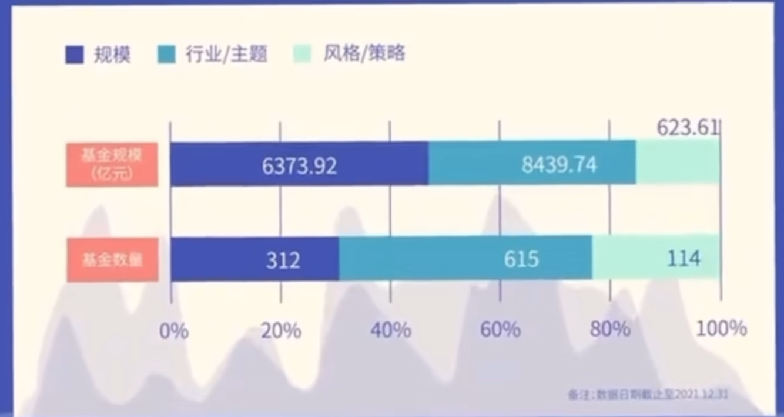

## 1. 指数的概念

### 股票指数
股票指数：股票指数通过计算成分股股票的权重，将股票按照一定的权重进行组合，得到一个指数。能够反映一揽子股票价格的变化。

### 分类方式——股票型指数细分
* 宽基规模指数。按照市值选取成分股，并且以市值加权的指数。例如上证50指数、沪深300指数、中证500指数、创业板指数、深证指数。也称为宽基指数。
* 行业指数：成分股同属于某一个固定行业，行业可以分为一级、二级、三级、四级行业。银行指数、证券指数、房地产指数、有色金属指数等。
* 主题指数：成分股均属于特定主体的指数基金。高铁指数、国企改革指数、互联网指数、大湾区指数、新能源指数基金、创新药指数基金
* 风格指数：根据成长价值等风格特征选择成分股的指数基金。沪深300成长指数基金、沪深300价值指数基金。
* 策略因子指数：采用某些策略或因子进行选股，活用非市值加权方法分配成分股权重。小康指数、大数据300指数。可以将指数分为价格指数、全收益指数、净收益指数。

### 分类方式——覆盖市场分类
  * 单市场指数：上证50
  * 跨市场指数：中证500
  * 跨境指数：中概互联
### 分类方式——投资区域划分
  * 内地指数
  * 香港指数
  * 美国指数
  * 全球指数
### 分类类别——资产类别
  * 股票指数
  * 债券指数
  * 商品指数
  * 基金指数
  * 多资产指数

## 2. 指数量化

指数的PE（市盈率）和PB（市净率）是衡量股票或指数估值水平的两个重要指标，它们在投资分析中具有重要作用。

### 1. PE（市盈率）
**定义**：PE（Price-to-Earnings Ratio）即市盈率，是股票价格与每股收益（EPS）的比率，用于衡量股票价格相对于公司盈利能力的估值水平。计算公式为：

$$
\text{PE} = \frac{\text{股票价格}}{\text{每股收益}}
$$
或者
$$
\text{PE} = \frac{\text{总市值}}{\text{总净利润}}
$$
**作用**：
- **评估估值水平**：PE反映了投资者为获取每单位净利润所愿意支付的价格。较低的PE可能意味着股票被低估，而较高的PE可能意味着股票被高估。
- **判断投资价值**：对于盈利稳定的公司或行业，PE是评估其投资价值的重要指标。例如，成长型企业通常会有较高的PE，因为市场对其未来盈利增长有较高预期。
- **行业对比**：不同行业的PE水平差异较大，例如，科技行业通常PE较高，而传统制造业PE较低。因此，PE更适合在同行业公司之间进行对比。

### 2. PB（市净率）
**定义**：PB（Price-to-Book Ratio）即市净率，是股票价格与每股净资产（BPS）的比率，用于衡量股票价格相对于公司净资产的估值水平。计算公式为：
$$
\text{PB} = \frac{\text{股票价格}}{\text{每股净资产}}
$$
或者
$$
\text{PB} = \frac{\text{总市值}}{\text{净资产}}
$$

**作用**：
- **评估资产价值**：PB反映了市场对公司资产价值的评估。较低的PB可能意味着股票价格相对于净资产较为便宜，具有一定的投资吸引力。
- **适用于重资产行业**：对于重资产行业（如钢铁、煤炭、银行等），PB是一个重要的估值指标，因为这些行业的资产价值较为明确。
- **判断市场情绪**：在熊市中，PB常常被用作寻底指标，因为市场情绪低落时，股票价格可能会接近或低于净资产。

### 3. PE和PB的综合应用
- **结合使用**：PE和PB通常一起使用，以更全面地评估股票或指数的估值水平。例如，PE适合评估盈利稳定的公司，而PB更适合评估重资产或周期性行业。
- **行业特性**：不同行业对PE和PB的适用性不同。例如，高科技企业由于无形资产占比较高，PB的参考价值有限，而PE可能更具意义。
- **投资决策**：通过PE和PB的百分位分析，可以判断当前估值在历史中的位置。例如，PE百分位较低可能意味着市场处于低估状态，适合买入。

总之，PE和PB是投资者评估股票或指数估值水平的重要工具，但它们需要结合行业特点、公司基本面以及市场环境等因素综合使用，才能更好地指导投资决策。

## 3. 指数的基金

### 优势
1. 吐故纳新。指数一般会追踪当前社会发展的趋势，即市值最高的头部公司的股票。
2. 分散风险。指数基金一般会购买指数下的多个股票，规避股票黑天鹅事件。
3. 费率低廉。大多数指数基金每年的管理费用较低，不超过0.5%
4. 规则透明，持仓清晰。
5. 工具化属性清晰，

## ETF投资 的三种方式

1. 在一级市场上申购和赎回。用一篮子股票于少量现金的资产组合相应的基金份额进行交换。在以及市场上申购和赎回的门槛较高。超过50到100万。更适用于专业投资者。

2. 在二级市场上买入和卖出。像买卖股票一样在交易所买卖ETF。根据价格优先、时间优先的规则进行排序，将买卖指令配对竞价成交。对于大多数ETF，当日买入的份额，T+1日才可以卖出。

3. 买入ETF联接基金，间接投资场内的ETF基金。特点：
   1. ETF联接基金的交易方式跟普通开放基金相同。在场外进行申购和赎回。
   2. ETF联接基金的投资门槛较低，大多为1元或10元起购。
   3. 普通ETF联接基金（不包括LOF）只可以在一级市场申购赎回。
   4. ETF联接基金支持定投，省时省力。

