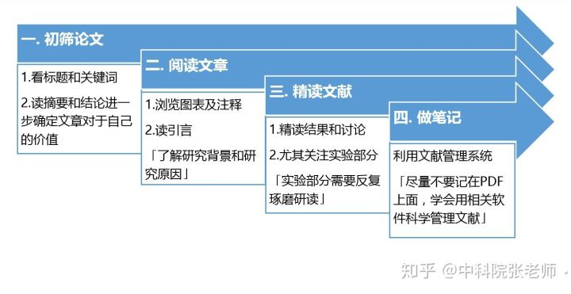
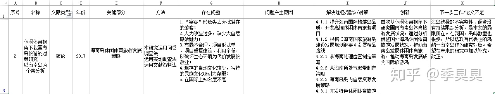

# 知乎，论文阅读

> 文献相关内容
> * 检索
> * 筛选
> * 阅读
> * 笔记
> * 管理

## 阅读方法

* 标题、关键字-> 摘要、结论-> 图表、引言-> 结果、讨论
## 论文笔记

* 序号、文献名称、文献类型、发表时间、关键部分、研究方法、存在的问题、产生的原因、解决方法、创新点、下一步工作、不足之处。

## 管理工具

### 候选项

* citavi
* noteExpress(放弃)
* Mendeley

> 二选一吧。

* citavi也太强大的有各种梦幻的功能，根本爱不释手好吧。但是感觉现阶段的自己，根本用不到这些东西，暂时还没有写论文的计划。
* 暂时先使用mendeley吧。主要能提供最基础的文献阅读和做笔记的功能，这对我来说，刚好够用。等以后需要更加复杂的科研工作了，再使用citavi。（citavi的检索功能也强大的一批。）
* 一边用简单的，一边学复杂的。citavi，牛皮。

### 最终的选择

* 最终还是选了了citavi，我发现做选择远比向一个目标努力奋斗要艰难的多。尤其是当感性和理性这两种本就互相冲突的思维，体现在两个选项上的时候。虽然理性上提示我，mendeley能够更好的适应我的需求，更加简洁，能提供必要的功能。但是好奇心驱使我，无法放下牛逼的citavi，那种想要了解他的冲动，太强烈了。
* 最终选择了citavi，并不是因为工作需要，而是因为不得不选择他。因为如果我不选择他，我就会一直不断地思考，如果是citavi会不会能够更好的实现，如果是citavi，会怎么做。他的复杂和技巧性，深深地吸引了我。大概这就是选择的原因吧。
* 所以，选择了citavi。

## 个人阅读方案

### citavi

* 直接标注：主要内容
* 红色标注：关键内容，需要手动添加注释说明

* summary：读完论文后给的。
* comment：读完章节或段落后给的。

* quotation：引用阶段使用的内容，阅读论文的时候不需要。需要在写论文的时候，添加category，然后添加每篇文章的direct、indirect quotation

### 三次阅读

1. 泛读评分
   1. 摘要、引言、结论、图表
   2. 黄色、红色、summary、comment标注
   3. 星级&评价。content context。读完之后给出
   4. 删除不想相关的论文
2. 精读3星
   1. 精读原理
   2. 精读实验
3. 引用4星
   1. category（与论文关系）
   2. quotation（引用方式）

## citavi使用教程

### 文献导入

1. 直接输入文献内容，添加文献文件和信息。
2. 通过ID添加（arxivID、pumid、doi、isbn）
3. 直接添加pdf自动生辰给相关信息
4. 通过citavi picker从网页上抓取。

> 在导入文献的时候，可以通过手动的方式补全文献信息、content内容信息、context管理信息。并且导入这些信息的时候，citavi能够自动更新参考文献的格式。