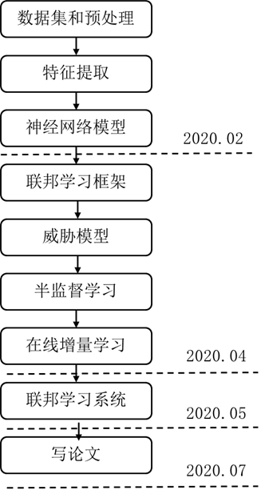

## 工作安排

1. **技术调研**，三个方向的相关论文阅读技术范式确定。
2. **基础知识**，实现机器学习+深度学习的基本算法。并看李宏毅的教程和西瓜书。
3. **数据集和预处理**工作。相关数据集构建、反编译工具使用，完成恶意软件的代码分析工作。
4. **特征提取**
5. **神经网络模型**的构建与本地训练。效果评估，验证机器学习算法的有效性
6. **联邦学习框架**的实现。效果评估，验证联邦学习框架的准确率不会降低
7. **威胁模型**的应用。验证威胁抵抗效果
8. **半监督学习**的实现。验证半监督方法的有效性。
9. **集中在线增量学习**的实现，验证算法的有效性。
10. **联邦在线半监督**学习的实现。
11. 检测效果最终的效果评估。
12. 威胁信息生成
13. 生成效果评估

