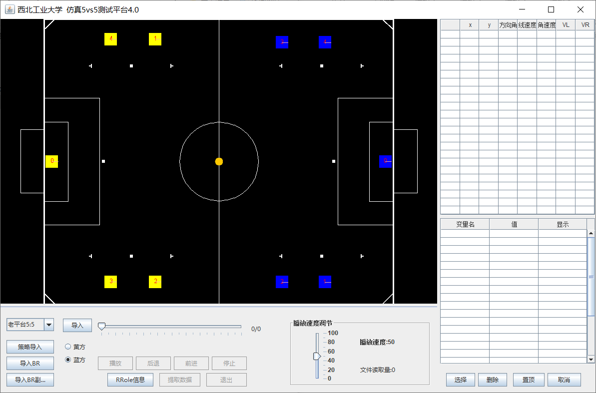
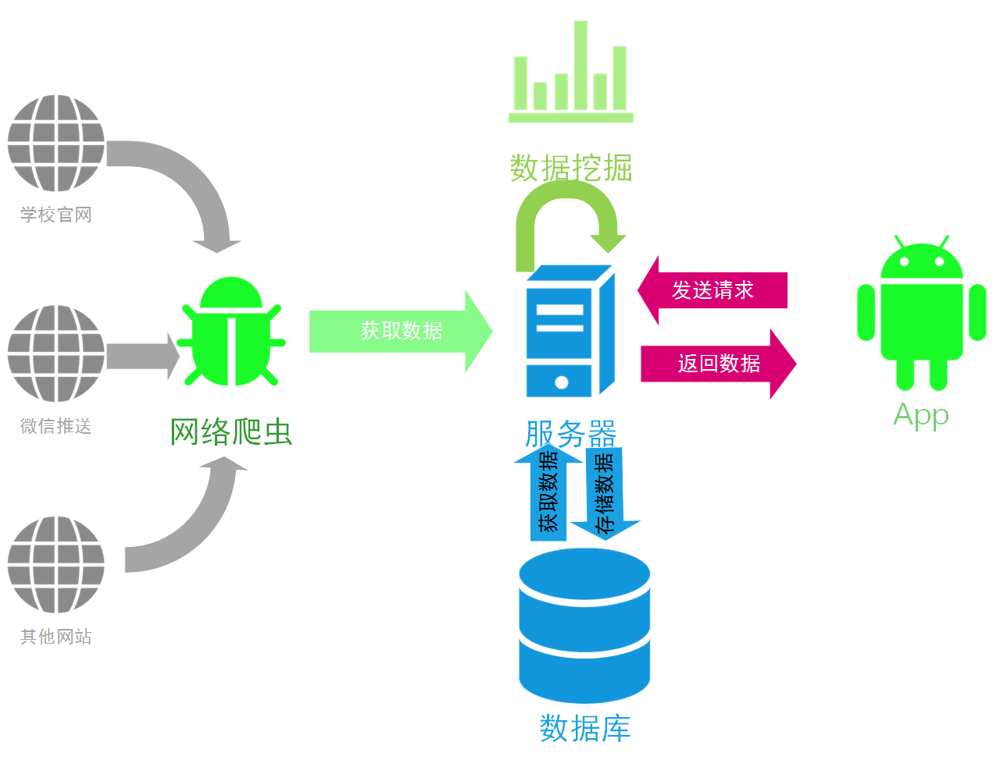
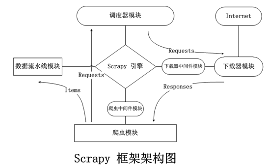
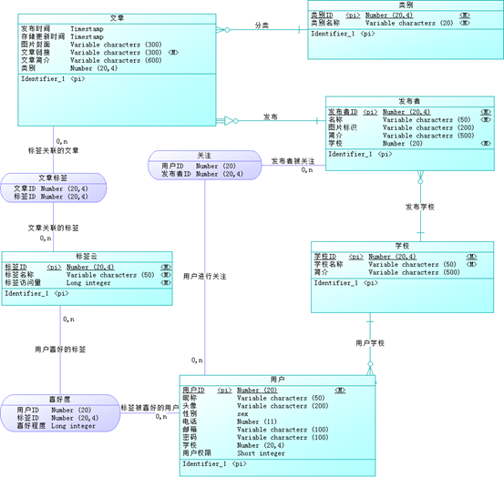
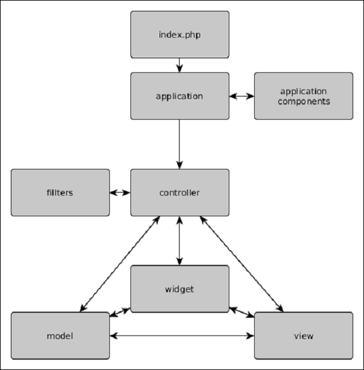
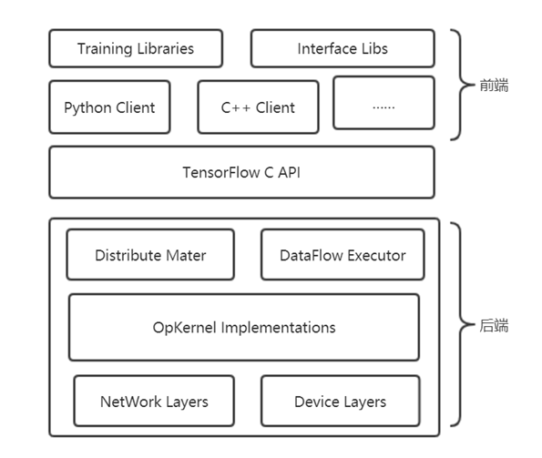
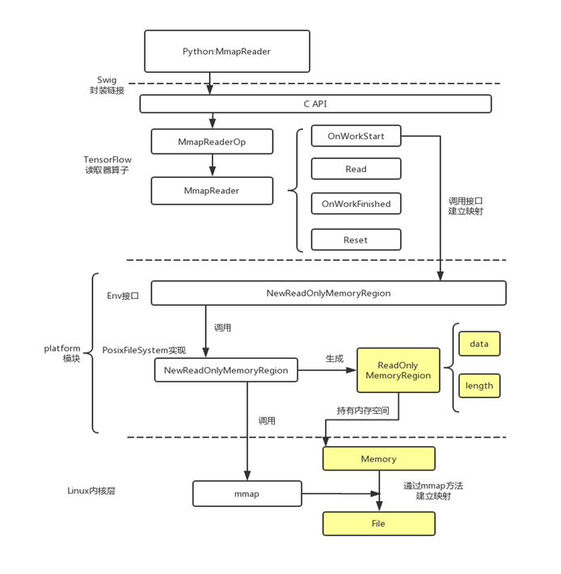

## 1 教育经历
你好。我叫殷康龙，现就读于北京航空航天大学计算机学院，主要研究联邦学习在恶意软件检测领域的应用。本科就读于西北工业大学软件与微电子学院，主修软件工程。

在学校主要学习了数据结构与算法、C++程序设计、JavaEE企业级开发、面向对象程序设计、编译原理等课程，综合测评成绩在250人中排名第8。

## 2 校园经历

在学校里积极参加社团和活动。曾任软微学院科创部干事，参与组织一行代码大赛和程序设计比赛。曾任西工大新闻中心副部长，负责开发新文中心的功能网站，培训技术人员，维护西工大官方微信。

## 4 主要成果

* 两次学校一等奖学金，一次华为奖学金，一次国家励志奖学金，一次电子工业出版社助学金，“优秀共青团员”称号
* 2016-2017年连续两届FIRA机器人世界杯SimuRoSot项目国际特等奖（冠军），Air Challenge项目国际一等奖（亚军）
* 2017中国机器人大赛空中机器人-无人机大战水果项目一等奖
* 2019年获得国家级大学生创新项目《基于超宽带定位技术的无人机目标追踪系统》和《基于网络爬虫和数据分析的高校信息整合系统》优秀结题
* 获得《面向学生的校园信息交流系统V1.0》《基于scrapy框架的校园信息爬虫系统》《基于网络爬虫和数据分析的高校信息整合系统》计算机软件著作权

## 3 项目经历

> 项目概述、主要工作、最终成果

### 竞技策略开发——仿真5VS5SimuRosot(√上传)
* 项目概述：15个人的开发团队，长期开发项目，C++、JAVA。工程项目主要包括数据处理模块、前场、后场、边路、底线、特殊策略、定位球策略等，主要用于参加5V5 simurosot的国内比赛和国外比赛。
* 主要工作：负责开发前场的相关策略，主要包括策略选择模块（优势前场、保守前场、边路前场）、角色选择和切换模块（角色的稳定性，进入退出分开控制。）、目标计算模块（保持相对的阵型，减少阵型的抖动）、移动跑位模块、射门模块。使用PID控制方法对机器人控制，增强了前场的稳定性。使用JAVA为团队开发了数据测试平台，实现了对数据仿真、策略测试、可视化。。搭建团队开发的SVN版本控制系统，方便整个团队项目开发和维护。
* 关键技术：开发测试平台主要使用java swing开发跨平台图形界面，提供了一系列GUI组件。主要包括数据导入模块、动态演示模块、数据显示模块。使用java io random_accessfile读取并解析file文件。使用java thread实现数据加载与数据展示的并行过程。通过事件监听与响应机制，实现对数据仿真动态演示过程的控制，包括仿真速度调节和仿真进度调节。使用javadoc生成标准的java文档供后续开发使用，方便开发维护。

* 最终成果：暑假期间带领团队前往日照参加了2017中国机器人大赛，前往台湾 参加了FIRA机器人世界杯，取得多项冠军。

### 大创项目——基于网络爬虫和数据分析的高校信息整合系统(√上传)
* 项目概述：5个人，Python、MySQL。带领团队申请了《基于超宽带定位技术的无人机目标追踪系统》《基于网络爬虫和数据分析的高校信息整合系统》两个国家级大创项目，后者主要是利用爬虫综合网络信息，搭建web服务器，对数据进行二次处理，使用机器学习算法提供面向用户提供文章推荐功能、标签云索引功能和分类浏览功能，面向信息发布者提供了热点倾向功能、数据分析功能。
* 主要工作：项目架构、服务器搭建，包括爬虫模块（数据解析模块xpath、URL获取与去重模块）、服务器模块（MySQL数据库设计、Json数据封装）、Android客户端（数据请求模块HTTP请求、数据展示）、数据处理模块。通过Scrapy完成网络信息爬虫，构建了Mysql数据库，使用Django后端框架和Bootstrap前端框架开发了项目网站，使用大数据的算法对信息分析处理，并将整个项目部署到腾讯云提供的CentOS服务器上。使用Github进行代码管理。

* 关键技术：scrapy框架介绍。使用request模块进行爬虫，通过调度去缓存下一条URL，控制网站访问的频率；使用xpath解析数据内容并将数据存储到mysql数据库中。
>  * （1）Scrapy引擎打开，向爬虫模块请求其需要爬取的起始URLs
>  * （2）Scrapy引擎从爬虫模块那里获取到需要爬取的起始URLs，将它们放入调度器模块，作为待爬取的URL Requests；
>  * （3）Scrapy 引擎向调度器模块发出请求，获取下一个待爬取页面的URL；
>  * （4）调度器模块返回下一个待爬取页面的URL给Scrapy 引擎，Scrapy 引擎则将该 URL 经下载中间件模块（请求方向）转发给下载器；
>  * （5）当下载器模块完成页面下载后，会生成一个该页面所对应的 HTTP Response，并将其经下载中间件（响应方向）发送给Scrapy 引擎；
>  * （6）Scrapy 引擎从下载器模块处接收到HTTP Response 后，会将其经爬虫中间件模块（输入方向）发送给爬虫模块处理；
>  * （7）爬虫模块处理接收到的 HTTP Response，并返回从中爬取到的Items及需要跟进的新的 URLs 给 Scrapy 引擎；
>  * （8）Scrapy 引擎将（爬虫模块返回的）Items 转发给数据流水线模块，同时将（爬虫模块返回的）URLs 转发给调度器；
>  * （9）以上 2~8 的过程会一直重复执行，直到调度器模块中没有 URL Requests 时，Scrapy 引擎关闭，爬虫停止。

* 关键技术：Django框架。使用Apache服务器，处理http请求。Django框架，MVC（model-view-control）的代码架构模式。从数据库中获取数据，封装成json格式，最后将响应的数据传递给android客户端。

* 关键技术：数据处理算法。
  * 标签计算算法：jieba分词统计词频，TF-IDF算法进行词频统计，去除无关词汇，字词的重要性随着它在文件中出现的次数成正比增加，但同时会随着它在语料库中出现的频率成反比下降。
  * 分类算法：学科竞赛、科研信息、行政信息、招生信息、招聘就业、校园活动、升学留学、生活娱乐这八类，使用朴素贝叶斯分类器进行分类。（基于贝叶斯公式，可以试图讲解贝叶斯公式）
  * 混合推荐算法：基于协同过滤算法提取项目的基本特征（人，文章的特征，通过人阅读的其他文章给出特征，通过相似的人看的其他电影打上相似的标签）。系统采用的ＫＮＮ算法目的在于匹配项目中Ｋ个相似度最高的项目，作为预测推荐输出到用具接口。
* 最终成果：两个国家级大创项目均获得优秀结题。

### 电子钱包JavaEE企业及开发项目(----丢失)

* 项目概述：在中科金财上市公司参与电子钱包项目的实习。
* 负责使用Spring框架和mybatis实现数据库的访问和数据处理。

### 无人机项目(√上传一半，丢失一半)

* 项目概述：无人机加密通信项目开发。
* 主要工作：主要是在Android平台（DJ无人机的地面站android手机开发），使用Java多线程和Socket编程，实现无人机之间的通信连接。主要通过UDP网络通信、心跳测试保持连接、回调处理等方式实现线程通信。在加密通信过程中，使用C++开发加密仿真环境。使用nodejs+electron对通信过程进行可视化。使用网页技术HTML、CSS、JavaScript做前端，使用C++做为本地的后端。通过封装C++通信的代码，提供C++通信接口，供nodejs调用。（代码的封装，接口提供，）
* 主要成果：完成实验室项目验收。

### ~~补充项目——软件与微电子学院学生信息系统。PHPweb开发~~(----丢失)
* 项目概述：20个人组成的团队，PHP、MySQL。系统主要包括任务管理系统、证书认证系统、请销假平台、项目管理、活动，会议记录、党建系统、文件管理系统、就业记录等子系统。使用PHP作为后端开发脚本，使用MVCyii框架进行开发。
* 主要工作：构建数据库。使用yii框架实现请销假平台，包括表单管理和MySQL数据库访问。yii框架是MVC结构。由controller处理逻辑内容，model封装数据库访问，view视图作为界面，用来渲染数据，发送到前端。

* 最终成果：开发完成暑期项目实践，项目成功验收。

### ~~补充项目——企业级开发JavaEE项目考试系统~~(√上传)
> 因为是java项目，等日后学完java再写

### ~~补充项目——windows通信编程。多人聊天室~~(√上传)
* 项目概述：单人项目开发。
* 主要工作：MFC开发界面、windows网络通信。
* 主要成果：课设。

### ~~补充项目——TensorFlowIO优化~~(√上传)

* 项目概述：分析TensorFlow源代码，对源代码进行修改重新编译。使用mmap方法，优化TensorFlow数据加载过程中的IO操作。
* 主要工作：阅读源代码分析TensorFlow架构，使用多线程以流的方式读取多个文件。mmap封装大文件读取过程。编译并测试TensorFlow最后的优化效果。

1. 首先阅读了TensorFlow的源代码以及相关的研究资料，对TensorFlow的代码架构进行分析。
2. 第一层设备通信层，负责网络通信和设备管理。设备管理模块可以实现TensorFlow的异构性，提供了对不同平台不同设备的支持，统一封装成相同的接口，使得上层模块在调用过程中，不必考虑具体的底层实现。通信模块主要通过两种协议实现不同设备之间的通信过程，分别是gRPC协议和RDMA协议。
3. 第二层内核实现层，实现了核心算子（Operation）与张量（Tensor）的操作。所有的算子都是以张量为操作对象，依赖底层实现张量的内存分配和计算。
4. 第三层图计算层，实现了计算图（Graph），包括本地计算流图和分布式的计算流图的实现。主要实现了计算图的创建、编译、优化和执行的细节。计算图中的每个节点都是内核实现层中的算子，计算图中的每条边代表内核实现层中的张量。
5. 第四层API接口层，TensorFlow提供了原始的C API的实现，方便其他语言和平台进行调用。通过C API进一步实现其他语言的API，方便不同语言开发者选择熟悉的语言构建计算图。
6. 第五层应用层，不同的编程语言通过API接口层调用TensorFlow的内核，实现相关的模型和应用。

1. 使用linux的mmap方法申请内存空间，建立内存映射。
2. 使用platform模块，对底层方法进行封装，实现异常情况处理，并记录内存映射的地址及相关信息，提供上层接口
3. 利用platform模块提供的内存映射接口，创建读取器，复写父类中的数据读取方法。创建一个读取数据的算子，并注册到内核当中，提供其他语言的接口。
4. 编写前端，调用内核新方法，使用MmapReader模型进行数据读取。
5. 重新编译

* 最终成果：毕业答辩顺利完成。

## 5 个人能力和性格

1. C++后端开发、Java后端开发、Mysql数据库
2. 学习能力较强。
3. 乐观积极。热衷于开发

